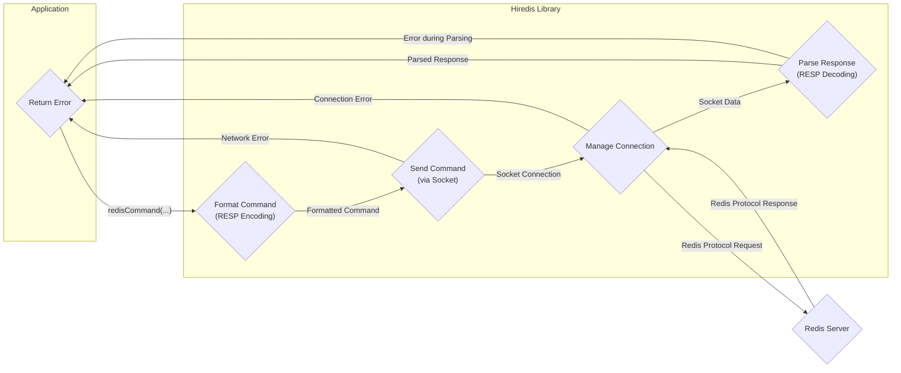

## Project Design Document: hiredis - Minimalistic Redis Client Library in C (Improved)

**1. Introduction**

This document provides an enhanced design overview of the `hiredis` library, a minimalistic C client library for the Redis database. This detailed description aims to facilitate a thorough understanding of the architecture, components, and data flow within `hiredis`, specifically for the purpose of threat modeling. The focus remains on core functionalities and interactions that are relevant to identifying potential security vulnerabilities.

**2. Goals and Objectives**

The primary goal of this document is to provide a comprehensive and improved architectural understanding of `hiredis` to support robust security analysis and threat modeling. Specific objectives include:

*   Clearly define the major components of the library with more granular detail.
*   Illustrate the data flow during typical and less common client-server interactions, including error scenarios.
*   Identify key interfaces and interactions with external systems (Redis server, application code, operating system) with a security lens.
*   Establish a robust baseline understanding for identifying a wider range of potential threat vectors and vulnerabilities.
*   Highlight specific areas within the codebase that warrant closer security scrutiny.

**3. Architecture Overview**

`hiredis` maintains its design as a lightweight, low-level client library directly implementing the Redis protocol. Its core architecture centers around managing network connections, formatting commands according to the Redis protocol, and parsing responses. The library offers both synchronous and asynchronous APIs to accommodate different application needs.

**4. Component Details**

*   **Connection Management:**
    *   Establishes and manages connections to the Redis server using standard socket APIs.
    *   Supports TCP/IP connections, allowing specification of hostname and port.
    *   Supports Unix domain sockets, enabling local communication with the Redis server.
    *   Provides functions for connecting (`redisConnect`, `redisConnectWithTimeout`, `redisConnectUnix`), disconnecting (`redisFree`), and checking connection status (`redisGetErr`).
    *   Implements TLS/SSL encryption support via integration with OpenSSL or other compatible TLS libraries. This includes functions for initiating TLS handshakes (`redisEnableTls`, `redisEnableTlsWithSettings`).
    *   Manages connection timeouts to prevent indefinite blocking.
    *   Handles reconnection logic in case of connection loss (application-managed).

*   **Command Formatting:**
    *   Takes user-provided command arguments (strings) and formats them into the Redis protocol's request format (RESP - Redis Serialization Protocol).
    *   Involves creating a multi-bulk string representation of the command and its arguments, including length prefixes.
    *   Functions like `redisFormatCommand`, `redisFormatCommandArgv` are used for this purpose.
    *   Crucially, this component handles the encoding of arguments for transmission, which can be a source of vulnerabilities if not done correctly.

*   **Command Sending:**
    *   Utilizes the underlying socket connection (obtained from Connection Management) to transmit the formatted command to the Redis server using `send()` or similar system calls.
    *   Handles potential network errors during transmission, such as `EAGAIN` or `EWOULDBLOCK` in non-blocking scenarios.
    *   May involve buffering of commands in pipelining scenarios.

*   **Response Parsing:**
    *   Receives data from the Redis server through the socket connection using `recv()` or similar system calls.
    *   Parses the received data according to the RESP specification, identifying different response types:
        *   Simple Strings (starting with `+`)
        *   Errors (starting with `-`)
        *   Integers (starting with `:`)
        *   Bulk Strings (starting with `$`)
        *   Arrays (starting with `*`)
    *   Extracts the relevant information from the response payload.
    *   Handles potential errors in the response format, which could indicate a problem with the server or a potential attack.
    *   Memory allocation for storing the parsed response is performed in this component, making it a critical area for memory safety.

*   **Asynchronous API (Optional):**
    *   Provides an event-driven interface for non-blocking communication, typically used with event loop libraries like `libevent` or `libev`.
    *   Involves registering file descriptors (sockets) with the event loop for read and write events.
    *   Uses callback functions to handle events such as data being ready to read or the socket being ready for writing.
    *   Functions like `redisAsyncConnect`, `redisAsyncCommand`, `redisAsyncSetConnectCallback`, `redisAsyncSetDisconnectCallback` are part of this API.

*   **Pipelining Support:**
    *   Allows sending multiple commands to the server sequentially without waiting for the response to each command.
    *   Commands are buffered locally and sent in a batch.
    *   Responses are received and parsed in the order the commands were sent.
    *   Requires careful management of the command queue and response processing to maintain correct association.

*   **Pub/Sub Support:**
    *   Enables subscribing to channels and receiving published messages from the Redis server.
    *   Involves sending `SUBSCRIBE`, `PSUBSCRIBE`, or `SSUBSCRIBE` commands.
    *   The connection remains open to receive push notifications from the server.
    *   Response parsing handles the different message types associated with Pub/Sub.

*   **Memory Management:**
    *   `hiredis` relies heavily on manual memory management using `malloc`, `free`, and related functions.
    *   Memory is allocated for connection structures (`redisContext`), command buffers, response buffers (`redisReply`), and internal data structures.
    *   Proper allocation, deallocation, and tracking of memory are crucial to prevent memory leaks, double frees, and use-after-free vulnerabilities.

*   **Error Handling:**
    *   Provides mechanisms for reporting errors that occur during various operations.
    *   Errors are typically stored in the `err` and `errstr` fields of the `redisContext` structure.
    *   Error codes can indicate network issues, protocol errors, or memory allocation failures.
    *   Applications need to check for errors after each `hiredis` function call.

**5. Data Flow (Improved)**

The typical data flow for a synchronous command execution in `hiredis`, including potential error paths, is illustrated below:

**Detailed Data Flow Steps:**

1. The application code initiates a Redis command by calling a synchronous `hiredis` function like `redisCommand`.
2. The `Command Formatting` component receives the command and its arguments and encodes them into the RESP format.
3. The formatted command is passed to the `Command Sending` component.
4. The `Command Sending` component utilizes the `Connection Management` component to send the formatted command over the established socket connection to the `Redis Server`. Network errors during sending are possible.
5. The `Redis Server` processes the command.
6. The `Redis Server` sends a response back over the socket connection, adhering to the RESP format.
7. The `Connection Management` component receives the raw socket data. Connection errors can occur here.
8. The `Response Parsing` component parses the received data according to the RESP specification. Errors during parsing (invalid RESP) can occur.
9. The parsed response is returned to the application code. If an error occurred during sending, connection, or parsing, an error indication is returned to the application.

**Data Flow for Asynchronous Operations:**

The asynchronous API involves registering callbacks with the event loop. The data flow involves the application registering interest in socket events (read/write), and `hiredis` invoking the registered callbacks when data is ready or the socket is writable. Error handling is typically done within these callbacks.

**6. Security Considerations (Enhanced for Threat Modeling)**

This section expands on potential security concerns, providing more specific examples and categories for threat modeling:

*   **Memory Safety Vulnerabilities:**
    *   **Buffer Overflows:** Occur when writing data beyond the allocated buffer size during command formatting or response parsing. Example: Handling excessively long command arguments or large bulk string responses without proper bounds checking.
    *   **Heap Overflow:** Overwriting heap metadata due to incorrect size calculations or buffer overflows, potentially leading to arbitrary code execution.
    *   **Stack Overflow:** Overflowing the call stack, potentially by deeply nested function calls or large local variables, although less common in `hiredis`'s structure.
    *   **Use-After-Free:** Accessing memory that has already been freed, leading to crashes or potential exploitation. Example: Incorrectly managing the lifecycle of `redisReply` objects.
    *   **Double-Free:** Attempting to free the same memory region twice, leading to heap corruption.
    *   **Memory Leaks:** Failure to free allocated memory, leading to resource exhaustion over time. Example: Not freeing `redisReply` objects after use.

*   **Input Validation and Injection Attacks:**
    *   **Redis Command Injection:** If user-provided data is not properly sanitized before being included in Redis commands, attackers could inject malicious commands. Example: Constructing a command string with unintended commands using string formatting.
    *   **Format String Vulnerabilities:** If user-controlled input is used in formatting functions (e.g., logging), attackers could potentially read from or write to arbitrary memory locations.

*   **Network Security:**
    *   **Man-in-the-Middle (MitM) Attacks:** Without TLS enabled, communication is vulnerable to eavesdropping and tampering.
    *   **Replay Attacks:** Captured commands could be replayed to perform unintended actions.
    *   **Denial of Service (DoS):**
        *   **Malformed Requests:** Sending malformed Redis protocol requests that could crash or hang the `hiredis` library or the Redis server.
        *   **Resource Exhaustion:** Sending a large number of requests or requests that consume significant resources (e.g., large data transfers).

*   **TLS/SSL Vulnerabilities:**
    *   **Vulnerabilities in the underlying TLS library (e.g., OpenSSL):** `hiredis` relies on external libraries for TLS, so vulnerabilities in those libraries can impact `hiredis`.
    *   **Incorrect TLS Configuration:** Improperly configured TLS settings (e.g., weak ciphers) can weaken security.
    *   **Certificate Validation Issues:** Failure to properly validate server certificates can lead to MitM attacks.

*   **Concurrency and State Management:**
    *   **Race Conditions:** In multithreaded environments, improper synchronization can lead to race conditions when accessing shared `hiredis` data structures.
    *   **State Confusion:** Incorrect handling of connection state or asynchronous operations could lead to unexpected behavior and vulnerabilities.

*   **Integer Overflows/Underflows:** Calculations involving lengths or sizes could be vulnerable to integer overflows or underflows, leading to incorrect memory allocation or other issues.

**7. Deployment Considerations (Security Focused)**

Deployment considerations with a strong focus on security:

*   **Library Version Management:**  Always use the latest stable version of `hiredis` to benefit from bug fixes and security patches. Implement a process for regularly updating the library.
*   **Secure Compilation:** Compile `hiredis` with security-enhancing compiler flags (e.g., `-D_FORTIFY_SOURCE=2`, `-fstack-protector-strong`, `-fPIE`, `-D_GNU_SOURCE`) to mitigate certain types of vulnerabilities.
*   **Dependency Management:**  Keep the underlying TLS library (e.g., OpenSSL) up-to-date with the latest security patches.
*   **Secure Configuration:** When using TLS, ensure strong ciphers are configured and proper certificate validation is enabled.
*   **Least Privilege:** Run applications using `hiredis` with the minimum necessary privileges to reduce the impact of potential compromises.
*   **Input Sanitization:**  Thoroughly sanitize and validate all user-provided input before including it in Redis commands to prevent injection attacks.
*   **Memory Monitoring:** Implement memory monitoring tools to detect potential memory leaks or excessive memory usage.
*   **Regular Security Audits:** Conduct regular security audits and penetration testing of applications using `hiredis` to identify potential vulnerabilities.

**8. Assumptions and Constraints**

*   This document assumes a solid understanding of the Redis protocol and general networking concepts.
*   The focus remains on the core functionalities of the `hiredis` library itself. Security vulnerabilities within the Redis server are outside the scope of this document.
*   The analysis is based on the publicly available source code of `hiredis` and general knowledge of common software vulnerabilities.

**9. Future Considerations**

*   Detailed static and dynamic analysis of the `hiredis` codebase, focusing on identified areas of concern.
*   Development of specific threat models based on different usage scenarios and deployment environments.
*   Investigation of potential hardening techniques for the `hiredis` library.
*   Analysis of the security implications of any future features or changes to the `hiredis` library.