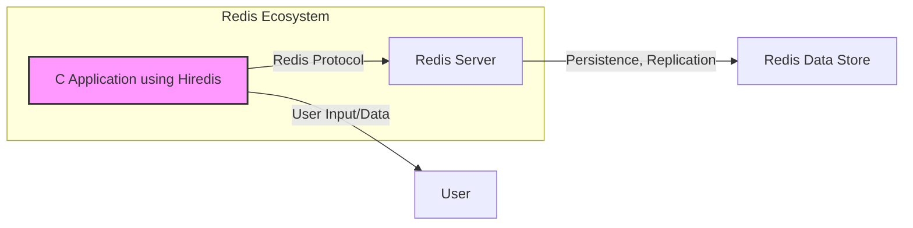
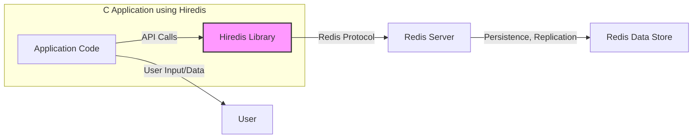
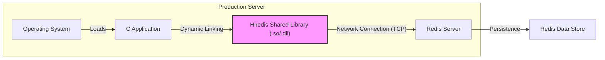
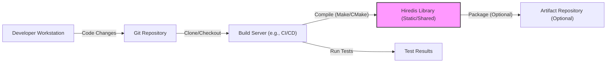

Okay, let's create a design document for the hiredis project.

# BUSINESS POSTURE

Hiredis is a minimalistic C client library for the Redis database. It's widely used due to its simplicity and performance.

Priorities and Goals:

- Provide a fast and efficient way to interact with Redis from C applications.
- Minimize dependencies and keep the library lightweight.
- Maintain compatibility with various Redis versions.
- Ensure stability and reliability for production use.
- Provide a simple and easy-to-use API.

Business Risks:

- Data corruption or loss due to client-side errors.
- Security vulnerabilities that could expose Redis data or allow unauthorized access.
- Performance bottlenecks that could impact application responsiveness.
- Compatibility issues with different Redis versions or operating systems.
- Lack of robust error handling leading to application instability.

# SECURITY POSTURE

Existing Security Controls:

- security control: The library itself doesn't handle authentication or encryption. It relies on Redis's built-in security features (e.g., password authentication, ACLs, TLS). (Described in Redis documentation and configuration).
- security control: Basic input sanitization is likely present to prevent buffer overflows or other C-specific vulnerabilities, but this needs verification in the code. (Implemented in the C code).
- security control: The project uses a Makefile and CMake for building, which can be configured to enable compiler security flags (e.g., stack protection, address space layout randomization). (Implemented in the build system configuration).
- accepted risk: The library doesn't implement TLS encryption itself, relying on external tools like stunnel or Redis's native TLS support.
- accepted risk: The library assumes a trusted connection to the Redis server. It doesn't inherently protect against man-in-the-middle attacks if TLS is not used.

Recommended Security Controls:

- security control: Integrate with a fuzzing framework (like OSS-Fuzz) to continuously test for vulnerabilities.
- security control: Perform regular static code analysis to identify potential security issues.
- security control: Document secure usage patterns, including recommendations for TLS configuration and authentication.
- security control: Provide clear guidance on how to handle connection errors and potential security-related exceptions.

Security Requirements:

- Authentication: The library should support Redis's authentication mechanisms (password, ACLs). It should not store or handle credentials directly, but rather pass them through to Redis.
- Authorization: The library should rely on Redis's authorization mechanisms (ACLs). It should not implement its own authorization logic.
- Input Validation: The library must sanitize all input to prevent C-specific vulnerabilities like buffer overflows and format string bugs.
- Cryptography: The library should not implement its own cryptographic functions. It should rely on Redis's native TLS support or external tools for secure communication.

# DESIGN

## C4 CONTEXT

Context Diagram Element List:

- Element:
    - Name: C Application using Hiredis
    - Type: Software System
    - Description: An application written in C that uses the hiredis library to interact with a Redis server.
    - Responsibilities:
        - Sending commands to Redis.
        - Receiving and processing responses from Redis.
        - Handling connection management.
        - Managing application-specific logic.
    - Security controls:
        - Input validation.
        - Secure coding practices.
        - Proper error handling.

- Element:
    - Name: Redis Server
    - Type: Software System
    - Description: The Redis server instance that the C application connects to.
    - Responsibilities:
        - Processing commands from clients.
        - Managing data storage and retrieval.
        - Handling replication and persistence.
        - Enforcing security policies (authentication, ACLs).
    - Security controls:
        - Authentication (password, ACLs).
        - TLS encryption (optional).
        - Access control lists.
        - Input validation.

- Element:
    - Name: Redis Data Store
    - Type: Data Store
    - Description: The persistent storage used by Redis (e.g., disk, memory).
    - Responsibilities:
        - Storing data persistently.
        - Providing data to the Redis server.
    - Security controls:
        - Disk encryption (if applicable).
        - Access controls on the data files.

- Element:
    - Name: User
    - Type: User/Actor
    - Description: A user or system that interacts with the C application.
    - Responsibilities:
        - Providing input to the application.
        - Receiving output from the application.
    - Security controls:
        - User authentication (if applicable).
        - Authorization (if applicable).

## C4 CONTAINER

Since hiredis is a client library, the container diagram is essentially an extension of the context diagram.

Container Diagram Element List:

- Element:
    - Name: Application Code
    - Type: Container (Code)
    - Description: The C code that utilizes the hiredis library.
    - Responsibilities:
        - Making API calls to hiredis.
        - Handling application-specific logic.
    - Security controls:
        - Secure coding practices.
        - Input validation.

- Element:
    - Name: Hiredis Library
    - Type: Container (Library)
    - Description: The hiredis C client library.
    - Responsibilities:
        - Providing an API for interacting with Redis.
        - Handling the Redis protocol.
        - Managing connections (low-level).
    - Security controls:
        - Input validation (within the library).
        - Error handling.

- Element:
    - Name: Redis Server
    - Type: Software System
    - Description: The Redis server instance.
    - Responsibilities:
        - Processing commands.
        - Managing data.
    - Security controls:
        - Authentication.
        - Authorization (ACLs).
        - TLS (optional).

- Element:
    - Name: Redis Data Store
    - Type: Data Store
    - Description: Persistent storage for Redis.
    - Responsibilities: Storing data.
    - Security controls: Disk encryption.

- Element:
    - Name: User
    - Type: User/Actor
    - Description: A user or system that interacts with the C application.
    - Responsibilities:
        - Providing input to the application.
        - Receiving output from the application.
    - Security controls:
        - User authentication (if applicable).
        - Authorization (if applicable).

## DEPLOYMENT

Hiredis is a library, so it's typically deployed as part of a larger C application.  There are several deployment scenarios:

1.  Statically linked into the application binary.
2.  Dynamically linked as a shared library (.so on Linux, .dll on Windows).
3.  Embedded within a larger system (e.g., a firmware image).

We'll describe the dynamically linked scenario, as it's common and illustrates the relevant security considerations.

Deployment Diagram Element List:

- Element:
    - Name: Operating System
    - Type: Infrastructure Node
    - Description: The operating system of the server (e.g., Linux, Windows).
    - Responsibilities:
        - Managing processes.
        - Providing system resources.
        - Enforcing security policies.
    - Security controls:
        - OS hardening.
        - Firewall.
        - Intrusion detection/prevention systems.

- Element:
    - Name: C Application
    - Type: Software System
    - Description: The application that uses hiredis.
    - Responsibilities:
        - Application-specific logic.
        - Interacting with Redis via hiredis.
    - Security controls:
        - Secure coding practices.
        - Input validation.

- Element:
    - Name: Hiredis Shared Library (.so/.dll)
    - Type: Software System
    - Description: The compiled hiredis library.
    - Responsibilities:
        - Providing the Redis client API.
        - Handling the Redis protocol.
    - Security controls:
        - Compiled with security flags.
        - Regularly updated to address vulnerabilities.

- Element:
    - Name: Redis Server
    - Type: Software System
    - Description: The Redis server instance.
    - Responsibilities:
        - Processing commands.
        - Managing data.
    - Security controls:
        - Authentication.
        - Authorization (ACLs).
        - TLS (optional).

- Element:
    - Name: Redis Data Store
    - Type: Data Store
    - Description: Persistent storage for Redis.
    - Responsibilities: Storing data.
    - Security controls: Disk encryption.

## BUILD

The hiredis build process uses a combination of Makefiles and CMake.

Build Process Security Controls:

- security control: Source Code Management (Git): The code is stored in a Git repository, providing version control and auditability.
- security control: Build Automation (Make/CMake): The build process is automated, ensuring consistency and repeatability.
- security control: Compiler Security Flags: The build system can be configured to enable compiler security flags (e.g., stack protection, ASLR).
- security control: Static Analysis: Static analysis tools (e.g., linters, security scanners) can be integrated into the build process to identify potential vulnerabilities.  This is a *recommended* control.
- security control: Testing: The build process includes running unit tests to verify the functionality of the library.  Automated security testing (e.g., fuzzing) is *recommended*.
- security control: Dependency Management: Dependencies should be carefully managed and reviewed for security vulnerabilities.  This is partially addressed by the minimalistic nature of hiredis, but still important.
- security control: Artifact Signing (Optional):  If the library is packaged and distributed, the resulting artifacts can be signed to ensure their integrity.

# RISK ASSESSMENT

Critical Business Processes:

- Reliable communication between C applications and Redis servers.
- Maintaining the integrity and availability of data stored in Redis.

Data Sensitivity:

- The data sensitivity depends entirely on the application using hiredis and Redis. Redis can store anything from highly sensitive data (PII, financial data) to less sensitive data (cached web content). Hiredis itself doesn't know the sensitivity; it's the responsibility of the application using it to handle data appropriately.

# QUESTIONS & ASSUMPTIONS

Questions:

- What specific compiler flags are currently used in the build process?
- Are there any existing static analysis or fuzzing tools integrated into the CI/CD pipeline?
- What is the process for handling security vulnerabilities reported in hiredis?
- Are there any specific Redis versions or configurations that are officially supported or recommended?
- Is there a documented secure coding guide or best practices for using hiredis?

Assumptions:

- BUSINESS POSTURE: We assume that the primary goal is to provide a reliable and efficient Redis client, with security being a critical but secondary concern (balanced against performance and simplicity).
- SECURITY POSTURE: We assume that users of hiredis are responsible for configuring Redis securely (authentication, TLS) and for handling sensitive data appropriately within their applications. We assume basic input sanitization is performed within hiredis, but this needs code review.
- DESIGN: We assume a standard client-server architecture, with hiredis acting as the client and connecting to a separate Redis server instance. We assume the use of TCP for communication.