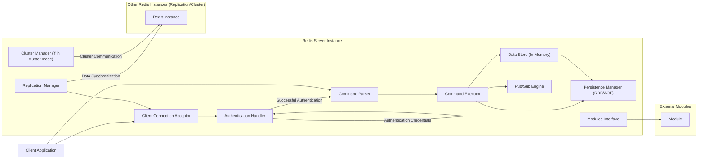

# Project Design Document: Redis (Improved)

**Version:** 1.1
**Date:** October 26, 2023
**Author:** Gemini (AI Model)

## 1. Introduction

This document provides an enhanced architectural design of the Redis project, based on the information available in the provided GitHub repository ([https://github.com/redis/redis](https://github.com/redis/redis)). This improved version aims to offer a more detailed and nuanced representation of the system's components and their interactions, specifically tailored for comprehensive threat modeling activities.

## 2. Goals

*   Provide a detailed architectural overview of the Redis system, suitable for in-depth security analysis.
*   Identify key components and their specific responsibilities, including security-relevant aspects.
*   Describe the primary data flows within the system with a focus on potential security vulnerabilities.
*   Highlight specific security considerations and potential threats for thorough threat modeling.

## 3. Scope

This document focuses on the core Redis server and its primary functionalities, including features relevant to security. It includes aspects related to network communication, client interaction, data storage, persistence, replication, clustering (at a high level), and module interaction. It does not delve into the implementation details of every individual command but focuses on architectural elements relevant to security.

## 4. Target Audience

This document is intended for:

*   Security engineers and architects performing threat modeling on Redis deployments.
*   Security auditors evaluating the security posture of Redis-based systems.
*   Developers requiring a detailed understanding of Redis architecture for secure development practices.
*   Operations teams responsible for securely deploying and managing Redis instances.

## 5. System Overview

Redis is an advanced key-value store that operates in-memory, offering high performance. It supports various data structures and provides features like persistence, replication, and clustering. The core of Redis is an event-driven architecture, typically single-threaded for command processing to ensure atomicity. Security features include password authentication and Access Control Lists (ACLs).

## 6. Component Details

This section provides a detailed description of the key components within a Redis server instance:

*   **Client Connection Acceptor:**
    *   Listens for incoming TCP connections on the configured port (default 6379).
    *   Utilizes an event loop (e.g., `epoll`, `kqueue`) for non-blocking I/O.
    *   Manages the initial handshake and establishes a connection.
    *   Security Consideration: Vulnerable to SYN flood attacks if not properly protected at the network level.

*   **Authentication Handler:**
    *   Responsible for verifying client credentials.
    *   Supports password-based authentication (`requirepass` configuration).
    *   Implements Access Control Lists (ACLs) for granular permission management (Redis 6+).
    *   Security Consideration: Weak passwords or misconfigured ACLs can lead to unauthorized access. Brute-force attacks against the authentication mechanism are a risk.

*   **Command Parser:**
    *   Receives commands from authenticated clients.
    *   Parses the command string into its constituent parts (command name and arguments).
    *   Validates the command syntax.
    *   Security Consideration: Vulnerabilities in the parsing logic could potentially be exploited.

*   **Command Executor:**
    *   Looks up the implementation of the parsed command.
    *   Executes the command, interacting with the Data Store, Persistence Manager, Pub/Sub Engine, or other components.
    *   Enforces ACL permissions before executing commands.
    *   Security Consideration:  Certain commands, if misused, can pose security risks (e.g., `SCRIPT LOAD`, `EVAL` for Lua scripting, module commands).

*   **Data Store (In-Memory):**
    *   The core component that holds all the data in RAM.
    *   Organized as key-value pairs, supporting various data structures (strings, hashes, lists, sets, sorted sets, streams, etc.).
    *   Manages memory allocation and eviction policies (e.g., LRU, LFU).
    *   Security Consideration: Sensitive data resides in memory, making it vulnerable if the server process is compromised (e.g., memory dumping). Incorrect eviction policies could lead to data loss or denial of service.

*   **Persistence Manager (RDB/AOF):**
    *   Responsible for writing the in-memory data to disk for durability.
    *   **RDB (Redis Database):** Creates point-in-time snapshots of the data.
        *   Security Consideration: RDB files contain a snapshot of the entire dataset and must be protected from unauthorized access.
    *   **AOF (Append Only File):** Logs every write operation.
        *   Security Consideration: AOF files also contain sensitive data. Corruption of the AOF file can lead to data loss or inconsistencies.

*   **Replication Manager:**
    *   Handles the process of replicating data from a master instance to one or more slave instances.
    *   Manages the initial synchronization and the ongoing propagation of write operations.
    *   Security Consideration: Unauthenticated replication can allow unauthorized servers to join the replication topology, potentially leading to data breaches or manipulation. Data transmitted during replication is not encrypted by default.

*   **Pub/Sub Engine:**
    *   Implements the publish/subscribe messaging paradigm.
    *   Allows clients to subscribe to channels and receive messages published to those channels.
    *   Security Consideration:  Lack of authorization on channels could allow unauthorized clients to subscribe to sensitive information.

*   **Modules Interface:**
    *   Provides a mechanism to extend Redis functionality with custom modules written in C.
    *   Modules can introduce new commands, data types, and features.
    *   Security Consideration: Modules have direct access to Redis internals and can introduce vulnerabilities if not developed securely. Supply chain risks associated with third-party modules.

*   **Cluster Manager (if in cluster mode):**
    *   Responsible for managing the distributed nature of a Redis cluster.
    *   Handles data sharding, node communication (using the Redis Cluster bus), and failover.
    *   Security Consideration:  Inter-node communication needs to be secured. Misconfigurations in the cluster can lead to data loss or security breaches.

## 7. Data Flow (with Security Focus)

This section describes the typical flow of a client request, highlighting security-relevant steps:

1. A **Client Application** attempts to establish a connection with the **Redis Server Instance** through the **Client Connection Acceptor**.
    *   Security Consideration: This is the first point of contact for potential network-level attacks.
2. The **Client Connection Acceptor** accepts the connection.
3. The connection is handed over to the **Authentication Handler**.
4. The **Client Application** sends authentication credentials (if required) to the **Authentication Handler**.
    *   Security Consideration: Credentials transmitted over an unencrypted connection are vulnerable to eavesdropping.
5. The **Authentication Handler** verifies the credentials against the configured password or ACL rules.
    *   Security Consideration:  Vulnerable to brute-force attacks if not rate-limited or protected.
6. Upon successful authentication, the **Client Application** sends a command to the **Command Parser**.
7. The **Command Parser** parses and validates the command.
8. The **Command Parser** passes the parsed command to the **Command Executor**.
9. The **Command Executor** checks if the authenticated client has the necessary permissions (based on ACLs) to execute the command.
    *   Security Consideration: Proper ACL configuration is crucial to prevent unauthorized actions.
10. The **Command Executor** interacts with the **Data Store** to perform the requested operation (read or write).
11. For write operations, the **Command Executor** informs the **Persistence Manager** (RDB or AOF) to persist the changes.
    *   Security Consideration:  Persistence mechanisms handle sensitive data and need to be stored securely.
12. In a master-slave setup, for write operations, the **Command Executor** informs the **Replication Manager**.
13. The **Replication Manager** sends the write operation to **Other Redis Instances (Slaves)**.
    *   Security Consideration:  Replication traffic is unencrypted by default.
14. If the command involves Pub/Sub, the **Command Executor** interacts with the **Pub/Sub Engine** to publish messages to subscribed clients.
    *   Security Consideration:  Lack of authorization on channels can lead to information disclosure.
15. The **Command Executor** sends the result back to the client.

## 8. Security Considerations (Detailed)

This section provides a more detailed breakdown of security considerations:

*   **Network Security:**
    *   **Unencrypted Communication:** By default, client-server communication is not encrypted, making it susceptible to eavesdropping and man-in-the-middle attacks. Consider using TLS.
    *   **Port Exposure:** Exposing the Redis port (6379) directly to the internet is a significant risk. Use firewalls and network segmentation.
    *   **Denial of Service (DoS):**  Susceptible to SYN flood attacks, connection exhaustion, and command-based resource exhaustion (e.g., large `MSET`, `SADD`).
    *   **Replication Traffic:**  Unencrypted replication traffic can be intercepted.

*   **Authentication and Authorization:**
    *   **Weak Passwords:** Using default or easily guessable passwords for `requirepass` is a major vulnerability.
    *   **ACL Misconfiguration:** Incorrectly configured ACLs can grant excessive permissions or fail to restrict access appropriately.
    *   **Brute-Force Attacks:** The authentication mechanism can be targeted by brute-force attacks to guess passwords. Implement rate limiting.

*   **Command Injection:**
    *   **Lua Scripting (`EVAL`, `SCRIPT LOAD`):**  Carelessly written or untrusted Lua scripts can execute arbitrary commands on the server.
    *   **Module Vulnerabilities:** Malicious or poorly written modules can execute arbitrary code with the privileges of the Redis server.

*   **Data Security:**
    *   **In-Memory Data Exposure:** If the server is compromised, the in-memory data can be easily accessed (e.g., through memory dumps).
    *   **Persistence File Security:** RDB and AOF files contain sensitive data and must be protected with appropriate file system permissions.
    *   **Lack of Encryption at Rest:** Data in RDB and AOF files is not encrypted by default. Consider using disk encryption.

*   **Replication Security:**
    *   **Unauthenticated Replication:** Allows unauthorized servers to join the replication topology, potentially leading to data theft or manipulation.
    *   **Data Breaches through Slaves:** If a slave instance is compromised, it can potentially access data replicated from the master.

*   **Module Security:**
    *   **Untrusted Modules:** Using modules from untrusted sources can introduce vulnerabilities.
    *   **Module Bugs:** Bugs in modules can lead to crashes or security exploits.

*   **Configuration Security:**
    *   **Insecure Defaults:** Relying on default configurations can leave the system vulnerable.
    *   **Allowing Dangerous Commands:**  Commands like `FLUSHALL`, `CONFIG`, `SHUTDOWN` should be carefully controlled.

*   **Denial of Service (Application Level):**
    *   **Memory Exhaustion:**  Attacker can fill up Redis memory with large amounts of data.
    *   **CPU Exhaustion:**  Executing computationally expensive commands can overload the server.
    *   **Slow Commands:**  Exploiting commands with high latency can degrade performance.

## 9. Deployment Considerations (Security Implications)

Different deployment scenarios have varying security implications:

*   **Standalone Instance:**
    *   Simpler to secure as there are fewer components to manage.
    *   Single point of failure. If compromised, all data is at risk.

*   **Master-Slave Replication:**
    *   Improves read scalability and provides basic failover.
    *   Security needs to be applied to both master and slave instances.
    *   Replication security becomes a concern.

*   **Redis Sentinel:**
    *   Provides automatic failover for master-slave setups.
    *   Sentinel instances themselves need to be secured, as a compromise could disrupt the entire system.
    *   Communication between Sentinels and Redis instances needs to be considered.

*   **Redis Cluster:**
    *   Provides horizontal scalability and high availability.
    *   More complex to secure due to the distributed nature.
    *   Inter-node communication security is critical.
    *   Properly configuring cluster topology and access controls is essential.

## 10. Future Considerations

This design document provides a comprehensive overview for threat modeling. Future enhancements could include:

*   Detailed diagrams of specific security features (e.g., ACL implementation).
*   Analysis of specific attack vectors and mitigation strategies.
*   Integration with common security frameworks and standards.
*   Consideration of security best practices for different deployment environments (e.g., cloud deployments).
