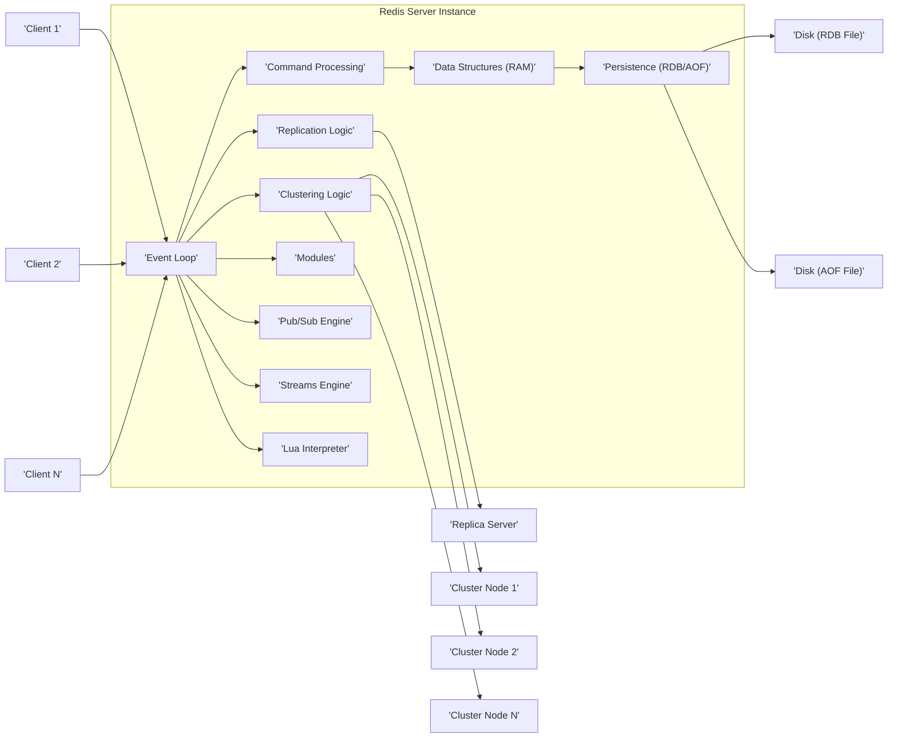
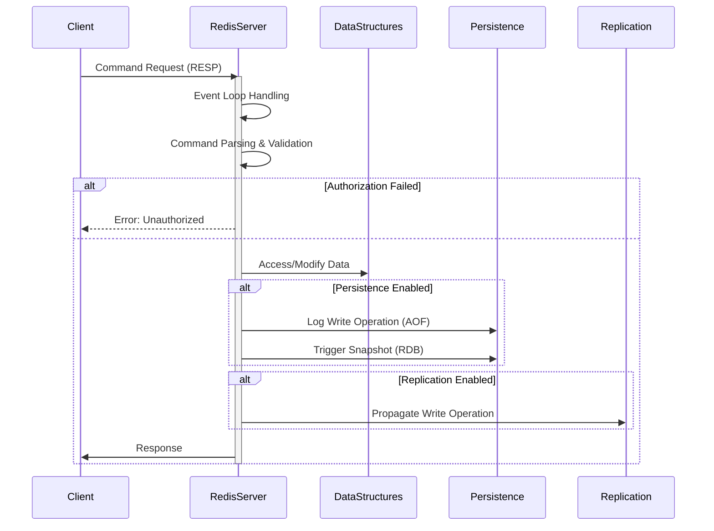

# Project Design Document: Redis (Improved)

**Project Name:** Redis (Remote Dictionary Server)

**Version:** 1.1

**Date:** October 26, 2023

**Author:** Gemini (AI Language Model)

## 1. Introduction

This document provides an enhanced and detailed design overview of the Redis project, an open-source, in-memory data structure store renowned for its speed and versatility as a database, cache, message broker, and streaming engine. This revised document aims to offer a more in-depth understanding of Redis's architecture, components, and data flow, specifically tailored for effective threat modeling.

## 2. Goals and Objectives

The primary goal of this document remains to provide a clear and detailed architectural description of the Redis project, but with greater emphasis on aspects relevant to security analysis. The specific objectives are:

*   To precisely identify and describe the key components of the Redis system, highlighting their security implications.
*   To clearly illustrate the interactions and data flow between these components, with a focus on potential attack vectors.
*   To outline the core functionalities and features of Redis, emphasizing security-related configurations and options.
*   To provide a robust and detailed basis for identifying potential security vulnerabilities and attack surfaces during subsequent threat modeling activities.

## 3. System Architecture

Redis employs a client-server architecture where a single, highly efficient Redis server instance manages requests from numerous clients. Key architectural elements, with a security lens, include:

*   **Single-threaded Event Loop with Non-blocking I/O:** While offering performance benefits, this single thread means a single blocking operation can impact overall responsiveness, a potential DoS vector.
*   **Primary In-Memory Data Storage:**  The speed advantage comes with the risk of data loss if persistence is not configured or fails.
*   **Robust Persistence Options (RDB & AOF):** These are crucial for data durability but introduce potential security concerns related to file access and integrity.
*   **Master-Replica Replication:** Enhances availability but requires secure configuration to prevent unauthorized replica connections.
*   **Clustering for Scalability and Resilience:**  Distributes data but adds complexity to security management across multiple nodes.
*   **Extensible Modules:**  Offers flexibility but introduces potential risks from unvetted or malicious modules.

## 4. Key Components

This section provides a more detailed look at the major components within the Redis architecture, emphasizing security considerations for each:

*   **Clients:** Applications or services connecting to Redis. Security concerns include client authentication, authorization, and the potential for compromised clients to issue malicious commands.
*   **Event Loop:**  The central processing unit. A vulnerability here could halt the entire server. DoS attacks targeting the event loop are a concern.
*   **Command Processing:**  Parses and executes commands. Vulnerabilities in command parsing could lead to unexpected behavior or even code execution. Improperly handled commands can be exploited for DoS.
*   **Data Structures (RAM):**  The in-memory data store. Security focuses on controlling access to sensitive data and preventing unauthorized modification or deletion. Memory exhaustion attacks are also a concern.
*   **Persistence (RDB/AOF):**
    *   **RDB (Redis Database):** Snapshots of data on disk. Security risks involve unauthorized access to the RDB file, potentially exposing sensitive information.
    *   **AOF (Append Only File):** Logs all write operations. Security risks include unauthorized modification of the AOF file, potentially leading to data corruption or manipulation.
*   **Replication Logic:**  Manages data synchronization to replicas. Security requires authenticating replicas to prevent unauthorized servers from joining and accessing data. Unencrypted replication traffic is a vulnerability.
*   **Clustering Logic:**  Handles data distribution and node management. Secure bootstrapping and communication between cluster nodes are critical to prevent unauthorized nodes from joining and compromising the cluster.
*   **Modules:** Extend Redis functionality. Security risks are significant as modules have direct access to Redis internals. Only trusted and vetted modules should be used.
*   **Pub/Sub Engine:**  Enables message broadcasting. Security concerns involve controlling who can publish and subscribe to channels, preventing information leaks or malicious message injection.
*   **Streams Engine:**  Provides a persistent message log. Security considerations include access control to streams and preventing message tampering.
*   **Lua Interpreter:**  Allows server-side scripting. Security risks are high if user-provided input is used in scripts without proper sanitization, potentially leading to command injection vulnerabilities.

## 5. Data Flow

The typical data flow within Redis, highlighting potential security checkpoints and vulnerabilities:

1. **Client Connection:** A client initiates a connection. **Security Checkpoint:**  Authentication mechanisms should be enforced here.
2. **Command Request:** The client sends a command. **Security Checkpoint:**  Command authorization should be performed to ensure the client has permissions.
3. **Event Loop Handling:** The server receives the command. **Potential Vulnerability:** DoS attacks can target the event loop.
4. **Command Parsing and Validation:** The command is processed. **Potential Vulnerability:**  Parsing errors could lead to exploits. Input sanitization is crucial.
5. **Data Access/Modification:** The server interacts with data structures. **Security Checkpoint:** Access control mechanisms should be in place to restrict data access.
6. **Persistence (Optional):** Data is written to disk. **Security Checkpoint:**  File system permissions must protect RDB and AOF files.
7. **Replication (Optional):** Data is sent to replicas. **Potential Vulnerability:** Unencrypted replication traffic can be intercepted. Replica authentication is necessary.
8. **Response Generation:** The server prepares the response.
9. **Response Transmission:** The server sends the response. **Potential Vulnerability:** Unencrypted communication can expose sensitive data in the response.
10. **Connection Closure (Optional):** The connection is terminated.

## 6. Security Considerations (Expanded)

This section expands on the security aspects, providing more specific examples and recommendations:

*   **Network Security:**
    *   **Recommendation:** Always use TLS/SSL encryption (via `stunnel` or native TLS in newer versions) for client-server communication to prevent eavesdropping.
    *   **Recommendation:**  Avoid exposing the Redis port (6379) directly to the public internet. Use firewalls and network segmentation to restrict access.
*   **Authentication and Authorization:**
    *   **Recommendation:**  Require strong passwords for authentication.
    *   **Recommendation:**  Utilize Redis ACLs to implement fine-grained access control, limiting user permissions to specific commands and keys. Regularly review and update ACL configurations.
*   **Data Security:**
    *   **Recommendation:**  Configure persistence (RDB and/or AOF) appropriately based on data durability requirements.
    *   **Recommendation:**  Secure the file system permissions for RDB and AOF files to prevent unauthorized access. Consider encrypting these files at rest.
*   **Command Injection:**
    *   **Recommendation:**  Exercise extreme caution when using the `EVAL` command. Sanitize all user-provided input before incorporating it into Lua scripts. Consider disabling the `EVAL` command if not strictly necessary.
*   **Denial of Service (DoS):**
    *   **Recommendation:**  Configure `maxmemory` to limit memory usage and implement eviction policies.
    *   **Recommendation:**  Use the `SLOWLOG` feature to identify and analyze potentially problematic commands.
    *   **Recommendation:**  Implement connection limits and timeouts to prevent resource exhaustion.
    *   **Recommendation:**  Consider using a connection multiplexer or proxy to protect the Redis server from direct client connections.
*   **Replication Security:**
    *   **Recommendation:**  Configure `requirepass` on both the master and replicas for authentication.
    *   **Recommendation:**  Use the `masterauth` option on replicas to authenticate with the master.
    *   **Recommendation:**  Encrypt replication traffic using `stunnel` or native TLS.
*   **Module Security:**
    *   **Recommendation:**  Only use trusted and well-vetted Redis modules.
    *   **Recommendation:**  Regularly update modules to patch known vulnerabilities.
    *   **Recommendation:**  Understand the security implications of any module before deploying it.
*   **Clustering Security:**
    *   **Recommendation:**  Use the Redis Cluster bus authentication to secure communication between cluster nodes.
    *   **Recommendation:**  Ensure secure bootstrapping of new nodes into the cluster.
    *   **Recommendation:**  Monitor cluster health and node status for any signs of compromise.

## 7. Deployment Considerations

Deployment best practices with a security focus:

*   **Secure Network Configuration:**  Implement strict firewall rules, use private networks, and consider VPNs for secure access.
*   **Resource Isolation:**  Deploy Redis in isolated environments (e.g., containers, dedicated VMs) to limit the impact of potential security breaches.
*   **Principle of Least Privilege:**  Run the Redis server process with the minimum necessary privileges.
*   **Regular Security Audits:**  Conduct periodic security audits and penetration testing to identify vulnerabilities.
*   **Keep Software Updated:**  Regularly update Redis to the latest stable version to benefit from security patches.
*   **Monitoring and Alerting:**  Implement robust monitoring and alerting systems to detect suspicious activity.

## 8. Future Considerations

Future security enhancements and considerations for the Redis project:

*   **Enhanced Native Encryption:**  Further improvements to built-in encryption options for all communication channels.
*   **Role-Based Access Control (RBAC):**  More sophisticated authorization mechanisms beyond basic ACLs.
*   **Improved Auditing Capabilities:**  More detailed logging of security-related events.
*   **Integration with Security Information and Event Management (SIEM) Systems:**  Easier integration for centralized security monitoring.
*   **Formal Security Certifications:**  Pursuing security certifications to demonstrate adherence to security standards.

This improved document provides a more detailed and security-focused overview of the Redis project's design. It serves as a more robust foundation for understanding the system's architecture and conducting thorough threat modeling activities.