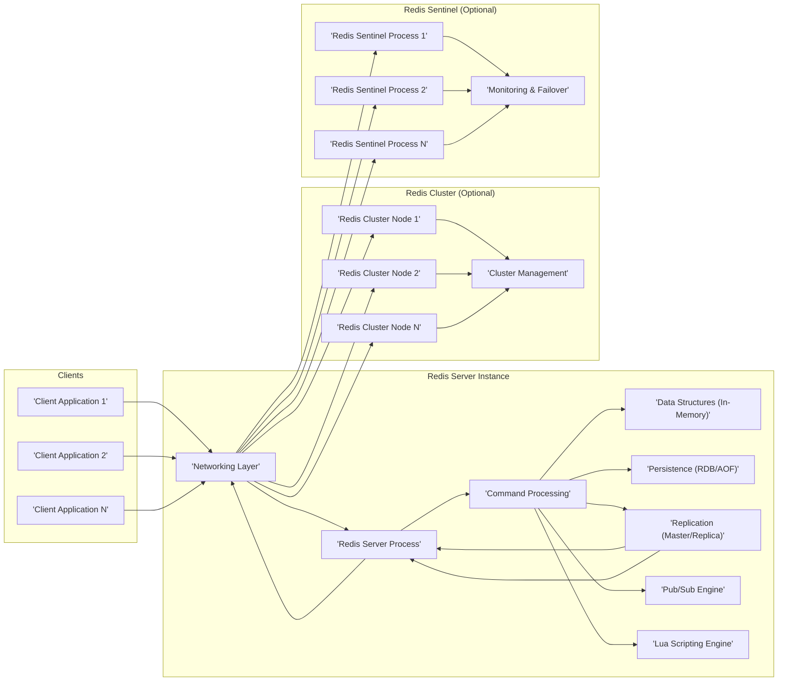

# Project Design Document: Redis

**Project Name:** Redis (Remote Dictionary Server)

**Project Repository:** [https://github.com/redis/redis](https://github.com/redis/redis)

**Document Version:** 1.1
**Date:** October 26, 2023
**Author:** AI Software Architect

## 1. Project Overview

Redis (Remote Dictionary Server) is an open-source, advanced key-value store renowned for its in-memory data storage and exceptional performance. It functions as a versatile data structure server, database, cache, message broker, and streaming engine. Redis supports a rich set of data structures, including strings, hashes, lists, sets, sorted sets, bitmaps, hyperloglogs, geospatial indexes, and streams, enabling developers to build sophisticated and high-performance applications. Its speed and efficiency make it ideal for use cases demanding rapid data access and manipulation.

**Key Features:**

*   **In-Memory Data Storage with Optional Persistence:** Primarily operates in RAM for blazing-fast read and write operations, with optional persistence mechanisms (RDB and AOF) to ensure data durability and recovery after restarts.
*   **Rich Set of Data Structures:** Offers a wide array of data structures beyond simple key-value pairs, allowing for efficient modeling of complex data relationships and operations.
*   **High Performance and Low Latency:** Architected for speed, delivering millions of operations per second with sub-millisecond latency, crucial for real-time applications.
*   **Replication for High Availability and Read Scalability:** Supports master-replica (formerly master-slave) replication, enabling read scaling by distributing read operations across replicas and enhancing availability through replica promotion in case of master failure.
*   **Clustering for Horizontal Scalability and Fault Tolerance:** Provides Redis Cluster, a distributed solution that shards data across multiple nodes, offering horizontal scalability and resilience to node failures.
*   **Pub/Sub Messaging for Real-time Communication:** Includes a built-in publish/subscribe system for real-time messaging and event distribution, facilitating the development of real-time applications.
*   **Lua Scripting for Server-Side Logic:** Allows execution of Lua scripts on the server, enabling complex, atomic operations and custom server-side logic, reducing network round trips and improving performance.
*   **Transactions for Atomicity:** Supports ACID transactions, ensuring atomicity, consistency, isolation, and durability for critical operations requiring data integrity.
*   **Modules for Extensibility:**  Extensible through modules, allowing users to add custom commands and functionalities, expanding Redis's capabilities beyond its core features.

**Use Cases:**

*   **Caching (Web, API, Database):**  Dramatically improves application performance by caching frequently accessed data, reducing latency and database load.
*   **Session Management:** Efficiently stores and manages user session data for web applications, ensuring scalability and fast session access.
*   **Real-time Analytics and Data Ingestion:** Processes and analyzes real-time data streams for dashboards, monitoring, and immediate insights.
*   **Message Queuing and Task Queues:** Implements reliable message queues and task queues for asynchronous processing and decoupling application components.
*   **Leaderboards, Counters, and Rate Limiting:** Powers real-time leaderboards, implements counters for various metrics, and enforces rate limits to protect systems from abuse.
*   **Geospatial Data Indexing and Queries:** Stores and queries geospatial data, enabling location-based services and applications.
*   **Real-time Chat and Social Media Applications:** Supports real-time features in chat applications, social media feeds, and collaborative platforms.
*   **Feature Flags and A/B Testing:**  Manages feature flags for dynamic feature rollouts and A/B testing experiments.

## 2. System Architecture Diagram

## 3. Component Description

*   **Client Applications:** Applications that interact with Redis to perform data operations. These can be web applications, microservices, background workers, or any software requiring fast data access. Clients use Redis client libraries available in various programming languages to communicate with the Redis server using the Redis protocol.

*   **Redis Server Process:** The core component of Redis, responsible for managing data and processing client commands. Key sub-components include:
    *   **Networking Layer:** Manages network connections with clients, listens for incoming commands, and sends responses. It typically uses non-blocking I/O and event-driven mechanisms (like `epoll` or `kqueue`) for high concurrency.  This layer handles the Redis protocol parsing and serialization.
    *   **Command Processing:** Receives commands from the networking layer, parses them, performs command validation (syntax, arguments, permissions), and dispatches them to the appropriate command handler.  Authentication and authorization checks are performed at this stage.
    *   **Data Structures (In-Memory):** The in-memory data store that holds all the data. It implements Redis's various data structures, optimized for performance and memory efficiency. Data structures are accessed and manipulated by command handlers.
    *   **Persistence (RDB/AOF):**  Handles optional data persistence to disk for durability.
        *   **RDB (Redis Database):** Creates point-in-time snapshots of the entire dataset and saves them to disk as binary files. RDB is efficient for backups and fast restarts but can lead to data loss in case of sudden server failure if the last snapshot is not recent enough.
        *   **AOF (Append Only File):** Logs every write operation (command) received by the server to a file. AOF provides higher durability than RDB as it can be configured to fsync every second or every command. On restart, Redis replays the AOF file to reconstruct the dataset.
    *   **Replication (Master/Replica):** Implements the replication mechanism. A master Redis instance can have multiple replicas. Replicas asynchronously receive data updates from the master, maintaining a copy of the data. This provides read scalability and high availability.
    *   **Pub/Sub Engine:** Manages the publish/subscribe messaging system. It maintains channels and subscriber lists, routing published messages to all subscribed clients.
    *   **Lua Scripting Engine:** Executes Lua scripts embedded within Redis commands. This allows for complex operations to be performed server-side atomically, reducing network overhead and improving performance for certain use cases.

*   **Redis Cluster (Optional):** A distributed, sharded, and highly available implementation of Redis.
    *   **Redis Cluster Nodes:** Individual Redis server instances that form the cluster. Each node is responsible for a subset of the data (shards) and communicates with other nodes to maintain cluster state and handle client requests.
    *   **Cluster Management:**  Handles cluster topology management, shard distribution, node discovery, failure detection, and automatic failover. It uses a gossip protocol for inter-node communication and a distributed consensus mechanism for cluster state updates.

*   **Redis Sentinel (Optional):** A monitoring, failover, and configuration provider for Redis.
    *   **Redis Sentinel Processes:** Independent processes that monitor Redis master and replica instances. Multiple Sentinels are typically deployed for redundancy.
    *   **Monitoring & Failover:** Sentinels continuously monitor the health of Redis instances. If a master instance becomes unavailable, Sentinels coordinate a failover process to promote one of the replicas to become the new master, ensuring continuous service availability. Sentinels also provide clients with the current master's address.

## 4. Data Flow

The data flow in Redis can be categorized into command processing and pub/sub messaging.

**Command Processing Data Flow:**

1.  **Client Connection and Command Request:** A client application establishes a network connection to the Redis server and sends a command request encoded in the Redis protocol.
2.  **Networking Layer Reception and Parsing:** The Redis server's networking layer receives the request, buffers the data, and parses the command according to the Redis protocol specification.
3.  **Command Validation and Authentication/Authorization:** The command processing module validates the command syntax and arguments. If authentication is enabled, it verifies the client's credentials. With ACLs, it checks if the client has the necessary permissions to execute the requested command on the target keys.
4.  **Command Execution and Data Structure Interaction:** The command is dispatched to the appropriate handler, which interacts with the in-memory data structures to perform the requested operation (read, write, delete, etc.).
5.  **Persistence (Optional):** If persistence is enabled and the command is a write operation, the persistence mechanism (RDB or AOF) is invoked to record the change to disk.
6.  **Replication (Optional):** If replication is configured and the command is a write operation on a master instance, the update is asynchronously propagated to replica instances.
7.  **Response Generation and Sending:** The command handler generates a response according to the Redis protocol, indicating the result of the operation. The networking layer sends the response back to the client.

**Pub/Sub Messaging Data Flow:**

1.  **Subscription Request:** A client sends a `SUBSCRIBE` or `PSUBSCRIBE` command to the Redis server to subscribe to specific channels or channel patterns.
2.  **Subscription Registration:** The Pub/Sub engine registers the client as a subscriber to the specified channels.
3.  **Publish Request:** A client sends a `PUBLISH` command to publish a message to a specific channel.
4.  **Message Routing and Distribution:** The Pub/Sub engine receives the published message and routes it to all clients currently subscribed to the target channel.
5.  **Message Delivery to Subscribers:** The networking layer sends the published message to each subscribed client over their respective network connections.

## 5. Security Considerations (For Threat Modeling)

This section details security considerations relevant for threat modeling Redis deployments.

*   **Authentication and Authorization (CIA - Confidentiality, Integrity, Availability):**
    *   **Threat:** Weak or absent authentication allows unauthorized access to Redis instances, leading to data breaches, data manipulation, and service disruption. Default configurations without passwords are highly vulnerable.
    *   **Mitigation:**
        *   **Require strong passwords:** Configure a strong password using the `requirepass` directive in `redis.conf`.
        *   **Implement Access Control Lists (ACLs):** Utilize Redis ACLs (Redis 6+) to define granular user permissions, restricting access to specific commands and keys based on user roles. Regularly review and update ACL configurations.
        *   **Disable default user:** If using ACLs, disable the default user to enforce explicit user creation and permission assignment.

*   **Network Security (CIA):**
    *   **Threat:** Exposing Redis directly to untrusted networks (e.g., the public internet) without proper network controls allows attackers to connect and potentially exploit vulnerabilities or gain unauthorized access.
    *   **Mitigation:**
        *   **Bind to specific interfaces:** Configure Redis to listen only on trusted network interfaces using the `bind` directive in `redis.conf`. Avoid binding to `0.0.0.0` in production environments.
        *   **Firewall rules:** Implement firewall rules to restrict access to Redis ports (default 6379) only from trusted sources (e.g., application servers, internal networks).
        *   **Network Segmentation:** Deploy Redis within a segmented network (e.g., a private subnet in a VPC) to isolate it from public networks and other less trusted systems.

*   **Data Encryption in Transit (Confidentiality, Integrity):**
    *   **Threat:** Unencrypted network communication exposes data transmitted between clients and Redis servers to eavesdropping and man-in-the-middle attacks.
    *   **Mitigation:**
        *   **Enable TLS/SSL:** Configure Redis with TLS/SSL encryption for client-server communication. This can be achieved using a TLS proxy like `stunnel` or using Redis distributions or cloud services that offer native TLS support.
        *   **Use secure network protocols:** Ensure client applications communicate with Redis using secure protocols and libraries that support TLS.

*   **Data Encryption at Rest (Confidentiality):**
    *   **Threat:** Unencrypted persistence files (RDB and AOF) expose sensitive data if the storage media is compromised or accessed by unauthorized individuals.
    *   **Mitigation:**
        *   **Operating System/Volume Encryption:** Utilize operating system-level encryption (e.g., dm-crypt, FileVault) or volume encryption (e.g., EBS encryption in AWS) to encrypt the storage volumes where RDB and AOF files are stored.
        *   **Consider Redis Enterprise with Encryption at Rest:** For more robust encryption at rest solutions, consider commercial Redis offerings like Redis Enterprise, which may provide built-in encryption at rest features.

*   **Command Injection via Lua Scripting (CIA):**
    *   **Threat:**  Improperly written or unsanitized Lua scripts executed on the Redis server can introduce vulnerabilities, allowing attackers to execute arbitrary commands on the server or manipulate data in unintended ways.
    *   **Mitigation:**
        *   **Script Review and Auditing:** Thoroughly review and audit all Lua scripts before deployment. Follow secure coding practices and sanitize inputs within scripts.
        *   **Principle of Least Privilege for Scripts:** Design scripts with the principle of least privilege, granting them only the necessary permissions to access and modify data.
        *   **Disable `EVAL` and `EVALSHA` for untrusted users:** If possible, restrict or disable the `EVAL` and `EVALSHA` commands for untrusted users or clients to prevent execution of arbitrary scripts.

*   **Denial of Service (DoS) Attacks (Availability):**
    *   **Threat:** Attackers can overwhelm the Redis server with excessive requests, large commands, slow client connections, or Pub/Sub abuse, leading to service degradation or unavailability.
    *   **Mitigation:**
        *   **Connection Limits:** Configure `maxclients` in `redis.conf` to limit the maximum number of concurrent client connections.
        *   **Rate Limiting:** Implement rate limiting mechanisms at the application level or using Redis itself (e.g., using `redis-cell` module) to restrict the number of requests from specific clients or IP addresses.
        *   **Command Whitelisting/Renaming:** Use ACLs to restrict access to potentially resource-intensive commands or rename dangerous commands using `rename-command` in `redis.conf`.
        *   **Resource Limits (Memory, CPU):** Configure operating system-level resource limits (e.g., using cgroups or resource quotas in containerized environments) to prevent Redis from consuming excessive resources and impacting other services.
        *   **Monitor slowlog:** Regularly monitor the Redis slowlog to identify and address slow-running commands that could contribute to DoS vulnerabilities.

*   **Vulnerability Management (CIA):**
    *   **Threat:** Unpatched vulnerabilities in Redis software can be exploited by attackers to compromise the server, leading to data breaches, service disruption, or complete system takeover.
    *   **Mitigation:**
        *   **Regular Updates and Patching:**  Establish a process for regularly updating Redis to the latest stable versions and applying security patches promptly.
        *   **Security Monitoring and Advisories:** Subscribe to Redis security mailing lists and monitor security advisories to stay informed about known vulnerabilities and recommended mitigations.
        *   **Vulnerability Scanning:** Periodically perform vulnerability scans on Redis servers using security scanning tools to identify potential vulnerabilities.

*   **Configuration Security (CIA):**
    *   **Threat:** Insecure default configurations or misconfigurations can create vulnerabilities and weaken the overall security posture of Redis deployments.
    *   **Mitigation:**
        *   **Harden `redis.conf`:** Review and harden the `redis.conf` file, disabling unnecessary features, setting strong passwords, configuring network settings appropriately, and enabling security-related options.
        *   **Secure Defaults:** Avoid using default configurations in production environments. Customize configurations based on security best practices and specific application requirements.
        *   **Configuration Management:** Use configuration management tools (e.g., Ansible, Chef, Puppet) to automate and enforce consistent and secure Redis configurations across deployments.

*   **Data Backup and Recovery (Availability, Integrity):**
    *   **Threat:** Data loss due to hardware failures, software errors, or security incidents can lead to service disruption and business impact.
    *   **Mitigation:**
        *   **Regular Backups:** Implement regular backups of Redis data using RDB snapshots or AOF persistence. Automate the backup process and store backups in a secure and offsite location.
        *   **Disaster Recovery Plan:** Develop and test a disaster recovery plan for Redis, outlining procedures for restoring data and recovering service in case of failures or incidents.
        *   **Replication and Clustering for HA:** Utilize Redis replication and clustering features to enhance data availability and fault tolerance, reducing the risk of data loss and service downtime.

*   **Monitoring and Logging (CIA):**
    *   **Threat:** Lack of adequate monitoring and logging hinders the ability to detect suspicious activities, performance issues, and security incidents, delaying incident response and increasing the impact of security breaches.
    *   **Mitigation:**
        *   **Enable Logging:** Configure Redis logging to capture relevant events, including connection attempts, command execution, errors, and security-related events.
        *   **Centralized Logging:**  Forward Redis logs to a centralized logging system for analysis, alerting, and long-term retention.
        *   **Performance and Security Monitoring:** Implement monitoring for key Redis metrics (CPU usage, memory usage, connection count, command latency, etc.) and security-related events (authentication failures, suspicious commands) to detect anomalies and potential security issues.
        *   **Alerting:** Set up alerts for critical events and security indicators to enable timely incident response.

## 6. Technology Stack

*   **Core Programming Language:** C (highly optimized for performance and low-level system interaction)
*   **Networking Libraries:** Operating system-specific networking APIs (e.g., `epoll` on Linux, `kqueue` on macOS/BSD) for efficient and scalable network I/O.
*   **Memory Management:** Custom memory allocator (jemalloc is often used as a high-performance alternative to standard `malloc`) for optimized memory allocation and deallocation.
*   **Data Structures Implementation:** Highly optimized, custom implementations of various data structures in C, tailored for in-memory performance and Redis's specific use cases.
*   **Persistence Formats:**
    *   **RDB (Redis Database):** Binary format for compact and fast point-in-time snapshots.
    *   **AOF (Append Only File):** Text-based command log for durable and recoverable write operations.
*   **Build System:** `make`, `gcc`/`clang` (standard C build tools).
*   **Testing Framework:** Tcl (Tool Command Language) for integration and functional tests, leveraging Tcl's scripting capabilities for test automation.
*   **Optional Modules (Extensibility):** C-based modules can be developed to extend Redis functionality, often using Redis's C API.

## 7. Deployment Model and Security Implications

Redis deployment models significantly impact security considerations.

*   **Single Instance:**
    *   **Description:** Simplest setup, a single Redis server instance.
    *   **Security Implications:** Single point of failure for both availability and security. If compromised, all data is at risk. Suitable only for development, testing, or non-critical applications with minimal security requirements.  Security relies heavily on OS-level security and network access controls.
*   **Master-Replica (formerly Master-Slave) Replication:**
    *   **Description:** One master instance and one or more replica instances. Replicas are read-only copies of the master.
    *   **Security Implications:** Improves read scalability and availability. If the master fails, a replica can be promoted (manually or with Sentinel). Replicas inherit master's security configurations. Compromise of the master can lead to compromise of all replicas. Replication traffic should ideally be within a trusted network.
*   **Redis Cluster:**
    *   **Description:** Distributed setup with data sharded across multiple nodes. Provides horizontal scalability and high availability.
    *   **Security Implications:** Enhanced availability and scalability. Security is more complex to manage across multiple nodes. Cluster communication needs to be secured. Node compromise can be isolated to a shard but can still impact data availability and integrity within that shard. Requires careful configuration of cluster security settings and network segmentation.
*   **Redis Sentinel:**
    *   **Description:** Monitoring and failover system for master-replica setups. Automates master failover.
    *   **Security Implications:** Improves availability by automating failover. Sentinels themselves need to be secured. Compromise of Sentinels could disrupt failover process or lead to incorrect master promotion. Sentinel communication with Redis instances and clients needs to be secured.
*   **Cloud-Managed Redis Services (AWS ElastiCache, Azure Cache for Redis, GCP Memorystore):**
    *   **Description:** Redis deployed and managed by cloud providers. Often includes built-in HA, backups, monitoring, and security features.
    *   **Security Implications:** Cloud providers handle infrastructure security and some aspects of Redis security (e.g., network isolation, encryption in transit). User is responsible for configuring access control, authentication, and data encryption at rest (if not managed by the provider). Security posture depends on the provider's security practices and user configuration. Leverage cloud provider's security features (IAM, VPCs, security groups, encryption keys).
*   **Containerized Deployments (Docker, Kubernetes):**
    *   **Description:** Redis deployed in containers, orchestrated by platforms like Kubernetes.
    *   **Security Implications:** Container security best practices apply (image scanning, resource limits, network policies, security contexts). Kubernetes network policies can be used to restrict network access to Redis containers. Secrets management in Kubernetes is crucial for managing Redis passwords and sensitive configurations.

## 8. Assumptions and Constraints

*   **Performance is a Primary Goal:** Redis is optimized for performance. Security measures should be implemented without significantly degrading performance. Security configurations should be tested for performance impact.
*   **Trusted Environment Assumption (Traditional Deployments):**  Traditional on-premise Redis deployments often assume a relatively trusted internal network environment. This assumption may not hold in cloud or hybrid environments, requiring stricter network security controls.
*   **Configuration is Key to Security:** Redis security heavily relies on proper configuration. Default configurations are often not secure enough for production. Secure configuration requires expertise and careful planning.
*   **Shared Responsibility Model (Cloud):** In cloud deployments, security is a shared responsibility between the cloud provider and the user. Users are responsible for configuring and managing security aspects within their control.
*   **Open Source Nature:** Redis is open source. Security relies on the open-source community for vulnerability discovery and patching. Users should actively monitor security advisories and apply updates promptly.
*   **Focus on Data Security:** Security considerations primarily focus on protecting the data stored in Redis (confidentiality, integrity) and ensuring service availability.

This improved design document provides a more detailed and security-focused overview of Redis, suitable for threat modeling exercises. It highlights key components, data flows, and specific security considerations for each aspect of Redis architecture and deployment. The next step is to use this document to conduct a structured threat modeling exercise, identifying potential threats, vulnerabilities, and mitigation strategies.