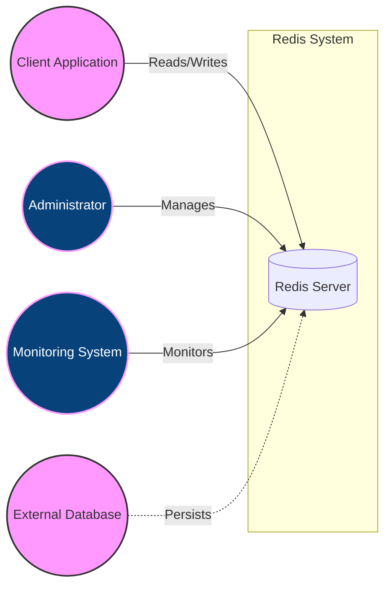
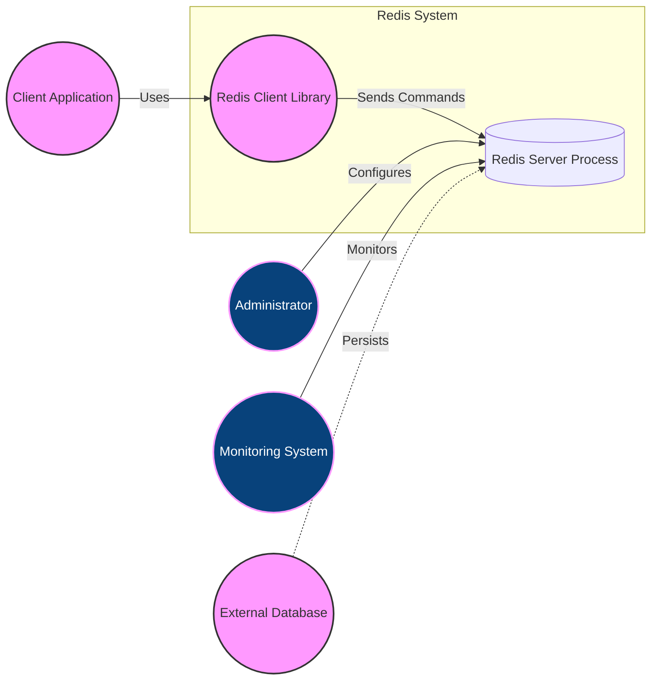
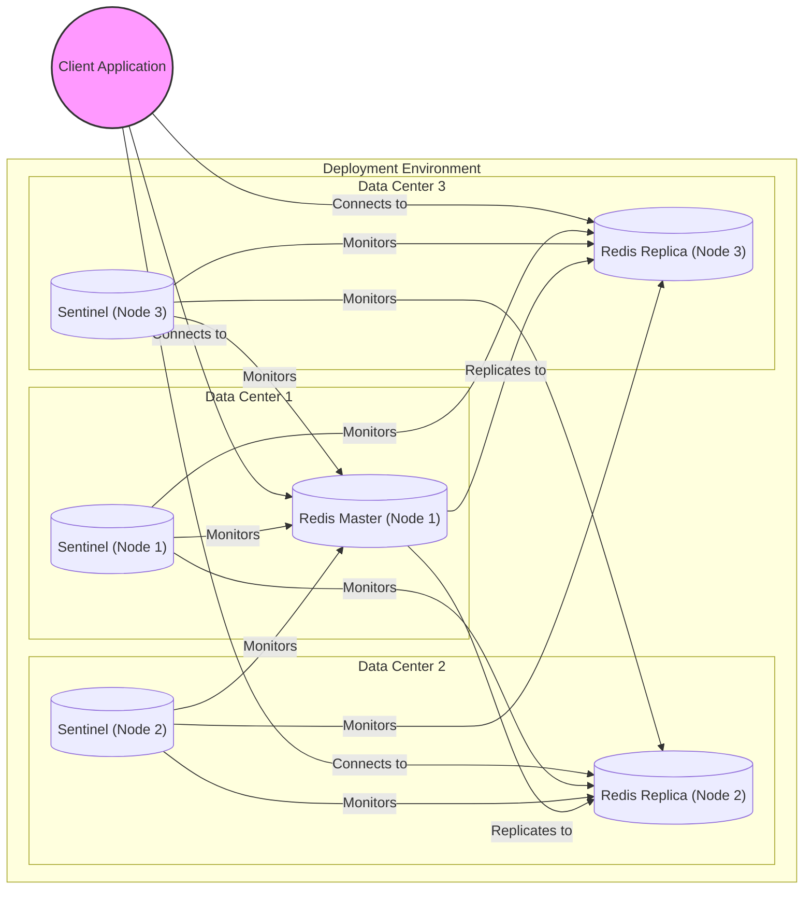
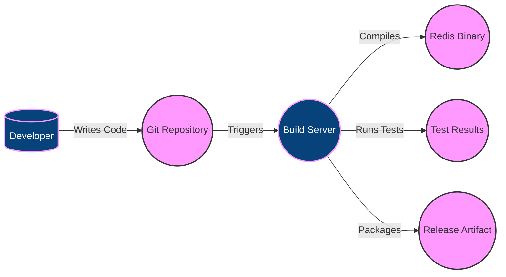

# BUSINESS POSTURE

Redis is a mature, widely-used, open-source project. It's not a startup, but rather a critical piece of infrastructure for many companies, ranging from small startups to Fortune 500 enterprises. The primary business goals are performance, reliability, and data persistence (optional). The project aims to provide a high-performance, in-memory data structure store, used as a database, cache, and message broker.

Business priorities:

- Performance: Extremely low latency data access.
- Reliability: High availability and data consistency.
- Scalability: Ability to handle increasing workloads.
- Data Durability (Optional): Configurable persistence options to prevent data loss.
- Operational Simplicity: Ease of deployment, configuration, and management.
- Community Support: Active and engaged community for support and contributions.
- Security: Protecting data from unauthorized access and ensuring the integrity of the system.

Most important business risks:

- Data Loss: Loss of in-memory data due to server crashes or power outages (if persistence is not configured or fails).
- Performance Degradation: Unexpected slowdowns impacting application performance.
- Security Breaches: Unauthorized access to sensitive data stored in Redis.
- Downtime: Service interruptions leading to application unavailability.
- Data Corruption: Data inconsistencies due to bugs or operational errors.
- Scalability Bottlenecks: Inability to handle increased load, leading to performance issues.

# SECURITY POSTURE

Existing security controls (based on the GitHub repository and common Redis deployments):

- security control: Authentication: Redis supports password authentication (AUTH command) to restrict access. Implemented in Redis server core.
- security control: Network Security: Typically deployed within a trusted network environment, often behind firewalls and with restricted access policies. Implemented at the network/infrastructure level.
- security control: TLS/SSL Encryption: Redis supports TLS/SSL for encrypting client-server communication and cluster communication. Implemented in Redis server core and client libraries.
- security control: Command Renaming/Disabling: Sensitive commands can be renamed or disabled to prevent accidental or malicious use. Implemented in Redis configuration (redis.conf).
- security control: Access Control Lists (ACLs) (Redis 6+): Fine-grained access control to restrict commands and data access based on user roles. Implemented in Redis server core.
- security control: Client-Side Encryption: Data can be encrypted by the application before being stored in Redis. Implemented in client applications.
- security control: Auditing: Redis can log commands and events to a file or syslog. Implemented in Redis configuration (redis.conf).
- security control: Regular Security Updates: The Redis project releases updates to address security vulnerabilities. Implemented through system updates and package management.
- security control: Bounded Memory Usage: Redis can be configured with a maximum memory limit (maxmemory) to prevent it from consuming all available memory. Implemented in Redis configuration (redis.conf).
- security control: Lua Scripting Security: Redis provides a secure environment for executing Lua scripts, limiting access to potentially dangerous operations. Implemented in Redis server core.

Accepted risks:

- accepted risk: Default Configuration: Redis, by default, binds to all interfaces and has no authentication enabled. This is a known and accepted risk, requiring administrators to configure security properly.
- accepted risk: Denial of Service (DoS): Redis, like any network service, is susceptible to DoS attacks. Mitigation relies on network-level protections and resource limits.
- accepted risk: Insider Threats: Malicious or negligent insiders with network access can potentially bypass security controls. Mitigation relies on strong access controls and monitoring.
- accepted risk: Data Exposure in Memory: Data stored in Redis resides in memory, making it potentially vulnerable to memory scraping attacks if the server is compromised.

Recommended security controls:

- Implement Network Segmentation: Isolate Redis instances within a dedicated network segment with strict access control rules.
- Enable and Configure ACLs: Use Redis 6+ ACLs to implement the principle of least privilege.
- Enforce Strong Passwords: Use strong, randomly generated passwords for authentication.
- Monitor Redis Logs: Regularly review Redis logs for suspicious activity.
- Implement Intrusion Detection/Prevention Systems (IDS/IPS): Deploy IDS/IPS to monitor network traffic for malicious activity targeting Redis.
- Regularly Audit Security Configuration: Periodically review and update the Redis security configuration to address emerging threats.

Security requirements:

- Authentication:
    - All clients must authenticate before accessing Redis data.
    - Strong password policies must be enforced.
    - Support for multi-factor authentication (MFA) should be considered (likely implemented externally).
- Authorization:
    - Access to Redis commands and data must be controlled using ACLs.
    - The principle of least privilege must be applied.
- Input Validation:
    - Redis itself does not perform extensive input validation as it primarily stores binary data. Input validation is largely the responsibility of the client application.
    - Client applications must sanitize data before storing it in Redis to prevent injection attacks (e.g., Lua script injection).
- Cryptography:
    - TLS/SSL must be used to encrypt all client-server and cluster communication.
    - Strong ciphers and protocols must be used.
    - Client-side encryption should be considered for sensitive data.
    - Key management procedures must be established and followed.

# DESIGN

## C4 CONTEXT

Element descriptions:

- Client Application:
    - Name: Client Application
    - Type: Software System
    - Description: Applications that use Redis as a cache, database, or message broker.
    - Responsibilities: Sending commands to Redis, reading and writing data, handling application logic.
    - Security controls: Authentication, TLS/SSL encryption, client-side encryption (optional), input validation.

- Administrator:
    - Name: Administrator
    - Type: Person
    - Description: Individuals responsible for managing and configuring Redis instances.
    - Responsibilities: Installing, configuring, monitoring, and maintaining Redis servers.
    - Security controls: Strong authentication, access controls, secure remote access.

- Monitoring System:
    - Name: Monitoring System
    - Type: Software System
    - Description: Systems used to monitor the performance and health of Redis instances.
    - Responsibilities: Collecting metrics, generating alerts, providing dashboards.
    - Security controls: Authentication, TLS/SSL encryption, secure communication channels.

- Redis Server:
    - Name: Redis Server
    - Type: Software System
    - Description: The core Redis server process.
    - Responsibilities: Storing data in memory, processing commands, managing persistence (optional).
    - Security controls: Authentication, ACLs, TLS/SSL encryption, command renaming/disabling, auditing.

- External Database:
    - Name: External Database
    - Type: Software System
    - Description: An external database system that Redis might interact with for persistence or data synchronization.
    - Responsibilities: Providing persistent storage for Redis data (optional).
    - Security controls: Dependent on the specific database system used.

## C4 CONTAINER

Element descriptions:

- Redis Server Process:
    - Name: Redis Server Process
    - Type: Container
    - Description: The main Redis server process that handles data storage, command processing, and persistence.
    - Responsibilities: Managing in-memory data structures, executing commands, handling client connections, managing persistence (if enabled).
    - Security controls: Authentication, ACLs, TLS/SSL encryption, command renaming/disabling, auditing, input validation (limited).

- Redis Client Library:
    - Name: Redis Client Library
    - Type: Container
    - Description: Libraries used by client applications to interact with Redis.
    - Responsibilities: Providing an API for connecting to Redis, sending commands, and receiving responses.
    - Security controls: TLS/SSL encryption, connection pooling, handling authentication.

- Client Application:
    - Name: Client Application
    - Type: Software System
    - Description: Applications that use Redis as a cache, database, or message broker.
    - Responsibilities: Sending commands to Redis, reading and writing data, handling application logic.
    - Security controls: Authentication, TLS/SSL encryption, client-side encryption (optional), input validation.

- Administrator:
    - Name: Administrator
    - Type: Person
    - Description: Individuals responsible for managing and configuring Redis instances.
    - Responsibilities: Installing, configuring, monitoring, and maintaining Redis servers.
    - Security controls: Strong authentication, access controls, secure remote access.

- Monitoring System:
    - Name: Monitoring System
    - Type: Software System
    - Description: Systems used to monitor the performance and health of Redis instances.
    - Responsibilities: Collecting metrics, generating alerts, providing dashboards.
    - Security controls: Authentication, TLS/SSL encryption, secure communication channels.

- External Database:
    - Name: External Database
    - Type: Software System
    - Description: An external database system that Redis might interact with for persistence or data synchronization.
    - Responsibilities: Providing persistent storage for Redis data (optional).
    - Security controls: Dependent on the specific database system used.

## DEPLOYMENT

Possible deployment solutions:

1.  Standalone: Single Redis instance.
2.  Replication: Master-replica setup for high availability and read scaling.
3.  Sentinel: Automatic failover for master-replica setups.
4.  Cluster: Sharded Redis deployment for horizontal scaling.
5.  Cloud-based managed services (e.g., AWS ElastiCache, Azure Cache for Redis, Google Cloud Memorystore).

Chosen deployment solution (for detailed description): Replication with Sentinel

Element descriptions:

- Redis Master (Node 1):
    - Name: Redis Master (Node 1)
    - Type: Node
    - Description: The primary Redis instance that handles write operations.
    - Responsibilities: Accepting write commands, replicating data to replicas.
    - Security controls: Authentication, ACLs, TLS/SSL encryption, firewall rules.

- Redis Replica (Node 2, Node 3):
    - Name: Redis Replica (Node 2, Node 3)
    - Type: Node
    - Description: Read-only replicas of the master instance.
    - Responsibilities: Serving read requests, replicating data from the master.
    - Security controls: Authentication, ACLs, TLS/SSL encryption, firewall rules.

- Sentinel (Node 1, Node 2, Node 3):
    - Name: Sentinel (Node 1, Node 2, Node 3)
    - Type: Node
    - Description: Sentinel instances that monitor the health of Redis master and replicas.
    - Responsibilities: Monitoring Redis instances, performing automatic failover if the master becomes unavailable.
    - Security controls: Authentication, TLS/SSL encryption, firewall rules.

- Client Application:
    - Name: Client Application
    - Type: Software System
    - Description: Applications that use Redis.
    - Responsibilities: Connecting to Redis instances, sending commands, handling application logic.
    - Security controls: Authentication, TLS/SSL encryption, client-side encryption (optional).

## BUILD

Redis build process is primarily based on Makefiles. The process involves compiling C source code into executable binaries.

Security controls in the build process:

- Code Review: All code changes are reviewed before being merged into the main branch.
- Static Analysis: The Redis project uses static analysis tools (e.g., linters) to identify potential code quality and security issues. Implemented in CI workflows.
- Testing: Extensive test suite to ensure code correctness and prevent regressions. Implemented in CI workflows.
- Dependency Management: Dependencies are carefully managed and reviewed for security vulnerabilities.
- Signed Releases: Official Redis releases are digitally signed to ensure authenticity and integrity.

# RISK ASSESSMENT

Critical business processes to protect:

- Data access and retrieval: Ensuring fast and reliable access to data stored in Redis.
- Data consistency: Maintaining data integrity and consistency across replicas.
- Service availability: Preventing downtime and ensuring continuous operation.

Data to protect and sensitivity:

- Cached application data: Sensitivity varies depending on the application. Can range from non-sensitive to highly sensitive (e.g., session data, user profiles, financial data).
- Database data: If Redis is used as a primary database, the data sensitivity is determined by the application's data model.
- Message queue data: If Redis is used as a message broker, the data sensitivity depends on the messages being exchanged.
- Configuration data: Redis configuration files may contain sensitive information such as passwords and access keys.

# QUESTIONS & ASSUMPTIONS

Questions:

- What specific types of data will be stored in Redis instances? (This is crucial for determining the appropriate security controls.)
- What are the specific compliance requirements (e.g., GDPR, PCI DSS, HIPAA) that apply to the systems using Redis?
- What is the existing network infrastructure and security architecture?
- What are the existing monitoring and logging capabilities?
- Are there any existing intrusion detection/prevention systems in place?
- What is the process for managing and rotating secrets (e.g., passwords, API keys)?
- What is the disaster recovery plan for Redis data?

Assumptions:

- BUSINESS POSTURE: The organization understands the importance of securing Redis and is willing to invest in the necessary resources.
- SECURITY POSTURE: The organization has a basic understanding of security best practices and has implemented some foundational security controls.
- DESIGN: Redis will be deployed in a secure network environment with restricted access. Administrators will configure Redis securely, enabling authentication and TLS/SSL encryption. The organization will regularly update Redis to the latest version to address security vulnerabilities.