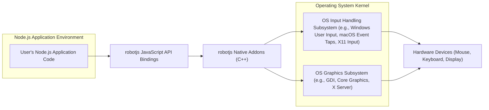
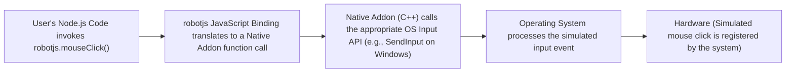
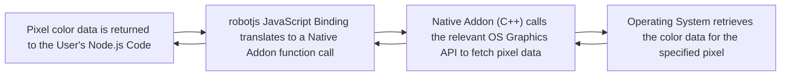

# Project Design Document: robotjs

**Version:** 1.1
**Date:** October 26, 2023
**Author:** AI Software Architect

## 1. Project Overview

This document details the design of the `robotjs` project, a Node.js library enabling native desktop automation. It empowers developers to programmatically control the mouse, keyboard, and screen of the local operating system where the Node.js application executes. This document serves as a foundational reference for understanding the system's architecture, data flow mechanisms, and core components, which is essential for subsequent threat modeling and security analysis.

## 2. Goals

* To offer a cross-platform Node.js API for manipulating mouse actions, including movements, clicks (single, double, right), and scrolling.
* To provide a Node.js API for simulating keyboard interactions, encompassing key presses, key releases, and the simulation of typing strings.
* To enable programmatic access to screen-related information, such as screen dimensions and the color of individual pixels at specific coordinates.
* To present a straightforward and intuitive API, facilitating seamless integration of desktop automation capabilities into Node.js applications.
* To maintain broad cross-platform compatibility, supporting major operating systems including Windows, macOS, and Linux.

## 3. Non-Goals

* Providing functionality for remote desktop control or remote access. `robotjs` is designed for local machine interaction only.
* Implementing advanced computer vision features like sophisticated image recognition or Optical Character Recognition (OCR).
* Incorporating built-in security mechanisms such as access control lists or sandboxing. Security is explicitly considered the responsibility of the application utilizing `robotjs`.
* Offering a graphical user interface (GUI) for creating automation scripts. `robotjs` is intended as a programmatic library for developers.
* Managing or directly interacting with operating system processes beyond the scope of simulating user input and reading screen data.

## 4. Target Audience

* Software developers requiring desktop automation for tasks such as automated testing, scripting of repetitive tasks, or creating custom utilities.
* Quality Assurance (QA) engineers seeking to develop and execute automated user interface (UI) tests.
* Developers building accessibility tools or assistive technologies that require programmatic control of the desktop environment.
* Hobbyist programmers and makers interested in automating routine desktop tasks for personal productivity or experimentation.

## 5. System Architecture

The `robotjs` library acts as an intermediary, bridging the gap between JavaScript code running within a Node.js environment and the underlying operating system's native APIs responsible for handling input and screen control. This is achieved through the utilization of Node.js Native Addons (also referred to as N-API or Node-API). These addons are written in C++ and compiled to native code, allowing direct interaction with system-level functions.

**Detailed Breakdown of Architecture Components:**

* **User's Node.js Application Code:** The JavaScript code authored by the developer that imports and utilizes the functionalities provided by the `robotjs` library.
* **robotjs JavaScript API Bindings:** This layer comprises the JavaScript code within the `robotjs` library that exposes the high-level API to developers. It receives function calls from the user's code and translates them into corresponding calls to the underlying native addon. This layer handles argument marshalling and provides a user-friendly interface.
* **robotjs Native Addons (C++):** This is the core component of `robotjs`, implemented in C++. It directly interacts with the operating system's native APIs. This component contains platform-specific implementations to handle the nuances of mouse and keyboard control and screen access across different operating systems.
* **OS Input Handling Subsystem:** This represents the operating system's internal mechanisms for managing input events from devices like the mouse and keyboard. Examples include the Windows User Input system, macOS Event Taps, and the X11 input handling on Linux.
* **OS Graphics Subsystem:** This represents the operating system's internal mechanisms for managing the display and providing access to screen information. Examples include the Graphics Device Interface (GDI) on older Windows versions, Core Graphics on macOS, and the X Server on Linux.
* **Hardware Devices:** The physical input and output devices, such as the mouse, keyboard, and display screen, that are being controlled or whose state is being read by `robotjs`.

## 6. Data Flow

The primary data flow within `robotjs` involves commands originating from the Node.js application to control the operating system and data being retrieved from the system (e.g., the color of a specific screen pixel).

**Control Flow Example (Simulating a Mouse Click):**

**Data Retrieval Flow Example (Getting a Pixel Color):**

**Detailed Description of Data Flow:**

* **Initiation of Action:** The developer's Node.js code calls a function exposed by the `robotjs` API (e.g., `mouseClick()`, `typeString()`, `getPixelColor()`). This initiates the data flow.
* **JavaScript Binding Interception:** The `robotjs` JavaScript binding layer receives this function call. It performs necessary argument validation and transformation before passing the request to the native addon. This layer acts as a bridge between the JavaScript and C++ domains.
* **Native Addon Processing:** The C++ native addon receives the call from the JavaScript binding. Based on the specific function invoked and the underlying operating system, it determines the appropriate OS-specific API functions to call.
* **Operating System API Interaction:** The native addon interacts with the relevant OS input or graphics APIs to execute the requested action. For instance, to simulate a mouse click, it might use `SendInput` on Windows, `CGEventPost` on macOS, or XTest extensions on Linux. Similarly, to get a pixel color, it would use OS-specific graphics APIs.
* **OS Execution and Data Retrieval:** The operating system processes the API calls. For control actions, this results in the simulation of user input events. For data retrieval, the OS fetches the requested information (e.g., pixel color).
* **Data Return Path (for retrieval operations):** If the operation involves retrieving data, the OS returns the requested data to the native addon.
* **Native Addon to JavaScript Binding:** The native addon marshals the data received from the OS back into JavaScript-compatible data types. This data is then returned to the JavaScript binding layer.
* **Return to User Code:** The JavaScript binding layer passes the processed data back to the user's Node.js code, completing the data flow.

## 7. Key Components

* **`lib/robotjs.js`:** This JavaScript file serves as the primary interface for the `robotjs` library. It is responsible for loading the compiled native addon and exposing the JavaScript functions that developers use to interact with the underlying native functionality.
* **`src/` directory:** This directory houses the C++ source code for the native addons. It contains platform-specific implementations to handle the variations in OS APIs.
    * **`src/robotjs.cc`:** This is the main entry point for the native addon. It initializes the module and registers the functions that can be called from JavaScript. It often acts as a dispatcher, routing calls to platform-specific implementations.
    * **Platform-Specific Implementation Files (e.g., `src/windows.cc`, `src/darwin.mm`, `src/linux.cc`):** These files contain the core logic for interacting with the operating system's input and graphics APIs. They implement the platform-specific details for simulating mouse and keyboard events and accessing screen information. The naming conventions might vary slightly.
* **Build Configuration Files (e.g., `binding.gyp`, `CMakeLists.txt`):** These files are used by Node.js build tools (like `node-gyp`) or CMake to define how the native addon should be compiled for different platforms. They specify source files, dependencies, compiler flags, and linking instructions.
* **External Dependencies:** `robotjs` might rely on external native libraries or system components provided by the operating system for interacting with the input and graphics subsystems. These dependencies are usually handled by the build process and are platform-specific.

## 8. Security Considerations

Due to the nature of `robotjs`, which directly interacts with the operating system's input and display mechanisms, security considerations are of utmost importance:

* **Insufficient Input Validation:** The `robotjs` library itself might not perform exhaustive validation on the arguments passed to its functions (e.g., mouse coordinates, key codes, strings to type). It is **critical** that applications utilizing `robotjs` implement robust input validation to sanitize any external or untrusted data before passing it to `robotjs` functions. Failure to do so could allow malicious actors to inject unintended commands or actions. For instance, using unsanitized input to set mouse coordinates could lead to clicks on unintended and potentially sensitive UI elements.
* **Privilege Escalation Potential:** `robotjs` operates with the same privileges as the Node.js process that is running it. If the Node.js process is executed with elevated privileges (e.g., administrator or root), `robotjs` will inherit those privileges. This significantly increases the potential impact of any vulnerabilities or misuse. Users should adhere to the principle of least privilege and avoid running applications using `robotjs` with elevated privileges unless absolutely necessary and with extreme caution.
* **Dependency Chain Vulnerabilities:** Like all Node.js projects, `robotjs` relies on a chain of dependencies. Security vulnerabilities in any of these dependencies could potentially be exploited by malicious actors to compromise the application or the system. Regular auditing and updating of dependencies are crucial security practices. Tools like `npm audit` or `yarn audit` should be used regularly.
* **Code Injection Vulnerabilities:** If an application using `robotjs` constructs input strings (e.g., for the `typeString()` function) based on untrusted external data without proper sanitization, it could be susceptible to code injection attacks. Maliciously crafted strings could potentially execute unintended commands or introduce vulnerabilities within the context of the application or even the operating system.
* **Exposure of Sensitive Screen Content:** The `getScreenSize()` and `getPixelColor()` functions provide access to the contents of the user's screen. Malicious applications or compromised systems could leverage these functions to capture sensitive information displayed on the screen, such as passwords, personal data, or confidential documents.
* **Platform-Specific Security Differences:** Security mechanisms and requirements can vary significantly across different operating systems. For example, simulating keyboard input might require specific permissions or accessibility settings to be enabled on macOS. Developers need to be aware of these platform-specific nuances and ensure their applications comply with the respective security guidelines.
* **Potential for Denial-of-Service (DoS):**  Rapidly and repeatedly simulating mouse movements or keyboard input could potentially overwhelm the local system, leading to a denial-of-service condition. Malicious scripts could exploit this to disrupt the user's workflow or even crash the system. Rate limiting or careful management of automation loops is important.

## 9. Deployment Considerations

* `robotjs` is typically integrated into a Node.js project by adding it as a dependency using package managers like `npm` or `yarn`.
* The installation process involves compiling the native addon specifically for the target operating system and architecture. This requires the presence of necessary build tools on the target machine, such as a C++ compiler (e.g., GCC, Clang, Visual Studio Build Tools) and Python.
* Applications that depend on `robotjs` must be deployed with the correctly compiled native addon for the specific platform where they will be running. This often means distributing different builds of the application or the native addon for different operating systems.
* When deploying to server environments, especially headless servers without a graphical interface, using `robotjs` might require additional configuration, such as setting up a virtual display server (e.g., Xvfb on Linux) to simulate a graphical environment for the library to interact with.

## 10. Future Considerations

* **Enhanced Error Handling and Robustness:** Improving error handling within the native addon to provide more specific and actionable error messages to the JavaScript layer, making debugging easier.
* **More Granular Control over Input Events:**  Potentially expanding the API to offer more fine-grained control over mouse and keyboard events, such as specifying the exact timing or modifiers for input events.
* **Support for Asynchronous Operations:** Exploring the feasibility of implementing asynchronous operations for certain functions, particularly those that might be time-consuming, to prevent blocking the Node.js event loop and improve application responsiveness.
* **Regular Security Audits and Vulnerability Scanning:**  Implementing a process for conducting regular security audits of the codebase and utilizing vulnerability scanning tools to proactively identify and address potential security weaknesses.
* **Improved and More Comprehensive Documentation:**  Providing more detailed and user-friendly documentation, including clear examples, best practices for secure usage, and platform-specific considerations for developers using the library.
