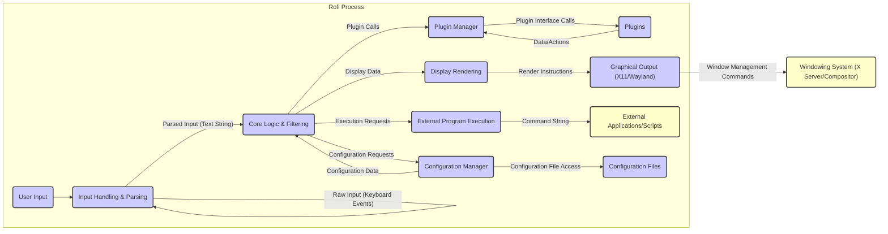

# Project Design Document: Rofi - A Window Switcher, Application Launcher and dmenu Replacement

**Version:** 1.1
**Date:** October 26, 2023
**Author:** Gemini (AI Language Model)

## 1. Introduction

This document provides a detailed design overview of Rofi, a versatile window switcher, application launcher, and dmenu replacement. This document aims to clearly articulate the system's architecture, components, and data flow, making it suitable for subsequent threat modeling activities. It outlines the key functionalities and interactions within Rofi to facilitate a comprehensive understanding of its potential security vulnerabilities. This revision includes more detailed descriptions and clarifies certain aspects for enhanced understanding during threat modeling.

## 2. Goals

*   Provide a clear and comprehensive description of Rofi's architecture and functionality.
*   Identify key components and their interactions with greater detail.
*   Outline the data flow within the application, including specific data types where relevant.
*   Serve as a robust foundation for future threat modeling exercises.
*   Document the design in a manner easily understandable by security professionals and developers with varying levels of familiarity with the project.

## 3. Scope

This document covers the core functionalities of Rofi as described in the project's GitHub repository. It focuses on the architectural design and data flow relevant to security considerations, providing more granular detail than the previous version. It includes:

*   Detailed description of user interaction mechanisms and input types.
*   In-depth explanation of core application logic and its decision-making processes.
*   Comprehensive overview of configuration handling, including file formats and access methods.
*   Detailed description of the plugin system architecture and plugin interaction points.
*   Specifics on interaction with the underlying operating system and windowing system, including relevant APIs.

This document does not cover:

*   Specific implementation details of individual functions beyond what is necessary for understanding data flow and component interaction.
*   Detailed code-level analysis or line-by-line examination.
*   Specific vulnerabilities or exploits.
*   Future planned features not yet implemented in the current stable version.

## 4. High-Level Overview

Rofi is a highly customizable and efficient application launcher and window switcher that can also function as a drop-in replacement for dmenu. It operates primarily within a graphical environment, interacting with the windowing system (typically X11 or Wayland). Users interact with Rofi through a text-based interface, typing queries to filter and select applications, windows, or other actions. Rofi's flexibility is significantly enhanced through a dynamic plugin system, allowing for extended functionality and integration with various services. The core application is designed for performance and responsiveness.

## 5. System Architecture

Rofi's architecture can be broken down into several key components that interact to provide its functionality.

### 5.1. Components

*   **User Input:** This represents the user interacting with Rofi, primarily through keyboard input. Input can include standard alphanumeric characters, special characters, and key combinations.
*   **Input Handling & Parsing:** This component receives raw keyboard events from the windowing system. It processes these events to form a coherent text string representing the user's query. This involves handling key presses, releases, and interpreting special key combinations. It may perform basic sanitization, but its primary role is parsing.
*   **Core Logic & Filtering:** This is the central orchestrator of Rofi's functionality. It receives the parsed user input and determines the appropriate actions based on the current mode (application launcher, window switcher, dmenu, etc.). It performs filtering operations on lists of applications, windows, or plugin-provided items. It interacts with the `Configuration Manager` to retrieve settings and the `Plugin Manager` to access and execute plugin functionalities. This component makes decisions about what to display and what actions to take.
*   **Display Rendering:** This component takes the filtered results from the `Core Logic` and generates the visual representation of Rofi's interface. It determines the layout, colors, and text to be displayed. It then passes rendering instructions to the `Graphical Output` component.
*   **Configuration Manager:** This component is responsible for loading, parsing, and managing Rofi's configuration files. It supports various configuration formats (e.g., plain text, potentially others via plugins). It provides configuration data to the `Core Logic` and other components upon request. It also handles applying configuration changes.
*   **Plugin Manager:** This component manages the lifecycle of Rofi plugins. It loads plugins at startup, provides an interface for the `Core Logic` to interact with them, and handles communication between the core application and plugins. It ensures plugins adhere to the defined API.
*   **Plugins:** These are dynamically loaded external modules that extend Rofi's functionality. They can provide new modes (e.g., SSH launcher), actions, or data sources (e.g., browser bookmarks). Plugins interact with the `Plugin Manager` through a defined API.
*   **External Program Execution:** This component handles the execution of external applications or scripts. It receives commands from the `Core Logic` (often triggered by user selection) and uses system calls to execute these commands. This component is crucial for Rofi's role as an application launcher and dmenu replacement.
*   **Graphical Output (X11/Wayland):** This component interacts directly with the underlying windowing system (X Server or Wayland compositor) to display Rofi's interface. It uses the respective APIs (Xlib/XCB for X11, Wayland client API for Wayland) to create windows, draw elements, and handle input events.
*   **Configuration Files:** These are typically text-based files (e.g., `config.rasi`) that store Rofi's configuration settings, including themes, keybindings, modes, and plugin configurations. The format and location of these files are well-defined.

### 5.2. External Entities

*   **Windowing System (X Server/Compositor):** The underlying system responsible for managing graphical displays, user input, and window management. Rofi relies on this to display its interface, receive user input events, and perform window management actions.
*   **External Applications/Scripts:** The applications or scripts that Rofi launches or interacts with. These can be any executable on the system.

## 6. Data Flow

The following describes the typical data flow within Rofi during a user interaction:

1. **User Input:** The user presses keys, generating keyboard events.
2. **Input Handling:** The `Input Handling & Parsing` component receives these raw keyboard events from the `Windowing System`.
3. **Parsing:** The `Input Handling & Parsing` component processes the events, forming a text string representing the user's query.
4. **Query Transmission:** The parsed input string is passed to the `Core Logic & Filtering` component.
5. **Configuration Check:** The `Core Logic` may request configuration data from the `Configuration Manager` to determine the current mode, theme, or other relevant settings.
6. **Plugin Interaction (Optional):** Depending on the mode and user input, the `Core Logic` may interact with the `Plugin Manager` to retrieve data (e.g., a list of SSH hosts) or request plugin-specific actions. This involves the `Core Logic` making calls to the `Plugin Manager`, which in turn calls the relevant `Plugin`.
7. **Filtering and Matching:** The `Core Logic` filters the list of available items (applications, windows, plugin results) based on the user's input and the current mode's filtering logic.
8. **Display Data Preparation:** The `Core Logic` prepares the data to be displayed, including the list of matching items and any relevant formatting information.
9. **Rendering Instructions:** The prepared display data is passed to the `Display Rendering` component, which generates instructions for how the interface should be drawn.
10. **Graphical Output:** The `Display Rendering` component uses the `Graphical Output` component to send drawing commands to the `Windowing System`, resulting in Rofi's interface being displayed on the screen.
11. **User Selection:** The user selects an item from the displayed list, typically by pressing Enter or clicking with the mouse.
12. **Action Determination:** The `Core Logic` determines the action associated with the selected item.
13. **Action Execution:**
    *   **Application Launch:** If an application is selected, the `Core Logic` instructs the `External Program Execution` component to launch the application using appropriate system calls. The command string passed to this component is crucial.
    *   **Window Switch:** If a window is selected, the `Core Logic` interacts with the `Windowing System` (via the `Graphical Output` component) to request a window switch.
    *   **Plugin Action:** If a plugin action is selected, the `Core Logic` instructs the `Plugin Manager` to execute the corresponding plugin function. This may involve the plugin interacting with `External Applications/Scripts`.

## 7. Security Considerations

This section outlines key security considerations based on the design. A more detailed threat model will build upon this foundation.

*   **Input Validation and Sanitization:** The `Input Handling & Parsing` component must rigorously validate and sanitize user input to prevent command injection attacks, especially when the input is used in the `External Program Execution` component or passed to plugins. Improper handling of shell metacharacters or escape sequences is a significant risk.
*   **Configuration File Security:** The `Configuration Files` are a critical attack surface. If these files are writable by unauthorized users, they could be modified to execute arbitrary commands upon Rofi's startup or during operation. Secure file permissions and potentially cryptographic signing of configuration files should be considered.
*   **Plugin Security and Isolation:**  Plugins, being external code, represent a significant potential attack vector. Rofi needs robust mechanisms to isolate plugins, limit their access to system resources, and validate their integrity. The `Plugin Manager` should enforce strict API boundaries and potentially employ sandboxing techniques. A compromised plugin could potentially gain full user privileges.
*   **External Program Execution Security:** The `External Program Execution` component must be carefully designed to prevent command injection vulnerabilities. Input received from the user or plugins should never be directly incorporated into shell commands without proper sanitization and escaping. Consider using parameterized execution methods where possible. Privilege separation for executed programs might also be necessary.
*   **Inter-Process Communication (IPC) Security:** If Rofi or its plugins utilize IPC mechanisms (e.g., sockets, pipes), these channels must be secured to prevent unauthorized access, eavesdropping, or manipulation of data. Authentication and encryption may be required.
*   **Memory Safety:** As Rofi is primarily written in C, memory safety issues like buffer overflows, use-after-free vulnerabilities, and format string bugs are potential concerns. Secure coding practices, static analysis, and thorough testing are essential to mitigate these risks.
*   **Dependency Management:** Rofi relies on external libraries (e.g., Xlib/XCB, Pango). Vulnerabilities in these dependencies could directly impact Rofi's security. Regular updates and vulnerability scanning of dependencies are crucial.
*   **Wayland Security Considerations:** When running under Wayland, understanding the security model of the Wayland protocol and the specific compositor implementation is important. While Wayland offers some inherent security improvements over X11, vulnerabilities can still exist in the compositor or in the way Rofi interacts with it.
*   **Default Configurations:** The default configuration of Rofi should be secure and not expose users to unnecessary risks. This includes default plugin settings and permissions.

## 8. Future Considerations

*   **Plugin Sandboxing:** Implementing a robust and fine-grained sandboxing mechanism for plugins would significantly enhance security by limiting the potential damage from malicious or poorly written plugins. This could involve using technologies like seccomp or namespaces.
*   **Enhanced Input Sanitization Techniques:** Employing more advanced input sanitization and validation techniques, potentially using libraries specifically designed for this purpose, to prevent a wider range of injection attacks.
*   **Cryptographic Signing of Configuration Files:** Implementing a mechanism to cryptographically sign configuration files to ensure their integrity and authenticity, preventing tampering by unauthorized users.
*   **Fine-grained Permissions for External Program Execution:** Allowing users to define more restrictive permissions or security contexts for programs launched through Rofi, potentially using features like Linux capabilities or sandboxing technologies.
*   **Security Audits and Penetration Testing:** Regularly conducting security audits and penetration testing to identify and address potential vulnerabilities.

## 9. Conclusion

This revised document provides a more detailed and comprehensive design overview of Rofi, outlining its key components, data flow, and crucial security considerations. This enhanced information serves as a stronger foundation for conducting thorough threat modeling exercises to identify and mitigate potential security vulnerabilities within the application. A deep understanding of the architecture and interactions described here is paramount for ensuring the security, integrity, and reliability of Rofi and the systems it operates on.