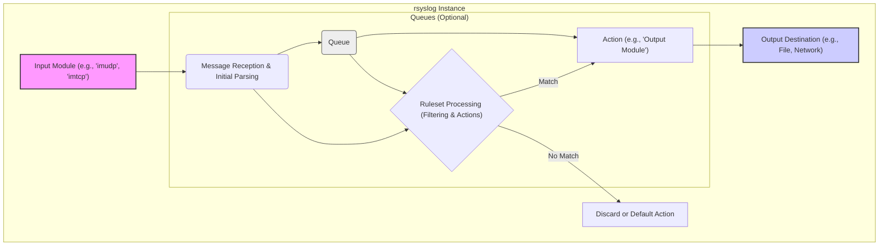

# Project Design Document: rsyslog

**Version:** 1.1
**Date:** October 26, 2023
**Author:** AI Software Architect

## 1. Introduction

This document provides an enhanced architectural design of the rsyslog system, a widely used open-source log processing utility. This design document is intended to serve as a robust foundation for subsequent threat modeling activities, providing a comprehensive understanding of the system's components, data flow, and interactions with a stronger focus on security-relevant aspects.

## 2. Goals and Non-Goals

**Goals:**

*   Clearly define the major components of the rsyslog system with a focus on their security implications.
*   Describe the data flow within rsyslog, from log reception to output, highlighting potential security vulnerabilities at each stage.
*   Identify key interfaces and interactions between components, emphasizing security boundaries and trust relationships.
*   Provide sufficient detail for effective threat modeling, enabling the identification of potential attack vectors and vulnerabilities.
*   Highlight important configuration aspects relevant to security, including best practices and potential misconfigurations.

**Non-Goals:**

*   Provide an exhaustive list of every rsyslog feature or module.
*   Detail the internal implementation of specific modules beyond what is necessary for threat modeling.
*   Offer specific security hardening recommendations (this will be the output of the threat modeling process).
*   Describe the user interface or command-line options in detail, unless directly relevant to security configuration.
*   Cover every possible deployment scenario, but focus on common and security-relevant deployments.

## 3. System Architecture

rsyslog's modular design allows for flexible and extensible log processing. Understanding the interactions between these modules is crucial for security analysis.

### 3.1. Major Components

*   **Input Modules (Imputs):** These modules are the entry points for log data. Security considerations include:
    *   `imudp`: Receives logs over UDP. Vulnerable to spoofing as UDP is connectionless.
    *   `imtcp`: Receives logs over TCP. Offers connection-oriented transport but requires careful configuration to prevent resource exhaustion and ensure authentication (e.g., using TLS).
    *   `imklog`: Reads kernel messages. Requires appropriate permissions and understanding of kernel log formats to prevent manipulation.
    *   `imjournal`: Reads messages from systemd journal. Relies on the security of the journal service itself.
    *   `imfile`: Reads logs from files. Susceptible to path traversal vulnerabilities if not configured carefully. Permissions on the log files are critical.
    *   `imrelp`: Receives logs using the Reliable Event Logging Protocol (RELP). Offers reliable delivery and optional TLS encryption.
*   **Processing Engine (Core):** The heart of rsyslog, responsible for decision-making based on configured rules. Security implications include:
    *   **Ruleset Logic:** Incorrectly configured rules can lead to logs being dropped, misrouted, or written to insecure locations.
    *   **Filtering Vulnerabilities:**  Complex filters might have vulnerabilities if they process untrusted data without proper sanitization.
    *   **Resource Consumption:**  Maliciously crafted log messages could exploit processing logic to consume excessive resources.
*   **Output Modules (Omputs):** These modules handle the delivery of processed logs. Security considerations include:
    *   `omfile`: Writes logs to files. Permissions on the output files and directories are paramount. Path traversal vulnerabilities are a concern.
    *   `omudp`: Sends logs over UDP. Lacks inherent security features like encryption or guaranteed delivery.
    *   `omtcp`: Sends logs over TCP. Encryption (TLS) should be used to protect confidentiality and integrity. Authentication of the remote endpoint is important.
    *   `omelasticsearch`: Sends logs to Elasticsearch. Requires secure configuration of the Elasticsearch cluster and secure communication.
    *   `ommysql`: Writes logs to a MySQL database. Database credentials must be securely managed, and appropriate database permissions configured.
    *   `omkafka`: Sends logs to a Kafka topic. Secure configuration of the Kafka cluster and appropriate access controls are necessary.
    *   `omrelp`: Sends logs using RELP. Offers reliable delivery and optional TLS encryption.
*   **Configuration System:** The `rsyslog.conf` file dictates rsyslog's behavior. Security considerations include:
    *   **Access Control:** The configuration file itself is a sensitive resource and should have restricted access.
    *   **Syntax and Logic Errors:**  Misconfigurations can lead to security vulnerabilities.
    *   **Secrets Management:**  Configuration might contain sensitive information like database passwords or API keys, requiring secure handling.
*   **Queues:** Queues buffer messages, providing resilience but also introducing security considerations:
    *   **Memory Queues:** Data is held in memory, vulnerable to memory dumping if the system is compromised.
    *   **Disk-Assisted Queues:** Data is written to disk, requiring secure storage and consideration of data at rest encryption.
    *   **Queue Overflow:**  If queues are not properly sized, they can overflow, leading to log loss or potential denial of service.
*   **Property Replacer:** This powerful feature manipulates log message content. Security implications include:
    *   **Data Sanitization:** Can be used to redact sensitive information before logging.
    *   **Format String Vulnerabilities:**  Improper use of property replacers with untrusted data could lead to format string vulnerabilities (though less common in modern rsyslog).
    *   **Information Leakage:**  Incorrectly configured property replacers could inadvertently expose sensitive information.
*   **Runtime Management Interface:**  Allows for runtime control. Security considerations include:
    *   **Authentication and Authorization:**  Access to this interface should be restricted to authorized users.
    *   **Command Injection:**  If the interface allows execution of arbitrary commands, it could be a significant vulnerability.

### 3.2. Data Flow

Understanding the flow of log data is crucial for identifying potential interception or manipulation points.

**Detailed Data Flow Steps (with Security Focus):**

1. **Log Reception:** An input module receives a log message. *Potential vulnerability: Spoofing (UDP), connection hijacking (TCP), injection attacks if parsing is flawed.*
2. **Message Reception & Initial Parsing:** The input module parses the raw log data. *Potential vulnerability: Buffer overflows, format string bugs if parsing is not robust.*
3. **Queuing (Optional):** Messages might be placed in a queue. *Security consideration: Data at rest encryption for disk-assisted queues, memory protection for memory queues.*
4. **Ruleset Processing:** The parsed message is evaluated against rules. *Potential vulnerability: Bypass of security logging if rules are misconfigured, resource exhaustion if rules are complex and inefficient.*
5. **Action Execution:** Actions are performed on matching messages. *Security consideration: Ensure actions do not introduce new vulnerabilities (e.g., executing insecure scripts).*
6. **Output to Destination:** The output module sends the message. *Potential vulnerability: Man-in-the-middle attacks if encryption is not used for network outputs, insecure file permissions, injection vulnerabilities in database outputs.*

### 3.3. Key Interfaces and Interactions

*   **Input Module API:** Defines how input modules interact with the core. *Security consideration: Ensure the API prevents malicious modules from compromising the system.*
*   **Output Module API:** Defines how the core interacts with output modules. *Security consideration: Ensure the API prevents output modules from exfiltrating data or causing harm.*
*   **Configuration File Format:** The syntax and structure of `rsyslog.conf`. *Security consideration:  A complex or poorly defined format could lead to parsing vulnerabilities.*
*   **Network Protocols (UDP, TCP, RELP):** Used for log transport. *Security consideration: Each protocol has its own security implications (e.g., lack of inherent security in UDP).*
*   **File System Interactions:** Reading configuration, input files, and writing output. *Security consideration: File permissions, path traversal vulnerabilities.*
*   **System Call Interface:** Interaction with the OS kernel. *Security consideration: Requires appropriate privileges and understanding of potential security implications of system calls.*
*   **Database Client Libraries:** Used by database output modules. *Security consideration: Vulnerabilities in the client libraries themselves.*
*   **Message Queue Client Libraries:** Used by message queue output modules. *Security consideration: Vulnerabilities in the client libraries.*
*   **Runtime Management Interface (Signals/Control Socket):**  External control of rsyslog. *Security consideration: Authentication, authorization, and protection against command injection.*

## 4. Security Considerations (Detailed)

This section expands on the initial security considerations, providing more specific examples and context.

*   **Input Validation:**
    *   **Threat:** Malicious actors could send crafted log messages to exploit vulnerabilities in input module parsing logic (e.g., buffer overflows in `imudp` if message length is not checked).
    *   **Mitigation:** Input modules should rigorously validate input data, including length checks, format validation, and sanitization of special characters.
*   **Authentication and Authorization:**
    *   **Threat:** Unauthorized sources could send log messages, potentially injecting false information or overwhelming the system. Unauthorized users could manage rsyslog.
    *   **Mitigation:** Use protocols with authentication mechanisms (e.g., TLS with client certificates for `imtcp`, RELP with authentication). Restrict access to the runtime management interface.
*   **Secure Communication:**
    *   **Threat:** Log data transmitted over the network could be intercepted and read or modified.
    *   **Mitigation:** Use encryption protocols like TLS for network-based log transport (`imtcp`, `omtcp`, `imrelp`, `omrelp`).
*   **Log Forgery:**
    *   **Threat:** Attackers could inject false or misleading log messages to cover their tracks or implicate others.
    *   **Mitigation:** Implement secure log transport with integrity checks (e.g., TLS). Consider using digital signatures for log messages (though not natively supported by rsyslog core). Secure the sources of log data.
*   **Information Disclosure:**
    *   **Threat:** Sensitive information might be inadvertently logged or exposed through insecure output configurations.
    *   **Mitigation:** Carefully configure output modules to avoid logging sensitive data. Use property replacers to redact sensitive information. Secure the storage locations of log files.
*   **Denial of Service (DoS):**
    *   **Threat:** Attackers could send a large volume of log messages to overwhelm rsyslog's resources (CPU, memory, disk).
    *   **Mitigation:** Implement rate limiting on input modules. Properly configure queue sizes and types. Use disk-assisted queues to handle bursts.
*   **Configuration Security:**
    *   **Threat:** Unauthorized modification of the `rsyslog.conf` file could compromise the entire logging system.
    *   **Mitigation:** Restrict access to the configuration file using file system permissions. Consider using configuration management tools to manage and audit changes.
*   **Resource Limits:**
    *   **Threat:**  Unbounded resource consumption could lead to system instability or crashes.
    *   **Mitigation:** Configure appropriate limits for queue sizes, file sizes, and other resources.
*   **Module Security:**
    *   **Threat:** Vulnerabilities in individual input or output modules could be exploited.
    *   **Mitigation:** Keep rsyslog and its modules updated. Be cautious when using third-party modules and review their security.
*   **Privilege Management:**
    *   **Threat:** Running rsyslog with excessive privileges increases the potential impact of a successful attack.
    *   **Mitigation:** Run rsyslog with the minimum necessary privileges. Consider using capabilities to grant specific permissions.

## 5. Deployment Considerations

The deployment model significantly impacts the security posture of rsyslog.

*   **Standalone Server:**  Security focuses on the local machine. Ensure proper hardening of the operating system and file system permissions.
*   **Centralized Logging Server:** Introduces network security concerns. Network segmentation, firewalls, and secure communication protocols are crucial. The central server becomes a high-value target.
*   **Cloud Environments:** Leverage cloud-specific security features (e.g., network security groups, IAM roles). Ensure secure storage of logs in the cloud.
*   **Containerized Environments:** Follow container security best practices. Secure the container image, limit container privileges, and manage network access.

## 6. Future Considerations

*   **Integration with Security Information and Event Management (SIEM) Systems:**  Ensuring secure and reliable log forwarding to SIEMs.
*   **Advanced Threat Detection Capabilities:** Exploring integration with threat intelligence feeds or anomaly detection engines.
*   **Immutable Logging:** Investigating methods to ensure the integrity and non-repudiation of log data.
*   **Improved Secrets Management:**  Exploring more robust ways to manage sensitive credentials within rsyslog configuration.

This enhanced design document provides a more detailed and security-focused view of the rsyslog architecture, setting a strong foundation for comprehensive threat modeling.