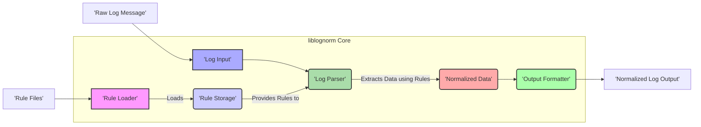
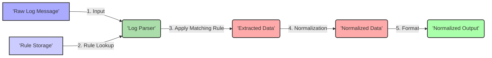

# Project Design Document: liblognorm

**Version:** 1.1
**Date:** October 26, 2023
**Author:** AI Software Architect

## 1. Introduction

This document provides a refined design overview of the `liblognorm` project, a library dedicated to the normalization of log messages. It aims to deliver a clear and comprehensive understanding of the library's architecture, individual components, and the flow of data through the system. This detailed design will serve as a crucial artifact for subsequent threat modeling activities, enabling a thorough analysis of potential security vulnerabilities.

## 2. Goals and Objectives

The overarching goals for the development of `liblognorm` are:

* **Consistent Log Message Parsing:** To establish a dependable and uniform method for parsing a wide array of log message formats, regardless of their origin.
* **Flexible and Expressive Rule Definition:** To empower users with the ability to define intricate custom rules for parsing and normalizing log messages, catering to highly specific requirements.
* **Modular Extensibility:** To facilitate the seamless integration of support for new log formats and the creation of novel normalization rules without necessitating substantial modifications to the core codebase.
* **Optimized Performance:** To achieve high efficiency in processing log messages, minimizing resource consumption and latency.
* **Cross-Platform Compatibility:** To ensure the library's usability and portability across diverse operating systems and hardware architectures.

## 3. Scope

This design document encompasses the essential components and functionalities of the `liblognorm` library. The scope includes:

* The mechanism for loading, parsing, and managing rule definitions.
* The process of parsing raw log messages based on the configured rules.
* The extraction and normalization of data elements from log messages.
* The generation of normalized log data in a structured and predictable format.
* The definition and structure of the core Application Programming Interface (API) for interacting with the library's functionalities.

The following items are explicitly excluded from the scope of this document:

* Specific integrations with external logging systems, agents, or applications.
* The design or implementation of user interface elements or command-line utilities built upon the library.
* Detailed performance benchmarking results, optimization strategies, or specific performance metrics.

## 4. High-Level Architecture

`liblognorm` employs a modular architecture, with the concepts of rules and parsers forming the central elements. The key components interact in a defined manner to process incoming raw log messages and produce structured, normalized output.

**Components:**

* **Rule Loader:** This component is responsible for reading and interpreting rule definitions from external files.
* **Rule Storage:** This component holds the parsed rules in an optimized internal representation, allowing for efficient access by the Log Parser.
* **Log Input:** This represents the source from which the raw log message originates. It can be a string, a file handle, or a data stream.
* **Log Parser:** This is the central processing unit of the library. It applies the loaded rules to the input log message to identify, extract, and normalize relevant data.
* **Normalized Data:** This component represents the structured data that has been extracted from the log message according to the matching rule.
* **Output Formatter:** This component transforms the normalized data into a user-defined output format, such as JSON or key-value pairs.
* **Rule Files:** These are external files containing the formal definitions of rules used for parsing and normalizing log messages.
* **Raw Log Message:** This is the original, unprocessed string containing the log information.
* **Normalized Log Output:** This is the final, structured representation of the log message after the normalization process is complete.

## 5. Component Details

This section provides a more in-depth examination of the key components within `liblognorm`, outlining their specific functionalities, implementation considerations, and relevant data structures.

### 5.1. Rule Loader

* **Functionality:**
    * Reads rule definitions from specified file paths or other configuration sources.
    * Parses the rule syntax, which is typically a custom Domain-Specific Language (DSL) designed for log parsing.
    * Performs validation checks on the rule syntax and semantics to ensure correctness.
    * Handles errors encountered during the rule loading process, such as invalid syntax or file access issues.
* **Implementation Details:**
    * Likely employs a parser generator tool (e.g., Flex/Lex and Bison/Yacc, or ANTLR) to process the rule syntax efficiently.
    * May incorporate a caching mechanism to store loaded rules in memory, reducing the overhead of repeated file parsing.
* **Data Structures:**
    * Utilizes an internal representation of rules, potentially as an Abstract Syntax Tree (AST) or a collection of structured objects that encapsulate rule logic.

### 5.2. Rule Storage

* **Functionality:**
    * Stores the loaded and validated rules in a highly efficient data structure for quick retrieval.
    * Provides mechanisms for searching and retrieving appropriate rules based on criteria such as matching log message patterns or source identifiers.
    * May support rule prioritization or ordering to handle cases where multiple rules could potentially match a single log message.
* **Implementation Details:**
    * Could utilize data structures like hash maps, prefix trees (Tries), or specialized indexing structures to optimize rule lookup performance.
* **Data Structures:**
    * Maintains a collection of rule objects, each containing detailed information about the rule's matching pattern, field extraction definitions, and any associated transformation logic.

### 5.3. Log Input

* **Functionality:**
    * Offers a standardized interface for providing raw log messages to the library for processing.
    * Supports various input methods, including passing log messages as strings or reading them from files or data streams.
* **Implementation Details:**
    * May involve buffering or streaming techniques to handle large volumes of log data efficiently, preventing memory exhaustion.
* **Data Structures:**
    * Represents the raw log message as a string or a sequence of characters, potentially with metadata about the input source.

### 5.4. Log Parser

* **Functionality:**
    * Receives a raw log message as input from the Log Input component.
    * Iterates through the rules stored in Rule Storage to identify the rule that best matches the input log message.
    * Applies the matching rule to extract specific data fields from the log message.
    * Executes any transformations or normalization steps defined within the matching rule on the extracted data.
* **Implementation Details:**
    * Employs pattern matching algorithms, which may include regular expressions or custom pattern matching logic, to compare the log message against the patterns defined in the rules.
    * Manages the internal state of the parsing process, including tracking the current position within the log message.
* **Data Structures:**
    * May use intermediate data structures to hold the extracted data before final normalization and formatting.

### 5.5. Normalized Data

* **Functionality:**
    * Represents the structured data that has been successfully extracted from the log message according to the applied rule.
    * Provides a consistent and predictable format for accessing the extracted fields, regardless of the original log message format.
* **Implementation Details:**
    * Typically implemented as a dictionary or map-like structure where keys represent the names of the extracted fields and values hold the corresponding data.
* **Data Structures:**
    * A collection of key-value pairs, where keys are standardized field names and values are the normalized data elements.

### 5.6. Output Formatter

* **Functionality:**
    * Accepts the Normalized Data as input.
    * Transforms the normalized data into a user-specified output format, such as JSON, XML, CSV, or simple key-value pairs.
    * Provides options for customizing the output format, such as indentation or field delimiters.
* **Implementation Details:**
    * May utilize libraries or built-in functions for generating the desired output formats.
* **Data Structures:**
    * Outputs the normalized data as a formatted string or a structured data object, depending on the chosen output format.

## 6. Data Flow

The typical sequence of data processing within `liblognorm` can be visualized as follows:

**Detailed Steps:**

1. **Input:** A raw log message is received by the Log Parser, typically from the Log Input component.
2. **Rule Lookup:** The Log Parser queries the Rule Storage to find the most appropriate rule that matches the characteristics of the input log message.
3. **Apply Matching Rule:** Once a matching rule is identified, the Log Parser applies the instructions within that rule to extract specific pieces of information from the log message.
4. **Normalization:** The extracted data undergoes a normalization process, which may involve data type conversions, formatting adjustments, or other transformations as defined in the rule.
5. **Format:** The resulting Normalized Data is then passed to the Output Formatter, which renders it into the desired output format, making it ready for consumption by other systems or applications.

## 7. Security Considerations (Detailed)

This section expands upon the preliminary security considerations, providing a more detailed analysis of potential threats and vulnerabilities within the `liblognorm` project.

* **Rule Injection Vulnerabilities:**
    * **Threat:** Malicious actors could attempt to inject crafted or malicious rules into the system through compromised rule files or insecure configuration mechanisms.
    * **Impact:** This could lead to arbitrary code execution within the context of the `liblognorm` process, information disclosure by manipulating data extraction, or denial of service by introducing computationally expensive rules.
    * **Mitigation:** Implement robust input validation and sanitization for rule files. Employ secure file handling practices and restrict write access to rule directories. Consider using a digitally signed rule format to ensure integrity.
* **Denial of Service (DoS) Attacks:**
    * **Threat:** Attackers could craft log messages or rules that exploit the parsing logic, leading to excessive resource consumption (CPU, memory) and potentially causing the library or the application using it to become unresponsive.
    * **Impact:** Service disruption, resource exhaustion, and potential application crashes.
    * **Mitigation:** Implement safeguards against overly complex or recursive rule definitions. Introduce timeouts or resource limits for parsing operations. Employ techniques to detect and mitigate regular expression Denial of Service (ReDoS) if regular expressions are used in rule definitions.
* **Log Injection Attacks:**
    * **Threat:** If the library is used to process untrusted log data from external sources, attackers could inject malicious content into log messages, potentially leading to vulnerabilities in downstream systems that consume the normalized logs.
    * **Impact:**  Cross-site scripting (XSS) vulnerabilities in log viewers, command injection in systems that process logs, or data corruption.
    * **Mitigation:**  Implement output encoding or sanitization of normalized data, especially if it will be displayed in web interfaces or used in commands. Clearly document the security implications of processing untrusted log data.
* **Information Disclosure:**
    * **Threat:** Error messages or debugging output might inadvertently reveal sensitive information about the system, the rules being used, or the content of log messages.
    * **Impact:** Exposure of internal system details, rule logic, or potentially sensitive data contained within logs.
    * **Mitigation:** Implement careful error handling and logging practices. Avoid including sensitive information in error messages. Provide mechanisms to control the verbosity of logging output in production environments.
* **Dependency Chain Vulnerabilities:**
    * **Threat:** The library may rely on third-party libraries or components that contain known security vulnerabilities.
    * **Impact:**  The security of `liblognorm` could be compromised by vulnerabilities in its dependencies.
    * **Mitigation:** Maintain an up-to-date inventory of all dependencies. Regularly scan dependencies for known vulnerabilities and update them promptly. Follow secure development practices when integrating third-party code.
* **Insufficient Input Validation:**
    * **Threat:**  Failure to properly validate the format and content of incoming log messages could lead to unexpected behavior, crashes, or security vulnerabilities.
    * **Impact:**  Potential for buffer overflows, format string vulnerabilities (if using C-style formatting), or other injection attacks.
    * **Mitigation:** Implement robust input validation to ensure that log messages conform to expected formats and do not contain malicious content.

## 8. Deployment Considerations

`liblognorm` is intended to be deployed as a library integrated into other applications or systems that require log normalization capabilities. Key deployment considerations include:

* **Language and Platform Compatibility:** Ensuring that the library is compatible with the programming languages and operating systems of the target deployment environments. This typically involves C or C++ compatibility and support for common operating systems like Linux, macOS, and Windows.
* **Dependency Management:** Providing clear and concise instructions on how to manage the library's dependencies during the build and deployment process. This may involve specifying required libraries and their versions.
* **Configuration Management:** Offering flexible mechanisms for configuring the library, such as specifying the location of rule files, setting logging levels, and potentially adjusting performance-related parameters.
* **Resource Requirements:**  Documenting the expected resource consumption of the library, including CPU usage, memory footprint, and potential disk I/O, to assist with capacity planning.
* **Security Hardening:** Providing guidance on how to securely deploy and configure the library, such as recommendations for file system permissions and secure storage of rule files.

## 9. Future Considerations

The following are potential areas for future development and enhancement of the `liblognorm` library:

* **Enhanced Rule Language:** Expanding the expressiveness and capabilities of the rule definition language to support more complex parsing scenarios and data transformations.
* **Improved Error Handling and Reporting:** Providing more detailed and informative error messages to aid in debugging and troubleshooting rule configurations and parsing issues.
* **Performance Optimization:** Continuously seeking opportunities to improve the performance and scalability of the library through algorithmic optimizations, code profiling, and potential use of parallel processing techniques.
* **Integration with Logging Ecosystems:** Developing integrations with popular logging frameworks and systems to simplify the adoption and use of `liblognorm` in existing environments.
* **User-Friendly API Enhancements:** Refining the library's API to make it more intuitive and easier to use for developers.
* **Built-in Support for Common Log Formats:** Adding pre-defined rules for commonly encountered log formats to reduce the initial configuration effort for users.

This revised design document provides a more detailed and comprehensive overview of the `liblognorm` project, strengthening its value as a foundation for thorough threat modeling activities.
