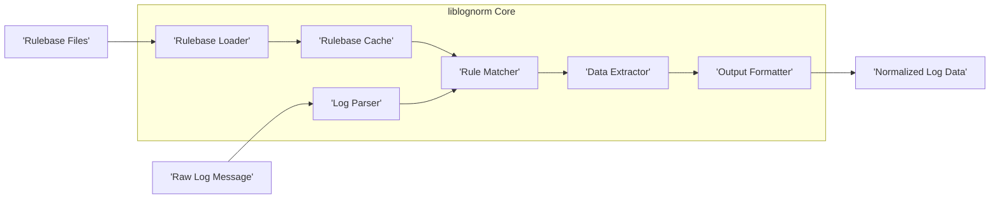
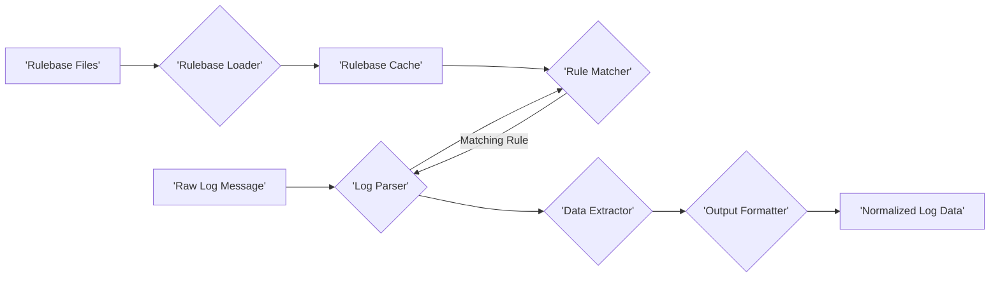

# Project Design Document: liblognorm

**Version:** 1.1
**Date:** October 26, 2023
**Author:** AI Software Architect

## 1. Introduction

This document provides a detailed design overview of the `liblognorm` project, a library designed for normalizing log messages. This document serves as a foundation for understanding the system's architecture, components, and data flow, which is crucial for subsequent threat modeling activities.

### 1.1. Purpose

The purpose of this document is to clearly and comprehensively describe the design of `liblognorm`. It aims to provide sufficient detail for security experts to understand the system's inner workings and identify potential vulnerabilities. This document will be used as the primary input for threat modeling sessions.

### 1.2. Scope

This document covers the core architecture and functionality of the `liblognorm` library as represented in the provided GitHub repository. It focuses on the key components involved in parsing and normalizing log messages based on defined rulebases. Specifically, it addresses the processing of a single log message at a time. Batch processing or other advanced features are outside the current scope.

### 1.3. Goals

*   Provide a clear and concise description of the `liblognorm` architecture.
*   Identify the key components and their interactions, including data dependencies.
*   Describe the data flow within the system, highlighting potential transformation points.
*   Serve as a basis for threat modeling activities, enabling the identification of potential attack vectors and vulnerabilities.

## 2. System Overview

`liblognorm` is a library that provides a mechanism to parse unstructured log messages and extract structured data from them based on a set of user-defined rules. It allows applications to transform diverse log formats into a consistent and easily processable format. This normalized data can then be used for analysis, storage, and other purposes.

### 2.1. Core Functionality

The primary function of `liblognorm` is to take a raw log message string and a set of rules (rulebase) as input and produce a structured representation of the log message as output. This involves a series of distinct steps:

*   **Rulebase Loading and Management:** Reading, parsing, validating, and storing the defined rules.
*   **Log Message Reception:** Receiving the raw, unstructured log message as input.
*   **Rule Matching:** Identifying the rule(s) within the loaded rulebase that best match the input log message.
*   **Data Extraction:** Extracting specific data fields from the log message based on the capture groups defined in the matched rule.
*   **Data Normalization and Transformation:**  Potentially transforming the extracted data into a standardized format or data type.
*   **Output Formatting:** Presenting the extracted and normalized data in a structured format.

## 3. System Architecture

The `liblognorm` architecture can be broken down into several key components that interact to achieve log message normalization. Understanding the boundaries and responsibilities of each component is crucial for threat modeling.

### 3.1. Component Diagram

### 3.2. Component Descriptions

*   **Rulebase Loader:** This component is responsible for reading and parsing the rulebase files. It interprets the syntax of the rules, validates them, and loads them into an internal representation, often stored in the `Rulebase Cache`.
*   **Log Parser:** This is the central component that receives the raw log message and orchestrates the parsing process. It interacts with the `Rule Matcher` to find applicable rules from the `Rulebase Cache`.
*   **Rule Matcher:** This component takes a log message and the loaded rulebase (from the `Rulebase Cache`) as input. It iterates through the rules and determines which rule(s) match the given log message based on the defined patterns (e.g., regular expressions).
*   **Data Extractor:** Once a matching rule is found, the `Data Extractor` uses the capture groups defined in the rule to extract specific fields from the log message. This involves identifying substrings within the raw log message.
*   **Output Formatter:** This component takes the extracted data and formats it into a structured output, typically a key-value pair structure or a JSON object. The specific format might be configurable.
*   **Rulebase Cache:** This component acts as a storage mechanism for the loaded and parsed rulebases, allowing for efficient access by the `Rule Matcher` without needing to reload the rules for each log message.

### 3.3. Data Flow

The process of normalizing a log message follows these steps:

1. The `Rulebase Loader` reads and parses `Rulebase Files`, storing the parsed rules in the `Rulebase Cache`.
2. A `Raw Log Message` is received by the `Log Parser`.
3. The `Log Parser` retrieves the loaded rules from the `Rulebase Cache`.
4. The `Log Parser` interacts with the `Rule Matcher`, passing the raw log message and the loaded rules.
5. The `Rule Matcher` compares the log message against the rules.
6. If a matching rule is found, the `Rule Matcher` informs the `Log Parser` about the matching rule.
7. The `Log Parser` then uses the matching rule's definition to instruct the `Data Extractor`.
8. The `Data Extractor` extracts the relevant fields from the raw log message based on the capture groups defined in the matching rule.
9. The extracted data is passed to the `Output Formatter`.
10. The `Output Formatter` generates the `Normalized Log Data` in the desired format.

## 4. Key Components in Detail

This section provides a more detailed look at the critical components of `liblognorm`, highlighting aspects relevant to security.

### 4.1. Rulebase Loader

*   **Functionality:**
    *   Reads rulebase files from specified locations (e.g., local filesystem, network locations).
    *   Parses the rule definitions, which typically involve regular expressions or other pattern-matching syntax.
    *   Handles different rulebase formats (if the library supports multiple formats).
    *   Performs validation of rule syntax and semantics to ensure they are well-formed and do not contain potentially harmful constructs.
    *   Stores the loaded rules in the `Rulebase Cache` in an optimized data structure for efficient lookup (e.g., a trie or hash map).
*   **Key Considerations for Threat Modeling:**
    *   **Malicious Rulebase Injection:** If the source of rulebase files is not trusted or if there are vulnerabilities in the loading/parsing logic, attackers could inject malicious rules to extract unintended data, cause denial-of-service, or even execute arbitrary code (depending on the rule processing engine).
    *   **Rule Complexity Exploitation:**  Overly complex regular expressions in rules could lead to performance issues or even denial-of-service (ReDoS attacks).
    *   **Rule Conflicts and Overlapping:**  Ambiguous or conflicting rules could lead to inconsistent or incorrect parsing of log messages.

### 4.2. Log Parser

*   **Functionality:**
    *   Receives raw log messages as input strings.
    *   Orchestrates the matching process by interacting with the `Rule Matcher`.
    *   Manages the state of the parsing process for a single log message.
    *   Handles cases where no matching rule is found, potentially providing a default output or an error indication.
*   **Key Considerations for Threat Modeling:**
    *   **Buffer Overflow/Overread:** If the parsing logic does not properly handle excessively long log messages, it could lead to buffer overflows or overreads.
    *   **Format String Vulnerabilities:** If the log parser uses user-controlled parts of the log message in format strings (e.g., for logging or error messages), it could lead to format string vulnerabilities.
    *   **Denial of Service:**  The parser could be targeted with specially crafted log messages that cause excessive processing time or resource consumption.

### 4.3. Rule Matcher

*   **Functionality:**
    *   Compares the input log message against the loaded rules from the `Rulebase Cache`.
    *   Implements the core logic for matching patterns defined in the rules, often relying on a regular expression engine or similar pattern-matching library.
    *   May support different matching algorithms or strategies depending on the rule definition.
    *   Returns the matching rule(s) to the `Log Parser`, potentially including information about the matched capture groups.
*   **Key Considerations for Threat Modeling:**
    *   **Regular Expression Denial of Service (ReDoS):**  Vulnerabilities in the underlying regular expression engine or poorly written regular expressions in the rules can be exploited to cause excessive CPU consumption.
    *   **Incorrect Matching Logic:** Flaws in the matching logic could lead to incorrect rules being applied, resulting in misinterpretation of log data.
    *   **Side-Channel Attacks:** Depending on the implementation, the time taken for rule matching might reveal information about the log message or the rulebase.

### 4.4. Data Extractor

*   **Functionality:**
    *   Extracts data fields (substrings) from the log message based on the capture groups defined in the matching rule.
    *   May perform basic data type conversions or sanitization on the extracted data (e.g., trimming whitespace).
*   **Key Considerations for Threat Modeling:**
    *   **Injection Vulnerabilities:** If the extracted data is not properly sanitized before being used in subsequent operations (e.g., database queries, system commands), it could lead to injection vulnerabilities (SQL injection, command injection, etc.).
    *   **Information Leakage:**  Incorrectly configured capture groups or flaws in the extraction logic could lead to the extraction of sensitive information that should not be exposed.
    *   **Integer Overflow/Underflow:** If data type conversions are performed on extracted data without proper bounds checking, it could lead to integer overflow or underflow issues.

### 4.5. Output Formatter

*   **Functionality:**
    *   Formats the extracted data into a structured output format (e.g., key-value pairs, JSON, CSV).
    *   May support different output formats and configuration options for the output format.
*   **Key Considerations for Threat Modeling:**
    *   **Injection Vulnerabilities in Output:** If the output format is not properly handled by the consuming application, vulnerabilities could arise (e.g., if the output is directly used in a web page without proper escaping).
    *   **Information Leakage in Output:**  Including too much information or not properly sanitizing the extracted data before outputting it could lead to the exposure of sensitive information.
    *   **Denial of Service through Output Size:**  Generating extremely large output payloads could potentially lead to denial-of-service in the consuming application.

### 4.6. Rulebase Cache

*   **Functionality:**
    *   Stores the loaded and parsed rulebases in memory for efficient access.
    *   May implement mechanisms for cache invalidation or updates when rulebase files are modified.
*   **Key Considerations for Threat Modeling:**
    *   **Cache Poisoning:** If an attacker can modify the contents of the rulebase cache directly (e.g., through memory corruption vulnerabilities), they could inject malicious rules.
    *   **Information Disclosure:**  If the cache is not properly protected, an attacker might be able to access the rule definitions, potentially revealing sensitive information about the system's logging practices.
    *   **Denial of Service:**  Filling the cache with a large number of malicious or redundant rules could lead to memory exhaustion and denial of service.

## 5. External Interfaces

`liblognorm` interacts with the external environment through several interfaces, which represent potential attack surfaces.

*   **Input:**
    *   **Raw Log Messages:** The primary input to the library. These can originate from various sources, including:
        *   Files (read from disk).
        *   Network sockets (e.g., syslog).
        *   Pipes or standard input.
        *   Memory buffers provided by other applications.
    *   **Rulebase Files:** Files containing the rules for parsing and normalizing log messages. The format and location of these files are typically configurable and can include:
        *   Local filesystem paths.
        *   Network locations (e.g., URLs).
*   **Output:**
    *   **Normalized Log Data:** The structured representation of the parsed log messages. The format of this output is configurable and can be:
        *   Key-value pairs.
        *   JSON objects.
        *   CSV format.
        *   Other custom formats.
        *   Output can be directed to:
            *   Standard output.
            *   Files.
            *   Network sockets.
            *   Memory buffers.
*   **API:**
    *   The library provides a programming interface (API) for other applications to interact with its functionality. This API typically includes functions for:
        *   Initializing and configuring the library.
        *   Loading rulebases from various sources.
        *   Parsing individual log messages.
        *   Accessing the normalized data.
        *   Managing the rulebase cache.

## 6. Security Considerations

This section expands on the initial security considerations, providing more specific examples of potential threats.

*   **Rulebase Security:**
    *   **Threat:** Malicious Rulebase Injection.
    *   **Description:** An attacker could provide a crafted rulebase file containing malicious regular expressions or rules designed to extract sensitive data or cause denial-of-service.
    *   **Mitigation:** Implement strict validation of rulebase syntax and semantics. Ensure rulebases are loaded from trusted sources and integrity is verified (e.g., using checksums or digital signatures).
*   **Input Validation (Raw Log Messages):**
    *   **Threat:** Buffer Overflow, Format String Vulnerabilities, Denial of Service.
    *   **Description:**  Attackers could send excessively long or specially crafted log messages to exploit vulnerabilities in the parsing logic.
    *   **Mitigation:** Implement robust input validation to check the length and format of log messages. Sanitize input where necessary.
*   **Resource Management:**
    *   **Threat:** Regular Expression Denial of Service (ReDoS).
    *   **Description:**  Attackers could provide log messages that trigger computationally expensive regular expression matching in the rules, leading to CPU exhaustion.
    *   **Mitigation:** Carefully review and test regular expressions in rulebases for potential performance issues. Consider using techniques to limit the execution time of regex matching.
*   **Error Handling:**
    *   **Threat:** Information Leakage through Error Messages.
    *   **Description:**  Detailed error messages could reveal sensitive information about the system's internal workings or data.
    *   **Mitigation:** Implement generic error handling and logging that does not expose sensitive details.
*   **Output Handling:**
    *   **Threat:** Injection Vulnerabilities in Consuming Applications.
    *   **Description:** If the normalized log data is not properly handled by the application consuming it, vulnerabilities like SQL injection or command injection could arise.
    *   **Mitigation:**  Provide clear documentation to consumers about the expected format and potential security implications of the output data. Encourage secure coding practices in consuming applications.
*   **Rulebase Cache Security:**
    *   **Threat:** Cache Poisoning, Information Disclosure.
    *   **Description:** If the rulebase cache is not properly protected, attackers might be able to modify its contents or access sensitive rule definitions.
    *   **Mitigation:** Protect the memory region where the rulebase cache is stored. Implement access controls if the cache is persisted.

## 7. Deployment Considerations

`liblognorm` is typically deployed as a library that is linked into other applications that need log normalization capabilities. The security posture of the deployment environment significantly impacts the overall security of `liblognorm`.

*   **Embedded Library:** When embedded within an application, the security of `liblognorm` is tied to the security of the host application. Vulnerabilities in the host application could be exploited to compromise `liblognorm`.
*   **Standalone Service:** If deployed as a standalone service (though less common for a library), it becomes a network-accessible component and requires its own security measures (e.g., access controls, network segmentation).

## 8. Future Considerations

*   **Support for More Rulebase Formats:** Expanding the library to support a wider range of rule definition languages and formats.
*   **Performance Optimization:** Continuously improving the efficiency of the parsing and matching algorithms to handle high volumes of log data.
*   **Advanced Data Transformation:** Adding capabilities for more complex data manipulation, enrichment, and data type conversions.
*   **Security Auditing and Hardening:**  Regularly conduct security audits and penetration testing to identify and address potential vulnerabilities. Implement security best practices throughout the development lifecycle.

This document provides a more detailed and comprehensive design overview of the `liblognorm` project, specifically tailored for threat modeling purposes. It highlights key components, data flows, and potential security considerations to facilitate a thorough security analysis.