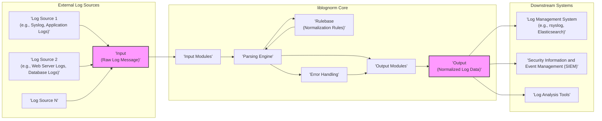
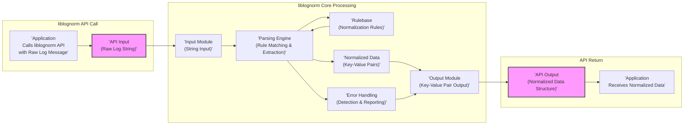

# Project Design Document: liblognorm

**Version:** 1.1
**Date:** 2023-10-27
**Author:** Gemini (AI Expert in Software, Cloud, and Cybersecurity Architecture)
**Project:** liblognorm - Log Normalization Library
**GitHub Repository:** [https://github.com/rsyslog/liblognorm](https://github.com/rsyslog/liblognorm)

## 1. Introduction

This document provides a detailed design overview of the `liblognorm` project, a library designed for normalizing log messages.  It aims to parse unstructured or semi-structured log data from various sources and transform it into a consistent, structured format. This normalization process simplifies log analysis, correlation, and management across diverse systems. This document is intended to serve as a foundation for threat modeling and security analysis of the `liblognorm` library, and is improved from the initial version to provide more clarity and detail.

## 2. Project Overview

`liblognorm` is a C library that provides core functionalities for robust log message normalization. Its key features include:

*   **Versatile Log Parsing:**  Analyzing raw log messages from diverse sources using configurable rules.
*   **Structured Normalization:**  Transforming log data into a standardized, structured format, primarily key-value pairs, for easier processing and analysis.
*   **Flexible Rule-Based Engine:**  Employing user-defined rulesets to dictate parsing and normalization logic, allowing adaptation to various log formats.
*   **Extensible Architecture:** Designed with modularity in mind, allowing for potential expansion with new input/output formats and rule types.
*   **High Performance:** Optimized for efficient log processing, essential for high-throughput logging environments where minimal overhead is critical.
*   **C Library Design:** Implemented in C for performance, portability, and ease of integration into system-level applications.

The primary use case for `liblognorm` is within log management systems like `rsyslog` (its parent project), but its generic design allows integration into any application requiring log normalization capabilities, including SIEM systems, log analysis pipelines, and custom monitoring tools.

## 3. System Architecture

### 3.1. High-Level Architecture Diagram



**Diagram Description (Improved):**

1.  **External Log Sources:**  Represents the origin points of log messages, highlighting the diversity of potential sources. Examples are now more specific.
2.  **Input (Raw Log Message):** The entry point for log messages into `liblognorm`.  Emphasized as a string input via API.
3.  **liblognorm Core:** The central processing unit, now explicitly including "Error Handling" as a key component.
    *   **Input Modules:** Handle initial log message reception (primarily string input via API).
    *   **Parsing Engine:** Core logic for rule application and data extraction.
    *   **Rulebase (Normalization Rules):** Configuration repository for parsing and normalization rules.
    *   **Output Modules:** Format and deliver normalized log data.
    *   **Error Handling:** Manages errors during parsing and rule processing, ensuring robustness.
4.  **Output (Normalized Log Data):** Structured, standardized log data output.
5.  **Downstream Systems:** Systems consuming normalized logs for various purposes.

### 3.2. Component Description

#### 3.2.1. Input Modules

*   **Purpose:**  To abstract the source of the raw log message. In the context of `liblognorm` as a library, the primary "input module" is the API itself, which receives a log message string.  Future extensibility could involve dedicated modules for different input types if the library were expanded to handle direct log ingestion.
*   **Functionality:**
    *   **API String Input:**  Accepts raw log messages as null-terminated C strings via the library's API function calls. This is the primary and most common input method.
    *   **Input Validation (Basic):**  May perform minimal validation on the input string, such as checking for null pointers or potentially length limitations to prevent buffer overflows at the API boundary.  More robust validation is handled by the parsing engine and rulebase.
*   **Examples (Conceptual & Current):**
    *   **String API Input (Current & Primary):**  The standard way to provide logs to `liblognorm`.
    *   **File Input Module (Future/Tooling):**  Hypothetically, a module could be developed to read log messages from files, but this is not a core component of the library itself.  More likely to be part of tools *using* `liblognorm`.
    *   **Network Input Module (Future/Tooling):**  Similarly, network input is outside the core library scope but could be implemented in applications that embed `liblognorm`.

#### 3.2.2. Parsing Engine

*   **Purpose:**  The central processing unit responsible for applying normalization rules to the input log message and extracting structured data.  This is where the core logic of `liblognorm` resides.
*   **Functionality:**
    *   **Rulebase Loading & Management:** Loads and manages the normalization rules from the Rulebase.  This includes parsing rule configuration files and potentially validating rule syntax.
    *   **Rule Matching Algorithm:** Implements an efficient algorithm to match input log messages against the rules in the Rulebase. This might involve techniques like regular expression matching, finite automata, or specialized parsing techniques depending on the rule definition language.
    *   **Pattern Extraction:**  Executes the extraction patterns defined in the matched rule to identify and extract specific fields from the log message.  This often involves regular expression capture groups or similar pattern matching mechanisms.
    *   **Data Type Conversion & Normalization:**  Applies data type conversions (e.g., string to integer, timestamp parsing) and further normalization steps as specified in the rules.
    *   **Error Handling within Parsing:**  Handles errors encountered during rule matching, pattern extraction, or data conversion.  Errors are reported to the Error Handling module.
*   **Key Aspects:**
    *   **Performance Optimization:**  Critical for high-speed log processing.  Likely employs optimized algorithms and data structures for rule matching and pattern extraction.
    *   **Rule Interpretation:**  Accurately interprets and executes the logic defined in the Rulebase.
    *   **Security Conscious Design:**  Must be designed to avoid vulnerabilities like ReDoS and handle potentially malicious input logs safely.

#### 3.2.3. Rulebase (Normalization Rules)

*   **Purpose:**  To store and organize the rules that define how log messages are parsed and normalized.  The Rulebase is the configurable knowledge base of `liblognorm`.
*   **Functionality:**
    *   **Rule Definition Language:** Defines the syntax and semantics for expressing normalization rules. This likely involves a text-based format with keywords, patterns (e.g., regular expressions), field definitions, and actions.
    *   **Rule Storage:** Stores rules, typically in configuration files.  The format is likely text-based for human readability and ease of editing.
    *   **Rule Loading & Parsing:**  Provides mechanisms to load rules from configuration files and parse them into an internal representation usable by the Parsing Engine.
    *   **Rule Validation:**  Performs validation on loaded rules to detect syntax errors, semantic inconsistencies, or potentially dangerous rule patterns (e.g., overly complex regular expressions).
    *   **Rule Organization (Rule Sets):**  May support organizing rules into rule sets or categories for better management and selective application of rules.
*   **Rule Structure Example (Conceptual - Simplified):**

    ```
    rule "apache-accesslog" {
        match pattern "^(?P<client_ip>\\S+) \\S+ \\S+ \\[(?P<timestamp>[^\\]]+)\\] \"(?P<method>\\S+) (?P<url>\\S+) \\S+\" (?P<status_code>\\d+) (?P<bytes_sent>\\d+)";
        field client_ip type string;
        field timestamp type datetime format "dd/MMM/yyyy:HH:mm:ss Z";
        field method type string;
        field url type string;
        field status_code type integer;
        field bytes_sent type integer;
    }
    ```

    This example shows a rule named "apache-accesslog" with:
    *   `match pattern`: A regular expression to identify Apache access log lines. Named capture groups (`?P<field_name>`) define fields to extract.
    *   `field ... type ...`:  Defines the extracted fields, their data types, and potentially format specifications (like `datetime format`).

*   **Configuration Format:**  Likely a custom text-based format designed for rule definition.  Consideration for more standard formats like YAML or JSON might exist for future enhancements.

#### 3.2.4. Output Modules

*   **Purpose:**  To format and deliver the normalized log data produced by the Parsing Engine to the calling application.
*   **Functionality:**
    *   **Key-Value Pair Formatting:**  Formats the extracted data as key-value pairs. This is the primary output format.  The internal representation is likely a data structure (e.g., hash map, dictionary) holding these pairs.
    *   **API Output:**  Provides the normalized data structure back to the calling application via the `liblognorm` API.
    *   **Output Format Extensibility (Potential):**  While primarily key-value pairs, future extensions could potentially support different output formats (e.g., JSON, XML serialization) if required by embedding applications, though this is less common for the core library itself.
*   **Output Format (Current):**
    *   **In-memory Data Structure:**  Normalized data is returned as a C data structure (likely a pointer to a structure) containing key-value pairs.  The application then accesses this structure to retrieve the normalized data.

#### 3.2.5. Error Handling

*   **Purpose:** To manage errors that occur during log processing, rule loading, or parsing.  Robust error handling is crucial for library stability and reliability.
*   **Functionality:**
    *   **Error Detection:** Detects various error conditions, such as:
        *   Rule parsing errors (syntax errors in rule files).
        *   Rule validation errors (semantic errors or dangerous rules).
        *   Log message parsing errors (messages not matching any rules, or errors during pattern extraction).
        *   Data conversion errors (e.g., invalid date/time formats).
        *   Resource allocation errors (memory allocation failures).
    *   **Error Reporting:** Provides mechanisms to report errors to the calling application. This typically involves:
        *   **Return Codes:** API functions return error codes to indicate success or failure and the type of error.
        *   **Error Messages:**  Provides functions to retrieve detailed error messages, potentially including error codes, descriptions, and context information (e.g., rule name, log message snippet).
        *   **Logging (Internal):**  May include internal logging for debugging and error tracking within `liblognorm` itself (though this is less directly exposed to the API user).
    *   **Error Recovery (Limited):**  In most cases, `liblognorm` focuses on reporting errors rather than automatic recovery.  Error recovery is typically handled by the calling application based on the reported error information.

#### 3.2.6. API (Library Interface)

*   **Purpose:**  Defines the programmatic interface for applications to interact with `liblognorm`.  A well-defined API is essential for usability and integration.
*   **Functionality:**
    *   **Initialization & Cleanup:** Functions to initialize the library (e.g., load Rulebase) and release resources when no longer needed.
    *   **Rulebase Management:** Functions to load, reload, and potentially manage rule sets.
    *   **Normalization API:** The core function to normalize a log message string.  This function takes a raw log message as input and returns the normalized data structure.
    *   **Error Handling API:** Functions to retrieve error codes and error messages.
    *   **Configuration Options (Potentially):**  API to set configuration options for `liblognorm` behavior (e.g., logging levels, rule loading paths).
    *   **Version Information:**  API to retrieve the library version.

## 4. Data Flow Diagram (Detailed)



**Diagram Description (Improved):**

1.  **liblognorm API Call:** Application initiates normalization via API call with a raw log string.
2.  **API Input (Raw Log String):** Log string enters `liblognorm`.
3.  **Input Module (String Input):** String input module receives the log string.
4.  **Parsing Engine (Rule Matching & Extraction):** Parsing engine matches rules from the Rulebase and extracts data.
5.  **Rulebase (Normalization Rules):** Provides rules to the parsing engine.
6.  **Normalized Data (Key-Value Pairs):** Parsing engine outputs normalized key-value pairs.
7.  **Output Module (Key-Value Pair Output):** Formats key-value pairs for API return.
8.  **Error Handling (Detection & Reporting):**  Error handling is now explicitly shown as part of the core processing, interacting with the Parsing Engine and Output Module to report errors.
9.  **API Output (Normalized Data Structure):** Normalized data is returned via API.
10. **Application Receives Normalized Data:** Application receives and processes normalized data.

## 5. Technology Stack

*   **Programming Language:** C (Primarily) - For optimal performance, system-level integration, and resource efficiency.
*   **Configuration Language:** Custom text-based format for Rulebase definition, likely incorporating elements of regular expressions or a domain-specific language tailored for log parsing.  Potential future support for standard formats like YAML or JSON for rule configuration.
*   **Build System:** Autotools (Likely, consistent with rsyslog project conventions) or potentially CMake for cross-platform build support.
*   **Dependencies:** Standard C libraries (libc).  Aiming for minimal external dependencies to maintain portability and reduce potential dependency-related vulnerabilities.

## 6. Deployment Model

`liblognorm` is designed for deployment as an **embedded library**.

*   **Embedded Library Integration:** Applications directly link `liblognorm` into their processes. This is the primary deployment model, enabling tight integration and performance optimization. Examples include `rsyslog`, log collectors, SIEM agents, and custom log processing applications.
*   **Command-Line Utilities (Tooling):**  Command-line tools may be built using `liblognorm` for testing, rule development, and ad-hoc log normalization tasks. These are typically for development and utility purposes, not production deployment of `liblognorm` itself.
*   **No Standalone Server/Service:** `liblognorm` is not intended to be deployed as a standalone server or network service. It is a library providing normalization *capabilities* to other applications.

## 7. Security Considerations (For Threat Modeling)

This section expands on security considerations for threat modeling, categorizing threats for better analysis.

**7.1. Rulebase Security Threats:**

*   **Rule Injection/Tampering (Configuration Vulnerability):**
    *   **Threat:** Malicious modification of Rulebase configuration files.
    *   **Impact:**
        *   **Data Exfiltration:** Rules crafted to extract and log sensitive data inappropriately.
        *   **Security Bypass:** Rules altered to misinterpret or ignore security-relevant log events.
        *   **Denial of Service (DoS):** Introduction of computationally expensive rules leading to performance degradation.
    *   **Mitigation:**
        *   Secure storage and access control for Rulebase configuration files.
        *   Integrity checks (e.g., checksums, signatures) for rule files.
        *   Principle of least privilege for access to rule configuration.

*   **Rule Complexity Exploitation (ReDoS Vulnerability):**
    *   **Threat:** Overly complex or poorly written rules, especially regular expressions, leading to Regular Expression Denial of Service (ReDoS).
    *   **Impact:**  DoS due to excessive CPU consumption when processing specific log messages that trigger exponential backtracking in regex matching.
    *   **Mitigation:**
        *   Rule validation and complexity analysis during rule loading.
        *   Use of secure regex practices and potentially regex engines with ReDoS protection.
        *   Resource limits on rule processing time.

**7.2. Input Handling Threats:**

*   **Log Injection Attacks (Input Validation Vulnerability):**
    *   **Threat:** Maliciously crafted log messages designed to exploit parsing engine vulnerabilities.
    *   **Impact:**
        *   **Information Disclosure:**  Logs crafted to reveal internal state or sensitive information.
        *   **Denial of Service:**  Large or complex logs overwhelming the parsing engine.
        *   **(Less Likely, but consider) Code Injection:** In extreme cases, flawed input handling could potentially lead to code execution if buffer overflows or format string bugs exist (though less probable in well-written C).
    *   **Mitigation:**
        *   Robust input validation and sanitization.
        *   Bounds checking for all input data.
        *   Defensive coding practices to prevent buffer overflows and format string vulnerabilities.

*   **Buffer Overflow/Memory Corruption (Implementation Vulnerability):**
    *   **Threat:**  Lack of proper bounds checking in C code when handling input log messages.
    *   **Impact:**  Crashes, memory corruption, potentially code execution in severe cases.
    *   **Mitigation:**
        *   Thorough code reviews and static analysis to identify potential buffer overflows.
        *   Use of safe C string handling functions (e.g., `strncpy`, `snprintf`).
        *   Memory safety tools and techniques during development and testing.

**7.3. Output Handling Threats:**

*   **Information Leakage in Normalized Output (Rule Design Vulnerability):**
    *   **Threat:**  Normalization rules inadvertently exposing sensitive information in the normalized output.
    *   **Impact:**  Unintentional disclosure of sensitive data through logs.
    *   **Mitigation:**
        *   Careful design and review of normalization rules to avoid over-extraction of data.
        *   Data masking or redaction techniques in rules if necessary.
        *   Principle of least privilege for data logging – only log necessary information.

**7.4. Resource Exhaustion Threats:**

*   **CPU Exhaustion (DoS Vulnerability):**
    *   **Threat:** Processing a high volume of logs or complex log messages consuming excessive CPU.
    *   **Impact:**  DoS for the application embedding `liblognorm`.
    *   **Mitigation:**
        *   Performance optimization of parsing engine and rule matching algorithms.
        *   Rate limiting or input throttling for log processing.
        *   Resource monitoring and alerts.

*   **Memory Exhaustion (DoS Vulnerability):**
    *   **Threat:** Processing very large log messages or high log volume leading to memory exhaustion.
    *   **Impact:**  Crashes, DoS due to memory exhaustion.
    *   **Mitigation:**
        *   Memory management optimizations.
        *   Limits on maximum log message size.
        *   Resource monitoring and alerts for memory usage.

## 8. Conclusion

This improved design document provides a more detailed and refined overview of the `liblognorm` project. It expands on component descriptions, clarifies data flow, and significantly enhances the security considerations section by categorizing threats and suggesting mitigations. This document serves as a robust foundation for conducting a comprehensive threat model and security assessment of `liblognorm`.  The next crucial step is to develop a detailed threat model based on this design, systematically identifying specific threats, vulnerabilities, and implementing appropriate mitigation strategies to ensure the security and resilience of `liblognorm` and the systems that depend on it.  This document will be invaluable for security audits, penetration testing, and ongoing security development lifecycle activities for the `liblognorm` project.