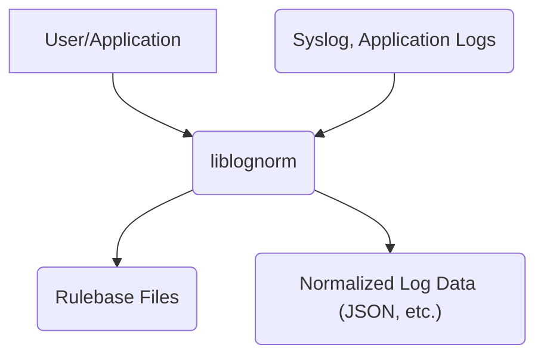
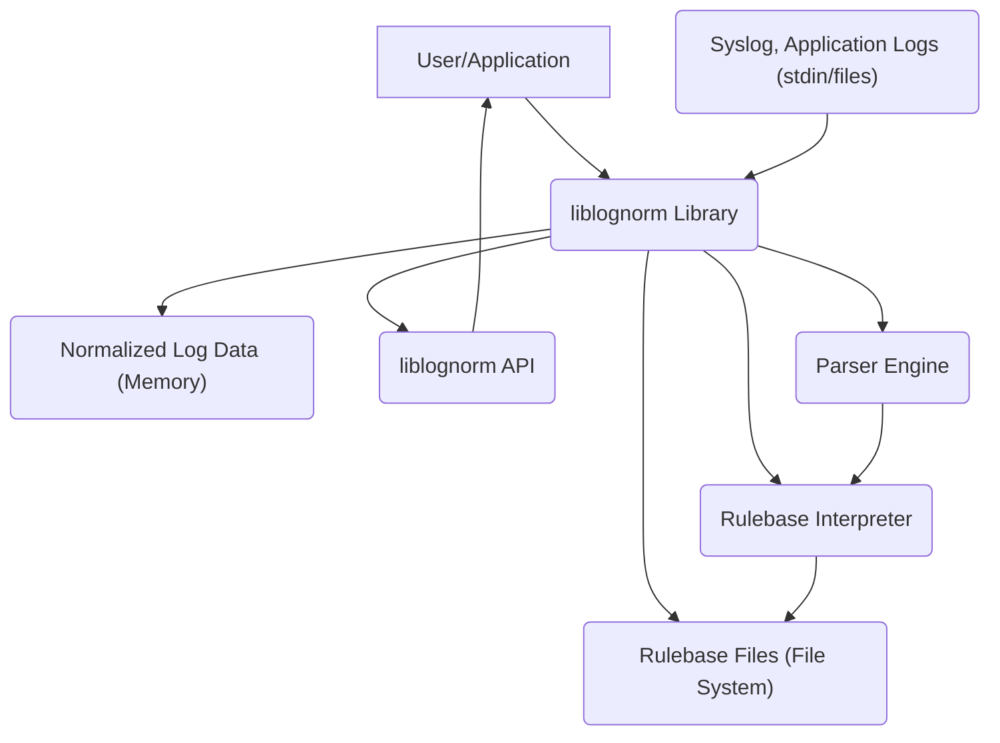
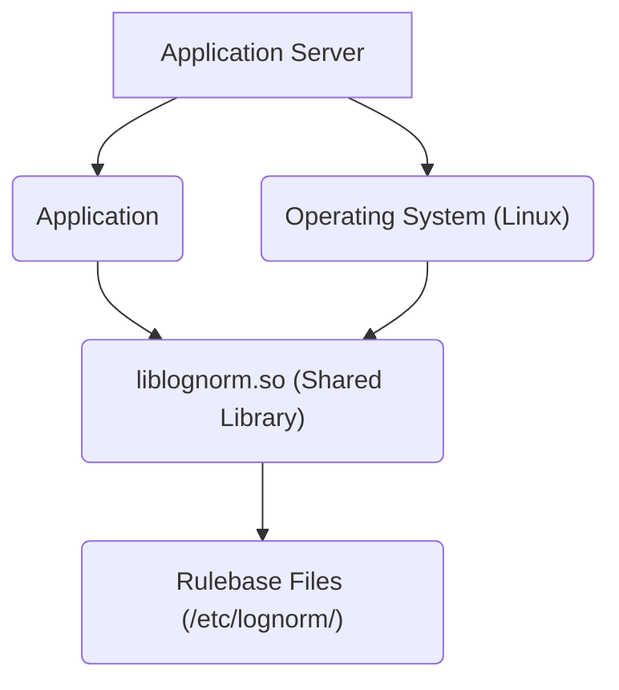
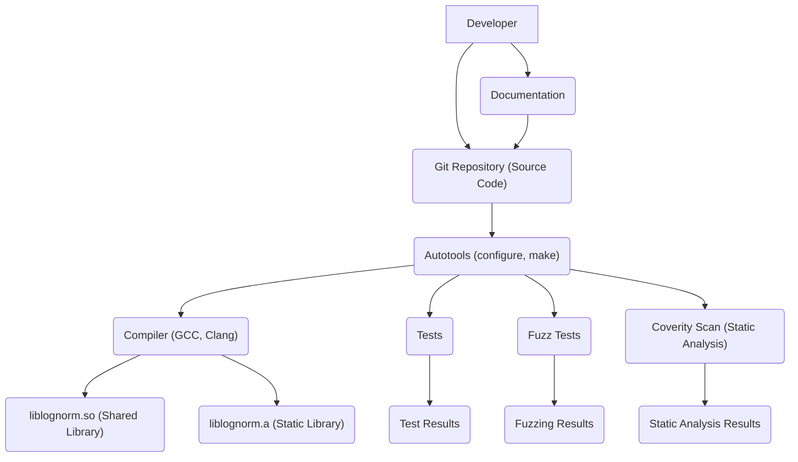

Okay, let's create a design document for the liblognorm project.

# BUSINESS POSTURE

Business Priorities and Goals:

*   Provide a fast and reliable log normalization library.
*   Enable users to easily extract structured data from unstructured log messages.
*   Support a wide variety of log formats.
*   Minimize the performance overhead of log normalization.
*   Maintain a stable and well-documented API.
*   Foster a community around the project.

Business Risks:

*   Inability to parse critical log formats, leading to loss of visibility.
*   Performance bottlenecks impacting application performance.
*   Security vulnerabilities in the library exposing applications to attacks.
*   Lack of adoption due to complexity or poor documentation.
*   Inability to keep up with evolving log formats.

# SECURITY POSTURE

Existing Security Controls:

*   security control: Fuzz testing (mentioned in documentation and build process).
*   security control: Static analysis (implied by use of Coverity Scan).
*   security control: Regular updates and maintenance (observed from commit history).
*   security control: Use of memory safe operations where possible (stated goal in documentation).

Accepted Risks:

*   accepted risk: Potential for vulnerabilities in complex parsing logic, mitigated by fuzzing and static analysis.
*   accepted risk: Performance impact under heavy load, mitigated by design for speed and user-provided benchmarks.
*   accepted risk: Limited support for extremely obscure or proprietary log formats.

Recommended Security Controls:

*   security control: Integrate a Software Composition Analysis (SCA) tool to identify vulnerabilities in dependencies.
*   security control: Implement a security linter to enforce secure coding practices.
*   security control: Establish a clear vulnerability disclosure and response process.
*   security control: Conduct regular security reviews of the codebase.
*   security control: Consider using a memory-safe language (like Rust) for future development or critical components to further reduce memory safety issues.

Security Requirements:

*   Authentication: Not directly applicable, as liblognorm is a library, not a service. Authentication is the responsibility of the application using the library.
*   Authorization: Not directly applicable. Authorization is the responsibility of the application using the library.
*   Input Validation: Critically important. The library must robustly handle malformed or malicious input without crashing or exhibiting unexpected behavior.  The rulebase definitions and the log messages themselves are both inputs that require validation.
*   Cryptography: Not directly applicable, unless the library is used to process encrypted logs, in which case the application using it would be responsible for decryption. Liblognorm itself does not handle encryption.

# DESIGN

## C4 CONTEXT

Context Diagram Element List:

*   Element 1:
    *   Name: User/Application
    *   Type: External Entity (Software System)
    *   Description: The application or system that utilizes liblognorm to parse and normalize log data.
    *   Responsibilities: Provides log data to liblognorm, consumes normalized output, manages rulebases.
    *   Security controls: Implements appropriate authentication and authorization mechanisms for its own functionality. Responsible for securely managing any sensitive data extracted by liblognorm.

*   Element 2:
    *   Name: liblognorm
    *   Type: Software System (Library)
    *   Description: The core liblognorm library, responsible for parsing and normalization.
    *   Responsibilities: Parses log messages according to provided rulebases, outputs structured data.
    *   Security controls: Fuzz testing, static analysis, input validation.

*   Element 3:
    *   Name: Rulebase Files
    *   Type: Data Store (Files)
    *   Description: Files containing the rules that define how to parse different log formats.
    *   Responsibilities: Store parsing rules.
    *   Security controls: File system permissions (managed by the user/application). Integrity checks (potentially implemented by the application).

*   Element 4:
    *   Name: Normalized Log Data (JSON, etc.)
    *   Type: Data
    *   Description: The structured output produced by liblognorm.
    *   Responsibilities: Represents the parsed log data in a structured format.
    *   Security controls: None directly within liblognorm. Security is the responsibility of the consuming application.

*   Element 5:
    *   Name: Syslog, Application Logs
    *   Type: Data
    *   Description: Raw, unstructured log data from various sources.
    *   Responsibilities: Contains the raw log information.
    *   Security controls: None directly within liblognorm. Security is the responsibility of the log source and transport mechanism.

## C4 CONTAINER

Since liblognorm is a library, the container diagram is essentially an extension of the context diagram.

Container Diagram Element List:

*   Elements 1-5 are the same as in the Context Diagram.

*   Element 6:
    *   Name: liblognorm API
    *   Type: API
    *   Description: The public interface of the liblognorm library.
    *   Responsibilities: Provides functions for initializing the library, loading rulebases, and parsing log messages.
    *   Security controls: Input validation of parameters passed to API functions.

*   Element 7:
    *   Name: Parser Engine
    *   Type: Component
    *   Description: The core component responsible for applying parsing rules to log messages.
    *   Responsibilities: Executes the parsing logic.
    *   Security controls: Robust handling of malformed input, fuzz testing.

*   Element 8:
    *   Name: Rulebase Interpreter
    *   Type: Component
    *   Description: The component responsible for loading and interpreting rulebase files.
    *   Responsibilities: Parses rulebase files, validates rule syntax, and makes rules available to the parser engine.
    *   Security controls: Input validation of rulebase files, checks for syntax errors and inconsistencies.

*   Element 9:
    *   Name: Normalized Log Data (Memory)
    *   Type: Data
    *   Description: The structured output produced by liblognorm, stored in memory.
    *   Responsibilities: Represents the parsed log data in a structured format.
    *   Security controls: None directly within liblognorm. Security is the responsibility of the consuming application.

*   Element 10:
    *   Name: Syslog, Application Logs (stdin/files)
    *   Type: Data
    *   Description: Raw, unstructured log data from various sources, read from standard input or files.
    *   Responsibilities: Contains the raw log information.
    *   Security controls: None directly within liblognorm. Security is the responsibility of the log source and transport mechanism.

## DEPLOYMENT

liblognorm is a library, and its deployment is tied to the application that uses it. Several deployment scenarios are possible:

1.  **Statically linked library:** The liblognorm code is compiled directly into the application executable.
2.  **Dynamically linked library:** The liblognorm library is compiled as a shared object (.so on Linux, .dll on Windows) and loaded by the application at runtime.
3.  **Embedded system:** liblognorm might be deployed as part of a larger embedded system, either statically or dynamically linked.

We'll describe the dynamically linked library scenario, as it's a common and illustrative case.

Deployment Diagram Element List:

*   Element 1:
    *   Name: Application Server
    *   Type: Infrastructure Node
    *   Description: The server hardware or virtual machine where the application is deployed.
    *   Responsibilities: Provides the computing resources for the application.
    *   Security controls: Operating system hardening, firewall, intrusion detection/prevention systems.

*   Element 2:
    *   Name: Application
    *   Type: Software System
    *   Description: The application that uses liblognorm.
    *   Responsibilities: Performs its primary function, utilizing liblognorm for log processing.
    *   Security controls: Application-specific security controls, secure coding practices.

*   Element 3:
    *   Name: liblognorm.so (Shared Library)
    *   Type: Software Component
    *   Description: The compiled liblognorm library.
    *   Responsibilities: Provides log normalization functionality.
    *   Security controls:  Regular updates, vulnerability patching.

*   Element 4:
    *   Name: Rulebase Files (/etc/lognorm/)
    *   Type: Data Store
    *   Description:  The location where rulebase files are stored.
    *   Responsibilities: Store parsing rules.
    *   Security controls: File system permissions, restricting write access to authorized users/processes.

*   Element 5:
    *   Name: Operating System (Linux)
    *   Type: Infrastructure Node
    *   Description: The operating system.
    *   Responsibilities: Provides the runtime environment.
    *   Security controls: OS hardening, security updates.

## BUILD

The liblognorm build process uses autotools (configure, make) and includes security checks.

Build Process Description:

1.  **Developer:**  Writes code and documentation, commits to the Git repository.
2.  **Git Repository:** Stores the source code, rulebase examples, and documentation.
3.  **Autotools:** The `configure` script checks for dependencies and system configuration. `make` orchestrates the build process.
4.  **Compiler:**  Compiles the C code into object files and then links them into either a static library (`.a`) or a shared library (`.so`).
5.  **Tests:**  Unit tests are run to verify the functionality of individual components.
6.  **Fuzz Tests:**  Fuzzing is used to test the library with a wide range of invalid or unexpected inputs to identify potential vulnerabilities.
7.  **Coverity Scan:**  Static analysis is performed to identify potential bugs and security vulnerabilities.
8. **Documentation:** Documentation is written and maintained.

Security Controls in Build Process:

*   security control: Fuzz testing (explicitly mentioned).
*   security control: Static analysis (Coverity Scan).
*   security control: Use of a version control system (Git) for tracking changes and facilitating collaboration.
*   security control: Automated build process (autotools) for consistency and reproducibility.

# RISK ASSESSMENT

Critical Business Processes:

*   Log analysis for security monitoring, troubleshooting, and business intelligence. The accuracy and availability of normalized log data are critical for these processes.

Data Sensitivity:

*   The sensitivity of the data processed by liblognorm depends entirely on the content of the logs being processed. Logs can contain:
    *   Personally Identifiable Information (PII)
    *   Financial data
    *   Authentication credentials (if improperly logged)
    *   Internal system information
    *   Business-sensitive data

    The library itself doesn't classify the data; the *application* using the library must handle the data appropriately based on its sensitivity. Liblognorm's role is to provide the structured data; the application is responsible for its secure handling.

# QUESTIONS & ASSUMPTIONS

Questions:

*   Are there any specific compliance requirements (e.g., GDPR, PCI DSS) that the applications using liblognorm must adhere to? This will influence the recommendations for data handling.
*   What is the expected volume and velocity of log data? This will impact performance considerations.
*   Are there any specific log formats that are particularly important to support?
*   What is the process for updating rulebase files in a production environment?
*   What are the specific deployment environments (cloud, on-premise, embedded)?

Assumptions:

*   BUSINESS POSTURE: The primary goal is to provide a robust and performant log normalization library. Security is a high priority, but performance cannot be sacrificed excessively.
*   SECURITY POSTURE: The development team is receptive to security best practices and willing to implement reasonable security controls.
*   DESIGN: The library will be primarily used in Linux environments, although portability is a consideration. The most common deployment model will be as a dynamically linked library. The application using liblognorm is responsible for the security of the normalized data.