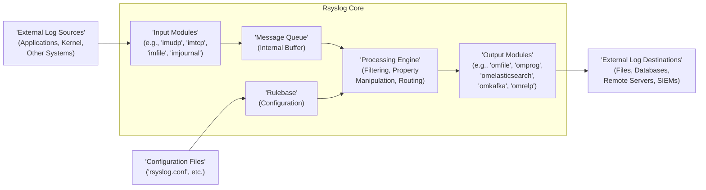

# Project Design Document: Rsyslog

**Version:** 1.1
**Date:** October 26, 2023
**Author:** Gemini (AI Language Model)

## 1. Introduction

This document provides a detailed design overview of the Rsyslog project, a widely used open-source system logging utility for Unix-like systems. The primary purpose of this document is to serve as a foundation for subsequent threat modeling activities. It meticulously outlines the key components, data flow with an emphasis on security boundaries, and external interfaces of Rsyslog, providing the necessary context for identifying potential security vulnerabilities and attack vectors.

## 2. Goals and Non-Goals (for Threat Modeling)

### 2.1. Goals

*   Clearly define the boundaries of the Rsyslog system and its interactions with the environment.
*   Identify the major components and their specific responsibilities in the context of log processing and security.
*   Describe the flow of log data through the system, highlighting potential points of vulnerability and data transformation.
*   Document all external interfaces and dependencies, including protocols and data formats, with a focus on security implications.
*   Highlight key configuration aspects that directly impact the security posture of Rsyslog.
*   Provide a comprehensive and security-focused understanding of the system's architecture to facilitate thorough threat identification and risk assessment.

### 2.2. Non-Goals

*   Detailed, line-by-line code-level implementation specifics or algorithms.
*   Performance benchmarking data, scalability metrics, or optimization strategies.
*   Specific deployment instructions or highly granular configuration examples tailored to particular environments.
*   A complete and exhaustive list of all possible configuration options, including obscure or rarely used settings.
*   A chronological history of the project's development, including past vulnerabilities or security incidents (unless directly relevant to understanding current architecture).

## 3. System Architecture

Rsyslog employs a modular architecture, designed for flexibility, extensibility, and adaptability to various logging needs. The core components interact to receive, process, and output log messages, with configuration driving their behavior.

## 4. Data Flow (with Security Considerations)

The journey of a log message through Rsyslog involves several stages, each with potential security implications:

*   **Log Reception (Potential Attack Surface):** Log messages originate from diverse sources and are received by input modules.
    *   Examples of sources include applications on the local host, the operating system kernel, network devices, and remote systems sending logs over various protocols.
    *   Input modules are responsible for interpreting the format of incoming log messages (e.g., syslog, JSON, GELF) and converting them into a standardized internal representation.
    *   **Security Considerations:** Input modules are a primary attack surface. Vulnerabilities in parsing logic could lead to buffer overflows or arbitrary code execution. Lack of proper source validation or authentication can allow malicious actors to inject fabricated log messages. Unencrypted protocols expose log data in transit.
*   **Message Queueing (Availability and Integrity):** Received log messages are placed in an internal message queue.
    *   This queue acts as a buffer, decoupling input and processing, and helps manage bursts of log traffic, preventing message loss.
    *   **Security Considerations:**  While generally internal, the message queue's configuration (e.g., size limits) can impact availability. In scenarios with shared memory queues (less common), unauthorized access could lead to message manipulation.
*   **Rule-Based Processing (Configuration and Logic Vulnerabilities):** The processing engine examines each log message against a set of rules defined in the configuration.
    *   Rules specify criteria for filtering (discarding or isolating messages), modifying (e.g., adding timestamps, anonymizing data), and routing log messages to specific outputs.
    *   **Security Considerations:** Misconfigured rules can lead to sensitive information being logged inappropriately or important security events being missed. Vulnerabilities in the rule processing logic itself could be exploited with crafted log messages. Injection vulnerabilities in configuration parameters could allow attackers to manipulate processing behavior.
*   **Output Routing (Destination Security and Transmission Security):** Based on matching rules, log messages are routed to one or more output modules.
    *   Output modules handle the delivery of log messages to their final destinations.
    *   Destinations can include local files, remote servers (using protocols like TCP, UDP, RELP), databases, security information and event management (SIEM) systems, or other applications.
    *   **Security Considerations:** Output modules introduce dependencies on the security of destination systems. Unencrypted transmission protocols expose log data. Insufficient authentication or authorization for output destinations can lead to unauthorized access or data breaches. Vulnerabilities in output module logic could be exploited to compromise destination systems.

## 5. Key Components

This section provides a more detailed description of the major Rsyslog components, emphasizing their security relevance:

*   **Input Modules (im\*) (Attack Surface):** These modules are the entry points for log messages and are crucial for security.
    *   `imudp`: Listens for syslog messages over UDP (stateless, no inherent security). Spoofing is a significant risk.
    *   `imtcp`: Listens for syslog messages over TCP (connection-oriented, offers some reliability). Susceptible to interception if not encrypted.
    *   `imfile`: Reads log messages from local files. Security depends on the permissions of the monitored files and the Rsyslog process.
    *   `imjournal`: Reads log messages from the systemd journal (relies on journal's security).
    *   `imrelp`: Listens for messages over the Reliable Event Logging Protocol (RELP), which can provide TLS encryption and authentication.
    *   Other input modules exist for specific sources and formats, each with its own security characteristics.
    *   **Key Security Considerations:** Protocol security (encryption, authentication), source validation, handling of malformed messages (buffer overflows, injection attacks), and resource consumption (DoS).
*   **Message Queue (Availability and Limited Integrity):** This internal buffer temporarily stores log messages.
    *   It helps to smooth out peaks in log volume and prevents immediate message loss if downstream components are temporarily unavailable.
    *   **Security Considerations:** Primarily related to availability. If the queue fills up, new messages might be dropped. In rare configurations using shared memory, unauthorized access could potentially lead to message manipulation.
*   **Rulebase (Configuration) (Configuration Security is Paramount):** The configuration files (typically `rsyslog.conf` and files in `/etc/rsyslog.d/`) define the rules governing log processing.
    *   Rules use selectors (matching criteria based on facility, severity, properties, etc.) and actions (what to do with matching messages).
    *   Configuration can include complex filters, property transformations, and routing logic.
    *   **Security Considerations:** This is a critical security component. Misconfigurations can have severe consequences (e.g., logging sensitive data to insecure locations, failing to log critical security events). Injection vulnerabilities in configuration parameters are a risk. Unauthorized modification of configuration files can completely compromise the logging system. Secure storage and access control for configuration files are essential.
*   **Processing Engine (Logic Vulnerabilities):** This component evaluates log messages against the configured rules and executes the corresponding actions.
    *   It performs filtering, property manipulation (e.g., using functions to modify message content), and routing of messages to the appropriate output modules.
    *   **Security Considerations:** Potential for vulnerabilities in the processing logic itself, which could be exploited by crafting specific log messages that trigger unexpected behavior or resource exhaustion. The security of property manipulation functions is also important.
*   **Output Modules (om\*) (Destination Security and Transmission Security):** These modules are responsible for delivering processed log messages to their final destinations.
    *   `omfile`: Writes log messages to local files. Security depends on file system permissions and storage encryption.
    *   `omprog`: Pipes log messages to an external program. Significant security risk if the external program is compromised or has vulnerabilities. Input sanitization before passing to external programs is crucial.
    *   `omelasticsearch`: Sends log messages to an Elasticsearch cluster. Requires secure communication (HTTPS) and proper authentication/authorization with the Elasticsearch cluster.
    *   `omkafka`: Sends log messages to a Kafka topic. Security depends on the Kafka cluster's security configuration (e.g., TLS, SASL).
    *   `omtcp`: Sends log messages to a remote server over TCP. Should ideally be used with TLS encryption (e.g., `omfwd`).
    *   `omudp`: Sends log messages to a remote server over UDP. Inherent lack of security; should be avoided for sensitive data.
    *   `omrelp`: Sends log messages to a remote server using the RELP protocol, which supports TLS encryption and authentication.
    *   **Security Considerations:** Security of the destination system, security of the transmission protocol (encryption, authentication), handling of sensitive information in logs, and potential vulnerabilities in the output module itself.

## 6. External Dependencies and Interfaces (Attack Vectors)

Rsyslog interacts with numerous external entities, creating potential attack vectors:

*   **Log Sources (Trust and Integrity):** Applications, the kernel, network devices, and other systems that generate log messages.
    *   **Security Considerations:** The trustworthiness of log sources is paramount. Compromised sources can inject malicious or misleading log messages, potentially leading to incorrect security analysis or system manipulation. Lack of proper source identification can make it difficult to trace the origin of malicious logs.
*   **Log Destinations (Confidentiality, Integrity, Availability):** Files, databases, remote servers, SIEM systems, and other systems where log messages are stored or processed.
    *   **Security Considerations:** The security of these destinations is critical for maintaining the confidentiality and integrity of log data. Unauthorized access to log destinations can lead to data breaches. Compromised destinations could be used to manipulate or delete logs, hindering incident response.
*   **Configuration Files (Integrity and Access Control):** These files define the behavior of Rsyslog.
    *   **Security Considerations:**  Access control and integrity of these files are paramount. Unauthorized modification can lead to logging failures, bypass security controls, or redirect logs to malicious destinations.
*   **Network Interfaces (Interception and Spoofing):** Rsyslog uses network interfaces for receiving and sending log messages over protocols like UDP, TCP, and RELP.
    *   **Security Considerations:**  Proper network security measures (firewalls, intrusion detection/prevention systems) are necessary to protect against unauthorized access, interception, and manipulation of log data in transit. Unencrypted protocols are vulnerable to eavesdropping.
*   **External Programs (via `omprog`) (Significant Risk):** Rsyslog can pipe log messages to external programs for further processing.
    *   **Security Considerations:** This introduces a significant security risk. Vulnerabilities in the external program could be exploited through crafted log messages. The external program runs with the privileges of the Rsyslog process, so a compromise could have serious consequences. Careful consideration and input sanitization are essential.
*   **System Libraries (Dependency Vulnerabilities):** Rsyslog relies on various system libraries (e.g., libc, OpenSSL/GnuTLS) for core functionalities.
    *   **Security Considerations:** Vulnerabilities in these libraries can potentially impact Rsyslog. Regular updates and security patching of the underlying operating system and libraries are crucial.

## 7. Security Considerations (Categorized)

This section categorizes and expands on the security aspects relevant to Rsyslog:

*   **Confidentiality (Protecting Sensitive Data):** Log messages often contain sensitive information.
    *   **Mitigation:** Use encrypted transport protocols (TLS via `imrelp`, `omrelp`, or `omfwd`), encrypt stored log files, implement data masking or anonymization within Rsyslog rules.
*   **Integrity (Ensuring Data Authenticity and Tamper-Proofing):**  Log messages should not be altered in transit or storage.
    *   **Mitigation:** Use secure transport protocols with integrity checks (e.g., TLS), consider digital signatures for log messages (less common in standard Rsyslog), ensure secure storage with appropriate permissions.
*   **Availability (Maintaining a Reliable Logging Service):** The logging system must be available to capture critical events.
    *   **Mitigation:** Implement proper resource management (queue size limits, rate limiting), protect against denial-of-service attacks (e.g., using firewalls), consider redundant logging infrastructure.
*   **Authentication and Authorization (Controlling Access):**  Restrict who can send logs to Rsyslog and who can access stored logs and configuration.
    *   **Mitigation:** Use authentication mechanisms provided by input modules (e.g., RELP authentication), implement strong access controls on configuration files and log directories, restrict network access to Rsyslog ports.
*   **Input Validation (Preventing Exploitation through Malformed Logs):** Rsyslog needs to be resilient against crafted or malicious log messages.
    *   **Mitigation:** Implement robust input validation and sanitization within input modules to prevent buffer overflows, injection attacks, and other vulnerabilities.
*   **Configuration Security (Protecting the Rulebase):** The configuration of Rsyslog is a critical security component.
    *   **Mitigation:** Secure default configurations, strict access control to configuration files, validation of configuration parameters, consider using configuration management tools for auditing and versioning.
*   **Remote Logging Security (Securing Communication with Remote Servers):** When sending logs to remote servers, secure protocols are essential.
    *   **Mitigation:** Prefer secure protocols like RELP with TLS or TCP with TLS (`omfwd`) over unencrypted protocols like UDP. Implement mutual authentication where possible.
*   **Resource Exhaustion (Preventing DoS Attacks):** Protect Rsyslog against attacks that could exhaust its resources.
    *   **Mitigation:** Implement rate limiting on input modules, configure appropriate queue sizes, monitor resource usage, and implement network-level protections.
*   **Auditing (Tracking Actions and Changes):**  Maintain logs of Rsyslog's own activities and configuration changes.
    *   **Mitigation:** Configure Rsyslog to log its own actions and errors, integrate with system auditing tools.

## 8. Deployment Considerations (Security Implications of Choices)

The security of an Rsyslog deployment is significantly influenced by deployment choices:

*   **Operating System Security (Foundation of Security):** The underlying operating system's security posture directly impacts Rsyslog.
    *   **Implication:**  A hardened and patched operating system is crucial. Security vulnerabilities in the OS can be exploited to compromise Rsyslog.
*   **Network Topology (Controlling Access and Visibility):** The network configuration and security measures in place affect the security of log transmission.
    *   **Implication:** Proper network segmentation, firewalls, and intrusion detection/prevention systems can help protect Rsyslog from unauthorized access and attacks.
*   **User Permissions (Principle of Least Privilege):** The permissions under which Rsyslog runs and the permissions of users interacting with it are critical.
    *   **Implication:** Rsyslog should run with the minimum necessary privileges. Restrict access to configuration files and log directories based on the principle of least privilege.
*   **Resource Limits (Preventing Resource Exhaustion):** Appropriate resource limits (CPU, memory, file descriptors) should be configured.
    *   **Implication:**  Insufficient resource limits can lead to instability or denial of service. Excessive limits might allow an attacker to consume excessive resources.
*   **Centralized vs. Distributed Logging (Architectural Security):** The architecture of the logging infrastructure (centralized server vs. distributed agents) has security implications.
    *   **Implication:** Centralized logging provides a single point of control and analysis but also a single point of failure. Distributed logging can improve resilience but increases complexity and the attack surface.
*   **Secure Storage of Logs (Protecting Archived Data):**  The security of the storage location for archived logs is important for long-term data protection.
    *   **Implication:** Use appropriate file system permissions, encryption, and access controls for archived logs.

This document provides a comprehensive and security-focused understanding of the Rsyslog project's architecture, key components, and data flow. This information is essential for conducting thorough threat modeling exercises to identify potential security vulnerabilities and develop appropriate mitigation strategies to ensure the confidentiality, integrity, and availability of the logging infrastructure.