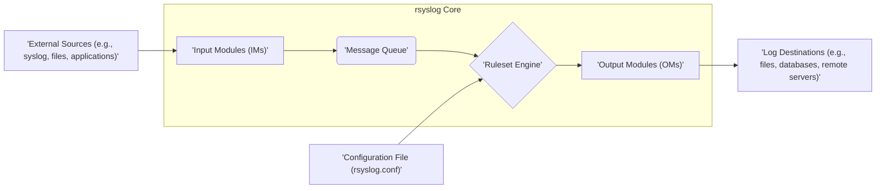

# Project Design Document: rsyslog

**Version:** 1.1
**Date:** October 26, 2023
**Author:** AI Software Architect

## 1. Introduction

This document provides an enhanced and detailed design overview of the rsyslog project, a cornerstone open-source system logging utility prevalent in Unix and Linux environments. The primary objective of this document is to furnish a clear and comprehensive understanding of rsyslog's architecture, its constituent components, and the intricate flow of log data within the system. This detailed exposition is specifically intended to facilitate robust threat modeling and in-depth security analysis of rsyslog deployments.

## 2. Goals and Objectives

The fundamental goals underpinning the design and development of rsyslog are:

*   **Highly Reliable Log Collection:** To guarantee the dependable and consistent collection of log messages originating from a diverse array of sources, ensuring no critical events are missed.
*   **Extremely Flexible Log Processing:** To offer a rich and adaptable suite of capabilities for filtering, transforming, enriching, and intelligently routing log data based on its content and context.
*   **Versatile and Extensible Output Options:** To support a broad spectrum of output destinations, encompassing local files, relational databases, NoSQL stores, cloud-based services, and remote systems, with an architecture that readily accommodates new output methods.
*   **Optimized for High Performance:** To process and deliver log messages with exceptional efficiency and minimal resource overhead, even under heavy load.
*   **Modular Extensibility and Customization:** To maintain a modular architecture that empowers users and developers to extend rsyslog's functionality by adding custom input methods, processing logic, and output destinations.

## 3. System Architecture

rsyslog employs a modular architecture where distinct modules are responsible for specific stages of log processing. The central core engine acts as the orchestrator, guiding log messages through these interconnected modules.

## 4. Key Components

This section provides a more granular description of the core components within the rsyslog system.

*   **Input Modules (IMs):**
    *   The entry points for log messages into the rsyslog system. They are responsible for receiving log data from various sources.
    *   Specific examples include:
        *   `imudp`: Listens for and receives standard syslog messages transmitted over the User Datagram Protocol (UDP), typically on port 514.
        *   `imtcp`: Listens for and receives standard syslog messages transmitted over the Transmission Control Protocol (TCP), offering more reliability than UDP.
        *   `imfile`: Monitors and reads log messages from specified local files, supporting various file formats and rotation schemes.
        *   `imjournal`: Integrates with the systemd journal, allowing rsyslog to process log messages collected by systemd.
        *   `imklog`: Reads kernel log messages directly from the `/proc/kmsg` interface.
        *   `imrelp`: Receives log messages using the Reliable Event Logging Protocol (RELP), which provides guaranteed delivery and transactional semantics.
    *   Each input module is typically configured to listen on a specific network port, monitor a particular file, or interface with a specific system service.
    *   Upon receiving a log message, input modules parse the raw data and transform it into rsyslog's internal standardized format, which includes properties like timestamp, hostname, facility, severity, and the message content.

*   **Message Queue:**
    *   A central, configurable buffer that temporarily stores incoming log messages before they are processed by the ruleset engine.
    *   Serves as a crucial decoupling mechanism between input and processing stages, enhancing the system's resilience against temporary slowdowns or interruptions in downstream processing. If an output destination becomes unavailable, the queue can hold messages until it recovers.
    *   Offers various queue types with different characteristics, including:
        *   **Direct:** Messages are processed immediately without queuing (least resilient).
        *   **In-Memory:** Messages are stored in RAM (fast but volatile).
        *   **Disk-Assisted:** Messages are primarily stored in RAM but can spill over to disk if memory pressure increases (balances performance and reliability).
        *   **Persistent (on disk):** Messages are written to disk immediately, providing the highest level of reliability against data loss.

*   **Ruleset Engine:**
    *   The intelligent core of rsyslog, responsible for evaluating log messages against a user-defined set of rules specified in the configuration file.
    *   Rules define the actions to be taken based on the characteristics and content of individual log messages.
    *   A rule typically consists of:
        *   **Selectors:** Define the criteria for matching log messages. Selectors can filter based on:
            *   **Facility:** The type of system or application that generated the log (e.g., `auth`, `mail`, `kern`).
            *   **Severity:** The importance or urgency of the log message (e.g., `debug`, `info`, `warning`, `error`, `critical`).
            *   **Hostname:** The source of the log message.
            *   **Message Content:** Patterns or regular expressions to match within the log message itself.
            *   **Structured Data:**  Properties extracted from structured log formats.
        *   **Actions:** Specify what rsyslog should do with messages that match the selector. Common actions include:
            *   Writing the message to a local file (using `omfile`).
            *   Forwarding the message to a remote syslog server (using `omudp` or `omtcp`).
            *   Executing an external program or script (using `omprog`).
            *   Writing the message to a database (using modules like `ommysql` or `ompgsql`).
            *   Discarding the message.
        *   **Property Replacers:** Allow for the manipulation and formatting of message properties before an action is taken. This enables customization of log output.
        *   **String Operations:** Provide capabilities for string-based filtering, manipulation, and extraction within rules.

*   **Output Modules (OMs):**
    *   The exit points for processed log messages from rsyslog. They are responsible for delivering log data to its intended destinations.
    *   Examples of output modules include:
        *   `omfile`: Writes log messages to local files, with extensive options for file naming, rotation, and formatting.
        *   `omprog`: Executes an external program or script, passing the log message as input, enabling integration with custom processing pipelines.
        *   `omudp`: Forwards log messages over UDP to a specified remote host and port.
        *   `omtcp`: Forwards log messages over TCP to a specified remote host and port, offering more reliable delivery.
        *   `ommysql`, `ompgsql`: Writes log messages to MySQL and PostgreSQL databases, respectively, allowing for structured storage and querying of log data.
        *   `omelasticsearch`: Sends log messages to an Elasticsearch cluster, facilitating indexing and searching of log data.
        *   `omkafka`: Publishes log messages to an Apache Kafka topic, enabling integration with stream processing platforms.
        *   `omrelp`: Sends log messages using the Reliable Event Logging Protocol (RELP) to a remote server.
    *   Output modules handle the formatting of log messages according to the requirements of the destination and manage the transmission or writing process.

*   **Configuration File (rsyslog.conf):**
    *   The central control file that dictates the behavior of the rsyslog daemon.
    *   Specifies critical settings, including:
        *   Loading and configuring specific input modules and their listening parameters (e.g., network ports, file paths).
        *   Defining the ruleset for processing log messages, including selectors and associated actions.
        *   Loading and configuring specific output modules and their destination parameters (e.g., file paths, remote server addresses, database credentials).
        *   Setting global parameters that affect the overall operation of rsyslog, such as queue settings, error handling, and security options.
    *   The configuration file is typically read during the rsyslog daemon's startup. Rsyslog supports reloading the configuration file without requiring a full restart, allowing for dynamic updates to logging rules.

## 5. Data Flow

The journey of a log message through the rsyslog system can be broken down into the following stages:

1. **Log Message Ingestion:** An input module receives a raw log message from an external source. This could be a syslog message arriving over the network, a line read from a monitored file, or an entry retrieved from the systemd journal.
2. **Parsing and Initial Formatting:** The responsible input module parses the raw log data and transforms it into rsyslog's internal standardized representation. This involves extracting key properties like the timestamp, hostname, facility, severity, and the actual message content. Structured data, if present, may also be parsed and stored as properties.
3. **Queueing (if configured):** The formatted log message is then placed into the configured message queue. The type of queue (in-memory, disk-assisted, persistent) influences the reliability and performance characteristics at this stage.
4. **Ruleset Evaluation:** The ruleset engine retrieves log messages from the queue (or directly if no queue is configured) and sequentially evaluates them against the defined rules in the `rsyslog.conf` file. The engine checks if the message's properties match the selectors defined in each rule.
5. **Action Execution:** When a log message matches the selector of a rule, the corresponding action(s) associated with that rule are executed. This often involves invoking one or more output modules. A single log message can match multiple rules, leading to multiple actions being performed.
6. **Log Delivery:** The invoked output modules format the log message according to the requirements of the target destination (e.g., adding specific headers, formatting timestamps) and then deliver the message to its final destination. This could involve writing to a local file, sending the message over the network, or inserting it into a database.

## 6. Security Considerations

Security is a paramount concern when deploying and managing rsyslog. Several key aspects need careful consideration:

*   **Input Validation and Sanitization:**
    *   Input modules should implement robust validation checks on incoming log messages to prevent the injection of malicious or malformed data that could potentially exploit vulnerabilities in downstream processing or output modules.
    *   Sanitizing input data, especially when dealing with untrusted sources, is crucial to mitigate risks like log injection attacks, where attackers could manipulate log data to mislead administrators or bypass security controls.

*   **Secure Communication Channels:**
    *   When receiving or forwarding logs over a network, employing secure communication protocols is essential to protect the confidentiality and integrity of log data in transit.
    *   Utilizing TLS (Transport Layer Security) for TCP-based protocols like standard syslog over TCP and RELP encrypts the communication channel, preventing eavesdropping and tampering.
    *   Proper management of TLS certificates and private keys is critical for maintaining the security of these connections.

*   **Access Control and Permissions:**
    *   Restricting access to the rsyslog configuration file (`rsyslog.conf`) and the directories where log files are stored is vital to prevent unauthorized modification of logging rules or tampering with log data.
    *   File system permissions should be carefully configured to ensure that only authorized users and processes can read or write these files.
    *   Consider using features like chroot environments to further isolate the rsyslog process.

*   **Output Destination Security:**
    *   When configuring rsyslog to send logs to remote systems or databases, implementing appropriate authentication and authorization mechanisms is crucial to prevent unauthorized access to the log data.
    *   Utilizing secure connection methods (e.g., TLS for database connections, SSH tunneling) can protect the confidentiality and integrity of logs being sent to external systems.
    *   Securely storing credentials used to access output destinations is also essential.

*   **Protection Against Log Forging and Injection:**
    *   If rsyslog is configured to receive logs from potentially untrusted sources (e.g., applications on a public network), there is a risk of attackers forging log messages or injecting malicious content into legitimate logs.
    *   Implementing strong authentication mechanisms for log sources and carefully validating the source of incoming logs can help mitigate these risks.
    *   Consider using mechanisms like message signing to verify the authenticity of log messages.

*   **Resource Management and Denial of Service Prevention:**
    *   A high volume of incoming log messages, especially from potentially malicious sources, or misconfigured rules that lead to excessive processing or output, can lead to resource exhaustion (CPU, memory, disk space), potentially causing a denial of service.
    *   Implementing queue limits, rate limiting mechanisms, and carefully designing rules to avoid infinite loops or excessive processing can help prevent resource exhaustion.

*   **Configuration Security Best Practices:**
    *   The rsyslog configuration file often contains sensitive information, such as server addresses, credentials for remote systems, and potentially sensitive filtering rules.
    *   It should be protected with strict file system permissions, and access should be limited to authorized administrators.
    *   Consider using configuration management tools to manage and audit changes to the `rsyslog.conf` file.

## 7. Deployment Considerations

Deploying rsyslog effectively requires careful planning and consideration of various factors:

*   **Deployment Topology:**
    *   **Standalone:** A single rsyslog instance on each host, managing local logs.
    *   **Centralized:** A dedicated rsyslog server collects logs from multiple client machines. This requires careful network configuration and security considerations.
    *   **Hierarchical:** Multiple tiers of rsyslog servers, forwarding logs from local instances to regional collectors, and then to a central repository.
*   **Resource Allocation:**  Adequate CPU, memory, and disk space must be allocated to the rsyslog process, especially in high-volume environments. The size and type of the message queue will impact memory usage. Disk space requirements depend on the volume of logs being stored locally.
*   **Network Configuration:**  Firewall rules must be configured to allow necessary network traffic for receiving and forwarding logs. Ensure correct port assignments for syslog protocols (UDP/514, TCP/514, or custom ports).
*   **Log Rotation and Archiving:** Implement a robust log rotation strategy to prevent log files from consuming excessive disk space. Consider using tools like `logrotate` in conjunction with rsyslog. Establish an archiving strategy for long-term storage of log data.
*   **Monitoring and Alerting:**  Monitor the health and performance of the rsyslog service. Implement alerting mechanisms to notify administrators of potential issues, such as queue overflows, disk space exhaustion, or service failures.
*   **Security Hardening:**  Harden the operating system where rsyslog is deployed by applying security patches, disabling unnecessary services, and following security best practices.
*   **Load Balancing and Redundancy:** In high-throughput environments, consider deploying multiple rsyslog servers behind a load balancer for increased capacity and redundancy. RELP can provide reliable delivery guarantees in such setups.

## 8. Future Considerations

The rsyslog project continues to evolve, with potential future enhancements including:

*   **Advanced Security Features:**  Exploring and implementing more sophisticated security features, such as support for log message signing using cryptographic keys, encryption of logs at rest, and integration with security information and event management (SIEM) systems for enhanced threat detection.
*   **Enhanced Cloud Platform Integration:**  Deeper and more seamless integration with cloud-native logging services offered by major cloud providers (e.g., AWS CloudWatch Logs, Azure Monitor Logs, Google Cloud Logging).
*   **Performance Optimization:**  Ongoing efforts to further optimize the performance and resource utilization of rsyslog, particularly in handling very high volumes of log data. This could involve improvements to queue management, multi-threading, and module efficiency.
*   **Improved Configuration Management and Automation:**  Exploring more user-friendly configuration options, potentially through web-based interfaces or integration with configuration management tools (e.g., Ansible, Chef, Puppet).
*   **Advanced Analytics and Correlation Capabilities:**  Potentially incorporating features for basic log analytics and correlation directly within rsyslog or providing tighter integration with dedicated log analytics platforms.

This enhanced design document provides a more in-depth understanding of the rsyslog project, offering valuable insights for conducting comprehensive threat modeling and security assessments. The detailed descriptions of components, data flow, and security considerations are intended to facilitate the identification of potential vulnerabilities and the implementation of effective security mitigations.