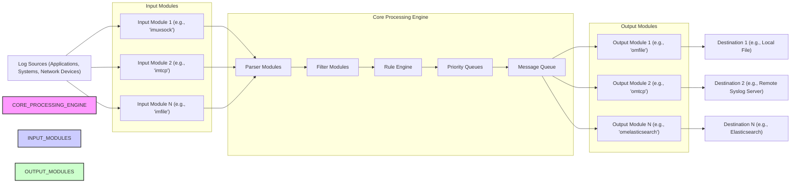

# Project Design Document: rsyslog for Threat Modeling (Improved)

**Project Name:** rsyslog - Reliable System Logging Service

**Project Repository:** [https://github.com/rsyslog/rsyslog](https://github.com/rsyslog/rsyslog)

**Document Version:** 1.1
**Date:** 2023-10-27
**Author:** AI Software Architecture Expert

## 1. Project Overview

### 1.1. Project Goals and Objectives

rsyslog is an open-source, high-performance system logging service. Its primary goals are:

*   **Reliable Log Collection:** Guarantee log message delivery even under stress, network issues, or system failures.
*   **Centralized Logging:** Aggregate logs from diverse sources (applications, operating systems, security devices, network infrastructure) for unified monitoring, analysis, and security incident response.
*   **Flexible Configuration:** Offer a highly adaptable system through a rich configuration language to meet varied logging requirements and deployment scenarios.
*   **Extensibility:** Provide a modular design that facilitates the addition of new input methods, output destinations, and message processing capabilities via modules.
*   **Performance:** Maintain efficient operation and minimal resource usage, even when handling high volumes of log data.
*   **Security:** Implement and support security features to protect log data confidentiality, integrity, and availability, as well as the logging infrastructure itself.

This design document is specifically tailored for threat modeling rsyslog deployments. It provides a detailed architectural overview, highlighting components, data flow, and trust boundaries to enable effective identification and mitigation of potential security threats.

### 1.2. Target Audience

This document is intended for:

*   **Security Architects and Engineers:** Professionals responsible for designing secure systems and conducting threat modeling exercises.
*   **Penetration Testers and Security Auditors:** Individuals tasked with assessing the security posture of systems utilizing rsyslog.
*   **System Administrators and DevOps Engineers:** Teams responsible for deploying, configuring, and maintaining rsyslog infrastructure in production environments.
*   **rsyslog Developers and Module Contributors:**  Developers working on the rsyslog project itself or creating extensions and integrations.

### 1.3. High-Level System Description

rsyslog functions as a sophisticated log management pipeline. It ingests log messages from various sources, processes them according to user-defined rules, and routes them to multiple destinations.  It supports a wide array of input sources, including system logs, standard syslog protocols (UDP, TCP), structured formats (JSON, GELF), and application-specific logs. Output destinations are equally diverse, ranging from local files and databases to remote syslog servers, SIEM systems, cloud storage, and message queues.  rsyslog's modular architecture is central to its flexibility and extensibility, allowing users to customize its functionality through a rich ecosystem of input, parser, filter, and output modules.

## 2. System Architecture

### 2.1. Component Diagram



**Changes from previous version:** Added "Priority Queues" to the Core Processing Engine for more accurate representation of rsyslog's architecture.

### 2.2. Component Descriptions

*   **Input Modules (im\*):**  These modules are the entry points for log messages into rsyslog. They handle the reception of logs from various sources and protocols. Key security considerations for input modules include:
    *   **`imuxsock`:** Listens on local Unix sockets (e.g., `/dev/log`, `/dev/kmsg`). Vulnerable if local access controls are weak, allowing unauthorized processes to inject logs.
    *   **`imtcp`:** Receives syslog over TCP. Supports TLS for encryption and authentication, crucial for securing remote log ingestion. Susceptible to denial-of-service attacks if not properly configured.
    *   **`imudp`:** Receives syslog over UDP.  Less reliable and inherently insecure due to lack of encryption and authentication. Should be avoided for sensitive logs or untrusted networks. Prone to spoofing and data loss.
    *   **`imfile`:** Monitors and reads logs from files. Requires careful permission management on monitored files to prevent unauthorized access or modification.
    *   **`imjournal`:** Reads from systemd journal. Relies on systemd's security model.
    *   **`imkmsg`:** Reads kernel messages. Requires appropriate privileges to access kernel ring buffer.
    *   **`imgssapi`:**  Receives syslog messages with GSS-API authentication and encryption, providing stronger security for network syslog.

*   **Parser Modules (parser\*):**  Parsers transform raw log messages into structured data. Security implications include:
    *   **Vulnerability to Malformed Logs:** Parsers must be robust against malformed or malicious log messages that could exploit parsing vulnerabilities (e.g., buffer overflows, format string bugs).
    *   **Data Extraction Accuracy:** Incorrect parsing can lead to misinterpretation of log data, affecting security analysis and alerting.
    *   **Example Parsers:** `parser_rfc3164`, `parser_rfc5424` (standard syslog formats), `parser_json`, `parser_gelf` (structured formats), `parser_regex` (flexible regex-based parsing).

*   **Filter Modules (filter\*):** Filters selectively process log messages based on defined criteria. Security relevance:
    *   **Access Control Implementation:** Filters can be used to implement basic access control by selectively routing logs based on source, severity, or content.
    *   **Data Reduction:** Filters can reduce the volume of logs processed and stored, potentially mitigating storage-related denial-of-service attacks and reducing exposure of sensitive data.
    *   **Example Filters:** Property-based filters (severity, facility, hostname), string-based filters (message content), regular expression filters.

*   **Rule Engine:** The core logic of rsyslog. It evaluates rules based on filters and directs messages to appropriate actions (output modules, property modifications, etc.). Security considerations:
    *   **Configuration Vulnerabilities:**  Incorrectly configured rules can lead to logs being dropped, misrouted, or exposed to unauthorized destinations.
    *   **Rule Complexity:** Overly complex rule sets can be difficult to audit and maintain, potentially introducing security gaps.
    *   **Rate Limiting and Throttling:** Rule engine can implement rate limiting to protect against log flooding attacks.

*   **Priority Queues:** rsyslog uses priority queues to manage messages based on their importance and configured priorities. This ensures that critical logs are processed and delivered even under heavy load. Security relevance:
    *   **Ensuring Delivery of Critical Security Logs:** Priority queues help guarantee that security-relevant logs (e.g., alerts, audit trails) are prioritized and not lost during system stress.
    *   **Queue Overflow Handling:**  Proper queue configuration and overflow handling are essential to prevent denial-of-service by filling up queues with low-priority or malicious logs.

*   **Message Queue:** Provides buffering and reliability. Different queue types (in-memory, disk-assisted) offer varying trade-offs between performance and durability. Security aspects:
    *   **Data Loss Prevention:** Queues mitigate data loss during temporary outages of output destinations or network disruptions.
    *   **Disk-Based Queue Security:** Disk-assisted queues require secure storage to protect queued log data at rest. Access control to queue files is crucial.
    *   **Queue Size Limits:**  Setting appropriate queue size limits prevents unbounded queue growth, which could lead to resource exhaustion and denial-of-service.

*   **Output Modules (om\*):**  Modules responsible for sending processed logs to destinations. Security considerations are destination-specific and include:
    *   **`omfile`:** Writes to local files. Requires careful file permissions and access control to protect log files.
    *   **`omtcp`:** Sends syslog over TCP.  Supports TLS for secure transmission to remote servers. Authentication mechanisms (e.g., client certificates) should be used where possible.
    *   **`omudp`:** Sends syslog over UDP. Insecure and should be avoided for sensitive destinations.
    *   **`omelasticsearch`, `omkafka`, `ommongodb`, `ommysql`, `ompgsql`:** Output to various data stores. Security depends on the security features of the destination system (authentication, authorization, encryption in transit and at rest).  Credentials for accessing these systems must be securely managed within rsyslog configuration.
    *   **`omhttp` / `omhttpfs`:** Sends logs over HTTP/HTTPS.  HTTPS should always be used for secure transmission. Authentication and authorization mechanisms of the target HTTP endpoint must be considered.

### 2.3. Data Flow Diagram

```mermaid
graph LR
    subgraph "Log Source"
        APP["Application"]
        OS["Operating System"]
        NET_DEV["Network Device"]
        SEC_DEV["Security Device (Firewall, IDS)"]
    end

    subgraph "rsyslog Instance"
        INPUT["Input Module"]
        PARSER_DF["Parser"]
        FILTER_DF["Filter"]
        RULE_ENGINE_DF["Rule Engine"]
        PRIORITY_QUEUE_DF["Priority Queue"]
        QUEUE_DF["Queue"]
        OUTPUT["Output Module"]
    end

    subgraph "Log Destination"
        LOCAL_FILE["Local File"]
        REMOTE_SYSLOG["Remote Syslog Server"]
        DATABASE["Database (SIEM, Log Management)"]
        CLOUD_SERVICE["Cloud Logging Service"]
        SIEM["SIEM System"]
    end

    APP --> INPUT
    OS --> INPUT
    NET_DEV --> INPUT
    SEC_DEV --> INPUT

    INPUT --> PARSER_DF
    PARSER_DF --> FILTER_DF
    FILTER_DF --> RULE_ENGINE_DF
    RULE_ENGINE_DF --> PRIORITY_QUEUE_DF
    PRIORITY_QUEUE_DF --> QUEUE_DF
    QUEUE_DF --> OUTPUT

    OUTPUT --> LOCAL_FILE
    OUTPUT --> REMOTE_SYSLOG
    OUTPUT --> DATABASE
    OUTPUT --> CLOUD_SERVICE
    OUTPUT --> SIEM

    linkStyle 0,1,2,3,4,5,6,7,8,9,10,11,12,13,14 stroke-width:2px,stroke:#000,fill:none
    linkStyle 0,1,2,3 text "Log Message"
    linkStyle 4 text "Raw Log Data"
    linkStyle 5 text "Parsed Log Data"
    linkStyle 6 text "Filtered Log Data"
    linkStyle 7 text "Rule-Based Routing"
    linkStyle 8 text "Prioritized Messages"
    linkStyle 9 text "Queued Log Data"
    linkStyle 10,11,12,13,14 text "Processed Log Message"
```

**Changes from previous version:** Added "Security Device" as a Log Source and "SIEM System" as a Log Destination. Included "Priority Queue" in the data flow.

### 2.4. Data Flow Description

1.  **Log Generation:** Applications, operating systems, network devices, and security devices generate log messages reflecting system events, application behavior, and security-related activities.
2.  **Log Input:** Input modules receive these log messages using various protocols and methods (e.g., system calls, network sockets, file monitoring).
3.  **Parsing:** Parser modules process raw log data, structuring it into meaningful fields and properties for easier filtering and analysis.
4.  **Filtering:** Filter modules evaluate log messages against defined criteria to select messages for further processing based on severity, source, content, or other attributes.
5.  **Rule Engine Processing:** The rule engine applies configured rules, determining actions to be taken for each log message based on selectors (filters). This includes routing messages to specific outputs, modifying properties, or discarding logs.
6.  **Priority Queuing:** Messages are placed into priority queues based on their configured priority, ensuring critical logs are processed promptly.
7.  **Message Queuing:** Messages are buffered in the message queue to provide reliability and handle temporary backpressure or destination unavailability.
8.  **Output:** Output modules retrieve messages from the queue and transmit them to designated destinations, using appropriate protocols and formats for each destination type.
9.  **Log Storage/Analysis/SIEM:** Log messages are stored in various destinations for long-term retention, security analysis, performance monitoring, and integration with SIEM systems for security incident detection and response.

### 2.5. Trust Boundary Diagram

```mermaid
graph LR
    subgraph "Untrusted Zone: Log Sources"
        LOG_SOURCE_UNTRUSTED["Log Sources (Applications, Systems, Network Devices, Security Devices)"]
    end

    subgraph "Trusted Zone: rsyslog Instance"
        INPUT_TB["Input Modules"]
        PARSER_TB["Parser Modules"]
        FILTER_TB["Filter Modules"]
        RULE_ENGINE_TB["Rule Engine"]
        PRIORITY_QUEUE_TB["Priority Queue"]
        QUEUE_TB["Message Queue"]
        OUTPUT_TB["Output Modules"]
        CONFIG_TB["Configuration Files"]
        PROCESS_TB["rsyslog Process & Memory"]
    end

    subgraph "Potentially Trusted/Untrusted Zone: Log Destinations"
        LOG_DEST_ZONE["Log Destinations (Files, Remote Servers, Databases, Cloud, SIEM)"]
    end

    LOG_SOURCE_UNTRUSTED --> |Log Messages (Potentially Malicious)| INPUT_TB
    INPUT_TB --> PARSER_TB
    PARSER_TB --> FILTER_TB
    FILTER_TB --> RULE_ENGINE_TB
    RULE_ENGINE_TB --> PRIORITY_QUEUE_TB
    PRIORITY_QUEUE_TB --> QUEUE_TB
    QUEUE_TB --> OUTPUT_TB
    CONFIG_TB -- Configuration --> RULE_ENGINE_TB
    PROCESS_TB -- Access Configuration, Modules, Queues --> CONFIG_TB & INPUT_TB & PARSER_TB & FILTER_TB & RULE_ENGINE_TB & PRIORITY_QUEUE_TB & QUEUE_TB & OUTPUT_TB
    OUTPUT_TB --> |Log Messages (Potentially Sensitive)| LOG_DEST_ZONE

    style UNTRUSTED_ZONE fill:#ffe0e0,stroke:#333,stroke-width:2px
    style TRUSTED_ZONE fill:#e0ffe0,stroke:#333,stroke-width:2px
    style POTENTIALLY_TRUSTED_UNTRUSTED_ZONE fill:#e0e0ff,stroke:#333,stroke-width:2px

    classDef UNTRUSTED_ZONE fill:#ffe0e0,stroke:#333,stroke-width:2px
    classDef TRUSTED_ZONE fill:#e0ffe0,stroke:#333,stroke-width:2px
    classDef POTENTIALLY_TRUSTED_UNTRUSTED_ZONE fill:#e0e0ff,stroke:#333,stroke-width:2px

    class LOG_SOURCE_UNTRUSTED UNTRUSTED_ZONE
    class INPUT_TB,PARSER_TB,FILTER_TB,RULE_ENGINE_TB,PRIORITY_QUEUE_TB,QUEUE_TB,OUTPUT_TB,CONFIG_TB,PROCESS_TB TRUSTED_ZONE
    class LOG_DEST_ZONE POTENTIALLY_TRUSTED_UNTRUSTED_ZONE
```

**Changes from previous version:** Added "Security Devices" to Untrusted Zone. Included "Priority Queue" and "rsyslog Process & Memory" in Trusted Zone. Added labels to data flow arrows indicating potential security concerns (malicious logs from untrusted zone, sensitive logs to potentially untrusted zone). Added connection from "rsyslog Process & Memory" to all components to represent process control and data access.

### 2.6. Trust Boundary Description

*   **Untrusted Zone: Log Sources:**  All log sources are considered untrusted. This is a critical assumption for threat modeling. Compromised applications, systems, or network devices could inject malicious or misleading log messages into rsyslog. Security devices themselves, while intended for security, can also be compromised or misconfigured, making their logs potentially untrustworthy in certain scenarios.
*   **Trusted Zone: rsyslog Instance:** The rsyslog instance, encompassing all its components, configuration, and the running process, is the trusted zone.  The security of the entire logging pipeline relies on the integrity and security of this zone.  Compromise of rsyslog itself would have severe security implications, potentially leading to log manipulation, data exfiltration, or denial of service.  Configuration files are a critical part of the trusted zone, as they dictate rsyslog's behavior. The rsyslog process and its memory space are also included, as vulnerabilities in the process itself could be exploited.
*   **Potentially Trusted/Untrusted Zone: Log Destinations:** Log destinations reside in a zone that can be either trusted or untrusted depending on the specific deployment and security controls.
    *   **Trusted Destinations:**  Secure local file systems, hardened databases within a private network, dedicated SIEM systems under strict access control.
    *   **Untrusted Destinations:** Remote syslog servers on the internet, cloud logging services (where trust depends on the cloud provider's security posture and the user's configuration), less secure network shares.  Data sent to untrusted destinations must be protected with strong encryption and potentially integrity checks.  SIEM systems, while often considered trusted, can also be targets for attack, especially if they are internet-facing or handle sensitive data.

## 3. Security Considerations

### 3.1. Authentication and Authorization

*   **Input Authentication:**
    *   **`imtcp` with TLS:**  Strong authentication using TLS client certificates is recommended for `imtcp` to verify the identity of log sources. However, often only server-side TLS is used for encryption without client authentication, relying on network segmentation.
    *   **GSS-API (`imgssapi`):** Provides robust authentication and encryption using Kerberos or other GSS-API mechanisms.
    *   **UDP (`imudp`):** Offers no inherent authentication.  Highly vulnerable to spoofing. Should be avoided in security-sensitive environments.
    *   **Local Sockets (`imuxsock`):** Relies on local operating system access controls. Vulnerable if local permissions are misconfigured.
*   **Output Authentication:**
    *   **`omtcp` with TLS:**  TLS provides encryption and can be configured for server authentication. Client authentication (e.g., client certificates) can be used for mutual authentication with the destination syslog server.
    *   **Database Outputs (`ommysql`, `ompgsql`, etc.):**  Authentication to databases relies on username/password or other database-specific authentication methods. Secure credential management is critical.
    *   **Cloud Outputs (`omelasticsearch`, cloud logging services):** Authentication typically uses API keys, access tokens, or IAM roles. Secure storage and rotation of these credentials are essential.
*   **Configuration Access Control:** Restrict access to rsyslog configuration files (`rsyslog.conf`, module configuration files) to authorized administrators only. Use file system permissions and potentially configuration management tools with access control features.
*   **Internal Authorization:** rsyslog lacks fine-grained internal authorization. Modules and processing steps generally operate with the privileges of the rsyslog process. OS-level privilege separation (e.g., using capabilities, dedicated user accounts) is crucial to limit the impact of potential vulnerabilities.

### 3.2. Data Confidentiality and Integrity

*   **Data in Transit:**
    *   **TLS Encryption:**  Mandatory for network transmission of sensitive logs, especially over untrusted networks. Use `omtcp` with TLS for remote syslog, `omhttps` for HTTP-based outputs.
    *   **IPsec/VPN:** For network segments where multiple systems communicate, consider using IPsec or VPNs to encrypt all network traffic, including syslog.
*   **Data at Rest:**
    *   **File System Encryption:** Encrypt file systems where log files are stored (`omfile` destinations, disk-assisted queues).
    *   **Database Encryption:** Utilize database encryption features for databases used as log storage (`ommysql`, `ompgsql`, etc.).
    *   **Access Control Lists (ACLs):** Implement strict ACLs on log files and database tables to restrict access to authorized users and processes.
*   **Message Integrity:**
    *   **TCP and TLS:** TCP provides reliable delivery and TLS adds integrity checks.
    *   **Signed Syslog (RFC 5425):**  For high-integrity logging, consider using signed syslog extensions if supported by input sources and output destinations. This provides cryptographic verification of message origin and content.

### 3.3. Input Validation and Sanitization

*   **Input Validation:**
    *   **Protocol Validation:** Input modules should validate incoming data against expected protocols (e.g., syslog RFC compliance).
    *   **Data Type Validation:** Parsers should validate data types and formats to prevent unexpected behavior.
    *   **Rate Limiting:** Implement rate limiting on input modules to mitigate log flooding attacks.
*   **Sanitization (Limited in rsyslog):**
    *   **Filtering Sensitive Data:** Use filters to drop or mask log messages containing highly sensitive information before they are stored or transmitted.
    *   **Property Rewriting:**  Use property rewriters to modify or redact sensitive data within log messages.
    *   **Source-Side Sanitization (Best Practice):**  The most effective approach is to sanitize sensitive data at the log source (application level) *before* it is sent to rsyslog.

### 3.4. Logging and Auditing

*   **rsyslog Internal Logs:**
    *   **Configuration Errors:** Log configuration errors, parsing failures, and module loading issues.
    *   **Connection Status:** Monitor connection status to input sources and output destinations.
    *   **Security Events:** Log authentication failures, authorization violations, and potential security-related errors.
    *   **Performance Metrics:** Track queue sizes, message processing rates, and resource usage.
    *   **Centralized Logging of rsyslog Logs:** Send rsyslog's internal logs to a separate, secure logging system for monitoring and analysis.
*   **Audit Logging of Configuration Changes:**
    *   **Version Control:** Use version control systems (e.g., Git) to track changes to rsyslog configuration files.
    *   **Configuration Management Auditing:** If using configuration management tools (e.g., Ansible, Puppet), leverage their auditing capabilities to log configuration changes.
    *   **Operating System Audit Logs:**  Enable OS-level audit logging to track access and modifications to rsyslog configuration files and the rsyslog process itself.

### 3.5. Network Security

*   **Firewall Rules:**
    *   **Restrict Input Ports:**  Limit inbound network access to rsyslog instances to only necessary ports and authorized source IP addresses or networks.
    *   **Restrict Output Ports:**  Control outbound network connections from rsyslog to only authorized destination ports and IP addresses.
    *   **Network Segmentation:** Deploy rsyslog in a segmented network to limit the impact of potential compromises.
*   **Port Security:**
    *   **Disable Unused Input Modules:** Disable input modules that are not required to reduce the attack surface.
    *   **Bind to Specific Interfaces:** Configure input modules to bind to specific network interfaces to limit exposure.
*   **DDoS Protection:**
    *   **Rate Limiting (Input Modules, Rule Engine):** Implement rate limiting to protect against log flooding and denial-of-service attacks.
    *   **Firewall-Based DDoS Mitigation:** Utilize firewall features (e.g., SYN flood protection, connection limits) to mitigate network-level DDoS attacks.

### 3.6. Dependency Management

*   **Regular Updates:**  Establish a process for regularly updating rsyslog and all its dependencies (libraries, modules) to patch known vulnerabilities.
*   **Vulnerability Scanning:**  Use vulnerability scanning tools to identify outdated or vulnerable components in the rsyslog installation.
*   **Module Security Review:**  Thoroughly review and test third-party or community-contributed modules before deploying them in production. Verify module sources and check for known vulnerabilities.

### 3.7. Privilege Management

*   **Principle of Least Privilege:**
    *   **Non-Root User:** Run the rsyslog process as a dedicated non-root user with minimal privileges.
    *   **Capabilities:** Use Linux capabilities to grant only necessary privileges to the rsyslog process instead of running as root.
    *   **User and Group Permissions:**  Configure file system permissions to restrict access to rsyslog configuration files, log files, queue files, and related directories to the rsyslog user and authorized administrators.
*   **Chroot Environment (Advanced):**  In highly security-sensitive environments, consider running rsyslog in a chroot environment to further isolate it from the rest of the system.

## 4. Deployment Architecture (Simplified)

### 4.1. Typical Deployment Scenarios (Expanded)

*   **Centralized Logging Server (SIEM Integration):** A dedicated, hardened server running rsyslog, acting as a central log aggregator for an entire organization. Often integrated with a SIEM system for security monitoring and incident response. Requires robust security controls and high availability.
*   **Distributed Logging (Hierarchical Forwarding):** Multiple rsyslog instances deployed in different network zones or geographical locations. Local rsyslog instances collect logs within their zone and forward them to a central rsyslog aggregator or SIEM. Improves scalability and resilience.
*   **Local Logging (Host-Based Security):** rsyslog running on each individual system primarily for local log management, security auditing, and host-based intrusion detection. Logs may also be forwarded to a central system for broader visibility.
*   **Cloud-Based Logging (Hybrid and Cloud-Native):** rsyslog deployed in cloud environments, either directly sending logs to cloud logging services (e.g., AWS CloudWatch, Azure Monitor, Google Cloud Logging) or acting as a forwarder/pre-processor before sending logs to cloud platforms. Supports hybrid cloud and cloud-native architectures.
*   **Forwarder/Relay (Log Aggregation and Normalization):** rsyslog instances deployed as intermediate forwarders to aggregate logs from various sources, perform basic normalization or filtering, and then relay logs to a central logging system or SIEM. Useful for complex network topologies and log processing pipelines.

### 4.2. Simplified Deployment Diagram (Centralized Logging with SIEM)

```mermaid
graph LR
    subgraph "Client Systems & Security Devices"
        CLIENT1["Client System 1"]
        CLIENT2["Client System 2"]
        CLIENT_N["Client System N"]
        FIREWALL["Firewall"]
        IDS["Intrusion Detection System"]
    end

    subgraph "Central rsyslog Server"
        RSYSLOG_SERVER["rsyslog Instance"]
    end

    subgraph "SIEM & Log Storage"
        SIEM_SYSTEM["SIEM System"]
        LOG_STORAGE["Log Storage (e.g., Elasticsearch, Object Storage)"]
    end

    CLIENT1 --> RSYSLOG_SERVER
    CLIENT2 --> RSYSLOG_SERVER
    CLIENT_N --> RSYSLOG_SERVER
    FIREWALL --> RSYSLOG_SERVER
    IDS --> RSYSLOG_SERVER
    RSYSLOG_SERVER --> SIEM_SYSTEM
    RSYSLOG_SERVER --> LOG_STORAGE
    SIEM_SYSTEM --> LOG_STORAGE

    linkStyle 0,1,2,3,4 stroke-width:2px,stroke:#000,fill:none
    linkStyle 0,1,2,3,4 text "Syslog over Network (e.g., TCP/TLS)"
    linkStyle 5 text "Logs to SIEM"
    linkStyle 6 text "Logs to Storage (Raw/Processed)"
    linkStyle 7 text "SIEM Data to Storage"
```

**Changes from previous version:** Added Security Devices (Firewall, IDS) as clients and SIEM System as a primary destination. Clarified Log Storage purpose.

## 5. Technology Stack

*   **Programming Language:** Primarily written in C for performance and efficiency.
*   **Configuration Language:** rsyslog's custom configuration language, powerful but can be complex. Configuration files are typically `.conf` files.
*   **Operating Systems:** Broad support for Unix-like systems (Linux, BSD, macOS, Solaris) and limited support for Windows.
*   **Dependencies:** Standard C libraries, plus optional dependencies based on enabled modules:
    *   **OpenSSL/GnuTLS:** TLS encryption for network communication.
    *   **Database Client Libraries:**  `libmysqlclient`, `libpq`, `libmongoc`, etc., for database output modules.
    *   **libcurl:** HTTP/HTTPS output module (`omhttpfs`).
    *   **libjson-c/jansson:** JSON parsing and output.
    *   **zlib/lz4/snappy:** Compression libraries for queue and output modules.
    *   **GSS-API libraries:** Kerberos authentication (`imgssapi`).

## 6. Future Considerations (for Security)

*   **Enhanced Input Authentication and Authorization:**
    *   **Mutual TLS by Default:** Encourage and simplify the use of mutual TLS for `imtcp` and other network input modules.
    *   **API Key/Token Authentication:**  Introduce module-level support for API key or token-based authentication for input sources that don't support TLS client certificates.
    *   **Role-Based Access Control (RBAC) for Input Sources:**  Implement RBAC to control which input sources are allowed to send logs to rsyslog based on source IP, identity, or other attributes.
*   **Improved Built-in Sanitization and Data Masking:**
    *   **Advanced Property Rewriters:** Enhance property rewriters with more sophisticated data masking and redaction capabilities (e.g., regular expression-based masking, format-preserving encryption).
    *   **Dedicated Sanitization Modules:**  Develop dedicated modules specifically for data sanitization and anonymization within the rsyslog pipeline.
*   **Configuration Security Enhancements:**
    *   **Configuration Validation and Linting:**  Develop tools to automatically validate rsyslog configurations for security best practices and potential vulnerabilities.
    *   **Encrypted Configuration Storage:** Support encrypted storage of sensitive configuration parameters (e.g., database passwords, API keys).
    *   **RBAC for Configuration Management:** Implement RBAC to control who can modify rsyslog configurations.
*   **Enhanced Security Auditing and Monitoring:**
    *   **Detailed Audit Logs:**  Expand rsyslog's internal audit logging to capture more security-relevant events, such as configuration changes, authentication attempts, and access control decisions.
    *   **Real-time Security Monitoring:**  Integrate rsyslog with real-time security monitoring tools to detect and alert on suspicious activity within the logging pipeline itself.
*   **Formal Security Audits and Penetration Testing:**  Conduct regular formal security audits and penetration testing of rsyslog to identify and address potential vulnerabilities proactively.
*   **Security Hardening Guides and Best Practices:**  Develop and maintain comprehensive security hardening guides and best practices documentation for deploying and configuring rsyslog securely in various environments and use cases.

This improved design document provides a more detailed and security-focused overview of rsyslog architecture, data flow, and trust boundaries. It is intended to be a valuable resource for security professionals conducting threat modeling and security assessments of rsyslog deployments.  Always consult the official rsyslog documentation and community resources for the most current and comprehensive information.