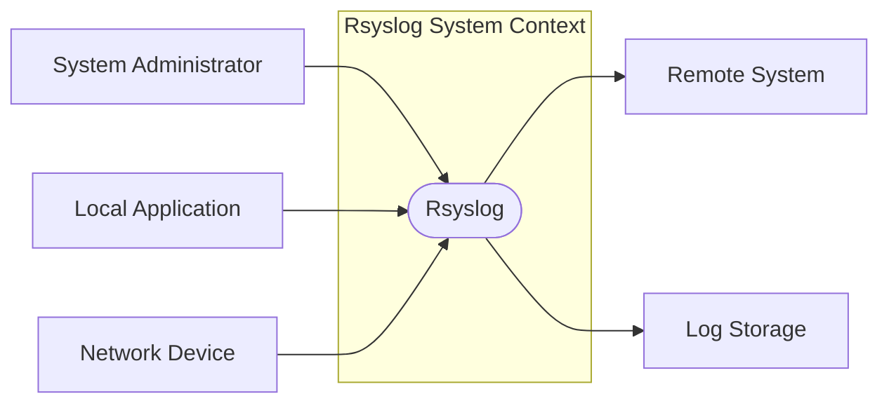
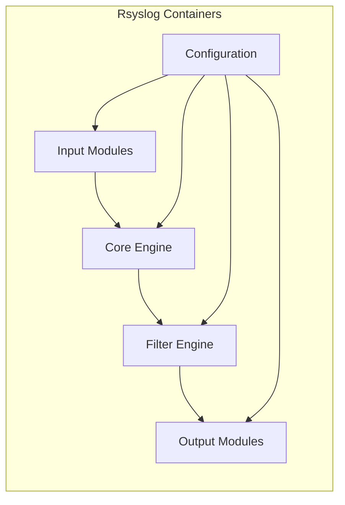
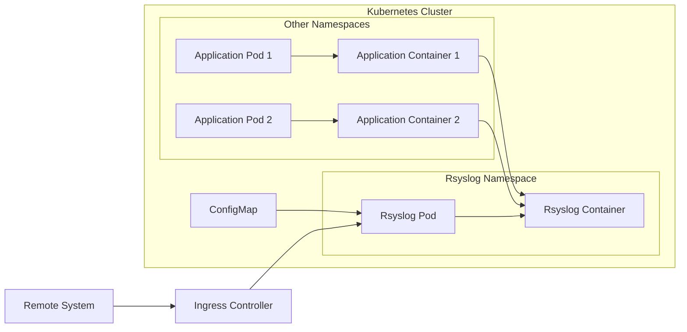

# Project Design Document: rsyslog

## BUSINESS POSTURE

Rsyslog is a widely-used, open-source software utility for forwarding log messages over a network. It's a core component in many systems for centralized logging, security auditing, and compliance. Given its widespread use and critical function, the business posture focuses on reliability, performance, security, and maintainability.

Priorities:

*   Reliability: Ensuring log messages are delivered reliably and without loss is paramount. System administrators rely on rsyslog for critical system monitoring and troubleshooting.
*   Performance: Rsyslog must handle high volumes of log data with minimal overhead to avoid impacting the performance of the systems it monitors.
*   Security: Protecting the confidentiality and integrity of log data is crucial, especially as logs often contain sensitive information.
*   Maintainability: The project must be maintainable and extensible to adapt to evolving logging needs and security threats.
*   Compatibility: Maintaining compatibility with a wide range of systems and log formats is essential for its broad adoption.

Business Goals:

*   Provide a robust and reliable logging solution for system administrators.
*   Offer a high-performance logging solution that scales to meet demanding workloads.
*   Ensure the secure transmission and storage of log data.
*   Maintain a well-documented and easily extensible codebase.
*   Support a wide range of input and output formats.

Most Important Business Risks:

*   Log data loss: Failure to capture or deliver log messages can hinder troubleshooting, security investigations, and compliance efforts.
*   Performance bottlenecks: Slow log processing can impact the performance of other systems.
*   Security breaches: Unauthorized access to or modification of log data can compromise sensitive information and undermine security audits.
*   Lack of compatibility: Inability to integrate with new systems or log formats can limit adoption and usefulness.
*   Code vulnerabilities: Security flaws in the codebase can be exploited by attackers.

## SECURITY POSTURE

Existing Security Controls:

*   security control: TLS encryption: Rsyslog supports TLS encryption for secure log transmission. (Implemented in network communication modules).
*   security control: Authentication: Rsyslog supports various authentication mechanisms, including TLS client certificates and GSSAPI. (Implemented in network communication and authentication modules).
*   security control: Access control: Rsyslog can be configured to restrict access to specific sources and destinations. (Implemented via configuration files).
*   security control: Input validation: Rsyslog performs input validation to mitigate some injection attacks. (Implemented in input processing modules).
*   security control: Regular security audits: The Rsyslog project undergoes periodic security reviews and audits. (Documented in project security policy).
*   security control: Community involvement: A large and active community contributes to identifying and addressing security vulnerabilities. (Evidenced by the project's GitHub repository and mailing lists).

Accepted Risks:

*   accepted risk: Complexity of configuration: Rsyslog's configuration can be complex, potentially leading to misconfigurations that could impact security.
*   accepted risk: Reliance on external libraries: Rsyslog relies on external libraries, which may introduce vulnerabilities.
*   accepted risk: Potential for denial-of-service: Rsyslog, like any network service, is susceptible to denial-of-service attacks.

Recommended Security Controls:

*   security control: Implement SELinux/AppArmor policies: Provide pre-built SELinux or AppArmor policies to further restrict Rsyslog's privileges.
*   security control: Enhanced input validation: Strengthen input validation to prevent more sophisticated injection attacks.
*   security control: Fuzz testing: Integrate regular fuzz testing into the development process to identify potential vulnerabilities.
*   security control: Static analysis: Incorporate static analysis tools into the build process to detect potential code vulnerabilities.
*   security control: Supply chain security: Implement measures to verify the integrity of dependencies and build tools.

Security Requirements:

*   Authentication:
    *   Support strong authentication mechanisms for remote connections (e.g., TLS client certificates, GSSAPI).
    *   Provide options for local authentication (e.g., PAM).
    *   Protect against brute-force attacks.

*   Authorization:
    *   Implement granular access control based on source, destination, and message content.
    *   Allow administrators to define rules for filtering and routing log messages.

*   Input Validation:
    *   Validate all input to prevent injection attacks (e.g., command injection, format string vulnerabilities).
    *   Sanitize log messages to remove potentially harmful characters.
    *   Handle malformed input gracefully without crashing.

*   Cryptography:
    *   Use strong cryptographic algorithms for encryption and authentication (e.g., TLS 1.3 or higher).
    *   Protect cryptographic keys securely.
    *   Provide options for using hardware security modules (HSMs).

## DESIGN

### C4 CONTEXT



Element Descriptions:

*   Element:
    *   Name: System Administrator
    *   Type: User
    *   Description: A person responsible for managing and monitoring systems.
    *   Responsibilities: Configures Rsyslog, monitors logs, investigates security incidents.
    *   Security controls: Strong password, multi-factor authentication (MFA) for system access.

*   Element:
    *   Name: Rsyslog
    *   Type: System
    *   Description: The Rsyslog system itself.
    *   Responsibilities: Receives, processes, filters, and forwards log messages.
    *   Security controls: TLS encryption, authentication, access control, input validation.

*   Element:
    *   Name: Remote System
    *   Type: System
    *   Description: A remote system that sends logs to Rsyslog.
    *   Responsibilities: Generates log messages.
    *   Security controls: Depends on the specific remote system; ideally, uses secure logging protocols.

*   Element:
    *   Name: Log Storage
    *   Type: System
    *   Description: A system for storing log data (e.g., Elasticsearch, Splunk, local files).
    *   Responsibilities: Stores log data persistently.
    *   Security controls: Access control, encryption at rest, auditing.

*   Element:
    *   Name: Local Application
    *   Type: System
    *   Description: An application running on the same system as Rsyslog that generates logs.
    *   Responsibilities: Generates log messages.
    *   Security controls: Depends on the specific application.

*   Element:
    *   Name: Network Device
    *   Type: System
    *   Description: A network device (e.g., router, firewall) that sends logs to Rsyslog.
    *   Responsibilities: Generates log messages.
    *   Security controls: Depends on the specific device; ideally, uses secure logging protocols.

### C4 CONTAINER



Element Descriptions:

*   Element:
    *   Name: Input Modules
    *   Type: Container
    *   Description: Modules responsible for receiving log messages from various sources.
    *   Responsibilities: Receive log messages, perform initial parsing, and pass them to the core engine.
    *   Security controls: Input validation, TLS encryption (for network inputs), authentication (for network inputs).

*   Element:
    *   Name: Core Engine
    *   Type: Container
    *   Description: The central processing unit of Rsyslog.
    *   Responsibilities: Manages message queues, handles threading, and coordinates other components.
    *   Security controls: Limited direct security controls; relies on other components for security.

*   Element:
    *   Name: Filter Engine
    *   Type: Container
    *   Description: Processes log messages based on configured rules.
    *   Responsibilities: Filters messages based on content, source, and other criteria.
    *   Security controls: Input validation (to prevent filter bypass).

*   Element:
    *   Name: Output Modules
    *   Type: Container
    *   Description: Modules responsible for sending log messages to various destinations.
    *   Responsibilities: Format log messages and send them to configured outputs (e.g., files, remote servers, databases).
    *   Security controls: TLS encryption (for network outputs), authentication (for network outputs).

*   Element:
    *   Name: Configuration
    *   Type: Container
    *   Description: The configuration file(s) that control Rsyslog's behavior.
    *   Responsibilities: Defines input sources, filter rules, output destinations, and other settings.
    *   Security controls: File permissions, access control to prevent unauthorized modification.

### DEPLOYMENT

Possible Deployment Solutions:

1.  Standalone Server: Rsyslog is installed and runs on a dedicated physical or virtual server.
2.  Containerized Deployment: Rsyslog runs within a container (e.g., Docker) on a container orchestration platform (e.g., Kubernetes).
3.  Embedded System: Rsyslog is integrated into an embedded system (e.g., a network appliance).
4.  Cloud-Based Logging Service: Rsyslog forwards logs to a cloud-based logging service (e.g., AWS CloudWatch, Azure Monitor).

Chosen Deployment Solution (Containerized Deployment):



Element Descriptions:

*   Element:
    *   Name: Kubernetes Cluster
    *   Type: Infrastructure
    *   Description: The container orchestration platform.
    *   Responsibilities: Manages the lifecycle of containers, provides networking, and ensures high availability.
    *   Security controls: Network policies, role-based access control (RBAC), pod security policies.

*   Element:
    *   Name: Rsyslog Namespace
    *   Type: Logical Boundary
    *   Description: A Kubernetes namespace for isolating Rsyslog resources.
    *   Responsibilities: Provides a scope for Rsyslog-related objects.
    *   Security controls: Network policies, RBAC.

*   Element:
    *   Name: Rsyslog Pod
    *   Type: Pod
    *   Description: A Kubernetes pod running the Rsyslog container.
    *   Responsibilities: Hosts the Rsyslog container.
    *   Security controls: Pod security policies.

*   Element:
    *   Name: Rsyslog Container
    *   Type: Container
    *   Description: The Docker container running the Rsyslog process.
    *   Responsibilities: Receives, processes, and forwards log messages.
    *   Security controls: Container image security scanning, minimal base image, read-only filesystem (where possible).

*   Element:
    *   Name: ConfigMap
    *   Type: Kubernetes Resource
    *   Description: A Kubernetes ConfigMap containing the Rsyslog configuration.
    *   Responsibilities: Provides configuration data to the Rsyslog container.
    *   Security controls: RBAC, encryption at rest (if using a secrets management solution).

*   Element:
    *   Name: Other Namespaces
    *   Type: Logical Boundary
    *   Description: Kubernetes namespaces for other applications.
    *   Responsibilities: Provides a scope for application-related objects.
    *   Security controls: Network policies, RBAC.

*   Element:
    *   Name: Application Pods (AppPod1, AppPod2)
    *   Type: Pod
    *   Description: Pods running application containers.
    *   Responsibilities: Host application containers.
    *   Security controls: Pod security policies.

*   Element:
    *   Name: Application Containers (AppContainer1, AppContainer2)
    *   Type: Container
    *   Description: Containers running application code.
    *   Responsibilities: Generate log messages.
    *   Security controls: Application-specific security controls.

*   Element:
    *   Name: Ingress Controller
    *   Type: Kubernetes Resource
    *   Description: An Ingress controller for managing external access to the Rsyslog service.
    *   Responsibilities: Routes external traffic to the Rsyslog pod.
    *   Security controls: TLS termination, authentication, access control.

*   Element:
    *   Name: Remote System
    *   Type: System
    *   Description: A remote system sending logs to Rsyslog.
    *   Responsibilities: Generates log messages.
    *   Security controls: Depends on the specific remote system; ideally, uses secure logging protocols.

### BUILD

The Rsyslog build process involves several steps, from source code to packaged releases. Security is a key consideration throughout the process.

```mermaid
graph LR
    Developer[Developer] --> GitRepository[Git Repository]
    GitRepository --> BuildServer[Build Server (e.g., Jenkins, GitHub Actions)]
    BuildServer --> SAST[SAST Tools]
    BuildServer --> DependencyCheck[Dependency Check Tools]
    BuildServer --> BuildArtifacts[Build Artifacts (e.g., .deb, .rpm)]
    BuildArtifacts --> ArtifactRepository[Artifact Repository]
    SAST --> SecurityReport[Security Report]
    DependencyCheck --> VulnerabilityReport[Vulnerability Report]
```

Build Process Description:

1.  Developer: Developers write and commit code to the Git repository.
2.  Git Repository: The source code is stored in a Git repository (GitHub).
3.  Build Server: A build server (e.g., Jenkins, GitHub Actions) automatically triggers builds upon code changes.
4.  SAST Tools: Static Application Security Testing (SAST) tools (e.g., SonarQube, Coverity) analyze the source code for potential vulnerabilities.
5.  Dependency Check Tools: Dependency check tools (e.g., OWASP Dependency-Check) scan project dependencies for known vulnerabilities.
6.  Build Artifacts: The build server compiles the code and creates build artifacts (e.g., .deb, .rpm packages).
7.  Artifact Repository: Build artifacts are stored in an artifact repository.
8.  Security Report: SAST tools generate security reports, highlighting potential vulnerabilities.
9.  Vulnerability Report: Dependency check tools generate reports listing known vulnerabilities in dependencies.

Security Controls in Build Process:

*   security control: Code review: All code changes undergo peer review before being merged.
*   security control: SAST: Static analysis tools are used to identify potential code vulnerabilities.
*   security control: Dependency checking: Dependencies are scanned for known vulnerabilities.
*   security control: Build automation: The build process is automated to ensure consistency and reduce manual errors.
*   security control: Signed releases: Release artifacts are digitally signed to ensure authenticity and integrity.
*   security control: Supply chain security: Efforts are made to verify the integrity of build tools and dependencies (though this is an ongoing challenge).

## RISK ASSESSMENT

Critical Business Processes to Protect:

*   System monitoring and troubleshooting: Rsyslog is essential for monitoring the health and performance of systems and for diagnosing issues.
*   Security auditing and incident response: Rsyslog provides the audit trail necessary for investigating security incidents and demonstrating compliance.
*   Compliance with regulations: Many regulations (e.g., PCI DSS, HIPAA) require logging and auditing, which Rsyslog facilitates.

Data to Protect and Sensitivity:

*   Log data: This includes system logs, application logs, and security logs.
    *   Sensitivity: Varies widely. Can range from low (e.g., routine system events) to high (e.g., authentication logs, error logs containing sensitive data, security event logs).  The sensitivity depends on the specific content of the logs and the context in which they are generated.  Logs may contain personally identifiable information (PII), protected health information (PHI), or other confidential data.

## QUESTIONS & ASSUMPTIONS

Questions:

*   What specific compliance requirements (if any) apply to the systems using Rsyslog? (e.g., PCI DSS, HIPAA, GDPR)
*   What is the expected volume of log data? (This impacts performance requirements and resource allocation.)
*   What are the specific security concerns of the organizations using Rsyslog? (e.g., are they particularly concerned about insider threats, external attacks, or data breaches?)
*   What are the existing security controls in the environments where Rsyslog will be deployed? (e.g., firewalls, intrusion detection systems, SIEM solutions)
*   What level of support and maintenance is expected for the Rsyslog deployment?
*   Are there any specific performance requirements or limitations?
*   What are the preferred methods for receiving logs from remote systems? (e.g., syslog over UDP, syslog over TCP, RELP, other protocols)
*   What are the target log storage solutions? (e.g., local files, Elasticsearch, Splunk, cloud-based services)

Assumptions:

*   BUSINESS POSTURE: It is assumed that the organization deploying Rsyslog values reliability, security, and performance.
*   BUSINESS POSTURE: It is assumed that the organization has a basic understanding of logging and security best practices.
*   SECURITY POSTURE: It is assumed that basic security controls (e.g., firewalls, access control) are in place in the deployment environment.
*   SECURITY POSTURE: It is assumed that the organization has a process for managing security vulnerabilities.
*   DESIGN: It is assumed that the Rsyslog configuration will be managed securely (e.g., using a configuration management system, with appropriate access controls).
*   DESIGN: It is assumed that the network infrastructure supports the chosen logging protocols.
*   DESIGN: It is assumed that sufficient resources (CPU, memory, storage) will be allocated to Rsyslog to handle the expected log volume.