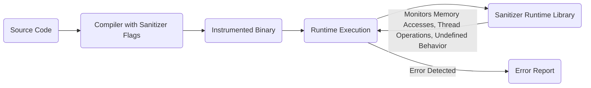
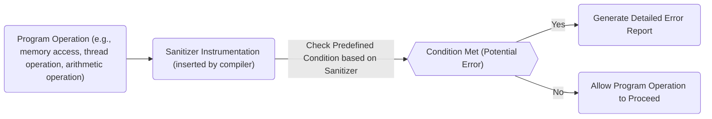
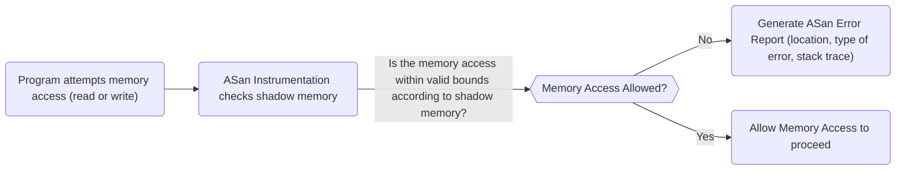
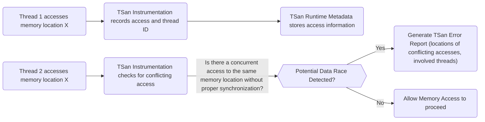

# Project Design Document: Google Sanitizers

**Version:** 1.1
**Date:** October 26, 2023
**Author:** Gemini (AI Language Model)

## 1. Introduction

This document provides an enhanced design overview of the Google Sanitizers project, a powerful suite of runtime instrumentation libraries meticulously designed to detect a wide array of programming errors, with a primary focus on memory safety and concurrency issues. This detailed design serves as a crucial foundation for subsequent threat modeling activities, enabling a thorough assessment of potential security vulnerabilities.

The Google Sanitizers project, publicly available on GitHub at [https://github.com/google/sanitizers](https://github.com/google/sanitizers), offers a comprehensive collection of tools that are seamlessly integrated into the software application build process. These tools inject specialized code that actively monitors program execution during runtime, effectively detecting issues that could otherwise lead to catastrophic crashes, significant security vulnerabilities, or unpredictable undefined behavior.

## 2. Goals

The core objectives driving the Google Sanitizers project are:

* **Robust Detection of Memory Safety Errors:**  To reliably identify critical memory-related errors, including:
    * Heap buffer overflows
    * Stack buffer overflows
    * Use-after-free errors
    * Use-after-return errors
    * Double-free errors
    * Invalid free errors
    * Memory leaks (optional detection)
* **Precise Detection of Data Races:** To accurately pinpoint instances of concurrent access to shared memory locations without the enforcement of proper synchronization mechanisms.
* **Comprehensive Detection of Undefined Behavior:** To identify occurrences of undefined behavior as strictly defined by the established C/C++ standards, ensuring code adheres to language specifications.
* **Generation of Actionable Error Reports:** To produce clear, concise, and highly informative error messages that empower developers to efficiently understand the nature of detected issues and implement effective fixes.
* **Minimization of Performance Overhead:** While acknowledging the inherent overhead associated with runtime instrumentation, a key goal is to maintain this overhead within acceptable limits, particularly for development and testing environments.
* **Simplified Integration Process:** To provide a straightforward and intuitive method for integrating the sanitizers into existing software build systems, minimizing friction for developers.
* **Broad Cross-Platform Support:** To ensure compatibility and functionality across a diverse range of operating systems and hardware architectures.

## 3. Non-Goals

This design document explicitly excludes the following aspects:

* **Granular Implementation Details:** The focus remains on the high-level architecture and overall functionality of the sanitizers, rather than delving into the intricate low-level implementation details of each individual sanitizer.
* **Detailed Performance Benchmarking:**  In-depth performance analysis, including specific metrics and optimization strategies, falls outside the scope of this document.
* **Specific Build System Integration Procedures:** While ease of integration is a stated goal, this document will not provide step-by-step instructions for integration with particular build systems such as CMake or Make.
* **Static Analysis Techniques and Methodologies:** The sanitizers are fundamentally runtime tools; therefore, static analysis approaches are not within the purview of this document.
* **Automated Vulnerability Patching Mechanisms:** The sanitizers are designed to detect errors; they do not possess the capability to automatically generate or apply patches to fix the identified issues.

## 4. High-Level Architecture

The Google Sanitizers project is structured as a collection of distinct sanitizers, each specifically targeting a particular category of programming errors. These sanitizers are typically implemented as compiler flags or as separate libraries that are linked with the target application during the build process.

**Components:**

* **Source Code:** The original, unmodified application code that is the subject of the build and testing process.
* **Compiler with Sanitizer Flags:** The compiler (e.g., Clang, GCC) invoked with specific command-line flags that instruct it to enable the desired sanitizers during the compilation phase.
* **Instrumented Binary:** The executable file generated by the compiler. This binary contains the original application code augmented with the additional instrumentation code injected by the enabled sanitizers.
* **Runtime Execution:** The process of executing the instrumented binary. During this phase, the injected instrumentation actively monitors the program's behavior.
* **Sanitizer Runtime Library:** A library that is linked with the instrumented binary. This library provides the core logic and functionality for monitoring program execution and detecting errors based on the instrumentation. Each sanitizer typically has its own dedicated runtime library.
* **Error Report:** The output generated by a sanitizer when it detects an error during runtime. This report typically includes detailed information about the error, such as its location in the source code (file and line number) and a description of the error type.

## 5. Detailed Design

The Google Sanitizers project encompasses the following key sanitizers:

* **AddressSanitizer (ASan):**
    * **Purpose:**  To detect a wide range of memory safety errors, including:
        * Heap buffer overflows (writing beyond allocated heap memory)
        * Stack buffer overflows (writing beyond allocated stack memory)
        * Use-after-free errors (accessing memory after it has been deallocated)
        * Use-after-return errors (accessing stack memory after the function has returned)
        * Double-free errors (attempting to free the same memory block twice)
        * Invalid free errors (attempting to free memory that was not allocated with `malloc` or `new`)
        * Optional detection of memory leaks (memory that is no longer reachable but has not been freed)
    * **Mechanism:** ASan employs a combination of techniques:
        * **Shadow Memory:** ASan maintains a separate, parallel region of memory called "shadow memory." Each byte in the application's memory has a corresponding "shadow byte" that describes the state of that memory (e.g., allocated, freed, poisoned). "Redzones" are placed around allocated memory regions in shadow memory to detect out-of-bounds accesses.
        * **Compiler Instrumentation:** The compiler inserts code at compile time before and after memory access instructions. This inserted code checks the corresponding shadow byte to ensure the access is valid.
        * **Runtime Library:** ASan provides its own implementations of memory allocation and deallocation functions (`malloc`, `free`, `new`, `delete`, etc.). These implementations update the shadow memory to reflect the allocation and deallocation status of memory blocks.
    * **Error Reporting:** When ASan detects an invalid memory access, it generates a detailed error report. This report typically includes the location of the error (source file, line number, and stack trace) and a clear description of the type of memory safety violation.

* **MemorySanitizer (MSan):**
    * **Purpose:** To detect reads of uninitialized memory, a common source of unpredictable behavior and potential security vulnerabilities.
    * **Mechanism:** MSan tracks the initialization state of memory locations throughout the program's execution.
        * **Compiler Instrumentation:** The compiler inserts code to track the flow of uninitialized values. Operations that initialize memory (e.g., writing a value) mark the corresponding memory locations as initialized in shadow memory.
        * **Shadow Memory:** Similar to ASan, MSan uses shadow memory, but in this case, the shadow bytes indicate whether the corresponding application memory byte has been initialized.
        * **Propagating Uninitialized State:** MSan tracks the propagation of uninitialized values through registers and memory.
    * **Error Reporting:** When MSan detects a read of an uninitialized value, it reports the location of the read operation and attempts to trace back the origin of the uninitialized value.

* **ThreadSanitizer (TSan):**
    * **Purpose:** To detect data races in multithreaded programs, which occur when multiple threads access the same memory location concurrently, and at least one of the accesses is a write, without proper synchronization.
    * **Mechanism:** TSan uses a "happens-before" relation analysis to identify potential data races.
        * **Compiler Instrumentation:** The compiler inserts code before and after memory access instructions and synchronization operations (e.g., mutex locks, unlocks, atomic operations).
        * **Runtime Library:** TSan's runtime library maintains metadata about thread activity, including the history of memory accesses and synchronization events. It uses this information to determine if a pair of accesses to the same memory location constitutes a data race.
    * **Error Reporting:** When TSan detects a data race, it generates an error report that includes the locations of the conflicting memory accesses in the source code and the thread IDs involved in the race.

* **LeakSanitizer (LSan):**
    * **Purpose:** To detect memory leaks, which occur when memory is allocated but never subsequently freed, leading to a gradual consumption of system resources.
    * **Mechanism:** LSan identifies memory leaks by performing a reachability analysis at the end of the program's execution (or at specific points if requested).
        * **Periodic Scans:** LSan can periodically scan allocated memory blocks.
        * **Reachability Tracing:** It traces reachable memory blocks starting from global variables, stack frames of active threads, and registers. Any allocated memory that is not reachable through these paths is considered leaked.
    * **Error Reporting:** LSan reports the locations in the code where the leaked memory blocks were originally allocated, along with the size of the leaked memory.

* **UndefinedBehaviorSanitizer (UBSan):**
    * **Purpose:** To detect various forms of undefined behavior as defined by the C/C++ standards. Undefined behavior can lead to unpredictable program behavior, crashes, and security vulnerabilities.
    * **Mechanism:** UBSan relies on compiler instrumentation to insert checks for specific conditions that constitute undefined behavior at runtime.
    * **Types of Undefined Behavior Detected:**
        * Integer overflow (signed integer arithmetic exceeding the maximum or minimum representable value)
        * Division by zero
        * Dereferencing null pointers
        * Out-of-bounds array access
        * Type punning violations (accessing an object through a pointer of an incompatible type)
        * Unreachable code being executed
        * Shift operations with negative or excessively large shift amounts
        * And many other forms of undefined behavior.
    * **Error Reporting:** When UBSan detects an instance of undefined behavior, it reports the specific type of undefined behavior encountered and the location in the source code where it occurred.

## 6. Data Flow

The general data flow for each sanitizer shares a common pattern:

**Detailed Data Flow for ASan (Example):**

**Detailed Data Flow for TSan (Example):**

## 7. Security Considerations (for Threat Modeling)

While the primary objective of the sanitizers is to enhance software reliability and correctness, several security implications warrant careful consideration during threat modeling:

* **Performance Overhead as an Attack Vector:** The inherent performance overhead introduced by runtime instrumentation could be exploited by attackers. An attacker might attempt to trigger code paths that are significantly slower when sanitized, leading to a denial-of-service condition, particularly in environments where sanitizers are unexpectedly enabled or partially deployed.
* **Information Disclosure through Error Reports:** Error reports generated by sanitizers can inadvertently expose sensitive information. This information might include memory addresses, stack traces revealing internal program structure, and potentially even snippets of data from memory. If these reports are logged or displayed in production environments (even unintentionally), they could provide valuable insights to attackers, aiding in vulnerability analysis and exploitation.
* **Denial of Service through Error Floods:**  An attacker might be able to craft inputs or trigger program states that cause a large number of sanitizer errors to be generated rapidly. The process of generating and logging these error reports could consume excessive system resources (CPU, memory, disk I/O), leading to a denial-of-service condition.
* **Bypassing or Circumventing Sanitizers:**  Sophisticated attackers might attempt to find ways to bypass the sanitizer's instrumentation or exploit vulnerabilities within the sanitizer's implementation itself. While generally robust, sanitizers are complex pieces of software and could potentially contain bugs. Techniques like return-oriented programming (ROP) or code injection might be used to execute code without triggering sanitizer checks.
* **Supply Chain Risks Associated with Sanitizer Libraries:**  The integrity and trustworthiness of the sanitizer libraries are paramount. If the sanitizer libraries themselves are compromised (e.g., through a supply chain attack), they could be manipulated to introduce vulnerabilities into the instrumented code or to fail to detect existing vulnerabilities.
* **False Negatives and Missed Vulnerabilities:** While designed to be accurate, sanitizers are not foolproof and might, in rare cases, fail to detect actual errors (false negatives). This is a significant security concern, as vulnerabilities might remain undetected even with sanitizers in use.
* **Interaction with Other Security Mechanisms:**  It's important to consider how sanitizers interact with other security features deployed in the system, such as Address Space Layout Randomization (ASLR), Control-Flow Integrity (CFI), and sandboxing technologies. While generally designed to be compatible, unexpected interactions or conflicts could potentially weaken the overall security posture. For example, excessive logging from sanitizers might negate some of the entropy provided by ASLR.
* **Side-Channel Information Leakage:** The timing differences introduced by the sanitizer's instrumentation could potentially be exploited in side-channel attacks to leak sensitive information. This is a more theoretical concern but should be considered in highly sensitive environments.

## 8. Deployment Considerations

The Google Sanitizers are primarily intended for use during the development, testing, and continuous integration phases of the software development lifecycle. They are typically enabled by specifying compiler flags during the build process.

* **Enabling via Compiler Flags:**  Specific compiler flags are used to enable individual sanitizers. For example:
    * `-fsanitize=address` for AddressSanitizer (ASan)
    * `-fsanitize=memory` for MemorySanitizer (MSan)
    * `-fsanitize=thread` for ThreadSanitizer (TSan)
    * `-fsanitize=leak` for LeakSanitizer (LSan)
    * `-fsanitize=undefined` for UndefinedBehaviorSanitizer (UBSan)
* **Linking with Runtime Libraries:** When a sanitizer is enabled, the compiler automatically links the necessary runtime library for that sanitizer with the application's executable.
* **Configuration through Environment Variables:** Some sanitizers offer configuration options that can be set using environment variables. These options can control aspects such as the verbosity of error reporting, suppression of specific error types, and memory allocation behavior.
* **Performance Implications in Production:** Due to the significant performance overhead introduced by the runtime instrumentation, it is generally **not recommended** to enable sanitizers in production deployments unless a thorough risk assessment has been conducted and the benefits of the runtime checks outweigh the performance cost and potential security implications of the error reports. Sanitizers are most effective in pre-production environments.

## 9. Future Considerations

The Google Sanitizers project is continuously evolving, and potential future developments may include:

* **Development of New Sanitizers:**  Creating new sanitizers to detect additional classes of errors, vulnerabilities, or security weaknesses.
* **Performance Optimizations:**  Ongoing efforts to optimize the performance of existing sanitizers to reduce runtime overhead and make them more viable for use in a wider range of environments.
* **Enhanced Error Reporting Capabilities:**  Improving the quality and detail of error reports, providing more context and guidance to developers for diagnosing and fixing issues. This could include more precise location information, better stack trace analysis, and potentially even suggested fixes.
* **Improved Integration with Debugging Tools and IDEs:**  Facilitating a smoother and more integrated experience for developers when debugging errors reported by the sanitizers. This could involve better integration with debuggers like GDB and LLDB, and IDE support for visualizing sanitizer reports.
* **Expansion of Language and Platform Support:**  Extending the reach of the sanitizers to support additional programming languages beyond C and C++, and broadening compatibility with a wider range of operating systems and hardware architectures.
* **More Granular Control and Configuration:** Providing developers with more fine-grained control over the behavior of the sanitizers, allowing them to customize the checks performed and the reporting mechanisms.

This enhanced design document provides a more detailed and nuanced understanding of the Google Sanitizers project, with a particular emphasis on aspects relevant to threat modeling. The information presented here should serve as a valuable resource for security professionals and developers seeking to assess and mitigate potential security risks associated with the project and its application.
