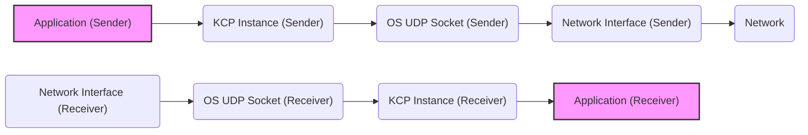
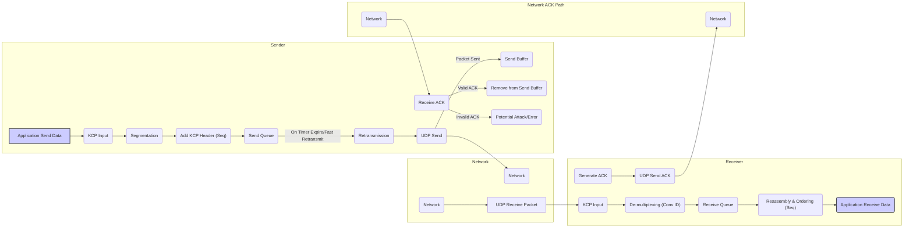

## Project Design Document: KCP - A Fast and Reliable ARQ Protocol (Improved)

**1. Introduction**

This document provides a detailed design overview of the KCP (Fast and Reliable ARQ Protocol) project, as found on GitHub ([https://github.com/skywind3000/kcp](https://github.com/skywind3000/kcp)). KCP is a Transmission Control Protocol (TCP)-like reliable data transfer protocol that operates over User Datagram Protocol (UDP). It aims to provide a faster and more efficient alternative to TCP in scenarios where network conditions are less than ideal, such as high packet loss or fluctuating latency. This document will serve as a foundation for subsequent threat modeling activities, focusing on identifying potential security vulnerabilities and attack vectors.

**2. Goals**

*   Provide a clear and comprehensive overview of KCP's architecture and functionality, specifically for security analysis.
*   Identify the key components and their interactions within the KCP implementation, highlighting aspects relevant to security.
*   Document the detailed data flow through the protocol, including error handling and control mechanisms.
*   Thoroughly outline potential areas of security concern and potential attack surfaces for future threat modeling.

**3. Non-Goals**

*   This document does not provide a line-by-line analysis of the KCP source code.
*   It does not delve into performance benchmarking or comparisons with other protocols unless directly relevant to security considerations.
*   It does not propose specific security mitigations or fixes at the implementation level.
*   It does not cover specific use cases or deployment scenarios in exhaustive detail, although general security implications for common deployments will be discussed.

**4. High-Level Architecture**

KCP operates as a library integrated into applications requiring reliable data transfer over UDP. It resides between the application layer and the operating system's UDP socket interface.

**Key Interactions:**

*   The sending application provides a data stream to the KCP instance.
*   The sending KCP instance processes the data, adding reliability and control information, and interacts with the operating system's UDP socket.
*   The operating system's network interface sends UDP packets onto the network.
*   The network transports the UDP packets.
*   The receiving operating system's network interface receives UDP packets.
*   The receiving KCP instance processes the received packets, ensuring reliability, and delivers the data stream to the receiving application.

**5. Detailed Design**

The KCP implementation centers around the `IKCPCB` (KCP Control Block) structure, which manages the state and parameters of a KCP connection. This structure and the associated logic are critical points for security analysis.

**5.1. Core Components:**

*   **IKCPCB (KCP Control Block):** The central data structure, a prime target for potential exploits if memory corruption vulnerabilities exist. It holds sensitive information:
    *   Connection state (e.g., sending, receiving, congestion window size).
    *   Send and receive windows (determining data flow limits).
    *   Sequence numbers for sent and received packets (crucial for ordering and replay protection).
    *   Acknowledgement numbers (indicating successfully received data).
    *   Timers for retransmission and other operations (potential for timing attacks if predictable).
    *   Configuration parameters (e.g., congestion control algorithm choices, influencing resource usage).
    *   Queues for sending and receiving data (potential for buffer overflow if not handled correctly).
    *   Internal state variables related to congestion control and flow control algorithms.

*   **Send Queue:**  Holds data segments ready for transmission. Vulnerabilities here could lead to denial of service if an attacker can manipulate this queue.

*   **Receive Queue:** Holds received data segments awaiting reassembly and delivery. Potential for resource exhaustion if an attacker sends out-of-order packets to fill this queue.

*   **Send Buffer:** Stores sent data segments awaiting acknowledgement. Important for retransmission logic and a potential target for attacks manipulating acknowledgement packets.

*   **Receive Buffer:** Stores received and acknowledged data segments.

*   **Protocol Logic:** The core algorithms driving KCP's functionality, containing critical decision-making processes:
    *   **Segmentation and Reassembly:** Dividing and merging data. Incorrect handling could lead to data corruption or denial of service.
    *   **Sequence Numbering:** Assigning and validating sequence numbers. Vulnerabilities here could break reliability or allow replay attacks.
    *   **Acknowledgement (ACK):** Generating and processing acknowledgements. Spoofed ACKs could disrupt data flow or lead to incorrect state.
    *   **Retransmission (ARQ):**  Managing timeouts and retransmitting lost segments. Predictable retransmission patterns could be exploited.
    *   **Round-Trip Time (RTT) Estimation:** Calculating network latency. Inaccurate estimations could impact performance or be manipulated for attacks.
    *   **Congestion Control:** Adjusting sending rate based on network conditions. Vulnerabilities could allow an attacker to unfairly consume bandwidth or cause congestion.
    *   **Flow Control:** Preventing buffer overflows at the receiver. If flawed, could lead to crashes or denial of service.
    *   **Fast Retransmit:**  Retransmitting upon receiving duplicate ACKs. Susceptible to attacks generating false duplicate ACKs.
    *   **Fast Recovery:**  Mechanism to recover from packet loss.
    *   **Optionally, Forward Error Correction (FEC):** Generating and using redundant packets. The FEC implementation itself could have vulnerabilities.

**5.2. Data Structures:**

*   **Segment (Packet):** The basic unit of transmission. Its structure is crucial for security analysis:
    *   **Header:** Contains control information. Vulnerabilities in parsing or validating the header could be exploited.
        *   Conversation ID (implicitly managed, application responsibility for uniqueness).
        *   Command Type (e.g., data, acknowledgement, push).
        *   Sequence Number.
        *   Acknowledgement Number.
        *   Window Size.
        *   Timestamp.
        *   Other control flags.
    *   **Data Payload:** The actual application data. Requires encryption at a higher layer for confidentiality.

*   **Acknowledgement Packet:** A specific type of segment confirming data receipt. Forged acknowledgement packets are a significant threat.

**6. Data Flow**

The following flowchart details the data flow, including acknowledgement and retransmission paths, which are critical for understanding potential vulnerabilities.

**Detailed Steps (Sender - Sending Data):**

1. **Application Send Data ("Application Send Data"):** The application provides data to the KCP instance.
2. **KCP Input ("KCP Input"):** KCP receives the data.
3. **Segmentation ("Segmentation"):** Data is divided into segments.
4. **Add KCP Header (Seq) ("Add KCP Header (Seq)"):** KCP header, including a sequence number, is added.
5. **Send Queue ("Send Queue"):** Segments are queued for sending.
6. **UDP Send ("UDP Send"):** Segments are sent as UDP packets.
7. **Send Buffer ("Send Buffer"):** Sent segments are stored awaiting acknowledgement.

**Detailed Steps (Receiver - Receiving Data):**

1. **UDP Receive Packet ("UDP Receive Packet"):** UDP packet arrives.
2. **KCP Input ("KCP Input"):** KCP receives the packet.
3. **De-multiplexing (Conv ID) ("De-multiplexing (Conv ID)"):**  KCP identifies the connection (application responsibility for unique IDs).
4. **Receive Queue ("Receive Queue"):** Packets are placed in the receive queue.
5. **Reassembly & Ordering (Seq) ("Reassembly & Ordering (Seq)"):** Packets are reordered based on sequence numbers.
6. **Application Receive Data ("Application Receive Data"):** Reassembled data is delivered.
7. **Generate ACK ("Generate ACK"):** An acknowledgement packet is created.
8. **UDP Send ACK ("UDP Send ACK"):** The ACK is sent.

**Acknowledgement Flow:**

1. **UDP Send ACK ("UDP Send ACK")** (Receiver).
2. **Network ("Network ACK Path")**.
3. **Receive ACK ("Receive ACK")** (Sender).
4. **Valid ACK ("Valid ACK")**:  If the ACK is valid, the corresponding segment is removed from the **Send Buffer ("Remove from Send Buffer")**.
5. **Invalid ACK ("Invalid ACK")**: If the ACK is invalid (e.g., wrong sequence number), it could indicate an attack or error.

**Retransmission Flow:**

1. **Send Queue ("Send Queue")**.
2. **On Timer Expire/Fast Retransmit ("On Timer Expire/Fast Retransmit")**: If an acknowledgement isn't received within the timeout or duplicate ACKs are received.
3. **Retransmission ("Retransmission")**: The segment is re-sent via **UDP Send ("UDP Send")**.

**7. Security Considerations**

KCP, operating over UDP, inherently lacks built-in security features. Applications using KCP must implement security measures at higher layers.

*   **Lack of Inherent Encryption:** KCP transmits data in plaintext. This makes it vulnerable to:
    *   **Eavesdropping:** Attackers can intercept and read the transmitted data.
    *   **Traffic Analysis:** Attackers can analyze communication patterns, even without decrypting the content, to gain information.
    *   **Mitigation:**  Employ application-layer encryption protocols like TLS/SSL or use libraries like libsodium to encrypt data before passing it to KCP.

*   **Missing Authentication and Integrity Mechanisms:** KCP doesn't verify the identity of the sender or the integrity of the data:
    *   **Spoofing:** Attackers can send packets pretending to be a legitimate endpoint, potentially injecting malicious data or disrupting communication.
    *   **Data Tampering:** Attackers can modify packets in transit without the receiver being able to detect the changes.
    *   **Mitigation:** Implement mutual authentication using pre-shared keys, digital signatures, or other authentication protocols. Use message authentication codes (MACs) or digital signatures to ensure data integrity.

*   **Vulnerability to Replay Attacks:** Attackers can capture valid KCP packets and resend them later:
    *   This can cause duplicate actions or data corruption if not handled properly at the application level.
    *   **Mitigation:** Implement mechanisms like timestamps, nonces (unique, one-time values), or strictly increasing sequence numbers at the application layer to detect and discard replayed packets. KCP's own sequence numbers help with ordering but aren't sufficient for robust replay protection against a malicious actor.

*   **Susceptibility to Denial of Service (DoS) Attacks:**
    *   **UDP Flooding:** Attackers can overwhelm the receiver with a large volume of UDP packets, consuming resources and making the service unavailable. KCP's reliability mechanisms might exacerbate this by triggering retransmissions.
    *   **Amplification Attacks:** Attackers can spoof the sender's address and send small requests to a KCP server, causing it to send larger responses to the spoofed victim.
    *   **Resource Exhaustion:** Attackers might send carefully crafted packets to exhaust the receiver's resources (e.g., filling receive queues, triggering excessive retransmissions).
    *   **Mitigation:** Implement rate limiting, traffic filtering, and anomaly detection mechanisms at the network and application layers. Properly configure KCP's parameters to limit resource consumption.

*   **Man-in-the-Middle (MitM) Attacks:** Without encryption and authentication, attackers can intercept, modify, or drop KCP packets:
    *   This allows them to eavesdrop, tamper with data, or disrupt communication.
    *   **Mitigation:**  End-to-end encryption and authentication are crucial to protect against MitM attacks.

*   **Potential Implementation Vulnerabilities:** Bugs or flaws in the KCP library itself could be exploited:
    *   **Buffer Overflows:**  Improper handling of data sizes could lead to buffer overflows, allowing attackers to execute arbitrary code.
    *   **Integer Overflows:**  Arithmetic errors could lead to unexpected behavior or vulnerabilities.
    *   **Logic Errors:** Flaws in the protocol logic could be exploited to bypass security mechanisms or cause crashes.
    *   **Mitigation:** Regular security audits, code reviews, and penetration testing of the KCP implementation are essential. Keep the KCP library updated to patch known vulnerabilities.

**8. Deployment Considerations**

Security considerations are paramount when deploying applications using KCP.

*   **Public Internet Deployments:**  Applications directly exposed to the public internet require robust security measures:
    *   **Mandatory Encryption:**  Always use application-layer encryption (e.g., TLS) for confidentiality.
    *   **Strong Authentication:** Implement mutual authentication to verify the identity of both parties.
    *   **DoS Protection:** Employ network-level and application-level DoS mitigation techniques.
    *   **Regular Security Updates:** Keep the KCP library and any supporting libraries updated.

*   **Private Network Deployments:** While the threat landscape might be lower, security is still important:
    *   **Consider Encryption:** Even within a private network, encryption can protect against internal threats.
    *   **Authentication:**  Implement authentication to control access and prevent unauthorized communication.
    *   **Network Segmentation:** Isolate KCP traffic within a secure network segment.

*   **Specific Use Cases:**
    *   **Online Games:**  Focus on preventing cheating and protecting player data. Encryption and authentication are crucial.
    *   **Real-time Communication:** Secure media streams using SRTP or similar protocols in conjunction with KCP.
    *   **IoT Devices:**  Consider the resource constraints of IoT devices when implementing security measures. Lightweight encryption and authentication protocols might be necessary.

**9. Future Considerations (for Threat Modeling)**

*   **Detailed Analysis of KCP Configuration Options:** Investigate the security implications of specific KCP parameters, such as:
    *   `nodelay`, `interval`, `resend`, `nc`: How do these parameters affect the protocol's resilience to attacks?
    *   Congestion control algorithm choices: Are some algorithms more susceptible to manipulation or abuse?
    *   FEC settings:  Could vulnerabilities in the FEC implementation be exploited?

*   **Scrutinize KCP's Random Number Generation:** If KCP uses randomness for any security-sensitive operations (e.g., initial sequence numbers, although unlikely), assess the quality and predictability of the random number generator.

*   **Evaluate Side-Channel Attacks:**  Consider potential side-channel attacks, such as timing attacks, that might leak information about the KCP implementation or the data being transmitted.

*   **Analyze Error Handling and Logging:**  How does KCP handle errors? Are error messages informative enough for debugging but not so verbose that they leak sensitive information to attackers? Are security-related events logged appropriately?

*   **Investigate Potential for Protocol Confusion Attacks:** Could an attacker trick a KCP endpoint into misinterpreting traffic from a different protocol?

This improved design document provides a more detailed and security-focused overview of KCP, serving as a stronger foundation for comprehensive threat modeling activities. It highlights potential vulnerabilities and attack vectors that need careful consideration when deploying applications using this protocol.
