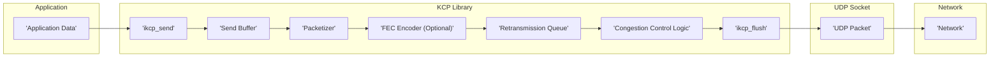
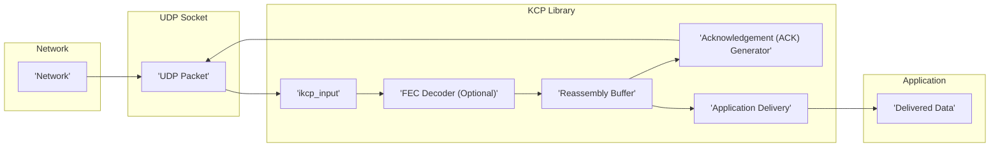

## Project Design Document: KCP - A Fast and Reliable ARQ Protocol (Improved)

**1. Introduction**

This document provides an enhanced design overview of the KCP (Fast and Reliable ARQ Protocol) library, as found in the GitHub repository [https://github.com/skywind3000/kcp](https://github.com/skywind3000/kcp). This improved document aims to provide a more detailed articulation of the architecture, components, and data flow of KCP to facilitate more effective threat modeling activities. It maintains a focus on the core functionality and design principles of the library itself, independent of specific applications utilizing it.

**2. Project Goals and Scope**

* **Goal:** To provide a comprehensive and detailed design overview of the KCP library specifically tailored for security analysis and threat modeling.
* **Scope:** This document covers the core components, their interactions, and the data flow within the KCP library. It delves deeper into the protocol logic, data structures, and the lifecycle of packets within the system. It explicitly excludes specific implementations or applications using KCP, focusing solely on the library's internal workings.

**3. System Overview**

KCP is a reliable UDP-based protocol engineered for low-latency and high-throughput communication. It implements a sophisticated Automatic Repeat-reQuest (ARQ) mechanism layered on top of UDP to deliver reliable, ordered data packets. Key features include:

* **Reliable Transmission:** Guarantees the delivery of data packets through retransmissions.
* **Ordered Delivery:** Ensures packets are delivered to the application in the exact order they were sent.
* **Congestion Control:** Dynamically adjusts the transmission rate based on network conditions to prevent congestion and optimize throughput.
* **Flow Control:** Prevents the sender from overwhelming the receiver's buffer capacity.
* **Fast Retransmission:** Employs techniques like duplicate ACKs to quickly detect and retransmit lost packets.
* **Forward Error Correction (FEC) (Optional):**  Offers the option to encode packets with redundant data, enabling the receiver to reconstruct lost packets without requiring retransmission, improving resilience to packet loss.

**4. Architectural Design**

The KCP library can be conceptually decomposed into the following interconnected components:

* **KCP Core Logic (ikcp object):** This is the central processing unit of the library. It encapsulates the ARQ protocol logic, managing:
    * **State Management:** Tracks the current state of the connection (though UDP is connectionless, KCP maintains internal state).
    * **Sequence Number Management:** Assigns and tracks sequence numbers for sent packets.
    * **Acknowledgment Handling:** Processes incoming acknowledgment (ACK) packets to confirm successful delivery.
    * **Retransmission Logic:** Determines when and which packets need to be retransmitted based on timeouts and duplicate ACKs.
    * **Window Management:** Controls the sending and receiving windows for flow control.
* **Input Interface (`ikcp_input`):** This function serves as the entry point for incoming UDP packets. It performs initial processing, including:
    * **Packet Parsing:**  Extracts relevant information from the UDP payload, such as sequence numbers and acknowledgment numbers.
    * **Duplicate Packet Detection:** Identifies and discards duplicate packets.
    * **Acknowledgment Processing:** Updates the sender's state based on received ACKs.
* **Output Interface (`ikcp_send`, `ikcp_flush`):** These functions handle the transmission of data:
    * **`ikcp_send`:** Accepts data from the application and adds it to the send buffer.
    * **`ikcp_flush`:**  Packetizes data from the send buffer into KCP segments, applies congestion control logic, and sends the resulting UDP packets.
* **Timer Management (`ikcp_update`, internal timers):** KCP relies on timers for critical operations:
    * **Retransmission Timer:** Triggers retransmission of unacknowledged packets after a timeout period.
    * **Probe Timer:** Used for window probing when the receiver's window is closed.
    * **Internal Clock:**  Used to track time for timeout calculations. The `ikcp_update` function is responsible for advancing the internal clock and triggering timer events.
* **Congestion Window Management (within Core Logic):** This mechanism dynamically adjusts the number of packets the sender can have in flight:
    * **Slow Start:**  Increases the congestion window gradually at the beginning of a connection or after a congestion event.
    * **Congestion Avoidance:** Increases the congestion window more conservatively when the window is larger.
    * **Fast Retransmit/Fast Recovery:**  Reacts to packet loss indicated by duplicate ACKs by quickly retransmitting the lost packet and reducing the congestion window.
* **Retransmission Queue (internal to Core Logic):** Stores copies of sent packets that have not yet been acknowledged. This allows for retransmission if necessary.
* **Send Buffer (internal to Core Logic):**  Temporarily holds data received from the application before it is packetized and sent.
* **Receive Buffer (internal to Core Logic):** Stores received packets that are out of order, awaiting the arrival of preceding packets before they can be delivered to the application.
* **FEC Module (Optional, within Core Logic):** If enabled, this module performs:
    * **Encoding:** Adds redundant parity packets to the stream of outgoing data packets.
    * **Decoding:** Uses the parity packets to reconstruct lost data packets on the receiving end.

**5. Data Flow**

The following diagrams illustrate the detailed data flow for sending and receiving data using the KCP library.

**5.1. Sending Data (Detailed)**

* **'Application Data'**: The application provides data to be sent by calling `ikcp_send`.
* **'ikcp_send'**: The `ikcp_send` function appends the data to the 'Send Buffer'.
* **'Send Buffer'**: Data is held in the 'Send Buffer' until `ikcp_flush` is called.
* **'Packetizer'**: When `ikcp_flush` is called, the 'Packetizer' segments the data from the 'Send Buffer' into KCP segments, assigning sequence numbers.
* **'FEC Encoder (Optional)'**: If FEC is enabled, the 'FEC Encoder' generates and adds redundant parity packets.
* **'Retransmission Queue'**:  The generated KCP segments (and FEC parity packets, if applicable) are added to the 'Retransmission Queue'.
* **'Congestion Control Logic'**: The 'Congestion Control Logic' determines if the packets can be sent based on the current congestion window.
* **'ikcp_flush'**:  The `ikcp_flush` function constructs UDP packets containing the KCP segments and sends them via the UDP socket.
* **'UDP Packet'**: The data is transmitted as a 'UDP Packet'.
* **'Network'**: The 'UDP Packet' travels across the 'Network'.

**5.2. Receiving Data (Detailed)**

* **'Network'**: A 'UDP Packet' arrives from the 'Network'.
* **'UDP Packet'**: The 'UDP Packet' is received by the UDP socket.
* **'ikcp_input'**: The `ikcp_input` function processes the incoming 'UDP Packet', parsing the KCP segment.
* **'FEC Decoder (Optional)'**: If FEC is enabled, the 'FEC Decoder' attempts to reconstruct any lost data packets using the parity packets.
* **'Reassembly Buffer'**:  Received KCP segments are placed in the 'Reassembly Buffer'. Out-of-order segments are held until missing preceding segments arrive.
* **'Acknowledgement (ACK) Generator'**: The 'Acknowledgement (ACK) Generator' creates ACK packets to inform the sender about received segments. These ACKs are sent back via the UDP socket (implicitly through a subsequent `ikcp_flush` call).
* **'Application Delivery'**: Once a sequence of segments is complete and in order in the 'Reassembly Buffer', the data is passed to the 'Application Delivery' mechanism.
* **'Delivered Data'**: The application receives the 'Delivered Data'.

**6. Key Data Structures (Detailed)**

* **`struct IKCPCB`:** The core data structure representing a KCP control block. It contains:
    * **`snd_una`:**  The sequence number of the oldest unacknowledged packet.
    * **`snd_nxt`:** The next sequence number to be assigned to a new packet.
    * **`rcv_nxt`:** The expected sequence number of the next incoming packet.
    * **`ts_probe`:** Timestamp for the next window probe.
    * **`cwnd`:** The current congestion window size.
    * **`rmt_wnd`:** The receiver's advertised window size.
    * **`snd_queue`:** A list of segments waiting to be sent.
    * **`rcv_queue`:** A list of received segments waiting to be delivered.
    * **`acklist`:** A list of pending acknowledgments to be sent.
    * **`buffer`:** The send buffer.
    * **`frags`:** The number of fragmented packets in the send buffer.
    * **Timers:** Variables related to retransmission and probe timers.
* **`struct ISEG`:** Represents a single KCP segment (packet). Contains:
    * **`conv`:** Conversation identifier.
    * **`cmd`:** Command type (e.g., PUSH, ACK).
    * **`frg`:** Fragmentation offset.
    * **`wnd`:** Receiver window size.
    * **`ts`:** Timestamp.
    * **`sn`:** Sequence number.
    * **`una`:** Acknowledgment number.
    * **`len`:** Data length.
    * **`data`:** The actual data payload.

**7. Security Considerations (More Specific)**

This section provides more specific security considerations based on the detailed design and data flow.

* **UDP Vulnerabilities:** As KCP operates over UDP, it inherits UDP's inherent lack of connection establishment and inherent security mechanisms. This makes it vulnerable to:
    * **Source IP Spoofing:** Attackers can send packets with forged source IP addresses, potentially disrupting communication or launching amplification attacks. This is relevant at the 'UDP Socket' and 'Network' layers.
    * **Port Scanning:**  The UDP ports used by KCP are susceptible to scanning, potentially revealing the presence of a KCP service.
* **DoS Attacks Targeting `ikcp_input`:**  Malicious actors can flood the receiver with invalid or malformed UDP packets intended for `ikcp_input`. This could consume processing resources and potentially lead to denial of service.
* **Replay Attacks Exploiting Sequence Numbers:** While KCP uses sequence numbers, vulnerabilities could arise if the sequence number space is predictable or if the implementation doesn't handle wrapping correctly. Attackers could potentially replay captured packets. This is relevant to the 'ikcp_input' and 'Reassembly Buffer' components.
* **ACK Spoofing and Manipulation:** Attackers could forge ACK packets to:
    * **Prematurely Acknowledge Packets:**  Potentially causing the sender to advance its window incorrectly.
    * **Trigger Fast Retransmit:** Sending duplicate ACKs for packets that haven't been lost. This impacts the 'Acknowledgement (ACK) Generator' and 'Congestion Control Logic'.
* **Congestion Control Exploitation:**  Attackers might try to manipulate the congestion control mechanism to unfairly gain bandwidth or cause congestion for other users. This relates to the 'Congestion Control Logic'.
* **Vulnerabilities in FEC Implementation (If Enabled):**  If the optional FEC mechanism is used, vulnerabilities in the encoding or decoding algorithms could be exploited to inject malicious data or cause denial of service. This is specific to the 'FEC Encoder (Optional)' and 'FEC Decoder (Optional)' components.
* **Integer Overflows/Underflows in Sequence Numbers and Window Sizes:**  Careless implementation could lead to integer overflows or underflows in sequence number calculations, window size management, or other critical parameters, potentially leading to unpredictable behavior or security vulnerabilities within the 'KCP Core Logic'.
* **Resource Exhaustion through Unacknowledged Packets:** An attacker could send a large number of packets without ever acknowledging them, potentially causing the sender's 'Retransmission Queue' to grow indefinitely, leading to memory exhaustion.

**8. Deployment Considerations**

KCP is typically deployed as a library integrated into applications requiring reliable, low-latency communication over UDP. Specific deployment scenarios can introduce additional security considerations. For example:

* **Publicly Accessible Services:**  Applications using KCP exposed to the public internet require careful consideration of DoS mitigation and potential attack vectors.
* **Peer-to-Peer Networks:** In P2P scenarios, authenticating peers becomes crucial to prevent malicious actors from injecting false data or disrupting communication.

**9. Future Considerations**

* **Formal Security Audit:** A comprehensive security audit by independent experts is recommended to identify potential vulnerabilities.
* **Consideration of Encryption:**  While KCP itself doesn't provide encryption, integrating it with encryption libraries (e.g., using a secure channel established before KCP communication) should be considered for sensitive data.
* **Standardized Protocol Specification:** A more formal and publicly available specification of the KCP protocol would aid in interoperability and security analysis by the wider community.
* **Fuzzing and Vulnerability Testing:**  Employing fuzzing techniques and other vulnerability testing methodologies can help uncover potential weaknesses in the implementation.

This improved document provides a more granular understanding of the KCP library's design, offering a stronger foundation for conducting a thorough threat model and implementing appropriate security measures.