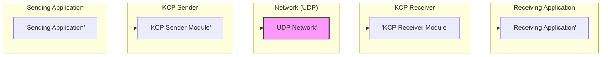

# Project Design Document: KCP (Fast and Reliable ARQ Protocol)

**Version:** 1.1
**Date:** 2023-10-27
**Author:** AI Expert

## 1. Introduction

This document provides a detailed design overview of the KCP (Fast and Reliable ARQ Protocol) project, as found on GitHub: [https://github.com/skywind3000/kcp](https://github.com/skywind3000/kcp). KCP is a reliable UDP-based protocol designed to provide faster and more stable network communication, especially in environments with high packet loss or network congestion. It implements a custom Automatic Repeat reQuest (ARQ) algorithm, congestion control, and forward error correction (FEC) mechanisms to improve network throughput and reduce latency compared to standard TCP in certain scenarios.

This design document aims to serve as a foundation for threat modeling activities. It outlines the system architecture, data flow, security considerations, and deployment aspects of KCP, enabling security professionals to identify potential vulnerabilities and design appropriate security mitigations.

### 1.1. Project Goals

The primary goals of the KCP project are:

* **Reliable Data Transmission:** Ensure data is delivered accurately and in order, even over unreliable networks, using ARQ and FEC.
* **High Speed and Low Latency:** Minimize transmission delays and maximize throughput, especially compared to TCP in lossy networks, through optimized congestion control and reduced overhead.
* **Efficiency:** Optimize bandwidth usage and minimize overhead by using UDP as the base protocol and efficient header design.
* **Simplicity and Ease of Integration:** Provide a lightweight and easy-to-use library with a simple API that can be integrated into various applications.
* **Cross-Platform Compatibility:** Support multiple operating systems and architectures, ensuring broad applicability.
* **Configurability:** Offer tunable parameters to adapt KCP's behavior to different network conditions and application requirements (e.g., congestion control algorithm, FEC ratio, window size).

### 1.2. Document Scope

This document covers the following aspects of the KCP project:

* High-level system architecture and components.
* Detailed data flow within the KCP protocol, including key mechanisms like windowing, retransmission, and congestion control.
* Security considerations and potential vulnerabilities, along with mitigation strategies.
* Typical deployment scenarios and their security implications.
* Technology stack and dependencies.

This document focuses on the design and architecture of KCP itself and its integration into applications. It does not delve into the specific code implementation details of the KCP library but provides sufficient architectural context for security analysis.

## 2. System Architecture

KCP operates as a transport layer protocol, typically sitting above UDP and below the application layer. It provides a reliable, ordered data stream abstraction on top of the unreliable UDP datagram service. KCP incorporates features like sliding window, selective repeat retransmission, and congestion control algorithms (often resembling TCP's but with optimizations for UDP).  Some implementations also include Forward Error Correction (FEC) to proactively recover from packet loss.

### 2.1. High-Level Architecture Diagram

**Components:**

* **Sending Application:** The application that wants to send data reliably over the network. It interacts with the KCP Sender Module through a defined API (e.g., `send()`, `update()`).
* **KCP Sender Module:** This module is the core of the KCP protocol on the sending side. It performs:
    * **Segmentation:** Divides application data into segments based on Maximum Transmission Unit (MTU) and KCP configuration.
    * **Sequence Numbering:** Assigns unique sequence numbers to each segment for ordered delivery and reassembly.
    * **Sliding Window:** Manages a sending window to control the number of outstanding packets and optimize throughput.
    * **Retransmission Timer & Selective Repeat ARQ:** Implements timers for each segment and uses Selective Repeat ARQ to retransmit only lost packets, improving efficiency compared to Go-Back-N ARQ.
    * **Congestion Control:** Employs congestion control algorithms (e.g., TCP-like congestion control, or more aggressive algorithms) to adapt sending rate to network conditions, preventing congestion and ensuring fairness.
    * **Flow Control:** Manages the sending rate based on receiver's advertised window size to prevent receiver buffer overflow.
    * **Forward Error Correction (FEC) (Optional):**  Generates and sends redundant FEC packets to allow the receiver to recover from some packet loss without retransmission.
    * **UDP Encapsulation:** Encapsulates KCP segments into UDP packets for network transmission.
* **UDP Network:** The underlying unreliable network layer providing datagram delivery. Packet loss, reordering, and duplication are inherent characteristics of UDP networks.
* **KCP Receiver Module:** This module is the counterpart to the sender, implementing KCP on the receiving side. It performs:
    * **UDP De-encapsulation:** Extracts KCP segments from received UDP packets.
    * **Sequence Verification & Reordering:** Checks sequence numbers to detect missing or out-of-order packets and reorders them correctly.
    * **Reassembly:** Reassembles segments into the original data stream, handling potential packet loss and reordering.
    * **Acknowledgment (ACK) & Selective Acknowledgment (SACK) Generation:** Sends ACKs for received packets, including Selective ACKs (SACKs) to inform the sender about specific packets received out of order, improving retransmission efficiency.
    * **Flow Control & Receiver Window Advertisement:** Advertises the receiver window size to the sender, controlling the sender's transmission rate.
    * **FEC Decoding (Optional):** If FEC is used, attempts to recover lost data packets using received FEC packets.
* **Receiving Application:** The application that receives the reliable, ordered data stream from the KCP Receiver Module through a defined API (e.g., `recv()`, `update()`).

### 2.2. Component Interaction

1. **Data Transmission Request:** The Sending Application calls the KCP Sender Module's `send()` function to transmit data.
2. **KCP Processing (Sender):** The KCP Sender Module processes the data:
    * **Segmentation, Sequence Numbering, Windowing, Retransmission Timer, Congestion Control, Flow Control, FEC (if enabled), UDP Encapsulation.** These steps are performed as described in section 2.1. The sender maintains a sending window, tracks outstanding packets, and manages retransmission timers. Congestion control algorithms dynamically adjust the sending rate based on network feedback (ACKs, packet loss).
3. **UDP Transmission:** The KCP Sender Module sends UDP packets over the network using the underlying UDP socket.
4. **UDP Reception:** The UDP Network delivers UDP packets to the KCP Receiver Module. Network impairments like packet loss, reordering, or duplication can occur.
5. **KCP Processing (Receiver):** The KCP Receiver Module processes received UDP packets:
    * **UDP De-encapsulation, Sequence Verification, Reordering, Reassembly, ACK/SACK Generation, Flow Control Feedback, FEC Decoding (if enabled).** These steps are performed as described in section 2.1. The receiver maintains a receiving window, reassembles data, and generates ACKs/SACKs to provide feedback to the sender.
6. **Data Delivery:** The KCP Receiver Module delivers the ordered and reliable data stream to the Receiving Application through its `recv()` function.
7. **Feedback Loop:** ACKs and SACKs from the receiver are received by the sender. This feedback is crucial for:
    * **Congestion Control:** Adjusting the congestion window and sending rate.
    * **Retransmission Management:** Confirming successful packet delivery and triggering retransmissions for lost packets.
    * **Flow Control:**  The sender respects the receiver's advertised window size to avoid overwhelming it.

## 3. Data Flow

The data flow within KCP, highlighting key mechanisms, is as follows:

```mermaid
graph LR
    subgraph "Sender Side"
        SA["'Sending Application Data'"] --> KS_Seg["'KCP Segmentation'"];
        KS_Seg --> KS_Seq["'Sequence Numbering'"];
        KS_Seq --> KS_Window["'Sliding Window Management'"];
        KS_Window --> KS_Retrans["'Retransmission Handling (Selective Repeat)'"];
        KS_Retrans --> KS_Congest["'Congestion Control (e.g., TCP-like)'"];
        KS_Congest --> KS_Flow["'Flow Control (Receiver Window)'"];
        KS_Flow --> KS_FEC["'FEC Encoding (Optional)'"];
        KS_FEC --> KS_UDPEnc["'UDP Encapsulation'"];
        KS_UDPEnc --> Network_Send["'Network (UDP) Send'"];
    end
    subgraph "Network"
        Network_Send --> Network_Channel["'Unreliable Network Channel'"];
        Network_Channel --> Network_Receive["'Network (UDP) Receive'"];
    end
    subgraph "Receiver Side"
        Network_Receive --> KR_UDEEnc["'UDP De-encapsulation'"];
        KR_UDEEnc --> KR_SeqVer["'Sequence Verification & Reordering'"];
        KR_SeqVer --> KR_Reassem["'Reassembly'"];
        KR_Reassem --> KR_ACKSACK["'ACK/SACK Generation (Selective ACKs)'"];
        KR_ACKSACK --> KR_FlowCtrl["'Flow Control Advertisement (Receiver Window)'"];
        KR_FlowCtrl --> Network_Feedback["'Network (UDP) Feedback (ACKs/SACKs)'"];
        KR_Reassem --> KR_FECDecode["'FEC Decoding (Optional)'"];
        KR_FECDecode --> RA["'Receiving Application Data'"];
    end
    Network_Feedback --> KS_Congest;
    Network_Feedback --> KS_Retrans;
    style Network_Channel fill:#f9f,stroke:#333,stroke-width:2px
```

**Data Flow Steps (Detailed):**

1. **Sending Application Data:** Data originates from the sending application via the KCP `send()` API.
2. **KCP Segmentation:** Data is divided into segments, considering MTU and configured segment size.
3. **Sequence Numbering:** Each segment is assigned a unique sequence number for ordering and loss detection.
4. **Sliding Window Management:** The sender manages a sliding window, limiting the number of unacknowledged packets in flight to optimize throughput and manage network congestion.
5. **Retransmission Handling (Selective Repeat):**  Timers are set for each segment. If an ACK is not received within the timeout, and SACKs indicate loss, only the lost segments are retransmitted (Selective Repeat ARQ). Fast retransmit mechanisms might also be employed based on duplicate ACKs.
6. **Congestion Control (e.g., TCP-like):** KCP implements congestion control algorithms, often inspired by TCP (like Reno or Cubic), to dynamically adjust the sending rate based on network congestion signals (packet loss, round-trip time). This prevents network collapse and ensures fair bandwidth sharing.
7. **Flow Control (Receiver Window):** The sender respects the receiver's advertised window size. The receiver window indicates the buffer space available at the receiver. The sender will not send more data than the receiver window allows, preventing receiver buffer overflow.
8. **FEC Encoding (Optional):** If FEC is enabled, redundant FEC packets are generated based on the data segments. These FEC packets can be used by the receiver to recover from packet loss without retransmission, improving performance in high-loss environments.
9. **UDP Encapsulation:** KCP segments (and FEC packets, if used) are encapsulated within UDP packets.
10. **Network (UDP) Send:** UDP packets are sent over the network.
11. **Unreliable Network Channel:** UDP packets traverse the network, which may introduce packet loss, reordering, or duplication.
12. **Network (UDP) Receive:** UDP packets are received at the destination.
13. **UDP De-encapsulation:** KCP segments (or FEC packets) are extracted from UDP packets.
14. **Sequence Verification & Reordering:** Sequence numbers are checked to ensure correct order and detect missing packets. Out-of-order packets are buffered and reordered.
15. **Reassembly:** Segments are reassembled into the original data stream.
16. **ACK/SACK Generation (Selective ACKs):** ACKs are generated for successfully received packets. Selective ACKs (SACKs) are generated to inform the sender about specific out-of-order packets received, allowing for more efficient retransmission. Delayed ACKs might be used to reduce ACK overhead.
17. **Flow Control Advertisement (Receiver Window):** The receiver advertises its current receiver window size to the sender in ACK packets, providing flow control feedback.
18. **FEC Decoding (Optional):** If FEC is enabled, the receiver attempts to use received FEC packets to recover any lost data packets. If successful, retransmission of those lost data packets is avoided.
19. **Network (UDP) Feedback (ACKs/SACKs):** ACKs and SACKs are sent back to the sender over UDP.
20. **Receiving Application Data:** The reassembled, ordered, and reliable data stream is delivered to the receiving application via the KCP `recv()` API.
21. **Feedback Loop (Congestion Control & Retransmission):** ACKs and SACKs received by the sender are used to update the congestion window, adjust sending rate, and manage retransmissions.

## 4. Security Considerations

KCP, while enhancing reliability and speed over UDP, has inherent security considerations. Applications using KCP must address these to ensure overall system security.

### 4.1. Confidentiality

* **KCP itself does not provide encryption.** Data transmitted via KCP is in plaintext.
* **Vulnerability:** Data transmitted over KCP is vulnerable to eavesdropping and interception by network attackers. This can lead to unauthorized access to sensitive information.
* **Mitigation:**
    * **Application Layer Encryption:** Implement robust encryption at the application layer using protocols like TLS/SSL, DTLS (for UDP-based applications), or application-specific encryption libraries (e.g., libsodium, OpenSSL). This is the **primary and recommended mitigation**.
    * **VPN/Tunneling:** Deploy KCP within a VPN or secure tunnel (e.g., IPsec, WireGuard) to encrypt all traffic between endpoints. This provides network-level encryption but might add overhead.

### 4.2. Integrity

* **KCP provides data integrity through checksums (CRC32 or similar).** It detects data corruption during transmission.
* **Strength:** Checksums protect against accidental errors but are **not cryptographically secure** against malicious manipulation.
* **Vulnerability:** While checksums detect accidental corruption, they are vulnerable to targeted attacks where an attacker could manipulate data and recalculate the checksum, bypassing integrity checks.
* **Mitigation:**
    * **Cryptographic Integrity Checks (HMAC):** For high-security applications, implement stronger cryptographic integrity checks at the application layer using Hash-based Message Authentication Codes (HMACs) with strong cryptographic hash functions (e.g., SHA-256). This provides robust protection against malicious data tampering.
    * **End-to-End Integrity:** Ensure integrity checks are performed end-to-end, covering the entire data path from sender application to receiver application, not just within KCP itself.

### 4.3. Availability

* **KCP improves availability in lossy networks but is still susceptible to DoS attacks.**
* **Vulnerability:** KCP endpoints can be targets of Denial of Service (DoS) and Distributed Denial of Service (DDoS) attacks. Attackers can flood KCP endpoints with UDP packets, overwhelming resources (CPU, bandwidth, memory), and disrupting service availability for legitimate users. Amplification attacks targeting UDP are also a concern.
* **Mitigation:**
    * **Rate Limiting & Traffic Shaping:** Implement rate limiting on KCP endpoints to restrict incoming packet rates from specific sources or in total. Traffic shaping can prioritize legitimate traffic and de-prioritize or drop suspicious traffic.
    * **Firewalling & Access Control Lists (ACLs):** Use firewalls and ACLs to filter out malicious traffic based on source IP addresses, ports, or traffic patterns. Implement strict ingress filtering to allow only necessary traffic.
    * **Resource Management & Capacity Planning:** Ensure sufficient resources (CPU, memory, bandwidth) are allocated to KCP endpoints to handle expected legitimate traffic and withstand a reasonable level of attack. Implement resource monitoring and auto-scaling if deployed in cloud environments.
    * **DDoS Mitigation Services:** For internet-facing KCP endpoints, consider using specialized DDoS mitigation services offered by cloud providers or security vendors. These services can detect and mitigate large-scale DDoS attacks.
    * **Connection Limits:** Limit the number of concurrent KCP connections to prevent resource exhaustion from excessive connection attempts.

### 4.4. Authentication and Authorization

* **KCP itself does not provide authentication or authorization.** It does not verify identities or control access.
* **Vulnerability:** Without authentication, KCP endpoints are vulnerable to unauthorized access, spoofing, and man-in-the-middle (MITM) attacks. Without authorization, there's no control over who can send or receive data, potentially leading to data breaches or unauthorized actions.
* **Mitigation:**
    * **Application Layer Authentication:** Implement strong authentication mechanisms at the application layer. This could include:
        * **Mutual Authentication:** Verifying the identity of both sender and receiver using methods like pre-shared keys, certificates (e.g., X.509), or password-based authentication.
        * **Token-Based Authentication:** Using tokens (e.g., JWT, OAuth 2.0 tokens) to authenticate users or applications.
    * **Authorization Mechanisms:** Implement authorization controls to restrict access to data and functionalities based on authenticated identities. Use role-based access control (RBAC) or attribute-based access control (ABAC) to manage permissions.
    * **Secure Key Exchange:** If using pre-shared keys or symmetric encryption, ensure secure key exchange out-of-band. For public-key cryptography, use secure certificate management practices.

### 4.5. Protocol-Specific Vulnerabilities

* **Implementation Flaws:** Vulnerabilities can exist in the KCP library code itself due to coding errors, design flaws, or improper handling of edge cases.
* **Vulnerability:** Exploitable vulnerabilities in the KCP library could lead to remote code execution (RCE), information disclosure, buffer overflows, or DoS attacks.
* **Mitigation:**
    * **Regular Security Audits & Code Reviews:** Conduct regular security audits and code reviews of the KCP library by security experts to identify and fix potential vulnerabilities.
    * **Static & Dynamic Analysis:** Use static analysis tools and dynamic analysis/fuzzing techniques to automatically detect potential code defects and vulnerabilities.
    * **Vulnerability Scanning & Patch Management:** Regularly scan for known vulnerabilities in the KCP library and its dependencies. Keep the KCP library updated with the latest security patches and bug fixes from the project maintainers or trusted sources.
    * **Input Validation & Sanitization:** Implement robust input validation and sanitization within the KCP implementation to prevent injection vulnerabilities and handle malformed packets gracefully.
    * **Memory Safety:** Utilize memory-safe programming practices and tools to mitigate memory-related vulnerabilities like buffer overflows.

### 4.6. Security Summary Table

| Threat Category        | Threat                                     | Vulnerability                               | Mitigation Strategies                                                                                                |
|------------------------|---------------------------------------------|---------------------------------------------|----------------------------------------------------------------------------------------------------------------------|
| **Confidentiality**    | Eavesdropping, Interception                | Lack of encryption in KCP                   | Application Layer Encryption (TLS/SSL, DTLS), VPN/Tunneling                                                        |
| **Integrity**          | Data Tampering, Manipulation               | Checksums not cryptographically secure      | Cryptographic Integrity Checks (HMAC), End-to-End Integrity                                                        |
| **Availability**       | DoS, DDoS Attacks                          | UDP-based protocol, resource exhaustion     | Rate Limiting, Firewalling, Resource Management, DDoS Mitigation Services, Connection Limits                             |
| **Authentication**     | Unauthorized Access, Spoofing, MITM         | Lack of authentication in KCP               | Application Layer Authentication (Mutual Auth, Tokens), Secure Key Exchange                                         |
| **Authorization**      | Unauthorized Data Access, Actions          | Lack of authorization in KCP                | Application Layer Authorization (RBAC, ABAC)                                                                         |
| **Protocol Specific** | Implementation Flaws, Code Defects         | Vulnerabilities in KCP library code         | Security Audits, Code Reviews, Static/Dynamic Analysis, Vulnerability Scanning, Patch Management, Input Validation, Memory Safety |

## 5. Deployment Architecture

KCP deployment architectures and their security implications:

### 5.1. Client-Server Model

* **Scenario:** Client applications reliably communicate with a central server.
* **Deployment:** Server-side KCP Receiver, Client-side KCP Sender.
* **Security Implications:**
    * **Server as Attack Target:** The server becomes a central point of attack. DoS attacks targeting the server can disrupt service for all clients. Server-side vulnerabilities are critical.
    * **Client Spoofing:** Without client authentication, a malicious client could impersonate legitimate clients.
    * **Data Interception (Client-Server Path):** Communication between clients and server is vulnerable to interception if not encrypted.
* **Security Recommendations:** Implement strong server-side security measures (DoS protection, vulnerability management), mandatory client authentication, and end-to-end encryption (e.g., TLS/SSL or DTLS over KCP).

### 5.2. Peer-to-Peer (P2P) Model

* **Scenario:** Direct communication between multiple peers.
* **Deployment:** Each peer runs both KCP Sender and Receiver.
* **Security Implications:**
    * **Increased Attack Surface:** Each peer becomes a potential attack target. Vulnerabilities in any peer can compromise the P2P network.
    * **Peer Impersonation & Malicious Peers:** Without peer authentication, malicious peers can join the network, inject malicious data, or eavesdrop on communication.
    * **Distributed DoS:** A coordinated attack from multiple compromised peers can launch a distributed DoS attack against specific peers or the entire network.
* **Security Recommendations:** Implement mutual peer authentication, peer-to-peer encryption (e.g., using DTLS or secure channels), and reputation systems to identify and isolate malicious peers.

### 5.3. Cloud Environments

* **Scenario:** Microservices communication within a cloud, or client-to-cloud communication.
* **Deployment:** KCP for internal microservice communication or for client access to cloud services.
* **Security Implications:**
    * **Cloud Infrastructure Security:** Security relies on the underlying cloud provider's infrastructure security. Misconfigurations in cloud security settings can expose KCP endpoints.
    * **Internal Network Security:** For microservice communication, security within the cloud network is crucial. Network segmentation and access control are important.
    * **API Security:** For client-to-cloud access, API security best practices (authentication, authorization, input validation) must be applied on top of KCP.
* **Security Recommendations:** Leverage cloud security features (firewalls, network policies, IAM), implement strong API security practices, and consider using service mesh technologies for secure microservice communication.

### 5.4. Edge Computing

* **Scenario:** Applications at the network edge with potentially unreliable networks.
* **Deployment:** KCP on edge devices and edge servers for communication.
* **Security Implications:**
    * **Physical Security of Edge Devices:** Edge devices might be physically less secure and more vulnerable to tampering or theft.
    * **Network Security at the Edge:** Edge networks (e.g., wireless, cellular) can be less secure than core networks.
    * **Resource Constraints on Edge Devices:** Security measures on resource-constrained edge devices need to be lightweight and efficient.
* **Security Recommendations:** Implement device hardening, secure boot, physical security measures, strong authentication for edge devices, and efficient encryption algorithms suitable for resource-constrained environments.

## 6. Technology Stack

* **Programming Language:** C++ (Core implementation). Bindings available for C, Go, Python, and other languages.
* **Network Protocol:** UDP (Underlying transport).
* **Operating Systems:** Cross-platform (Linux, Windows, macOS, Android, iOS, embedded systems).
* **Build System:** CMake, Make, platform-specific build tools.
* **Dependencies:** Minimal dependencies, primarily standard system libraries (sockets, time functions). Potentially depends on specific libraries for FEC implementations if enabled.

## 7. Threat Model Input

This design document is structured to directly support threat modeling. Key elements for threat modeling are:

* **Assets:** Application data, user credentials, system resources (CPU, memory, bandwidth), KCP endpoints, communication channels.
* **Threat Actors:** External attackers, malicious insiders, compromised peers (in P2P scenarios).
* **Threats:** Eavesdropping, data tampering, DoS/DDoS, unauthorized access, spoofing, MITM, protocol vulnerabilities, implementation flaws (detailed in Section 4 and summarized in the table).
* **Vulnerabilities:** Lack of encryption, weak integrity checks, lack of authentication/authorization in KCP itself, potential implementation flaws in KCP library, UDP as underlying protocol.
* **Mitigations:** Detailed mitigation strategies are provided in Section 4 and summarized in the table. These should be evaluated and implemented based on the specific application and deployment context.

**Threat Modeling Process using this Document:**

1. **Asset Identification:** Identify the specific assets relevant to your application using KCP.
2. **Threat Identification:** Use the "Security Considerations" section and the threat summary table (Section 4.6) to identify potential threats relevant to your assets and deployment scenario. Consider STRIDE or other threat modeling methodologies.
3. **Vulnerability Analysis:** Analyze the vulnerabilities outlined in this document and any specific vulnerabilities in your KCP implementation or integration.
4. **Risk Assessment:** Assess the likelihood and impact of each identified threat. Prioritize threats based on risk level.
5. **Mitigation Planning:** Select and implement appropriate mitigation strategies from Section 4 and other relevant security best practices. Tailor mitigations to your specific application requirements and risk tolerance.
6. **Security Validation & Testing:** Validate the effectiveness of implemented security controls through security testing (penetration testing, vulnerability scanning).
7. **Continuous Monitoring & Improvement:** Continuously monitor for new threats and vulnerabilities, update security measures, and iterate on the threat model as the system evolves.

This document provides a comprehensive foundation for threat modeling KCP-based systems. By systematically analyzing the architecture, data flow, security considerations, and deployment scenarios outlined here, security professionals can effectively identify, assess, and mitigate security risks associated with using KCP.