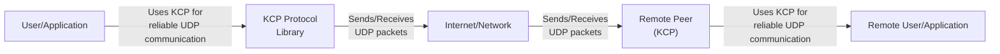
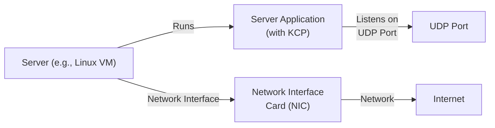
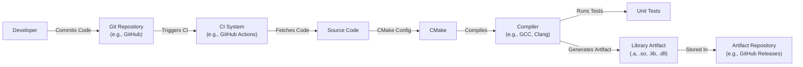

# BUSINESS POSTURE

Business Priorities and Goals:

*   Provide a fast and reliable UDP-based protocol for applications that require low latency and are tolerant of some packet loss.
*   Offer a viable alternative to TCP, especially in scenarios where TCP's congestion control and reliability mechanisms are detrimental to performance (e.g., online games, real-time streaming).
*   Provide a simple, easy-to-integrate library for developers across various platforms.
*   Maintain a small codebase for ease of understanding, maintenance, and security auditing.

Business Risks:

*   Data corruption or loss due to unreliable underlying UDP transport.
*   Security vulnerabilities within the KCP implementation leading to potential exploits (e.g., denial-of-service, data manipulation).
*   Performance issues under specific network conditions or with incorrect configuration.
*   Compatibility issues with different network environments or firewalls.
*   Lack of adoption due to perceived complexity or competition from other similar protocols.

# SECURITY POSTURE

Existing Security Controls:

*   security control: The project is open-source, allowing for community review and scrutiny of the codebase. (Described in the GitHub repository)
*   security control: The project mentions FEC (Forward Error Correction) as an optional feature, which can improve reliability and potentially mitigate some data loss risks. (Described in the GitHub repository)
*   security control: The project mentions encryption as an optional feature. (Described in the GitHub repository)

Accepted Risks:

*   accepted risk: KCP, by its nature as a UDP-based protocol, is inherently susceptible to packet loss, reordering, and duplication.  Mitigation strategies like FEC and application-level handling are necessary.
*   accepted risk: The project does not implement any built-in authentication or authorization mechanisms. These are left to the application layer.
*   accepted risk: The project does not implement any built-in denial of service protection.

Recommended Security Controls:

*   security control: Implement robust input validation and sanitization to prevent buffer overflows or other injection vulnerabilities.
*   security control: Provide clear documentation and guidance on secure configuration and usage of the library, including recommendations for encryption and FEC.
*   security control: Conduct regular security audits and penetration testing to identify and address potential vulnerabilities.
*   security control: Consider adding built-in protection against common denial-of-service attacks, such as connection limiting or rate limiting.
*   security control: Implement a secure build and release process, including code signing and vulnerability scanning.

Security Requirements:

*   Authentication: Not directly handled by KCP; responsibility of the application layer.
*   Authorization: Not directly handled by KCP; responsibility of the application layer.
*   Input Validation: KCP must rigorously validate all incoming data to prevent buffer overflows, format string vulnerabilities, and other injection attacks.  This includes validating packet headers, lengths, and sequence numbers.
*   Cryptography: KCP should support optional encryption to protect data confidentiality and integrity. The specific encryption algorithm and key management should be configurable and well-documented.  The library should use well-vetted cryptographic libraries and avoid implementing custom cryptography.
*   Data Integrity: KCP should provide mechanisms to ensure data integrity, such as checksums or MACs, even when encryption is not used.

# DESIGN

## C4 CONTEXT



Element Descriptions:

*   Element:
    *   Name: User/Application
    *   Type: User/Application
    *   Description: An application that utilizes the KCP protocol for network communication.
    *   Responsibilities: Initiates and manages KCP connections, sends and receives data through KCP, handles application-level logic.
    *   Security controls: Implements application-level security measures (authentication, authorization, data validation).

*   Element:
    *   Name: KCP Protocol Library
    *   Type: Software Library
    *   Description: The KCP library implementation, providing an API for reliable UDP communication.
    *   Responsibilities: Implements the KCP protocol, manages connection state, handles packet retransmission, congestion control, and optional FEC/encryption.
    *   Security controls: Input validation, optional encryption, potential DoS mitigation.

*   Element:
    *   Name: Internet/Network
    *   Type: Network Infrastructure
    *   Description: The underlying network infrastructure that transports UDP packets.
    *   Responsibilities: Transmits UDP packets between the local and remote KCP instances.
    *   Security controls: Network-level security controls (firewalls, intrusion detection systems) may be present but are outside the scope of KCP.

*   Element:
    *   Name: Remote Peer (KCP)
    *   Type: Software Library
    *   Description: The KCP library implementation on the remote end of the connection.
    *   Responsibilities: Implements the KCP protocol, manages connection state, handles packet retransmission, congestion control, and optional FEC/encryption.
    *   Security controls: Input validation, optional encryption, potential DoS mitigation.

*   Element:
    *   Name: Remote User/Application
    *   Type: User/Application
    *   Description: An application that utilizes the KCP protocol for network communication on the remote end.
    *   Responsibilities: Initiates and manages KCP connections, sends and receives data through KCP, handles application-level logic.
    *   Security controls: Implements application-level security measures (authentication, authorization, data validation).

## C4 CONTAINER

Since KCP is a library, the container diagram is essentially the same as the context diagram, with the addition of internal components within the KCP library itself.

```mermaid
graph LR
    User["User/Application"] -- "Uses KCP API" --> KCPAPI["KCP API"]
    KCPAPI -- "Manages Connections" --> ConnectionManager["Connection\nManager"]
    ConnectionManager -- "Sends/Receives\nData" --> Sender["Sender"]
    ConnectionManager -- "Receives/Processes\nData" --> Receiver["Receiver"]
    Sender -- "Segments & Encrypts\n(Optional)" --> SegmentationEncryption["Segmentation &\nEncryption (Optional)"]
    Receiver -- "Decrypts (Optional) &\nReassembles" --> DecryptionReassembly["Decryption (Optional) &\nReassembly"]
    SegmentationEncryption -- "Sends UDP Packets" --> NetworkInterface["Network\nInterface"]
    DecryptionReassembly <-- "Receives UDP Packets" -- NetworkInterface
    NetworkInterface -- "UDP" --> Internet["Internet/Network"]
    Internet -- "UDP" --> RemoteNetworkInterface["Remote\nNetwork\nInterface"]
    RemoteNetworkInterface -- "Sends UDP Packets" --> RemoteDecryptionReassembly["Remote\nDecryption (Optional) &\nReassembly"]
    RemoteNetworkInterface <-- "Receives UDP Packets" -- RemoteSegmentationEncryption["Remote\nSegmentation &\nEncryption (Optional)"]
    RemoteDecryptionReassembly -- "Decrypts (Optional) &\nReassembles" --> RemoteReceiver["Remote\nReceiver"]
    RemoteSegmentationEncryption <-- "Segments & Encrypts\n(Optional)" -- RemoteSender["Remote\nSender"]
    RemoteReceiver -- "Receives/Processes\nData" --> RemoteConnectionManager["Remote\nConnection\nManager"]
    RemoteSender -- "Sends/Receives\nData" --> RemoteConnectionManager
    RemoteConnectionManager -- "Manages Connections" --> RemoteKCPAPI["Remote\nKCP API"]
    RemoteKCPAPI -- "Used by Remote App" --> RemoteUser["Remote User/Application"]

```

Element Descriptions:

*   Element:
    *   Name: User/Application
    *   Type: User/Application
    *   Description: An application that utilizes the KCP protocol for network communication.
    *   Responsibilities: Initiates and manages KCP connections, sends and receives data through KCP, handles application-level logic.
    *   Security controls: Implements application-level security measures (authentication, authorization, data validation).

*   Element:
    *   Name: KCP API
    *   Type: API
    *   Description: The public interface of the KCP library.
    *   Responsibilities: Provides functions for creating, configuring, and managing KCP connections.
    *   Security controls: Input validation for API parameters.

*   Element:
    *   Name: Connection Manager
    *   Type: Component
    *   Description: Manages the state of KCP connections.
    *   Responsibilities: Handles connection establishment, termination, and state transitions. Tracks sequence numbers, acknowledgments, and retransmissions.
    *   Security controls: Input validation for connection parameters, potential DoS mitigation.

*   Element:
    *   Name: Sender
    *   Type: Component
    *   Description: Responsible for sending data over the KCP connection.
    *   Responsibilities: Segments data into packets, manages the sending window, and handles retransmissions.
    *   Security controls: None.

*   Element:
    *   Name: Receiver
    *   Type: Component
    *   Description: Responsible for receiving data over the KCP connection.
    *   Responsibilities: Reassembles packets into the original data stream, handles acknowledgments, and manages the receiving window.
    *   Security controls: Input validation for received packets.

*   Element:
    *   Name: Segmentation & Encryption (Optional)
    *   Type: Component
    *   Description: Handles data segmentation and optional encryption.
    *   Responsibilities: Splits data into smaller packets suitable for transmission over UDP.  If encryption is enabled, encrypts the data before sending.
    *   Security controls: If encryption is enabled, uses a secure cryptographic library and proper key management.

*   Element:
    *   Name: Decryption (Optional) & Reassembly
    *   Type: Component
    *   Description: Handles optional decryption and data reassembly.
    *   Responsibilities: If encryption is enabled, decrypts received data. Reassembles packets into the original data stream.
    *   Security controls: If encryption is enabled, uses a secure cryptographic library and proper key management.

*   Element:
    *   Name: Network Interface
    *   Type: Component
    *   Description: Interacts with the underlying network stack.
    *   Responsibilities: Sends and receives UDP packets.
    *   Security controls: None.

*   Element:
    *   Name: Internet/Network
    *   Type: Network Infrastructure
    *   Description: The underlying network infrastructure that transports UDP packets.
    *   Responsibilities: Transmits UDP packets between the local and remote KCP instances.
    *   Security controls: Network-level security controls (firewalls, intrusion detection systems) may be present but are outside the scope of KCP.

*   Elements with prefix 'Remote' are the same as described above, but on the remote end of the connection.

## DEPLOYMENT

KCP is a library, so deployment is typically integrated into the application using it.  There are several possible deployment scenarios:

1.  **Embedded System:** The KCP library is compiled directly into the application binary and deployed as a single executable on an embedded device.
2.  **Desktop/Mobile Application:** The KCP library is linked (statically or dynamically) with the application and deployed as part of the application package.
3.  **Server Application:** The KCP library is linked with the server application and deployed on a server (physical or virtual).  This server could be running on various operating systems (Linux, Windows, etc.) and cloud environments (AWS, Azure, GCP, etc.).
4.  **Web Application (via WebAssembly):**  KCP could potentially be compiled to WebAssembly and used within a web browser, although this would require careful consideration of browser limitations and security sandboxing.

We will describe the **Server Application** deployment scenario in detail:



Element Descriptions:

*   Element:
    *   Name: Server (e.g., Linux VM)
    *   Type: Server (Virtual Machine)
    *   Description: The server hosting the application that uses the KCP library.
    *   Responsibilities: Provides the computing resources and operating environment for the server application.
    *   Security controls: Operating system hardening, firewall, intrusion detection/prevention systems.

*   Element:
    *   Name: Server Application (with KCP)
    *   Type: Application
    *   Description: The server application that incorporates the KCP library for reliable UDP communication.
    *   Responsibilities: Handles application logic, manages KCP connections, and processes data.
    *   Security controls: Application-level security measures, KCP's internal security controls.

*   Element:
    *   Name: UDP Port
    *   Type: Network Port
    *   Description: The UDP port on which the server application listens for incoming KCP connections.
    *   Responsibilities: Receives incoming UDP packets destined for the KCP application.
    *   Security controls: Firewall rules to restrict access to the UDP port.

*   Element:
    *   Name: Network Interface Card (NIC)
    *   Type: Hardware
    *   Description: The network interface card that connects the server to the network.
    *   Responsibilities: Sends and receives network packets.
    *   Security controls: None.

*   Element:
    *   Name: Internet
    *   Type: Network
    *   Description: The network over which the server communicates with clients.
    *   Responsibilities: Transports network packets.
    *   Security controls: Network-level security controls (firewalls, intrusion detection systems).

## BUILD

The KCP project uses CMake as its build system. A typical build process would involve:

1.  **Developer:** Writes code and commits changes to the Git repository (e.g., GitHub).
2.  **Continuous Integration (CI) System (Optional):** A CI system (e.g., GitHub Actions, Travis CI, Jenkins) is triggered by the commit.
3.  **Fetch Source Code:** The CI system (or a local build environment) fetches the source code from the repository.
4.  **CMake Configuration:** CMake is used to configure the build process based on the target platform and build options (e.g., enabling FEC, encryption).
5.  **Compilation:** The source code is compiled into a library (static or dynamic) using a compiler (e.g., GCC, Clang, MSVC).
6.  **Testing (Optional):** Unit tests are run to verify the correctness of the code.
7.  **Artifact Generation:** The build process produces a library file (e.g., .a, .so, .lib, .dll) that can be linked with applications.
8.  **Artifact Storage (Optional):** The built library is stored in a repository (e.g., GitHub Releases, a package manager repository).



Security Controls in the Build Process:

*   security control: Use of a CI system allows for automated builds and testing, ensuring consistency and reducing the risk of manual errors.
*   security control: Unit tests help to identify bugs and vulnerabilities early in the development cycle.
*   security control: Static analysis tools (e.g., linters, SAST scanners) can be integrated into the CI pipeline to detect potential security issues in the code.
*   security control: Dependency management tools can be used to track and update dependencies, reducing the risk of using vulnerable libraries.
*   security control: Code signing can be used to ensure the integrity and authenticity of the built library.
*   security control: Build artifacts should be stored securely and access should be restricted.

# RISK ASSESSMENT

Critical Business Processes:

*   Reliable and low-latency data transmission for applications that require it (e.g., online games, real-time streaming).
*   Maintaining the reputation and trustworthiness of the KCP library and its developers.

Data Sensitivity:

*   The sensitivity of the data transmitted using KCP depends entirely on the application using it. KCP itself does not handle any specific data format or content.
*   If encryption is not used, the data is transmitted in plain text over UDP and is susceptible to eavesdropping.
*   If encryption is used, the sensitivity of the data is protected, provided that strong encryption algorithms and proper key management are used.
*   Metadata, such as source and destination IP addresses and ports, is always visible, regardless of encryption.

# QUESTIONS & ASSUMPTIONS

Questions:

*   What specific network conditions and performance requirements are anticipated for applications using KCP?
*   What level of security (confidentiality, integrity, availability) is required for the data being transmitted?
*   What are the target platforms and deployment environments for applications using KCP?
*   What is the expected user base and usage patterns for KCP?
*   Are there any specific regulatory or compliance requirements that need to be considered?
*   What are plans for long term support and maintenance?
*   What are plans for handling reported security vulnerabilities?

Assumptions:

*   BUSINESS POSTURE: The primary goal is to provide a fast and reliable alternative to TCP, even at the cost of some potential data loss.
*   SECURITY POSTURE: Security is a concern, but performance is prioritized. Application-level security is assumed to be the responsibility of the application developer.
*   DESIGN: The library will be used in a variety of environments, and the design should be flexible and adaptable. The underlying network is assumed to be unreliable.