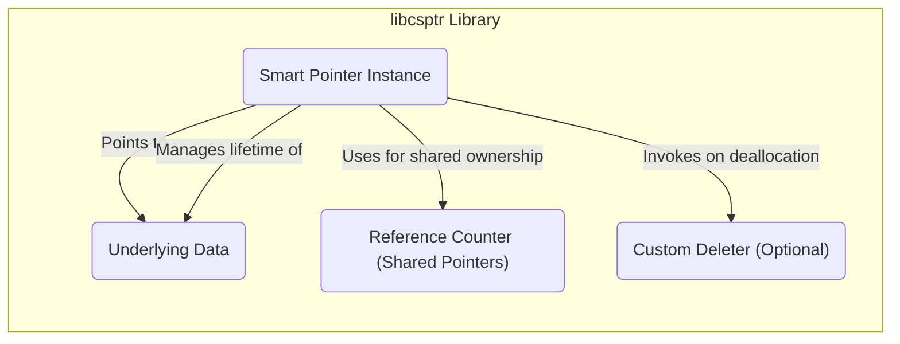
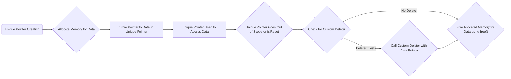
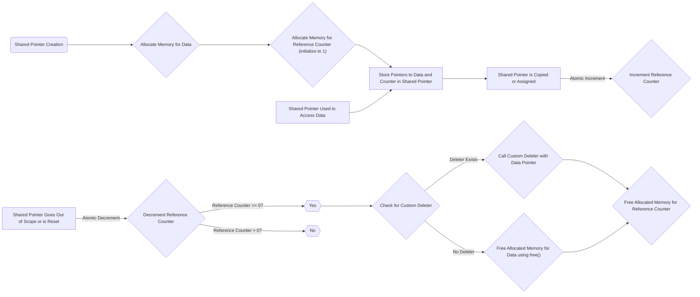
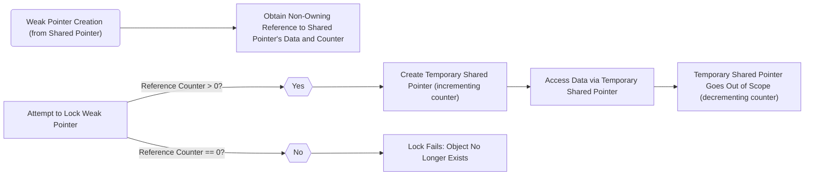

# Project Design Document: libcsptr

**Version:** 1.1
**Date:** October 26, 2023
**Author:** AI Software Architect

## 1. Introduction

This document provides an enhanced and more detailed design overview of the `libcsptr` library, a C library providing smart pointer functionalities. This document serves as a robust foundation for understanding the library's architecture, components, and data flow, which is crucial for subsequent threat modeling activities. The improvements in this version aim to provide greater clarity and a stronger focus on security considerations.

### 1.1. Purpose

The purpose of this document is to:

*   Clearly and comprehensively describe the architecture and design of the `libcsptr` library.
*   Identify key components and their interactions with greater specificity.
*   Outline the data flow within the library with more detailed steps.
*   Provide a more robust basis for identifying potential security vulnerabilities during threat modeling, including specific examples.

### 1.2. Scope

This document covers the core functionalities of the `libcsptr` library as observed from its public interface and intended use. It focuses on the design aspects directly relevant to security considerations, providing more context and potential attack vectors. Implementation details within the functions are not exhaustively covered, but the overall structure, data handling, and potential security implications are described in detail.

### 1.3. Goals

The primary goals of `libcsptr` are to:

*   Provide robust RAII (Resource Acquisition Is Initialization) semantics for memory management in C, minimizing manual memory management.
*   Significantly reduce the risk of memory leaks and dangling pointers, common sources of vulnerabilities in C code.
*   Offer a variety of smart pointer types, each tailored to specific ownership models and use cases, enhancing flexibility and safety.

## 2. System Overview

`libcsptr` is a C library that implements various smart pointer types. These smart pointers are designed to automate the management of dynamically allocated memory, thereby reducing the likelihood of memory-related errors. They encapsulate raw pointers and ensure that the associated memory is deallocated appropriately, either when the smart pointer goes out of scope or is explicitly reset.

### 2.1. Key Concepts

*   **Reference Counting:** The fundamental mechanism employed by shared ownership smart pointers. A counter, associated with the managed memory, tracks the number of active smart pointers referencing it. The memory is deallocated only when this counter reaches zero.
*   **Ownership Semantics:**  Smart pointers enforce clear ownership rules for the underlying resource. Different types of smart pointers implement distinct ownership models, such as exclusive ownership (unique pointers) or shared ownership (shared pointers).
*   **Automatic Deallocation:** The core benefit of smart pointers. Deallocation of the managed memory is handled automatically, reducing the burden on the programmer and minimizing the risk of forgetting to free memory.
*   **Customizable Deallocation (Custom Deleters):**  The ability to specify a user-defined function to be executed when the managed memory is deallocated. This allows for the management of associated resources beyond just freeing memory.

### 2.2. High-Level Architecture

The library provides distinct smart pointer types, each implemented with specific data structures and behaviors. The central components are the smart pointer instances themselves, the underlying managed data, and, for shared pointers, the associated reference counter. Custom deleters add another layer of functionality.

## 3. Detailed Design

This section provides a more granular view of the key components and their interactions within `libcsptr`.

### 3.1. Smart Pointer Types

*   **Unique Pointer:**
    *   **Ownership:** Represents exclusive ownership. Only one unique pointer can own the managed object at any given time.
    *   **Copy/Move Semantics:**  Cannot be copied (to prevent multiple owners). Ownership can be transferred via move semantics.
    *   **Deallocation Trigger:** Deallocates the managed memory when the unique pointer is destroyed (goes out of scope) or is explicitly reset.
    *   **Custom Deleters:** Supports custom deleters, allowing users to specify how the managed resource should be cleaned up.

*   **Shared Pointer:**
    *   **Ownership:** Enables shared ownership. Multiple shared pointers can point to the same object concurrently.
    *   **Reference Counting:** Uses a reference counter to track the number of active shared pointers.
    *   **Deallocation Trigger:** The managed memory is deallocated only when the reference count drops to zero (i.e., the last shared pointer referencing the object is destroyed or reset).
    *   **Thread Safety:** Requires thread-safe implementation of the reference counter to ensure correctness in concurrent environments.
    *   **Custom Deleters:** Supports custom deleters, which are invoked when the last shared pointer is destroyed.

*   **Weak Pointer:**
    *   **Ownership:** Provides a non-owning, non-controlling reference to an object managed by a shared pointer.
    *   **Purpose:** Does not prevent the managed object from being deallocated. Primarily used to observe objects managed by shared pointers without participating in ownership.
    *   **Lifecycle:** Can be used to check if the referenced object still exists (via the `lock()` operation). If the object has been deallocated, `lock()` will fail.
    *   **Breaking Cycles:** Crucial for breaking circular dependencies between shared pointers, preventing memory leaks.

### 3.2. Core Components

*   **Smart Pointer Structure (Generic):**  Each smart pointer type will likely be implemented as a structure containing:
    *   `ptr`: A raw pointer to the managed data.
    *   `deleter`: (Optional) A function pointer to the custom deleter function.

*   **Shared Pointer Structure (Specific):**  In addition to the generic structure, shared pointers will also contain:
    *   `ref_count`: A pointer to a shared reference counter.

*   **Reference Counter (for Shared Pointers):**
    *   **Storage:**  A dynamically allocated integer (or similar atomic type) stored in the heap.
    *   **Increment/Decrement:**  Incremented atomically when a new shared pointer is created (through copying or assignment). Decremented atomically when a shared pointer is destroyed or reset.
    *   **Deallocation Trigger:** When the counter transitions to zero, the managed data and the reference counter itself are deallocated.
    *   **Thread Safety:**  Requires atomic operations (e.g., `atomic_fetch_add`, `atomic_fetch_sub`) to ensure thread safety and prevent race conditions.

*   **Custom Deleter:**
    *   **Type:** A function pointer provided by the user with a specific signature (e.g., taking the raw pointer as an argument).
    *   **Invocation:** Invoked by the smart pointer's destructor when the managed resource needs to be cleaned up. For shared pointers, this happens when the reference count reaches zero.
    *   **Use Cases:**  Releasing non-memory resources (file handles, network connections), performing specific cleanup actions.

### 3.3. Data Flow - Unique Pointer

*   **Creation:** Memory for the managed data is allocated. The raw pointer to this memory is stored within the unique pointer structure.
*   **Usage:** The unique pointer provides controlled access to the underlying data.
*   **Destruction/Reset:** When the unique pointer's lifetime ends:
    *   The library checks if a custom deleter was provided during the unique pointer's creation.
    *   If a custom deleter exists, it is invoked with the raw pointer to the managed data.
    *   If no custom deleter exists, the memory allocated for the data is freed using the standard `free()` function.

### 3.4. Data Flow - Shared Pointer

*   **Creation:** Memory for the managed data is allocated. Memory for the reference counter is also allocated and initialized to 1. Pointers to both the data and the counter are stored within the shared pointer structure.
*   **Copy/Assignment:** When a shared pointer is copied or assigned to another shared pointer, the reference counter is atomically incremented to reflect the additional owner.
*   **Usage:** Shared pointers provide shared access to the underlying data.
*   **Destruction/Reset:** When a shared pointer's lifetime ends:
    *   The reference counter is atomically decremented.
    *   If the reference counter transitions to zero:
        *   The library checks for a custom deleter.
        *   If a custom deleter exists, it's invoked with the raw pointer to the managed data.
        *   The memory allocated for the data is freed using `free()`.
        *   The memory allocated for the reference counter is also freed.

### 3.5. Data Flow - Weak Pointer

*   **Creation:** A weak pointer is created from an existing shared pointer. It stores a non-owning reference to the shared pointer's managed data and its reference counter.
*   **Locking:** To access the managed data, the weak pointer must be "locked." This operation attempts to create a temporary shared pointer from the weak pointer.
*   **Success:** If the reference counter is greater than zero, a temporary shared pointer is successfully created (incrementing the counter), allowing safe access to the data. When the temporary shared pointer goes out of scope, the counter is decremented.
*   **Failure:** If the reference counter is zero, the managed object has already been deallocated, and the lock operation fails, indicating that the object no longer exists.

## 4. Security Considerations (Detailed)

This section expands on the potential security vulnerabilities, providing more context and examples relevant to threat modeling.

*   **Use-After-Free:**
    *   **Scenario:** If there's a flaw in the reference counting logic (e.g., a race condition leading to premature decrement), the memory might be freed while a weak pointer still holds a reference, or a raw pointer obtained from a smart pointer is still in use.
    *   **Exploitation:** An attacker could then overwrite the freed memory, potentially leading to arbitrary code execution when the dangling pointer is dereferenced.

*   **Double-Free:**
    *   **Scenario:**  A bug in the decrementing logic or an issue with custom deleters could cause the `free()` function to be called on the same memory region multiple times.
    *   **Exploitation:** Double-free vulnerabilities can corrupt memory management structures, potentially leading to crashes or, in some cases, exploitable memory corruption.

*   **Circular Dependencies (Shared Pointers leading to Memory Leaks):**
    *   **Scenario:** If two or more objects managed by shared pointers hold shared pointers to each other, forming a cycle, their reference counts will never reach zero, even when they are no longer needed.
    *   **Impact:** This leads to memory leaks, which, while not immediately exploitable for arbitrary code execution, can cause denial-of-service by exhausting available memory.

*   **Thread Safety Issues (Race Conditions in Reference Counting):**
    *   **Scenario:** If the increment and decrement operations on the reference counter are not atomic, race conditions can occur in multithreaded environments. For example, two threads might decrement the counter simultaneously, leading to a count of zero while there are still active references.
    *   **Exploitation:** This can lead to premature deallocation (use-after-free) or incorrect reference counts, potentially causing double-frees.

*   **Vulnerabilities in Custom Deleters:**
    *   **Scenario:** If a user-provided custom deleter contains vulnerabilities (e.g., buffer overflows, use-after-free within the deleter itself), these vulnerabilities can be triggered when the smart pointer is destroyed.
    *   **Mitigation:** The library should clearly document the security implications of custom deleters and advise users on secure coding practices.

*   **Integer Overflow/Underflow in Reference Counter:**
    *   **Scenario:** Although less likely with standard integer sizes, if the reference counter reaches its maximum value and is incremented again (overflow), or underflows to a very large number, it can lead to incorrect deallocation behavior.
    *   **Mitigation:** Using sufficiently large integer types (or atomic counters that handle overflow) can mitigate this risk.

*   **Type Confusion:**
    *   **Scenario:** If the library allows for unsafe casting or manipulation of the underlying raw pointer without proper type checks, it could lead to type confusion vulnerabilities. For example, treating a pointer to one type of object as a pointer to a different, incompatible type.
    *   **Exploitation:** Type confusion can lead to incorrect memory access and potentially arbitrary code execution.

## 5. Deployment Considerations

Deploying applications that utilize `libcsptr` requires attention to security best practices:

*   **Secure Compilation:** Compile the library and the application using it with compiler flags that enable security features such as:
    *   **Stack Canaries:** To detect stack buffer overflows.
    *   **Address Space Layout Randomization (ASLR):** To make it harder for attackers to predict memory addresses.
    *   **Position Independent Executable (PIE):**  Enhances the effectiveness of ASLR.
*   **Static and Dynamic Analysis:** Employ static analysis tools to identify potential vulnerabilities in the `libcsptr` code and the application's usage of it. Dynamic analysis (fuzzing) can help uncover runtime errors and vulnerabilities.
*   **Regular Updates and Patching:** Ensure that `libcsptr` and any dependencies are kept up-to-date with the latest security patches.
*   **Secure Linking:**  Ensure the library is linked securely to prevent tampering.

## 6. Future Considerations

*   **Enhanced Error Handling:**  Implement more robust error handling mechanisms within the library, particularly for memory allocation failures.
*   **Consideration of Intrusive Smart Pointers:** Explore the possibility of adding intrusive smart pointer types, where the reference count is stored within the managed object itself.
*   **Formal Verification:**  Investigate the application of formal verification techniques to mathematically prove the correctness and safety of the core reference counting logic and other critical components. This can provide a high degree of assurance against certain types of vulnerabilities.
*   **Auditing of Custom Deleters:**  Provide guidelines and potentially tools to help users audit the security of their custom deleters.

This improved design document provides a more detailed and security-focused overview of the `libcsptr` library. It serves as a valuable resource for threat modeling, enabling security professionals to identify and assess potential vulnerabilities more effectively.