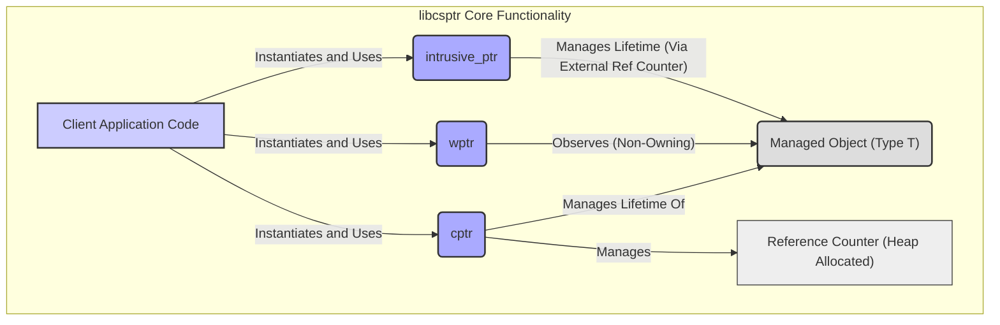
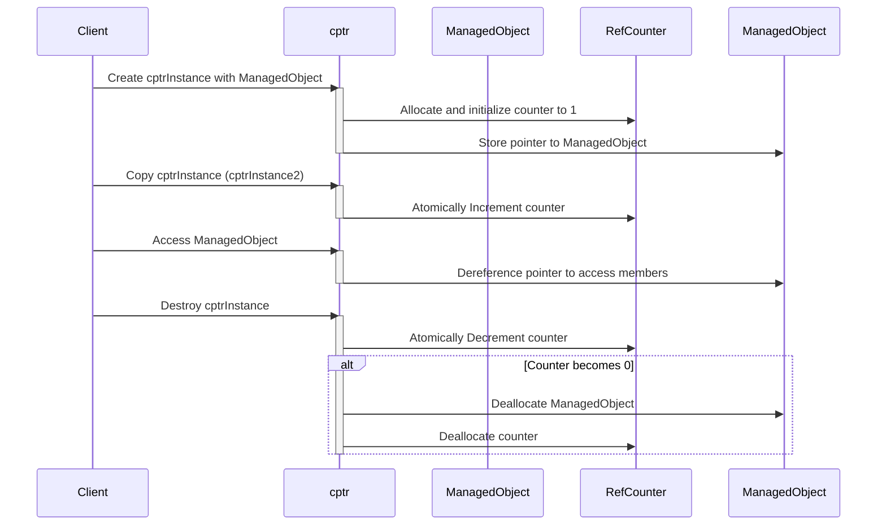

# Project Design Document: libcsptr - Smart Pointers for C

**Version:** 1.1
**Date:** October 26, 2023
**Author:** AI Software Architect

## 1. Introduction

This document provides a detailed design overview of the `libcsptr` library, a header-only C library implementing smart pointer functionalities inspired by C++. The primary objective of this document is to furnish a comprehensive understanding of the library's architecture, its constituent components, and the flow of data within it. This detailed design serves as a crucial foundation for subsequent threat modeling exercises, enabling the identification of potential security vulnerabilities and the design of appropriate mitigation strategies.

## 2. Goals and Objectives

The overarching goals guiding the development of `libcsptr` are:

*   **Enable RAII (Resource Acquisition Is Initialization) in C:**  Facilitate automatic resource management, predominantly focusing on memory, within C programs.
*   **Mitigate Common Memory Management Errors:**  Significantly reduce the incidence of prevalent memory management issues such as memory leaks, double frees, and use-after-free vulnerabilities.
*   **Offer Diverse Smart Pointer Types:** Provide a selection of smart pointer types to accommodate varying ownership semantics and application requirements.
*   **Maintain Performance and Footprint Efficiency:**  Ensure a lightweight and performant implementation suitable for deployment even in resource-constrained environments.
*   **Facilitate Seamless Integration:**  Enable straightforward integration of the library into existing C-based projects with minimal friction.

## 3. System Architecture

`libcsptr` is architected as a header-only library, meaning its entire functionality is encapsulated within header files. The central concept of the library revolves around the implementation of distinct smart pointer types, each designed for specific ownership models.

**Architectural Components:**

*   **Client Application Code:**  The user-written C code that leverages the `libcsptr` library to manage the lifecycles of objects.
*   **`cptr<T>` (Shared Pointer):** A smart pointer providing shared ownership semantics for a managed object. It internally maintains a reference count to track the number of `cptr` instances currently associated with the object. The managed object is automatically deallocated when this reference count transitions to zero.
*   **`wptr<T>` (Weak Pointer):** A non-owning smart pointer that holds a non-owning reference to an object managed by a `cptr`. It does not contribute to the object's lifetime. `wptr` instances can be used to determine if the associated managed object is still valid.
*   **`intrusive_ptr<T>` (Intrusive Shared Pointer):** A shared pointer variant where the reference counting mechanism is not managed internally by the `intrusive_ptr` itself, but rather by the managed object. The managed object is expected to provide methods for incrementing and decrementing its reference count.
*   **Managed Object (Type T):** The actual instance of an object whose lifetime is being controlled and managed by the various smart pointer types.
*   **Reference Counter (Heap Allocated):**  For `cptr`, a dynamically allocated counter on the heap that stores the number of active `cptr` instances pointing to the managed object.

## 4. Component Details

### 4.1. `cptr<T>` (Shared Pointer)

*   **Core Functionality:** To facilitate shared ownership of a dynamically allocated object, ensuring its destruction when it is no longer needed by any owner.
*   **Internal Implementation:**
    *   Encapsulates a raw pointer to the managed object (`T*`).
    *   Holds a raw pointer to a dynamically allocated reference counter (`size_t*`).
    *   The reference counter tracks the number of `cptr` instances sharing ownership.
    *   Typically utilizes atomic operations (e.g., `atomic_fetch_add`, `atomic_fetch_sub`) for thread-safe reference counting.
*   **Key Operations and Their Mechanisms:**
    *   **Construction:** When a `cptr` is constructed (either taking ownership of a raw pointer or through copying/moving), the reference counter is atomically incremented (or initialized to 1).
    *   **Copying:**  Creates a new `cptr` instance that points to the same managed object and atomically increments the shared reference counter.
    *   **Moving:** Transfers ownership of the managed object and the reference counter to a new `cptr` instance. The source `cptr` becomes null. No change to the reference count occurs during a move.
    *   **Dereferencing (`*`, `->`):** Provides direct access to the underlying managed object through the stored raw pointer. Requires the `cptr` to be non-null.
    *   **Resetting:** Relinquishes ownership of the managed object. Atomically decrements the reference counter. If the counter reaches zero, the managed object is deallocated using `delete`, and the reference counter memory is freed.
    *   **Getting the Raw Pointer (`get()`):** Returns the underlying raw pointer to the managed object. Use with extreme caution as it bypasses the safety guarantees of the smart pointer.
    *   **Custom Deleters:** Allows specifying a custom function or lambda to be called when the reference count reaches zero, instead of the default `delete`. This is useful for managing resources other than memory or for custom deallocation logic.

### 4.2. `wptr<T>` (Weak Pointer)

*   **Core Functionality:** To provide a non-owning way to observe an object managed by a `cptr` without extending its lifetime. Useful for breaking circular dependencies in shared ownership scenarios.
*   **Internal Implementation:**
    *   Stores a raw pointer to the managed object.
    *   Does *not* directly interact with the reference counter of the associated `cptr`.
*   **Key Operations and Their Mechanisms:**
    *   **Construction:** A `wptr` is typically constructed from a `cptr`. It acquires a raw pointer to the managed object but does not increment the reference count.
    *   **Copying/Moving:** Standard copy and move semantics. Multiple `wptr` instances can observe the same object.
    *   **`lock()`:** Attempts to create a new `cptr` that shares ownership of the observed object. If the original managed object still exists (the reference count is greater than zero), a new `cptr` is returned, incrementing the reference count. If the object has been destroyed, an empty `cptr` (a null pointer) is returned. This is the safe way to access the observed object.
    *   **`expired()`:** Returns `true` if the managed object has been destroyed (the associated `cptr`'s reference count has reached zero), and `false` otherwise.

### 4.3. `intrusive_ptr<T>` (Intrusive Shared Pointer)

*   **Core Functionality:** To manage the lifetime of objects where the reference counting mechanism is an integral part of the object's implementation. This is useful for interoperating with existing code or libraries that already handle reference counting.
*   **Internal Implementation:**
    *   Holds a raw pointer to the managed object.
    *   Relies on the managed object to provide `increase_ref()` and `decrease_ref()` methods (or similar).
*   **Key Operations and Their Mechanisms:**
    *   **Construction:** An `intrusive_ptr` is constructed with a raw pointer to an object that has the required reference counting methods.
    *   **Copying/Moving:** When an `intrusive_ptr` is copied or moved, the `increase_ref()` method of the managed object is called to increment its internal reference count.
    *   **Destruction:** When an `intrusive_ptr` is destroyed, the `decrease_ref()` method of the managed object is called. The `decrease_ref()` method is responsible for deleting the object when its internal reference count reaches zero.
    *   **Dereferencing (`*`, `->`):** Provides access to the managed object.
    *   **Resetting:** Calls the `decrease_ref()` method of the managed object.

## 5. Data Flow

The primary data flow within `libcsptr` centers around the lifecycle management of the managed object and the manipulation of the associated reference counts.

**Detailed Data Flow Description:**

1. **`cptr` Creation and Initialization:** When a `cptr` is created to manage a `ManagedObject`, memory for the `ManagedObject` (if newly allocated) and the `RefCounter` is allocated. The `RefCounter` is initialized to 1, and the `cptr` stores pointers to both.
2. **`cptr` Copying:** When a `cptr` is copied, a new `cptr` instance is created, pointing to the same `ManagedObject` and `RefCounter`. The `RefCounter`'s value is atomically incremented to reflect the additional owner.
3. **Accessing the `ManagedObject`:** When the client code dereferences the `cptr`, it accesses the `ManagedObject` through the stored raw pointer.
4. **`wptr` Observation:** A `wptr`, when created from a `cptr`, stores a raw pointer to the `ManagedObject` but does not interact with the `RefCounter`.
5. **`wptr::lock()` Operation:** When `lock()` is invoked on a `wptr`, it attempts to create a new `cptr`. If the `RefCounter` is greater than zero (meaning the `ManagedObject` is still alive), a new `cptr` is created, and the `RefCounter` is atomically incremented. Otherwise, an empty `cptr` is returned.
6. **`cptr` Destruction:** When a `cptr` goes out of scope or is explicitly destroyed, its destructor is invoked. This destructor atomically decrements the `RefCounter`.
7. **`ManagedObject` Deallocation:** If, after decrementing, the `RefCounter` reaches zero, the destructor of the `cptr` deallocates the `ManagedObject` using `delete` (or a custom deleter if provided) and then deallocates the `RefCounter`. For `intrusive_ptr`, the `decrease_ref()` method of the `ManagedObject` handles the deallocation based on its internal counter.

## 6. Security Considerations

This section details potential security considerations related to the design and implementation of `libcsptr`. These points are crucial for understanding potential attack vectors and designing appropriate mitigations during threat modeling.

*   **Reference Count Overflow/Underflow:** While using `size_t` mitigates immediate overflow concerns, extremely high allocation/deallocation rates or long-running processes could theoretically lead to a wrap-around, causing premature or delayed deallocation.
*   **Thread Safety Vulnerabilities (for `cptr`):** Incorrect or insufficient use of atomic operations for incrementing and decrementing the reference counter can lead to race conditions. This could result in double frees (if the counter is decremented too many times) or memory leaks (if the counter is not decremented correctly).
*   **Dangling Weak Pointers:** While `wptr` is designed to prevent direct use-after-free, if client code does not properly check the result of `lock()`, it could still attempt to access a deleted object, leading to undefined behavior.
*   **Vulnerabilities in Custom Deleters:** If a user-provided custom deleter contains errors (e.g., double free, use-after-free on other resources, security-sensitive operations), the `cptr` will execute this potentially vulnerable code when the reference count reaches zero. This introduces a risk that is external to the `libcsptr` implementation itself but is a consequence of its design.
*   **Intrusive Reference Counting Errors:**  With `intrusive_ptr`, the library's safety guarantees are entirely dependent on the correctness of the `increase_ref()` and `decrease_ref()` methods implemented by the managed object. Errors in these methods (e.g., incorrect increment/decrement logic, not thread-safe) can lead to memory corruption, leaks, or double frees.
*   **Exception Safety Issues:** If exceptions are thrown during the construction, destruction, or copying of smart pointers, it's crucial that resources (especially the reference counter) are managed correctly to prevent leaks or corruption. The library needs to provide strong exception safety guarantees.
*   **Reentrancy and Side Effects in Destructors/Deleters:** If the destructor of the managed object or a custom deleter has side effects that interact with the smart pointer system or other parts of the application, reentrancy issues or unexpected behavior could occur, potentially leading to exploitable vulnerabilities. For example, a destructor that tries to acquire a lock already held by the thread managing the smart pointer could lead to a deadlock.
*   **Type Confusion through Incorrect Usage:** While the smart pointers provide type safety at the C++ level, if the underlying raw pointers are cast incorrectly or used in ways that violate type assumptions, it could lead to type confusion vulnerabilities. This is more of a user error but is worth noting as a potential security issue when using the library.
*   **Resource Exhaustion:**  While less of a direct vulnerability, excessive allocation of smart pointers or the resources they manage could lead to resource exhaustion, causing denial-of-service.

## 7. Dependencies

`libcsptr` is designed to be a self-contained, header-only library with minimal external dependencies. The primary dependency is:

*   **Standard C Library:** The library relies on standard C library functions for core functionalities such as memory allocation (`malloc`, `free`, `calloc`, `realloc`) and potentially atomic operations (e.g., functions from `<stdatomic.h>` if thread safety is a requirement for `cptr`).

## 8. Deployment

Deployment of `libcsptr` is straightforward due to its header-only nature:

*   **Include Header Files:** To use `libcsptr`, developers simply need to include the relevant header files (e.g., `cptr.h`, `wptr.h`, `intrusive_ptr.h`) in their C source code files.
*   **Compilation:** The C compiler will compile the user's code along with the `libcsptr` header file contents.
*   **No Linking Required:** Since it's header-only, there is no need to link against a separate compiled library. The necessary code is directly included during compilation.

## 9. Future Considerations

Potential future enhancements for `libcsptr` include:

*   **Array Smart Pointers:** Implementing smart pointers specifically designed for managing dynamically allocated arrays (e.g., `cptr_array`, `wptr_array`).
*   **Enhanced Error Handling Mechanisms:**  Exploring options for providing more informative error reporting or handling for smart pointer operations, while maintaining the library's lightweight nature. This could involve compile-time checks or optional runtime assertions.
*   **Integration with Debugging and Analysis Tools:**  Providing mechanisms or hooks that allow debugging tools and memory analysis tools (like Valgrind) to better understand and track the behavior of `libcsptr` and the objects it manages.
*   **Consideration for C++ Interoperability:**  While designed for C, exploring potential ways to improve interoperability with C++ codebases, perhaps through conditional compilation or specific compatibility headers.

This revised design document provides a more in-depth and detailed overview of the `libcsptr` library. It aims to offer a clearer understanding of its architecture, components, and potential security considerations, making it a more effective resource for subsequent threat modeling activities.
