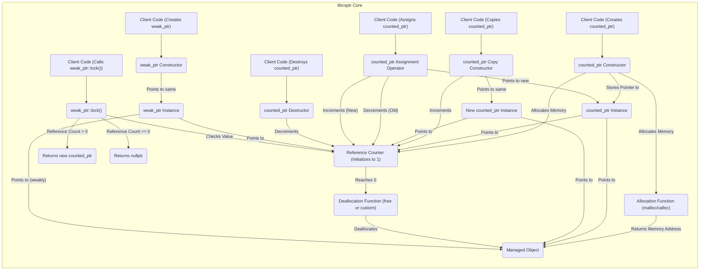
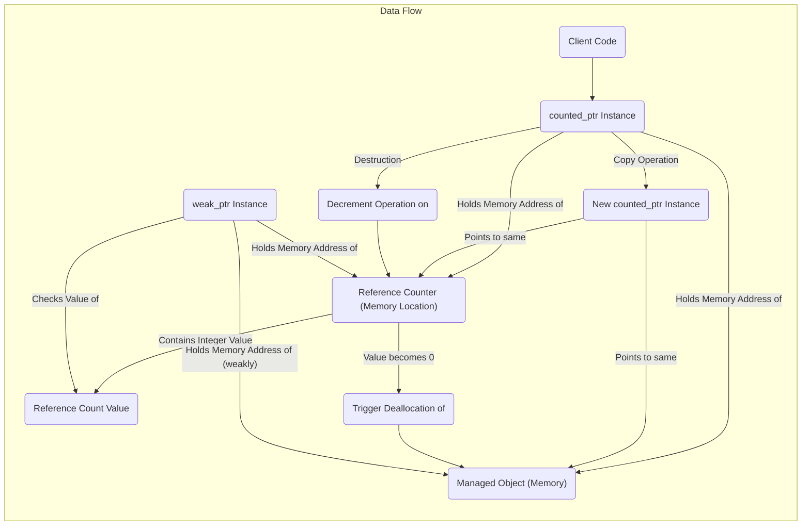

# Project Design Document: libcsptr - Smart Pointer Library for C

**Version:** 1.1
**Date:** October 26, 2023
**Author:** AI Software Architect

## 1. Introduction

This document provides a detailed design overview of the `libcsptr` library, a C library providing smart pointer functionalities. This document serves as a foundation for understanding the library's architecture, components, and data flow, which is crucial for subsequent threat modeling activities.

### 1.1. Purpose

The purpose of this document is to clearly and comprehensively describe the design of `libcsptr`. This document will be used as input for threat modeling to identify potential security vulnerabilities and design flaws. Understanding the internal workings and data management is essential for identifying attack surfaces and potential weaknesses.

### 1.2. Scope

This document covers the core design and architecture of the `libcsptr` library as represented in the provided GitHub repository. It focuses on the key components, their interactions, and the data flow within the library, specifically concerning memory management and reference counting mechanisms.

### 1.3. Goals

*   Provide a clear and detailed description of the `libcsptr` library's architecture, including the internal structure of its core components.
*   Identify the key components and their specific responsibilities in memory management and reference counting.
*   Illustrate the data flow within the library, particularly concerning the creation, manipulation, and destruction of smart pointers and the associated reference counts.
*   Serve as a basis for identifying potential security threats and vulnerabilities by highlighting critical areas of memory management and data handling.

## 2. Overview

`libcsptr` is a C library that implements smart pointers, aiming to provide safer and more convenient memory management compared to raw pointers. It utilizes reference counting to automatically manage the lifetime of dynamically allocated objects, reducing the risk of memory leaks and dangling pointers. The library offers different types of smart pointers to handle various ownership semantics, promoting safer and more robust C code.

### 2.1. Key Features

*   **Reference Counting:** Automatic memory deallocation of the managed object when the reference count reaches zero, ensuring timely resource release.
*   **`counted_ptr` for Shared Ownership:** Enables multiple parts of the program to safely share ownership of an object.
*   **`weak_ptr` for Non-Owning References:** Allows observation of an object managed by a `counted_ptr` without participating in ownership, preventing circular dependencies from causing memory leaks.
*   **RAII (Resource Acquisition Is Initialization):** Ensures resources (memory in this case) are acquired during smart pointer construction and automatically released during destruction, simplifying resource management.
*   **Mitigation of Common Memory Errors:** Aims to prevent issues like memory leaks, double frees, and dangling pointers by automating memory management.

## 3. Architecture

The `libcsptr` library is structured around several key components that work together to provide smart pointer functionality.

### 3.1. Core Components

*   **`counted_ptr` Structure:**
    *   Internal raw pointer (`void *` or similar) to the managed object.
    *   Pointer to a shared reference counter.
    *   Potentially a pointer to a custom deleter function.
*   **`weak_ptr` Structure:**
    *   Internal raw pointer (`void *` or similar) to the managed object (may be null if the object is already deleted).
    *   Pointer to the same shared reference counter as the associated `counted_ptr`.
*   **Reference Counter (Atomic Integer):**
    *   A dynamically allocated integer (likely using `malloc`) shared between all `counted_ptr` instances managing the same object.
    *   Incremented when a `counted_ptr` is copied or assigned.
    *   Decremented when a `counted_ptr` is destroyed.
    *   Potentially uses atomic operations to ensure thread safety.
*   **Allocation Functions (Wrappers):**
    *   Internal functions (potentially wrappers around `malloc`, `calloc`) used by `counted_ptr` to allocate memory for the managed object.
    *   May include additional logic for tracking allocations (for debugging purposes).
*   **Deallocation Function (Wrapper):**
    *   An internal function (potentially a wrapper around `free`) called when the reference counter reaches zero.
    *   If a custom deleter is provided, this function will call the custom deleter instead of `free`.
*   **Type Erasure Mechanism:**
    *   Employs `void *` to hold pointers to objects of any type.
    *   May use function pointers (deleters) to handle type-specific cleanup if needed.

### 3.2. Component Interactions

The following diagram illustrates the interaction between the core components during the lifecycle of `counted_ptr` and `weak_ptr` instances:

**Explanation of Interactions:**

*   When client code creates a `counted_ptr`, the constructor allocates memory for the managed object using an internal allocation function and allocates memory for the reference counter, initializing it to 1. The `counted_ptr` instance stores pointers to both.
*   Copying a `counted_ptr` invokes the copy constructor, which increments the shared reference counter and creates a new `counted_ptr` instance pointing to the same managed object and reference counter.
*   Assigning a `counted_ptr` involves decrementing the reference count of the previously managed object (if any) and incrementing the reference count of the newly managed object. The `counted_ptr` instance is updated to point to the new object and its reference counter.
*   When a `counted_ptr` goes out of scope or is explicitly destroyed, its destructor decrements the shared reference counter.
*   When the reference counter reaches zero, the internal deallocation function (either `free` or a custom deleter) is called to release the memory of the managed object.
*   Creating a `weak_ptr` involves creating an instance that points weakly to the managed object and shares the same reference counter without incrementing it.
*   Calling `weak_ptr::lock()` checks the value of the reference counter. If it's greater than zero, a new `counted_ptr` is returned, sharing ownership. If it's zero, a null pointer is returned.

## 4. Data Flow

The primary data flow within `libcsptr` revolves around the memory address of the managed object and the value of its associated reference count.

**Explanation of Data Flow:**

*   A `counted_ptr` instance stores the memory address of the dynamically allocated managed object.
*   It also stores the memory address of the shared reference counter associated with that object.
*   The reference counter itself holds an integer value representing the number of `counted_ptr` instances sharing ownership.
*   When a `counted_ptr` is copied, the new instance receives the same memory addresses for the managed object and the reference counter.
*   When a `counted_ptr` is destroyed, a decrement operation is performed on the integer value stored at the reference counter's memory address.
*   When the value at the reference counter's memory address becomes zero, it triggers the deallocation of the memory block pointed to by the managed object's memory address.
*   A `weak_ptr` instance holds the memory address of the managed object (weakly) and the memory address of its reference counter, allowing it to check the current reference count value without owning the object.

## 5. Security Considerations (For Threat Modeling)

This section outlines potential security considerations that should be explored during threat modeling, categorized for clarity.

### 5.1. Memory Safety Threats

*   **Use-After-Free:**
    *   **Scenario:** Bugs in the reference counting logic could lead to premature deallocation while a `counted_ptr` still holds a pointer to the memory.
    *   **Attack Vector:** Exploiting race conditions in a multithreaded environment could cause the reference count to be decremented incorrectly.
    *   **Mitigation in `libcsptr`:**  Reliance on atomic operations for reference counting. Thorough testing of reference counting logic.
*   **Double Free:**
    *   **Scenario:** Errors in copy constructors, assignment operators, or destructors could cause the `free` function to be called multiple times on the same memory address.
    *   **Attack Vector:**  Crafting specific sequences of copy and destruction operations to trigger the double free.
    *   **Mitigation in `libcsptr`:** Careful implementation of the rule of five (or zero) for copy/move semantics.
*   **Memory Leaks:**
    *   **Scenario:** Circular dependencies between objects managed by `counted_ptr` can prevent the reference count from ever reaching zero.
    *   **Attack Vector:** Intentionally creating circular dependencies to exhaust memory resources.
    *   **Mitigation in `libcsptr`:**  The existence of `weak_ptr` to break such cycles. Developer awareness and proper usage of `weak_ptr`.
*   **Integer Overflow in Reference Counter:**
    *   **Scenario:**  If the reference counter reaches its maximum value and overflows, it could wrap around to zero, leading to premature deallocation.
    *   **Attack Vector:**  Creating a massive number of copies of a `counted_ptr`.
    *   **Mitigation in `libcsptr`:** Using a sufficiently large integer type for the reference counter.

### 5.2. Concurrency Threats

*   **Race Conditions in Reference Counting:**
    *   **Scenario:** In multithreaded environments, concurrent access to the reference counter without proper synchronization could lead to incorrect increments or decrements.
    *   **Attack Vector:**  Exploiting timing windows in concurrent operations to manipulate the reference count.
    *   **Mitigation in `libcsptr`:**  Likely uses atomic integer operations for incrementing and decrementing the reference counter.
*   **Data Races on Managed Object:**
    *   **Scenario:** While `libcsptr` manages the lifetime, it doesn't inherently protect the managed object from concurrent access by multiple `counted_ptr` instances.
    *   **Attack Vector:**  Multiple threads accessing and modifying the managed object concurrently, leading to data corruption.
    *   **Mitigation in `libcsptr`:**  This is primarily the responsibility of the user of the library. `libcsptr` itself doesn't provide inherent protection against this.

### 5.3. Other Potential Threats

*   **Null Pointer Dereference:**
    *   **Scenario:**  While smart pointers aim to mitigate this, accessing the raw pointer via `get()` or `operator*()` on a `counted_ptr` that is managing a null pointer (if allowed) could lead to a crash. Also, improper handling of `weak_ptr::lock()` returning `nullptr`.
    *   **Attack Vector:**  Intentionally creating `counted_ptr` instances managing null pointers or accessing a `weak_ptr` after the object is deleted.
    *   **Mitigation in `libcsptr`:**  Careful handling of null pointers within the library's implementation. Clear documentation on the behavior of `weak_ptr::lock()`.
*   **Type Confusion:**
    *   **Scenario:** If the type erasure mechanism using `void *` is not handled carefully, casting the managed object to an incorrect type could lead to unexpected behavior or vulnerabilities.
    *   **Attack Vector:**  Exploiting weaknesses in the type system or casting mechanisms.
    *   **Mitigation in `libcsptr`:**  The library itself doesn't inherently enforce type safety beyond the `void *` mechanism. This relies on the correct usage by the developer.

### 5.4. Potential Attack Vectors

*   **Malicious Input:** While `libcsptr` itself doesn't directly handle input, vulnerabilities in the application using `libcsptr` could lead to the creation of object graphs or usage patterns that trigger the aforementioned threats.
*   **Concurrency Exploits:** Race conditions in multithreaded environments could be exploited to manipulate the reference counter or access managed objects unsafely.
*   **Memory Corruption:** Exploiting vulnerabilities in the library or the application using it could lead to arbitrary memory corruption, potentially by overwriting the reference counter or other critical data structures.

## 6. Dependencies

`libcsptr` likely has minimal external dependencies, primarily relying on the standard C library (`libc`) for core functionalities.

*   `libc` (for `malloc`, `calloc`, `free`, `pthread` primitives if thread-safe reference counting is implemented, etc.)

## 7. Deployment

`libcsptr` is intended to be deployed as a library that can be linked into C projects. Developers would include the header files and link against the compiled library. The library's ABI stability would be a consideration for long-term maintainability.

## 8. Future Considerations

*   **More Advanced Smart Pointer Types:** Consider adding support for unique pointers (with exclusive ownership) or move-only smart pointers.
*   **Customizable Deleters:** Allow users to specify custom functions (beyond `free`) to be called when an object is deallocated, enabling resource management for non-memory resources.
*   **Integration with Error Handling Mechanisms:** Provide mechanisms for handling allocation failures or other errors gracefully, potentially through return codes or callbacks.
*   **Compile-time Safety:** Explore ways to introduce more compile-time checks to prevent misuse of the library.

This design document provides a more detailed and comprehensive overview of the `libcsptr` library's architecture and data flow, specifically focusing on aspects relevant to security considerations. This information is crucial for conducting a thorough threat model to identify and mitigate potential security vulnerabilities.