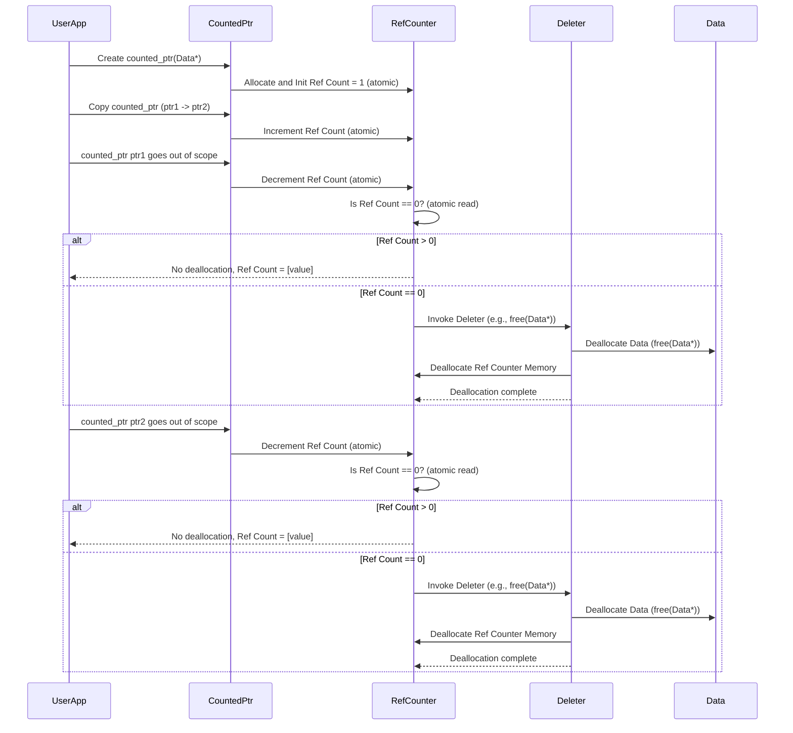
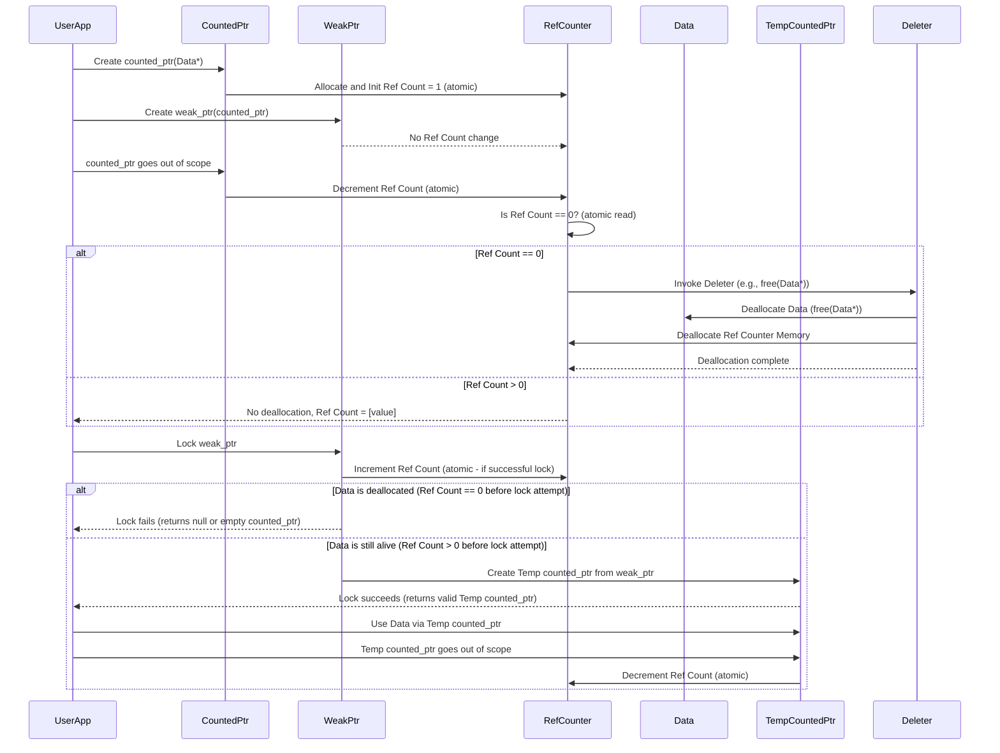

# Project Design Document: libcsptr - Smart Pointer Library for C

**Document Version:** 1.1
**Date:** 2023-12-08
**Author:** AI Expert

## 1. Introduction

This document provides a detailed design overview of the `libcsptr` project, a header-only C library for implementing smart pointers. This document is intended to serve as a foundation for threat modeling and security analysis of the library. It outlines the project's goals, architecture, data flow, technology stack, and initial security considerations. This document will be used as input for a comprehensive threat model to identify potential vulnerabilities and guide security testing.

**Project Link:** [https://github.com/snaipe/libcsptr](https://github.com/snaipe/libcsptr)

### 1.1. Project Goals

The primary goal of `libcsptr` is to provide a robust, efficient, and secure smart pointer implementation for the C programming language. Smart pointers aim to automate memory and resource management, significantly reducing the risk of common C programming errors such as memory leaks, dangling pointers, double-free vulnerabilities, and resource leaks.

Key goals of the library include:

* **Memory Safety and Resource Management:** Automate deallocation of dynamically allocated memory and management of other resources (like file handles, mutexes, etc.) to prevent leaks and dangling references.
* **Reduced Vulnerability Surface:** Minimize common memory-related vulnerabilities inherent in manual memory management in C, leading to more secure applications.
* **Efficiency and Performance:** Minimize runtime and memory overhead compared to manual resource management, ensuring the library is practical for performance-sensitive applications.
* **Developer Productivity and Ease of Use:** Provide a simple, intuitive, and well-documented API that is easy to integrate into existing C projects, improving developer productivity and reducing error-prone manual resource management.
* **Portability and Standard Compliance:** Ensure broad compatibility across various platforms, operating systems, and C standards (ideally targeting C99 and later for wider adoption and feature availability).
* **Thread Safety (where applicable and configurable):**  Address thread safety concerns for reference counting and smart pointer operations, especially in multi-threaded environments, potentially offering configurable thread-safety levels for performance optimization.
* **Extensibility:** Allow users to customize deallocation behavior through custom deleters, enabling management of diverse resource types beyond simple memory.

### 1.2. Target Audience

This document is intended for:

* **Security Auditors and Threat Modelers:** To gain a deep understanding of the library's design, identify potential attack surfaces, and conduct thorough threat modeling and vulnerability assessments.
* **Software Developers and Architects:** To understand the library's architecture, API, and implementation details for effective integration and usage in their projects.
* **Project Maintainers and Contributors:** To serve as a comprehensive reference for future development, maintenance, bug fixing, and security enhancements of the `libcsptr` library.
* **Quality Assurance and Testing Teams:** To develop comprehensive test plans, including unit tests, integration tests, and security-focused tests, based on the design and identified potential vulnerabilities.

## 2. System Architecture

`libcsptr` is designed as a header-only C library to maximize ease of integration and minimize dependencies. This design choice means that the library's implementation is primarily contained within header files that are directly included into user projects during compilation. This approach simplifies deployment and avoids complex linking procedures.

The core architectural principle of `libcsptr` is based on **reference counting** to manage the lifecycle of resources. The library centers around the `counted_ptr` type, which encapsulates a raw pointer and manages its lifetime automatically.

### 2.1. Components

Based on common smart pointer patterns and typical C library design principles, `libcsptr` likely provides the following core components:

* **`counted_ptr` (or similar name):** This is the primary smart pointer type and the cornerstone of the library. It is a structure that holds:
    * A raw pointer to the managed data object.
    * A pointer to a shared reference counter.
    * A pointer to a deleter function (or function pointer).
    `counted_ptr` is responsible for incrementing and decrementing the reference count upon construction, copy, move, and destruction. When the reference count reaches zero, it invokes the deleter to release the managed resource.
* **`weak_ptr` (or similar name):** A non-owning smart pointer that provides a way to observe a `counted_ptr` without participating in ownership or extending the lifetime of the managed object. It holds a pointer to the same reference counter as the associated `counted_ptr`. `weak_ptr` is used to detect if the managed object is still alive and to break potential circular dependencies that could prevent objects from being deallocated. Attempting to access the managed object through a `weak_ptr` requires "locking" it, which temporarily obtains a `counted_ptr` if the object is still alive.
* **Reference Counter (Internal):**  This is an integer variable (likely atomically accessed in thread-safe configurations) stored in dynamically allocated memory, shared by all `counted_ptr` and `weak_ptr` instances that manage the same object. It tracks the number of owning references (`counted_ptr` instances). The reference counter is incremented when a new `counted_ptr` is created (copy or move) and decremented when a `counted_ptr` is destroyed or reset.
* **Deleter Mechanism:** A flexible mechanism to customize the resource deallocation process. It is typically implemented using function pointers.
    * **Default Deleter:**  Uses `free()` for memory allocated via `malloc()` or similar functions. This is the default behavior when no custom deleter is specified.
    * **Custom Deleters:** Users can provide their own deleter functions to handle different resource types (e.g., `fclose()` for file handles, `pthread_mutex_destroy()` for mutexes, custom deallocation logic). The deleter is invoked when the reference count reaches zero.
* **API Functions (Public Interface):** A set of functions and macros exposed to users for interacting with the library. This API likely includes functions for:
    * Creating `counted_ptr` instances (from raw pointers, with custom deleters, etc.).
    * Copying and moving `counted_ptr` and `weak_ptr` instances.
    * Resetting `counted_ptr` instances (releasing ownership).
    * Accessing the raw pointer held by a `counted_ptr` (potentially with safety considerations).
    * Creating `weak_ptr` instances from `counted_ptr` instances.
    * Locking `weak_ptr` instances to obtain temporary `counted_ptr` instances.
    * Potentially functions for checking the status of `weak_ptr` instances (expired or not).

### 2.2. Component Diagram (Mermaid)

```mermaid
graph LR
    subgraph "libcsptr Library"
    A["counted_ptr"] -- "Manages" --> B["Data Object"];
    A -- "Uses" --> C["Reference Counter"];
    A -- "Uses" --> E["Deleter Function Pointer"];
    D["weak_ptr"] -- "Observes" --> C;
    E -- "Deallocates" --> B;
    end
    F["User Application"] -- "Uses API of" --> "libcsptr Library";
    F -- "Allocates Data (potentially)" --> B;
    style A fill:#f9f,stroke:#333,stroke-width:2px
    style D fill:#ccf,stroke:#333,stroke-width:2px
    style E fill:#ccf,stroke:#333,stroke-width:2px
    C -- "Shared by" --> A
    C -- "Shared by" --> D
```

**Description of Components and Interactions (Expanded):**

1. **`counted_ptr`**: The core smart pointer type. It encapsulates ownership of a `Data Object`. It holds a raw pointer to the data, a pointer to a shared `Reference Counter`, and a function pointer to a `Deleter Function`.  It manages the lifecycle of the `Data Object` by incrementing and decrementing the `Reference Counter`.
2. **`Data Object`**: Represents the actual resource being managed. In the context of memory management, this is dynamically allocated memory. It could also represent other resources like file handles, mutexes, etc., depending on the deleter used.
3. **`Reference Counter`**: A dynamically allocated integer (or atomic integer for thread safety) that tracks the number of `counted_ptr` instances currently owning the `Data Object`. It is shared among all `counted_ptr` and `weak_ptr` instances associated with the same `Data Object`.  Atomic operations are crucial for thread safety to prevent race conditions during increment and decrement operations.
4. **`weak_ptr`**: A non-owning observer of a `Data Object`. It holds a pointer to the same `Reference Counter` as the `counted_ptr` instances managing the object. It does not increment or decrement the reference count. It's used to check if the `Data Object` is still alive without preventing its deallocation.
5. **`Deleter Function Pointer`**: A function pointer stored within the `counted_ptr`. It points to the function that will be called to deallocate or release the `Data Object` when the `Reference Counter` reaches zero. This allows for customization of the deallocation process.
6. **`User Application`**: Represents the user code that utilizes the `libcsptr` library. It interacts with the library through its public API to create, manage, and use smart pointers, thereby automating resource management.

**Interaction Flow (Detailed):**

* **Resource Acquisition and `counted_ptr` Creation:** The `User Application` typically allocates a resource (e.g., using `malloc()`) and then creates a `counted_ptr` to manage it. The `counted_ptr` constructor allocates and initializes a `Reference Counter` to 1 and sets the `Deleter Function Pointer` (either to the default `free()` or a user-provided custom deleter).
* **Sharing Ownership (Copying `counted_ptr`):** When a `counted_ptr` is copied, a new `counted_ptr` instance is created that points to the *same* `Data Object` and the *same* `Reference Counter`. The `Reference Counter` is atomically incremented to reflect the additional owner.
* **Releasing Ownership (`counted_ptr` Destruction/Reset):** When a `counted_ptr` instance goes out of scope or is explicitly reset, its destructor is called. The destructor atomically decrements the `Reference Counter`.
* **Resource Deallocation (Reference Count Reaches Zero):** After decrementing the `Reference Counter`, the destructor checks if the counter has reached zero. If it has, it means there are no more `counted_ptr` instances owning the `Data Object`. In this case, the `Deleter Function Pointer` is invoked to deallocate the `Data Object`. The memory for the `Reference Counter` itself is also typically deallocated at this point.
* **Weak Observation (`weak_ptr` Usage):** `weak_ptr` instances are created from `counted_ptr` instances. They share the same `Reference Counter` but do not increment it. When the `User Application` needs to access the `Data Object` through a `weak_ptr`, it attempts to "lock" the `weak_ptr`. Locking creates a temporary `counted_ptr` if the `Data Object` is still alive (Reference Count > 0). If the object has already been deallocated (Reference Count == 0), locking fails.

## 3. Data Flow

The data flow in `libcsptr` is primarily concerned with managing pointers, reference counts, and the invocation of deleters. The core data being managed is the raw pointer to the user's data and the associated metadata for resource management.

### 3.1. Data Managed (Detailed)

`libcsptr` manages the following types of data:

* **User Data Pointers:** Raw C pointers (`void*` or specific data type pointers) provided by the user, pointing to the actual data or resource to be managed. `libcsptr` itself does not interpret or modify the content of this data, only manages its lifecycle.
* **Reference Counts:** Integer values (potentially atomic integers) that track the number of `counted_ptr` instances owning a particular `Data Object`. These are dynamically allocated and managed internally by the library.
* **Deleter Function Pointers:** Function pointers that specify the deallocation logic for the managed `Data Object`. These are stored within `counted_ptr` instances and invoked when the reference count reaches zero.

### 3.2. Reference Count Management Flow (Detailed Sequence Diagram)



**Data Flow Description (Expanded):**

1. **`counted_ptr` Creation:** When `counted_ptr` is created with a raw data pointer, the library allocates memory for a `Reference Counter` and initializes it to 1. This allocation and initialization should be thread-safe, especially in multi-threaded scenarios.
2. **`counted_ptr` Copying:** Copying a `counted_ptr` does *not* copy the underlying data. Instead, it creates a new `counted_ptr` instance that points to the *same* `Data Object` and the *same* `Reference Counter`. The `Reference Counter` is atomically incremented to reflect the new owner.
3. **`counted_ptr` Destruction (Scope Exit):** When a `counted_ptr` goes out of scope, its destructor is invoked. The destructor atomically decrements the `Reference Counter`.
4. **Reference Count Check and Deallocation:** After decrementing, the destructor checks if the `Reference Counter` has reached zero (atomically read).
    * **If Reference Count > 0:**  Other `counted_ptr` instances still own the `Data Object`, so no deallocation occurs.
    * **If Reference Count == 0:** This is the last owner. The `Deleter Function Pointer` is invoked to deallocate the `Data Object`. After deallocation of the `Data Object`, the memory allocated for the `Reference Counter` itself is also deallocated to prevent memory leaks.
5. **Subsequent `counted_ptr` Destructions:**  If there were multiple copies of `counted_ptr`, the process repeats for each instance going out of scope. Deallocation only happens once, when the reference count finally reaches zero.

### 3.3. Weak Pointer Flow (Detailed Sequence Diagram)



**Weak Pointer Flow Description (Expanded):**

1. **`weak_ptr` Creation from `counted_ptr`:** A `weak_ptr` is created from an existing `counted_ptr`. This operation only copies the pointer to the `Reference Counter`; it does *not* modify the reference count itself.
2. **Observation without Ownership:** `weak_ptr` instances observe the `Data Object` without owning it. They do not prevent the `Data Object` from being deallocated when all `counted_ptr` instances are gone.
3. **Locking `weak_ptr`:** To access the `Data Object` through a `weak_ptr`, the `User Application` must attempt to "lock" the `weak_ptr`.
4. **Lock Attempt and Reference Count Check:** Locking involves attempting to create a temporary `counted_ptr` from the `weak_ptr`. This process typically involves:
    * **Checking the Reference Count:**  The `weak_ptr` first checks the `Reference Counter`. If the reference count is already zero, the `Data Object` has been deallocated, and locking fails.
    * **Conditional Increment (Atomic):** If the reference count is greater than zero, the locking mechanism attempts to atomically increment the reference count. This increment is conditional; it should only succeed if the reference count is still positive at the moment of the increment attempt. This prevents race conditions where the object might be deallocated between checking the count and incrementing it.
5. **Lock Success/Failure and Temporary `counted_ptr`:**
    * **Lock Success:** If the atomic increment succeeds, a temporary `counted_ptr` is created. This temporary `counted_ptr` now owns the `Data Object` for the duration of its scope. The `User Application` can safely access the `Data Object` through this temporary `counted_ptr`.
    * **Lock Failure:** If the atomic increment fails (e.g., because the reference count became zero just before the increment attempt), locking fails. The `weak_ptr` indicates that the `Data Object` is no longer alive (typically by returning a null pointer or an empty `counted_ptr`).
6. **Temporary `counted_ptr` Scope and Decrement:** The temporary `counted_ptr` obtained from locking is typically a stack-based object. When it goes out of scope, its destructor is called, which decrements the `Reference Counter` (atomically). This decrement is essential to release the temporary ownership acquired during locking.

## 4. Technology Stack

* **Programming Language:** C (Likely targeting C99 or C11 for features like `<stdatomic.h>` for thread-safe operations and `<stdint.h>` for fixed-width integer types). The specific C standard targeted will influence the available features and portability.
* **Build System:**  Likely CMake for cross-platform build management, especially if examples and tests are provided. For a header-only library, the build system might be minimal, primarily for testing and example compilation.
* **Standard Library Dependencies:**  Core dependency is the standard C library. Key headers likely used:
    * `<stdlib.h>`: For memory allocation (`malloc`, `free`, `calloc`, `realloc`), and potentially `abort`, `exit`.
    * `<stdatomic.h>` (C11 or later) or platform-specific atomic intrinsics: For atomic operations on the reference counter to ensure thread safety. If C99 is targeted, platform-specific atomic implementations or mutex-based locking might be used for thread safety (if thread safety is a goal).
    * `<stdint.h>`: For fixed-width integer types (e.g., `uintptr_t`, `intptr_t`, `atomic_intptr_t`) for reference counters and pointer arithmetic, improving portability and clarity.
    * `<assert.h>`: For assertions used during development and testing to catch programming errors early.
    * `<stddef.h>`: For standard definitions like `NULL`, `size_t`, `ptrdiff_t`.
* **Platform Compatibility:**  Designed for cross-platform compatibility, aiming to support major operating systems including:
    * Linux distributions
    * Windows
    * macOS
    * Potentially other POSIX-compliant systems and embedded platforms, depending on the target audience and testing scope.
* **Compiler Compatibility:**  Requires a C compiler that supports the targeted C standard (e.g., GCC, Clang, MSVC). Compatibility with older compilers might be a consideration depending on the project goals.

## 5. Security Considerations (Detailed)

This section expands on the initial security considerations, providing more specific examples and potential mitigation strategies.

* **Reference Count Overflow/Underflow:**
    * **Threat:** If the reference counter is implemented using a fixed-size integer type (even atomic), extreme scenarios with very high reference counts over a long period could theoretically lead to integer overflow. Underflow is less likely in correct usage but could occur due to implementation errors.
    * **Vulnerability:**  Overflow could wrap around the counter, potentially leading to premature deallocation when the counter wraps back to zero, resulting in double-free or use-after-free vulnerabilities.
    * **Mitigation:**
        * **Use sufficiently large integer type:** Using `uintptr_t` or `intptr_t` for the reference counter provides a large address space-sized integer, significantly reducing the probability of overflow in practical scenarios.
        * **Overflow checks (less practical/performant):**  In highly critical systems, adding explicit overflow checks before incrementing the counter could be considered, but this would introduce performance overhead and complexity.
        * **Consider alternative counting mechanisms (for extreme cases):** For extremely long-lived objects with very high sharing, alternative counting mechanisms might be explored, but these are likely to be significantly more complex.
* **Race Conditions in Reference Counting (Thread Safety Vulnerabilities):**
    * **Threat:** In multi-threaded environments, if reference count operations (increment, decrement, read, write) are not properly synchronized, race conditions can occur.
    * **Vulnerability:** Race conditions can lead to incorrect reference counts. For example, a double-decrement could lead to premature deallocation (double-free), or missed decrements could lead to memory leaks. Concurrent access without proper synchronization is a classic concurrency vulnerability.
    * **Mitigation:**
        * **Atomic Operations:**  Crucially, use atomic operations (e.g., `atomic_fetch_add`, `atomic_fetch_sub`, `atomic_load`, `atomic_store` from `<stdatomic.h>` or platform-specific atomic intrinsics) for all operations on the reference counter. This ensures that operations are performed indivisibly and prevents data races.
        * **Mutex-based locking (alternative, less performant):**  If atomic operations are not available or for specific architectures, mutexes could be used to protect access to the reference counter, but this is generally less performant than atomic operations.
        * **Careful memory ordering:** When using atomic operations, consider memory ordering (e.g., `memory_order_relaxed`, `memory_order_acquire`, `memory_order_release`, `memory_order_seq_cst`) to optimize performance while maintaining correctness in concurrent scenarios.
* **Custom Deleter Vulnerabilities:**
    * **Threat:** Users providing custom deleter functions introduce a potential vulnerability point. Malicious or poorly written custom deleters could cause various security issues.
    * **Vulnerability:**
        * **Incorrect Deallocation:** A custom deleter might not correctly deallocate the resource, leading to memory leaks or resource leaks.
        * **Double-Free (if deleter calls `free` incorrectly):** A custom deleter might inadvertently call `free` on memory that was not allocated with `malloc` or has already been freed, leading to double-free vulnerabilities.
        * **Use-After-Free (if deleter doesn't properly release resources):** A deleter might not fully release all resources associated with the object, potentially leading to use-after-free conditions if other parts of the application still hold references to those resources.
        * **Side Effects and Logic Errors:** Custom deleters could have unintended side effects or contain logic errors that introduce vulnerabilities or unexpected behavior.
    * **Mitigation:**
        * **Clear Documentation and Guidelines:** Provide comprehensive documentation and examples on how to write safe and correct custom deleters. Emphasize the responsibility of the user in ensuring deleter correctness.
        * **Input Validation (limited applicability):**  Input validation for deleter functions is generally not feasible as they are function pointers.
        * **Sandboxing/Isolation (advanced, likely not applicable for a header-only library):** In more complex systems, sandboxing or isolating custom deleters could be considered, but this is likely not practical for a header-only C library.
        * **Code Review and Testing of Custom Deleters:** Encourage users to thoroughly review and test their custom deleters to ensure correctness and security.
* **Exception Safety (Error Handling in C Context):**
    * **Threat:** While C doesn't have exceptions like C++, errors can still occur during memory allocation, resource acquisition, and deleter execution. Improper error handling can lead to resource leaks or inconsistent states.
    * **Vulnerability:** Resource leaks, memory leaks, and program crashes due to unhandled errors.
    * **Mitigation:**
        * **Robust Error Handling:** Implement proper error handling throughout the library, especially in memory allocation and deallocation paths. Check return values of `malloc`, `calloc`, etc., and handle allocation failures gracefully (e.g., return error codes, abort in critical error scenarios after cleanup).
        * **Resource Acquisition Is Initialization (RAII) principle (as much as possible in C):**  The smart pointer itself embodies RAII. Ensure that resource acquisition and release are tightly coupled within the smart pointer's lifecycle.
        * **Careful Deleter Implementation:** Ensure deleters are robust and handle potential errors during resource release gracefully.
* **API Misuse and Undefined Behavior:**
    * **Threat:** Incorrect usage of the `libcsptr` API by developers can still lead to memory safety issues or undefined behavior, even with smart pointers.
    * **Vulnerability:** Memory leaks, dangling pointers, use-after-free, double-free, and other memory corruption issues due to incorrect API usage.
    * **Mitigation:**
        * **Clear and Comprehensive Documentation:** Provide extensive documentation, tutorials, and examples demonstrating the correct usage of the `libcsptr` API. Clearly document potential pitfalls and common mistakes.
        * **Well-Defined API Contracts:**  Clearly define the preconditions, postconditions, and invariants for all API functions.
        * **Assertions and Runtime Checks (during development):** Use assertions (`assert.h`) and runtime checks (where feasible without significant performance impact) to detect API misuse and programming errors during development and testing.
        * **Static Analysis Tools:** Encourage users to use static analysis tools to detect potential API misuse and memory safety issues in their code that uses `libcsptr`.
* **Double-Free Vulnerabilities (Implementation Errors):**
    * **Threat:** Despite the goal of preventing double-frees, implementation errors in the reference counting logic, deleter invocation, or atomic operations within `libcsptr` itself could still lead to double-free vulnerabilities.
    * **Vulnerability:** Double-free vulnerabilities can lead to memory corruption, program crashes, and potential security exploits.
    * **Mitigation:**
        * **Rigorous Code Review:** Conduct thorough code reviews of the `libcsptr` implementation, focusing on reference counting logic, atomic operations, and deleter invocation paths.
        * **Extensive Unit Testing:** Develop a comprehensive suite of unit tests to verify the correctness of reference counting, deleter invocation, and all API functions under various scenarios, including multi-threaded tests.
        * **Fuzzing and Dynamic Analysis:** Employ fuzzing and dynamic analysis tools to automatically detect potential double-free vulnerabilities and other memory safety issues.
* **Use-After-Free Vulnerabilities (Implementation Errors or API Misuse):**
    * **Threat:** Incorrect reference counting, weak pointer implementation flaws, or API misuse could potentially lead to use-after-free vulnerabilities if data is deallocated prematurely while still being accessed through a dangling pointer or weak pointer that was not properly checked.
    * **Vulnerability:** Use-after-free vulnerabilities are a critical class of memory safety issues that can lead to memory corruption and security exploits.
    * **Mitigation:**
        * **Careful Weak Pointer Implementation:**  Pay close attention to the implementation of `weak_ptr` locking and expiration checks to ensure that `weak_ptr` instances do not lead to use-after-free.
        * **Thorough Testing of Weak Pointers:**  Develop specific unit tests and integration tests to verify the correct behavior of `weak_ptr` instances in various scenarios, including object destruction and concurrent access.
        * **Address Sanitizers (e.g., ASan):** Use address sanitizers during testing to automatically detect use-after-free vulnerabilities and other memory errors.

## 6. Assumptions and Constraints (Expanded)

* **C Standard Compliance (Specific Standard):**  Assume the library is designed to be compliant with C99 or C11 standard. Specify the target standard explicitly as it impacts feature availability (e.g., `<stdatomic.h>`). If targeting C99, clarify how thread safety is achieved (if at all) without `<stdatomic.h>`.
* **Standard C Library Availability (Minimum Version):** Assume availability of a reasonably complete standard C library implementation. Specify minimum version requirements if any specific standard library features are essential.
* **Memory Allocation/Deallocation (Default `malloc`/`free`):**  The default deleter is assumed to use `free()` for memory allocated with `malloc()` or compatible allocation functions. Clearly document this assumption and the implications for users providing custom allocators.
* **Target Environment (General Purpose, Embedded, etc.):**  Specify the intended target environments (e.g., general-purpose desktop/server systems, embedded systems, real-time systems). This influences design choices related to performance, resource usage, and thread safety.
* **Performance Considerations (Overhead Limits):**  Performance is a key constraint. The library should aim to minimize runtime and memory overhead compared to manual memory management. Quantify acceptable overhead if possible.
* **Header-Only Nature (Implications):**  The header-only nature simplifies integration but might have implications for:
    * **Code Organization:** All implementation details are exposed in headers.
    * **Compilation Time:** Including headers in many compilation units can increase compilation time.
    * **Code Bloat (potential):** If headers are included in many places, code might be duplicated in object files, potentially increasing binary size.
* **Thread Safety Requirements (Configurable Levels):**  Specify the level of thread safety provided by the library. Is it fully thread-safe by default? Are there configurable thread-safety levels (e.g., single-threaded, multi-threaded with atomic operations, multi-threaded with mutexes)? Clarify the performance implications of different thread-safety levels.
* **Error Handling Strategy (Return Codes, Abort, etc.):**  Define the error handling strategy used by the library. Will it primarily rely on return codes, assertions, or other mechanisms to signal errors?

## 7. Future Work and Threat Modeling (Next Steps)

This design document is a crucial first step for security analysis. Future work and threat modeling activities will build upon this foundation:

* **Detailed Source Code Review (Security Focused):**  Conduct a line-by-line security-focused code review of the `libcsptr` source code on GitHub. Verify the design assumptions, analyze the implementation of reference counting, atomic operations (if used), deleter invocation, and weak pointer logic. Identify any potential implementation flaws or deviations from the design that could introduce vulnerabilities.
* **Threat Modeling Workshop (STRIDE or PASTA):** Organize a threat modeling workshop using a structured methodology like STRIDE (Spoofing, Tampering, Repudiation, Information Disclosure, Denial of Service, Elevation of Privilege) or PASTA (Process for Attack Simulation and Threat Analysis). Use this design document as input to systematically identify potential threats, attack vectors, and vulnerabilities based on the architecture, data flow, and security considerations outlined.
* **Vulnerability Analysis (Static and Dynamic):**
    * **Static Analysis:** Employ static analysis tools (e.g., linters, static analyzers specialized for C/C++) to automatically scan the `libcsptr` code for potential vulnerabilities, coding errors, and style issues. Focus on memory safety, concurrency, and API usage patterns.
    * **Dynamic Analysis:** Perform dynamic analysis using tools like address sanitizers (ASan), memory sanitizers (MSan), and thread sanitizers (TSan) during testing. Run unit tests and integration tests under sanitizers to detect runtime memory errors, race conditions, and other dynamic vulnerabilities.
* **Security Testing (Fuzzing, Unit Tests, Integration Tests):**
    * **Fuzzing:** Implement fuzzing techniques (e.g., using AFL, libFuzzer) to automatically generate and execute a large number of test cases with mutated inputs to uncover unexpected behavior, crashes, and potential vulnerabilities in the library.
    * **Security-Focused Unit Tests:** Develop specific unit tests that target identified potential vulnerabilities and security-sensitive areas of the code (e.g., reference counting edge cases, concurrent access scenarios, custom deleter interactions, weak pointer locking failures).
    * **Integration Tests:** Create integration tests that simulate real-world usage scenarios of `libcsptr` in larger applications to assess its security and robustness in more complex contexts.
* **Penetration Testing (Optional):**  Depending on the criticality of the library and the identified threat landscape, consider conducting penetration testing by security experts to simulate real-world attacks and identify vulnerabilities that might have been missed by other analysis methods.
* **Documentation Updates (Security Guidance):**  Based on the findings of threat modeling and vulnerability analysis, update the library's documentation to include security guidance for users. Document best practices for using the API securely, potential security pitfalls to avoid, and recommendations for writing secure custom deleters.

This document will be maintained and updated throughout the project lifecycle as new information becomes available, security analysis progresses, and the library evolves. Security is an ongoing process, and this design document and the associated security activities are essential for building a robust and secure `libcsptr` library.