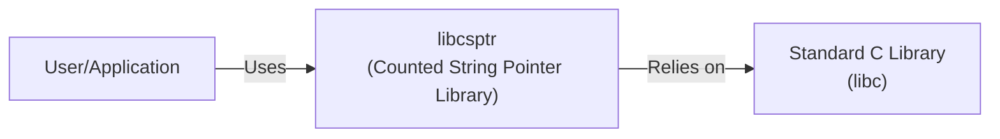
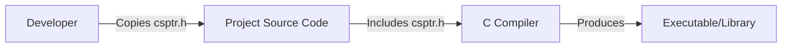
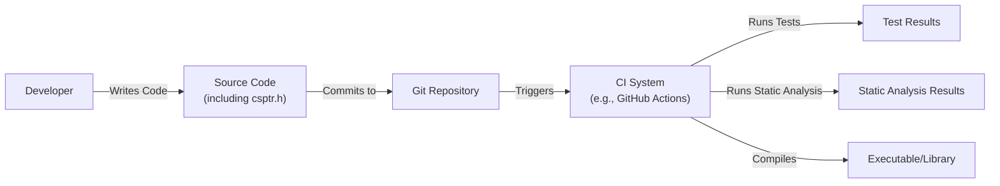

Okay, let's create a design document for the `libcsptr` project.

# BUSINESS POSTURE

Business Priorities and Goals:

*   Provide a simple, header-only C library for counted string pointers.
*   Enhance code safety and readability by managing string lifetimes.
*   Offer a lightweight alternative to more complex string management solutions.
*   Minimize external dependencies to ensure easy integration into various projects.
*   Reduce memory leaks.

Most Important Business Risks:

*   **Adoption Risk:** The library may not gain traction if it's perceived as too niche, overly complex, or if superior alternatives exist.
*   **Maintenance Risk:** As a single-developer, header-only library, long-term maintenance and support could be a challenge. Lack of updates could lead to incompatibility with newer C standards or compiler versions.
*   **Security Risk:** While aiming for safety, undiscovered bugs or misuse of the library could introduce vulnerabilities, especially related to string manipulation and memory management.
*   **Integration Risk:** Compatibility issues with existing codebases or specific compiler configurations could hinder adoption.

# SECURITY POSTURE

Existing Security Controls:

*   security control: The library's core design, using counted string pointers, inherently mitigates some common string handling errors like buffer overflows (when used correctly). Described in library header file.
*   security control: The library is self-contained (header-only) reducing external dependencies and thus the attack surface. Described in README.md.
*   security control: Code is publicly available on GitHub, allowing for community review and potential identification of vulnerabilities. Described in README.md.

Accepted Risks:

*   accepted risk: The library is provided "as is," with no warranty. Users assume responsibility for its proper use and integration.
*   accepted risk: The library does not encrypt or protect the content of the strings. It only manages their memory.
*   accepted risk: The library relies on the user to correctly use the provided functions. Incorrect usage can still lead to memory errors.
*   accepted risk: There is no formal security audit process in place.

Recommended Security Controls:

*   security control: Integrate static analysis tools (e.g., clang-tidy, Coverity) into the development workflow to catch potential bugs early.
*   security control: Add comprehensive unit tests, including edge cases and potential misuse scenarios, to ensure robustness.
*   security control: Consider using fuzzing techniques to test the library's resilience against unexpected inputs.
*   security control: Provide clear and detailed documentation on secure usage patterns, including examples of both correct and incorrect usage.
*   security control: Establish a security reporting process (e.g., a SECURITY.md file in the repository) to allow users to responsibly disclose vulnerabilities.

Security Requirements:

*   **Authentication:** Not applicable, as the library doesn't handle authentication.
*   **Authorization:** Not applicable, as the library doesn't handle authorization.
*   **Input Validation:** The library should internally validate its inputs (e.g., checking for NULL pointers, valid lengths) to prevent crashes or undefined behavior.  It should not, however, attempt to validate the *content* of the strings, as that is application-specific.
*   **Cryptography:** Not applicable, as the library is not intended for cryptographic operations. If string content needs encryption, that should be handled by a separate, dedicated library.

# DESIGN

## C4 CONTEXT

Context Diagram Element Descriptions:

*   Element:
    *   Name: User/Application
    *   Type: External Entity (Software System)
    *   Description: Any C application or library that utilizes `libcsptr` for string management.
    *   Responsibilities: Calls `libcsptr` functions to create, manipulate, and release counted string pointers.
    *   Security controls: Relies on `libcsptr` for safe string handling; implements its own security measures for other aspects of the application.

*   Element:
    *   Name: libcsptr
    *   Type: Software System (Library)
    *   Description: The `libcsptr` library itself, providing counted string pointer functionality.
    *   Responsibilities: Manages the allocation, deallocation, and reference counting of string data. Provides functions for string manipulation.
    *   Security controls: Implements internal checks to prevent common string handling errors. Relies on the standard C library for underlying memory management.

*   Element:
    *   Name: Standard C Library (libc)
    *   Type: External Entity (Software System)
    *   Description: The standard C library, providing fundamental functions like `malloc`, `free`, `strlen`, etc.
    *   Responsibilities: Provides basic system-level functionality, including memory management.
    *   Security controls: Assumed to be a well-tested and secure component of the operating system. `libcsptr` relies on its correct behavior.

## C4 CONTAINER

Since `libcsptr` is a header-only library, the container diagram is essentially the same as the context diagram.  There are no separate deployable units.

Container Diagram Element Descriptions:

*   Element:
    *   Name: User/Application
    *   Type: External Entity (Software System)
    *   Description: Any C application or library that utilizes `libcsptr` for string management.
    *   Responsibilities: Calls `libcsptr` functions to create, manipulate, and release counted string pointers.
    *   Security controls: Relies on `libcsptr` for safe string handling; implements its own security measures for other aspects of the application.

*   Element:
    *   Name: libcsptr
    *   Type: Software System (Library)
    *   Description: The `libcsptr` library itself, providing counted string pointer functionality.
    *   Responsibilities: Manages the allocation, deallocation, and reference counting of string data. Provides functions for string manipulation.
    *   Security controls: Implements internal checks to prevent common string handling errors. Relies on the standard C library for underlying memory management.

*   Element:
    *   Name: Standard C Library (libc)
    *   Type: External Entity (Software System)
    *   Description: The standard C library, providing fundamental functions like `malloc`, `free`, `strlen`, etc.
    *   Responsibilities: Provides basic system-level functionality, including memory management.
    *   Security controls: Assumed to be a well-tested and secure component of the operating system. `libcsptr` relies on its correct behavior.

## DEPLOYMENT

Deployment Solutions:

1.  **Direct Inclusion:** The user directly includes the `csptr.h` header file in their project's source code. This is the primary and recommended deployment method.
2.  **System-Wide Installation:** The user could copy `csptr.h` to a system-wide include directory (e.g., `/usr/local/include`). This is generally discouraged as it can lead to version conflicts and makes updates less manageable.
3.  **Package Manager:** While not currently supported, the library *could* be packaged for various C package managers (e.g., Conan, vcpkg). This would simplify integration into larger projects.

Chosen Deployment Solution (Detailed): Direct Inclusion

Deployment Diagram Element Descriptions:

*   Element:
    *   Name: Developer
    *   Type: Person
    *   Description: The developer integrating `libcsptr` into their project.
    *   Responsibilities: Obtains the `csptr.h` file and places it in the appropriate location within their project.
    *   Security controls: Ensures the integrity of the `csptr.h` file (e.g., by verifying its source or checksum).

*   Element:
    *   Name: Project Source Code
    *   Type: Code
    *   Description: The source code of the project using `libcsptr`.
    *   Responsibilities: Includes the `csptr.h` header file and uses its functions.
    *   Security controls: Relies on the developer to correctly use `libcsptr` and to implement other necessary security measures.

*   Element:
    *   Name: C Compiler
    *   Type: Tool
    *   Description: The C compiler used to build the project (e.g., GCC, Clang).
    *   Responsibilities: Compiles the project source code, including `libcsptr`, into an executable or library.
    *   Security controls: Relies on the compiler's own security features and configuration.

*   Element:
    *   Name: Executable/Library
    *   Type: Artifact
    *   Description: The compiled output of the project, incorporating `libcsptr`.
    *   Responsibilities: Executes the project's logic, including `libcsptr`'s string management functions.
    *   Security controls: Inherits the security characteristics of `libcsptr` and the project's code.

## BUILD

Build Process:

Since `libcsptr` is a header-only library, there is no separate build process for the library itself.  The "build" process is simply the compilation of the user's project that includes `csptr.h`. However, we can discuss the build process of a project *using* `libcsptr`, and how security can be integrated into that process.

Build Process Description:

1.  **Development:** The developer writes code, including the `csptr.h` header file and using its functions.
2.  **Commit:** The code is committed to a Git repository (e.g., GitHub).
3.  **Continuous Integration (CI):** A CI system (e.g., GitHub Actions, Jenkins) is triggered by the commit.
4.  **Testing:** The CI system runs unit tests, including tests specifically designed for `libcsptr` usage.
5.  **Static Analysis:** The CI system runs static analysis tools (e.g., clang-tidy, Coverity) to identify potential bugs and security vulnerabilities.
6.  **Compilation:** If tests and static analysis pass, the CI system compiles the code into an executable or library.

Security Controls in Build Process:

*   security control: **Version Control (Git):** Tracks changes to the code, allowing for auditing and rollbacks.
*   security control: **CI System:** Automates the build, test, and analysis process, ensuring consistency and repeatability.
*   security control: **Unit Tests:** Verify the correct behavior of the code, including `libcsptr` usage.
*   security control: **Static Analysis:** Detects potential bugs and security vulnerabilities before runtime.
*   security control: **Dependency Management:** (Potentially, if a package manager is used) Ensures that dependencies are tracked and updated securely.

# RISK ASSESSMENT

Critical Business Processes:

*   The primary business process is providing reliable and safe string management within C applications. The library's success depends on its ability to perform this function correctly and efficiently.

Data Protection:

*   **Data:** The library handles string data, which can range in sensitivity from non-sensitive (e.g., configuration settings) to highly sensitive (e.g., user input, passwords, API keys).
*   **Sensitivity:** The library itself does not classify or treat string data differently based on sensitivity. This is the responsibility of the application using the library. The library *should* aim to prevent vulnerabilities that could lead to *any* string data being exposed or corrupted (e.g., buffer overflows, use-after-free errors).

# QUESTIONS & ASSUMPTIONS

Questions:

*   Are there any specific performance requirements or constraints for the library?
*   Are there any target platforms or compiler versions that need to be specifically supported or excluded?
*   Is there a plan for long-term maintenance and support of the library?
*   What level of code coverage is desired for unit tests?
*   Are there any existing coding style guidelines or conventions that should be followed?

Assumptions:

*   **BUSINESS POSTURE:** The primary goal is to create a useful and safe library, prioritizing correctness and simplicity over extensive features.
*   **SECURITY POSTURE:** The developer is aware of basic C security best practices and aims to avoid common vulnerabilities.  However, no formal security expertise is assumed.
*   **DESIGN:** The library will remain header-only and will not introduce any external dependencies beyond the standard C library. The user is responsible for understanding and correctly using the library's functions. The user is responsible for handling any sensitive data appropriately.