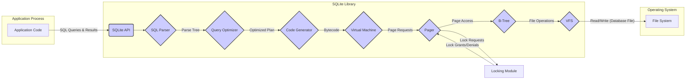

# Project Design Document: SQLite

**Version:** 1.1
**Date:** October 26, 2023
**Prepared By:** AI Software Architect

## 1. Introduction

This document provides a detailed architectural design of the SQLite project, based on the codebase available at [https://github.com/sqlite/sqlite](https://github.com/sqlite/sqlite). The primary purpose of this document is to facilitate threat modeling by providing a comprehensive understanding of the system's components, their interactions, and potential security considerations. This document will serve as the foundation for identifying potential vulnerabilities and attack vectors.

## 2. Goals and Objectives

The core goal of SQLite is to offer a lightweight, self-contained, serverless, zero-configuration, transactional SQL database engine suitable for embedding within applications. Key objectives include:

*   Providing a reliable and efficient embedded database solution.
*   Storing entire databases in single, cross-platform disk files.
*   Ensuring data integrity through ACID transaction properties.
*   Implementing a significant subset of the SQL standard for data manipulation and querying.
*   Maintaining high portability across diverse operating systems and hardware.
*   Offering a simple and easy-to-integrate database solution for developers.
*   Maintaining a reputation for stability and robustness.

## 3. Architectural Overview

SQLite employs a monolithic architecture where all functionalities reside within a single library. This library can be conceptually divided into several interacting modules.

### 3.1. Detailed Component Breakdown:

*   **Core Engine:** This is the central component responsible for the overall operation of SQLite. It manages the lifecycle of SQL statements, transaction management, and interaction with other modules.
*   **SQL Parser:** This module takes the input SQL statement as a string and performs lexical analysis (tokenization) and syntactic analysis to build an Abstract Syntax Tree (AST) representing the query.
*   **Query Optimizer:**  The optimizer analyzes the AST and determines the most efficient execution plan for the query. This involves considering available indexes, table statistics, and different query execution strategies.
*   **Code Generator:** This module translates the optimized query plan into a sequence of bytecode instructions that can be executed by the Virtual Machine.
*   **Virtual Machine (VM):** The VM executes the bytecode instructions generated by the Code Generator. It performs the actual data manipulation, retrieval, and updates.
*   **Pager:** The Pager module is responsible for managing the reading and writing of fixed-size pages of data to and from the database disk file. It implements caching and manages the locking of pages for concurrent access.
*   **B-Tree Implementation:** This module implements the B-Tree data structure, which is used to store tables and indexes on disk. It handles the organization of data within pages and the efficient retrieval of data based on key values.
*   **OS Interface (VFS - Virtual File System):** The VFS provides an abstraction layer between SQLite and the underlying operating system's file system. This allows SQLite to be portable across different operating systems by implementing platform-specific VFS modules.
*   **Tokenizer:**  The Tokenizer is the first stage of the SQL Parser, responsible for breaking down the input SQL string into a stream of individual tokens (keywords, identifiers, operators, etc.).
*   **Locking Module:** This module manages locks on the database file and individual pages to ensure transactional integrity and prevent data corruption in concurrent access scenarios. It implements different locking modes (shared, exclusive, etc.).
*   **Extension Loading Mechanism:** SQLite allows for extending its functionality by loading shared libraries (extensions) at runtime. These extensions can provide new SQL functions, virtual tables, or other custom behaviors.
*   **Command-Line Interface (CLI):** The `sqlite3` executable provides a standalone command-line interface for interacting with SQLite databases, executing SQL commands, and managing database files.
*   **APIs:** SQLite provides a C-language API that is the foundation for bindings in other programming languages (Python, Java, etc.). These APIs allow applications to interact with the SQLite library.

### 3.2. Detailed Data Flow Diagram

**Nodes Explanation:**

*   "Application Code": The software application that embeds and utilizes the SQLite library for data storage and retrieval.
*   "SQLite API": The set of functions and interfaces provided by the SQLite library for applications to interact with the database engine (e.g., `sqlite3_open`, `sqlite3_prepare_v2`, `sqlite3_step`, `sqlite3_finalize`).
*   "SQL Parser":  Analyzes the input SQL query string, verifying its syntax and creating a parse tree representing the query structure.
*   "Query Optimizer":  Analyzes the parse tree and determines the most efficient strategy for executing the query, considering indexes and other factors.
*   "Code Generator":  Translates the optimized query plan into a sequence of low-level bytecode instructions that the Virtual Machine can execute.
*   "Virtual Machine": Executes the bytecode instructions, performing operations like data retrieval, insertion, update, and deletion.
*   "Pager": Manages the interaction with the database file on disk, handling the reading and writing of fixed-size pages and implementing a page cache.
*   "B-Tree":  Implements the B-Tree data structure used for storing table data and indexes within the database file.
*   "VFS":  Provides an abstraction layer for interacting with the operating system's file system, enabling portability across different platforms.
*   "File System": The underlying storage mechanism provided by the operating system where the SQLite database file is stored.
*   "Locking Module": Manages locks on the database file and individual pages to ensure transactional integrity and prevent data corruption during concurrent access.

## 4. Security Considerations

Several security aspects are relevant when considering the use of SQLite:

*   **SQL Injection Vulnerabilities:** If user-provided input is not properly sanitized and is directly incorporated into SQL queries, attackers can inject malicious SQL code to bypass security measures, access unauthorized data, or modify data.
*   **File System Permission Issues:** The security of the SQLite database file heavily relies on the underlying file system permissions. Incorrectly configured permissions can allow unauthorized users or processes to read, modify, or delete the database file.
*   **Denial of Service (DoS) Attacks:** Maliciously crafted SQL queries that consume excessive resources (CPU, memory, disk I/O) can potentially lead to denial of service, making the application unresponsive.
*   **Security of Loaded Extensions:** Loading untrusted or malicious extensions can introduce significant security risks, as extensions have direct access to the SQLite process and can execute arbitrary code.
*   **Memory Safety Concerns:** While SQLite is generally considered robust, potential bugs in the core engine could lead to memory corruption vulnerabilities, which attackers could exploit.
*   **Lack of Built-in Encryption:** SQLite itself does not provide built-in encryption for data at rest. Applications requiring encryption must implement it at a higher level or rely on operating system-level encryption.
*   **Authentication and Authorization Limitations:** SQLite lacks built-in user authentication and fine-grained authorization mechanisms. Access control is primarily managed through file system permissions, which may not be sufficient for all applications.
*   **Temporary File Security:** SQLite uses temporary files for certain operations. The security of these temporary files (e.g., permissions, cleanup) needs to be considered to prevent information leakage or other vulnerabilities.
*   **VFS Implementation Vulnerabilities:** Custom or poorly implemented VFS modules can introduce security vulnerabilities if they do not properly handle file access, locking, or other file system operations.
*   **Database Corruption due to Concurrency Issues:** While SQLite has locking mechanisms, improper handling of concurrent access by the application can still lead to database corruption.

## 5. Deployment Considerations

The way SQLite is deployed significantly impacts its security profile:

*   **Embedded within Applications:** The most common deployment model, where the SQLite library is directly linked with the application. Security then heavily relies on the application's security practices.
*   **Mobile Applications:** SQLite is widely used in mobile apps for local data storage. Security considerations include data protection on the device and secure handling of sensitive information.
*   **Web Browsers (Client-Side Storage):** While the Web SQL Database API is deprecated, understanding its past use of SQLite highlights the need for browser-level security controls.
*   **Shared Database File Access:** When multiple processes access the same SQLite database file, proper concurrency control and locking mechanisms are crucial to prevent data corruption and ensure data integrity.
*   **File Location and Access Control:** The location of the database file on the file system and the associated access control permissions are critical security considerations.
*   **Backup and Recovery Strategies:** Secure backup and recovery mechanisms are essential to protect against data loss and ensure business continuity.
*   **Use in Server-Side Applications (Less Common):** While less common than client-side embedding, SQLite can be used in server-side applications, but careful consideration of concurrency and security implications is necessary.

## 6. Assumptions and Constraints

The following assumptions and constraints are relevant to this design document and subsequent threat modeling activities:

*   **Focus on the Core SQLite Library:** This document primarily focuses on the security aspects of the core SQLite library itself, as represented by the source code.
*   **Latest Stable Version as Baseline:** The architectural details and security considerations are generally based on the latest stable version of SQLite.
*   **General-Purpose Usage:** The analysis assumes a general-purpose usage scenario where SQLite is used for local data storage within an application. Specific application-level security measures are not detailed here.
*   **Operating System Security:** The security of the underlying operating system and file system is assumed to be a foundational element.
*   **No External Security Tools Considered:** This document focuses on the inherent security characteristics of SQLite and does not explicitly consider the impact of external security tools like firewalls or intrusion detection systems.

## 7. Future Considerations for Threat Modeling

The following areas warrant further investigation during the threat modeling process:

*   **Detailed Analysis of SQL Injection Attack Vectors:**  Specifically examine how different types of unsanitized input can lead to SQL injection vulnerabilities in various SQLite API calls.
*   **Evaluation of the Security of Specific VFS Implementations:** Analyze the security implications of using different VFS implementations, especially custom ones.
*   **In-depth Examination of Extension Security Mechanisms:**  Investigate the security controls and potential vulnerabilities associated with loading and executing SQLite extensions.
*   **Analysis of Potential Memory Corruption Vulnerabilities:** Review known memory safety issues in SQLite and explore potential attack scenarios.
*   **Assessment of Concurrency Control Mechanisms and Potential Race Conditions:**  Examine the locking mechanisms and identify potential race conditions that could lead to data corruption or security vulnerabilities.
*   **Threats Related to Temporary File Handling:**  Analyze the creation, usage, and deletion of temporary files and identify potential security risks.
*   **Impact of Database File Corruption:**  Consider the potential security implications of database file corruption, whether accidental or malicious.
*   **Analysis of Denial of Service Attack Vectors:**  Explore different ways an attacker could craft queries or interactions to cause a denial of service.

This improved design document provides a more detailed and comprehensive overview of the SQLite project's architecture and security considerations, making it a more effective foundation for conducting thorough threat modeling.
