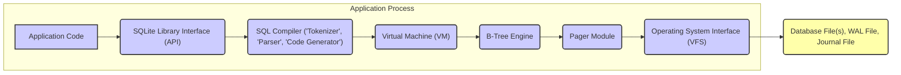
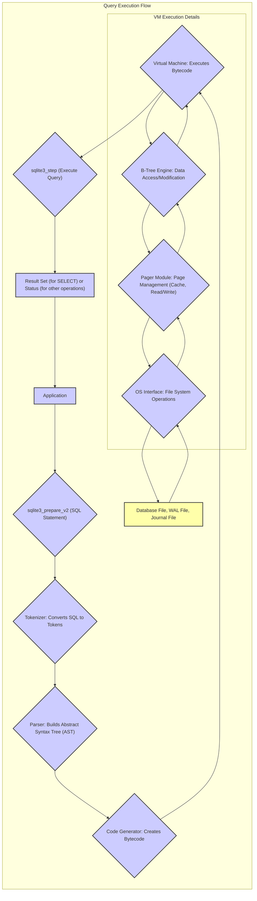

# Project Design Document: SQLite (Improved)

**Version:** 1.1
**Date:** October 26, 2023
**Author:** Gemini (AI Language Model)
**Purpose:** This document provides a detailed design overview of the SQLite project, intended for use in subsequent threat modeling activities. This version includes more detailed descriptions and expands on security considerations.

## 1. Introduction

This document outlines the architecture, components, and data flow within the SQLite library, focusing on aspects relevant to security threat modeling. SQLite is a self-contained, high-reliability, embedded, full-featured, public-domain, SQL database engine. Its widespread use necessitates a thorough understanding of its internal workings to identify potential security vulnerabilities. This document concentrates on the core library functionality and its inherent security properties, without delving into specific application integrations unless directly relevant to the core library's security.

## 2. Project Overview

SQLite is a C-language library implementing a small, fast, serverless, self-contained, high-reliability, full-featured SQL database engine. It is embedded directly into the application, eliminating the need for a separate database server process. A complete SQL database, including tables, indices, triggers, and views, is stored within a single file or a small number of files on disk. Its transactional nature (ACID properties) is a key characteristic influencing its security and reliability.

## 3. Architectural Design

SQLite's architecture is designed for simplicity and embedding. It operates within the application's memory space, interacting directly with the file system.

**Key Architectural Characteristics:**

*   **Embedded Library:** Directly linked into the application process.
*   **Serverless Operation:** Eliminates network attack vectors associated with database servers.
*   **File-Based Storage:** Data persistence relies on file system integrity and permissions.
*   **ACID Transactions:** Ensures data consistency and reliability, crucial for preventing data corruption in case of errors or attacks.
*   **Modular Design:** Components like the Pager and VFS allow for customization and portability, but also introduce potential points for vulnerabilities if not implemented correctly.

## 4. Component Description

This section provides a more detailed look at the major components within the SQLite library, highlighting their roles and security implications.

*   **SQLite Library Interface (API):**  The set of C functions that applications use to interact with SQLite. Proper input validation and secure coding practices when using this API are critical to prevent vulnerabilities like SQL injection.
*   **Tokenizer:**  Lexically analyzes the input SQL statement, breaking it down into tokens. Errors in the tokenizer could potentially lead to parsing bypasses.
*   **Parser:**  Analyzes the token stream to ensure it conforms to the SQL grammar, building an Abstract Syntax Tree (AST). Parser vulnerabilities could allow malformed SQL to be processed, potentially leading to unexpected behavior.
*   **Code Generator:**  Translates the AST into bytecode instructions for the Virtual Machine. Bugs in the code generator could lead to the generation of unsafe or incorrect bytecode.
*   **Virtual Machine (VM):** Executes the bytecode instructions. This is the core execution engine where data manipulation and access control are enforced. Vulnerabilities in the VM could have severe consequences.
*   **B-Tree Engine:** Manages the organization and retrieval of data on disk using a B-tree data structure. This includes index management. Security considerations include ensuring data integrity and preventing unauthorized access or modification at the storage level.
*   **Pager Module:**  Responsible for reading and writing fixed-size pages of data to and from the database file. It implements caching, rollback journals (or WAL - Write-Ahead Logging), and locking mechanisms. Vulnerabilities here could lead to data corruption or loss of data integrity.
*   **Operating System Interface (VFS - Virtual File System):**  Provides an abstraction layer for interacting with the underlying operating system's file system. This allows SQLite to be portable. Security depends on the correct implementation of the VFS, especially concerning file access permissions and handling of file system errors. Custom VFS implementations can introduce security risks if not carefully designed.
*   **Schema Subsystem:** Manages the database schema, including tables, columns, indexes, and triggers. Improper schema design or manipulation could lead to security vulnerabilities.
*   **Locking Module:** Implements mechanisms for concurrency control, ensuring data integrity when multiple processes or threads access the database. Locking vulnerabilities could lead to race conditions or deadlocks, potentially causing data corruption or denial of service.

## 5. Data Flow (Detailed)

This section elaborates on the data flow for a SQL query execution, highlighting key components involved in different stages.

**Detailed Steps:**

*   **SQL Statement Preparation:** The application provides an SQL statement to SQLite via the API (e.g., `sqlite3_prepare_v2`). This is the initial point where untrusted input can be introduced.
*   **Tokenization:** The Tokenizer breaks down the SQL string into a stream of tokens.
*   **Parsing:** The Parser analyzes the tokens according to SQL syntax rules, constructing an Abstract Syntax Tree (AST). This stage is crucial for preventing malformed or malicious SQL from being processed.
*   **Code Generation:** The Code Generator translates the AST into bytecode instructions that the Virtual Machine can execute. Optimizations and security checks might be performed at this stage.
*   **Virtual Machine Execution:** The Virtual Machine executes the bytecode instructions. This involves:
    *   **Data Access and Modification:** Interacting with the B-Tree Engine to retrieve or modify data pages.
    *   **Constraint Enforcement:** Checking constraints defined in the schema.
    *   **Trigger Execution:** Executing any associated triggers.
    *   **Transaction Management:** Managing the transactional state of the database.
*   **B-Tree Engine Interaction:** The Virtual Machine interacts with the B-Tree Engine to locate, read, or write data. This involves navigating the B-tree structure.
*   **Pager Module Interaction:** The B-Tree Engine requests specific data pages from the Pager Module. The Pager handles caching, retrieving pages from disk, and writing modified pages back. The Pager also manages the rollback journal or WAL for transaction support.
*   **OS Interface Interaction:** The Pager Module uses the OS Interface (VFS) to perform file system operations (open, read, write, sync, lock).
*   **Result Set Generation (for SELECT):** The Virtual Machine constructs a result set containing the data retrieved by the query.
*   **Result Retrieval:** The application retrieves the results using API functions like `sqlite3_step` and `sqlite3_column_...`.

## 6. Security Considerations (Expanded)

This section provides a more comprehensive overview of potential security concerns and vulnerabilities within SQLite.

*   **SQL Injection:**  Remains a primary concern. If user-provided data is directly embedded into SQL queries without proper sanitization or parameterization, attackers can manipulate the query to perform unauthorized actions. **Mitigation:** Use parameterized queries (prepared statements) consistently.
*   **File System Permissions:** The security of the database file is directly tied to the underlying file system permissions. Inadequate permissions can allow unauthorized read or write access. **Mitigation:** Implement the principle of least privilege for file system access.
*   **Denial of Service (DoS):**
    *   **Maliciously Crafted Queries:** Complex or resource-intensive queries can consume excessive CPU, memory, or disk I/O, leading to DoS. **Mitigation:** Implement query timeouts and resource limits.
    *   **Database Locking:**  Holding locks for extended periods can prevent other processes from accessing the database. **Mitigation:** Design applications to perform transactions quickly and release locks promptly.
    *   **Write Amplification (WAL):**  While WAL improves performance, certain patterns of writes can lead to significant disk I/O.
*   **Integer Overflows and Buffer Overflows:**  Although SQLite is generally well-audited, potential vulnerabilities exist in the C code where improper handling of input data sizes could lead to overflows. **Mitigation:** Rely on the rigorous testing and static analysis performed by the SQLite development team. Keep the library updated.
*   **VFS Vulnerabilities:**  Custom VFS implementations introduce a significant attack surface if not implemented securely. **Mitigation:**  Thoroughly audit custom VFS implementations. Prefer using the standard VFS when possible.
*   **Malicious Extensions:** Loading untrusted extensions can introduce arbitrary code execution vulnerabilities within the application's process. **Mitigation:** Only load trusted extensions from reliable sources. Consider disabling extension loading if not required.
*   **Database Corruption:** While SQLite is robust, unexpected termination or errors during write operations can potentially corrupt the database. **Mitigation:** Utilize the WAL feature for improved resilience. Implement proper error handling and recovery mechanisms in the application.
*   **Side-Channel Attacks:**  Information leakage through timing variations or resource consumption is a theoretical concern, especially in sensitive environments. **Mitigation:**  Difficult to mitigate entirely. Consider the threat model and sensitivity of the data.
*   **Cryptographic Weaknesses (Limited Built-in):** SQLite itself does not provide strong built-in encryption. Applications requiring encryption must implement it externally. **Mitigation:** Use established cryptographic libraries for encryption at the application level or utilize operating system-level encryption.
*   **Temporary File Security:** SQLite may create temporary files during operations. The security of these files needs consideration. **Mitigation:** Ensure appropriate permissions are set on directories where temporary files are created.
*   **Fuzzing Vulnerabilities:**  Vulnerabilities discovered through fuzzing efforts should be monitored and addressed promptly by updating the SQLite library.

## 7. Deployment Scenarios (with Security Implications)

Understanding deployment scenarios helps in assessing the attack surface and potential threats.

*   **Mobile Applications:**
    *   **Threats:**  Malicious apps could attempt to access or modify other apps' SQLite databases if permissions are not correctly configured. Data exfiltration from the device is also a concern.
    *   **Security Implications:**  Robust access control mechanisms at the OS level are crucial. Encryption of the database file might be necessary for sensitive data.
*   **Web Browsers:**
    *   **Threats:**  Malicious websites could potentially exploit vulnerabilities in the browser's SQLite implementation to access stored data (e.g., cookies, browsing history).
    *   **Security Implications:**  Sandboxing and strict security policies within the browser are essential.
*   **Embedded Systems:**
    *   **Threats:**  Physical access to the device could allow attackers to access the database file directly. Vulnerabilities in the embedded system's software could be exploited to access the database.
    *   **Security Implications:**  Physical security measures, secure boot processes, and robust software security are important. Encryption of the database is often necessary.
*   **Desktop Applications:**
    *   **Threats:**  Malware running on the user's system could attempt to access or modify the application's SQLite database.
    *   **Security Implications:**  Operating system-level security and anti-malware software are the primary defenses.
*   **Command-Line Tools:**
    *   **Threats:**  Improperly secured command-line tools using SQLite could be exploited to access or modify data with elevated privileges.
    *   **Security Implications:**  Careful attention to user permissions and input validation is required.

## 8. Assumptions and Limitations

*   This document primarily focuses on the security characteristics of the core SQLite library itself. Application-specific vulnerabilities introduced through the use of the SQLite API are outside the scope, except where they directly relate to the library's inherent behavior.
*   The threat model derived from this document needs to be tailored to the specific context and deployment environment of SQLite.
*   The security considerations listed are not exhaustive but represent key areas of concern based on current knowledge of SQLite and common software vulnerabilities.
*   This document assumes the use of a reasonably current and actively maintained version of the SQLite library. Older versions may contain known vulnerabilities.
*   The analysis does not cover potential vulnerabilities introduced by third-party wrappers or bindings for SQLite in other programming languages, unless they expose fundamental flaws in the core library.

## 9. Future Considerations

*   Detailed threat modeling exercises based on the information presented in this document.
*   Analysis of the security implications of specific SQLite features, such as JSON support, full-text search, and R-Tree modules.
*   Continuous monitoring of reported vulnerabilities and security advisories related to SQLite.
*   Evaluation of the security impact of different compile-time options and configurations of SQLite.
*   Investigation of formal verification techniques for critical components of SQLite.

This improved design document provides a more detailed and security-focused overview of the SQLite project, serving as a stronger foundation for subsequent threat modeling activities. The expanded descriptions and security considerations aim to facilitate a more thorough and effective assessment of potential vulnerabilities.
