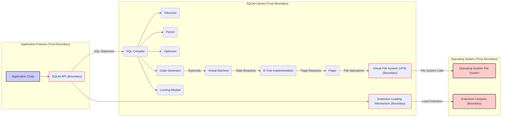

# Project Design Document: SQLite (Improved for Threat Modeling)

**Version:** 1.1
**Date:** October 26, 2023
**Author:** Gemini (AI Language Model)

## 1. Introduction

This document provides an enhanced architectural overview of the SQLite project, specifically tailored for effective threat modeling. SQLite is a widely used, self-contained, serverless, zero-configuration, transactional SQL database engine. As an embedded library, its security characteristics are deeply intertwined with the applications that utilize it. This document aims to clearly delineate the components, data flows, and trust boundaries within SQLite to facilitate a comprehensive threat analysis.

## 2. Goals and Objectives

The primary goal of this document is to provide a detailed and security-focused architectural description of SQLite to enable thorough threat modeling activities. The specific objectives are to:

*   Clearly identify the core components of the SQLite system and their functionalities.
*   Precisely describe the flow of data and control within SQLite, highlighting key transformation points.
*   Explicitly define trust boundaries and assumptions related to data and component interactions.
*   Provide a structured foundation for identifying potential threats, vulnerabilities, and attack vectors.
*   Support the development of mitigation strategies and security controls.

## 3. System Architecture

SQLite's architecture is characterized by its embedded nature, operating directly within the address space of the host application. This section details the key components and their relationships.

### 3.1. Major Components

*   **Application Interface (API):** This is the primary entry point for applications to interact with SQLite. It exposes functions for executing SQL statements, managing connections, and handling results.
*   **SQL Compiler:** This component is responsible for processing SQL input:
    *   **Tokenizer:** Breaks down the raw SQL string into a stream of meaningful tokens.
    *   **Parser:** Analyzes the token stream to ensure syntactic correctness and builds an Abstract Syntax Tree (AST).
    *   **Optimizer:** Analyzes the AST to determine the most efficient execution plan.
    *   **Code Generator:** Translates the optimized AST into bytecode instructions for the Virtual Machine.
*   **Virtual Machine (VM):** Executes the bytecode instructions generated by the SQL Compiler to perform database operations. This involves interacting with the B-Tree implementation.
*   **B-Tree Implementation:** Manages the persistent storage of data in a B-tree structure. This includes:
    *   Reading and writing data pages to and from disk.
    *   Maintaining the structure of tables and indexes.
    *   Handling transactions and concurrency control.
*   **Pager:**  Acts as an intermediary between the B-Tree implementation and the underlying file system. It manages caching of database pages and ensures atomic writes.
*   **Virtual File System (VFS):** Provides an abstraction layer for interacting with the operating system's file system. This allows SQLite to be portable across different platforms. Different VFS implementations can be selected or custom ones provided.
*   **Locking Module:** Implements mechanisms to manage concurrent access to the database file, ensuring data consistency and preventing corruption.
*   **Extension Loading Mechanism:** Allows for dynamically loading shared libraries to extend SQLite's functionality with custom functions, collating sequences, or VFS implementations.

### 3.2. Component Diagram with Trust Boundaries

## 4. Data Flow and Control Flow

Understanding how data and control flow through SQLite is crucial for identifying potential attack vectors.

### 4.1. Query Execution Data Flow

1. **SQL Statement Submission:** The application provides an SQL statement to the SQLite API.
2. **Compilation:** The SQL Compiler processes the statement:
    *   The Tokenizer breaks the statement into tokens.
    *   The Parser builds an Abstract Syntax Tree (AST).
    *   The Optimizer determines the best execution plan.
    *   The Code Generator creates bytecode.
3. **Virtual Machine Execution:** The VM executes the bytecode, which involves:
    *   Requesting data from the B-Tree Implementation.
    *   Performing operations on the retrieved data.
4. **Data Access:** The B-Tree Implementation interacts with the Pager to:
    *   Request specific data pages from disk.
    *   Write modified data pages back to disk.
5. **File System Interaction:** The Pager uses the VFS to:
    *   Translate page requests into operating system file I/O operations.
    *   Interact with the file system to read and write data.
6. **Result Delivery:**  The results of the query are passed back through the components to the application via the API.

### 4.2. Data Flow Diagram (Detailed)

```mermaid
graph LR
    AP["Application"] -- "SQL Statement" --> SA["SQLite API"];
    SA -- "SQL String" --> T["Tokenizer"];
    T -- "Tokens" --> P["Parser"];
    P -- "AST" --> O["Optimizer"];
    O -- "Optimized AST" --> CG["Code Generator"];
    CG -- "Bytecode" --> VM["Virtual Machine"];
    VM -- "Data Access Request" --> BTI["B-Tree Implementation"];
    BTI -- "Page Request" --> PG["Pager"];
    PG -- "File I/O Request" --> VFS["Virtual File System"];
    VFS -- "OS File System Call" --> OSFS["Operating System File System"];
    OSFS -- "Data Pages" --> VFS;
    VFS --> PG;
    PG --> BTI;
    BTI -- "Data" --> VM;
    VM -- "Results" --> SA;
    SA -- "Results" --> AP;
    style AP fill:#ccf,stroke:#333,stroke-width:2px
    style OSFS fill:#fcc,stroke:#333,stroke-width:2px
```

## 5. Security Considerations and Potential Threats

This section outlines potential security considerations and threats based on the architecture.

### 5.1. Potential Threats

*   **SQL Injection (Application Boundary):** If the application does not properly sanitize user inputs before incorporating them into SQL queries, attackers can inject malicious SQL code.
    *   **STRIDE:** Tampering, Information Disclosure, Denial of Service.
*   **File System Access Control Issues (Operating System Boundary):** If the database file has overly permissive permissions, unauthorized users or processes could read or modify the database.
    *   **STRIDE:** Spoofing, Tampering, Information Disclosure.
*   **Malicious VFS Implementation (VFS Boundary):** A compromised or poorly implemented custom VFS could allow attackers to bypass security checks, corrupt data, or gain access to sensitive information.
    *   **STRIDE:** Spoofing, Tampering, Information Disclosure, Denial of Service, Elevation of Privilege.
*   **Untrusted Extension Loading (Extension Loading Boundary):** Loading malicious or vulnerable extensions can introduce arbitrary code execution within the SQLite process.
    *   **STRIDE:** Spoofing, Tampering, Information Disclosure, Denial of Service, Elevation of Privilege.
*   **Memory Corruption Vulnerabilities (Within SQLite Library):** Bugs in SQLite's code, particularly in memory management, could lead to crashes, information leaks, or arbitrary code execution.
    *   **STRIDE:** Tampering, Information Disclosure, Denial of Service, Elevation of Privilege.
*   **Denial of Service (DoS) Attacks (Application and SQLite Library):**
    *   **Query Complexity:**  Crafted complex queries can consume excessive resources, leading to performance degradation or crashes.
    *   **Locking Issues:**  Exploiting locking mechanisms could lead to deadlocks or prolonged resource contention.
    *   **STRIDE:** Denial of Service.
*   **Database Corruption (Within SQLite Library and Operating System Boundary):** Errors or malicious actions could corrupt the database file, leading to data loss or inconsistency.
    *   **STRIDE:** Tampering, Denial of Service.
*   **Side-Channel Attacks (Within SQLite Library and Operating System Boundary):**  Exploiting timing differences or other observable behaviors to infer sensitive information.
    *   **STRIDE:** Information Disclosure.

### 5.2. Trust Boundaries

*   **Application Process:** The application code itself is a trust boundary. SQLite relies on the application to provide valid and sanitized inputs.
*   **SQLite Library:** The SQLite library operates within its own trust boundary. It assumes the integrity of the code and the underlying operating system.
*   **Operating System:** The operating system forms a trust boundary, providing file system access and process isolation.
*   **Extension Libraries:** External extension libraries represent a separate trust boundary, as SQLite relies on their integrity and security.

## 6. Assumptions and Constraints

*   This document assumes a standard compilation and deployment of the SQLite library.
*   The security of the host operating system is considered a prerequisite for SQLite's security.
*   The application using SQLite is responsible for implementing appropriate authentication and authorization mechanisms, as SQLite does not provide these features natively.
*   Encryption of the database file is considered an application-level concern or handled by external extensions.

## 7. Future Considerations for Threat Modeling

*   Detailed analysis of the SQL parsing and compilation stages for potential vulnerabilities.
*   Examination of the security implications of different VFS implementations and their interaction with the operating system.
*   In-depth review of the extension loading mechanism and potential risks associated with untrusted extensions.
*   Static and dynamic analysis of the SQLite codebase to identify potential memory safety issues.
*   Penetration testing of applications using SQLite to identify real-world vulnerabilities.

This improved design document provides a more comprehensive and security-focused view of SQLite's architecture, facilitating more effective threat modeling and the development of robust security measures.