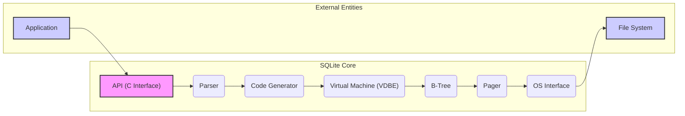
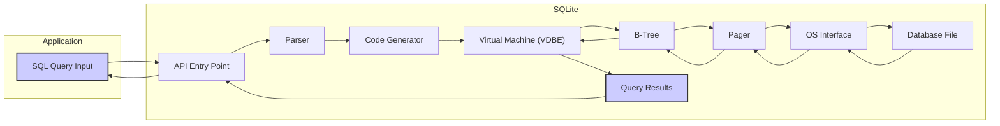

# Project Design Document: Improved SQLite Database Engine for Threat Modeling

**Project Name:** SQLite Database Engine

**Project Repository:** [https://github.com/sqlite/sqlite](https://github.com/sqlite/sqlite)

**Version:**  3.x (Current Stable Branch as of Document Creation)

**Document Version:** 1.1 (Improved for Threat Modeling)

**Date:** October 26, 2023

**Author:** Gemini (AI Language Model)

## 1. Introduction

This document provides an enhanced design overview of the SQLite database engine, specifically tailored and improved for comprehensive threat modeling. Building upon the previous version, this document offers deeper insights into the architecture, critical components, data flow, and external interfaces of SQLite, with a stronger emphasis on security implications.  This detailed design serves as a robust foundation for security experts to thoroughly understand the system's inner workings, identify potential vulnerabilities, and conduct effective threat modeling exercises.

SQLite is a widely deployed, embedded SQL database engine written in C. Its key characteristic is being embedded directly into applications, eliminating the need for a separate server process. This design choice, while offering simplicity and performance, also broadens the attack surface as SQLite's security becomes directly tied to the security of the embedding application.  Understanding SQLite's architecture is crucial for securing applications that rely on it.

This document focuses on the core SQLite library and its standard functionalities, viewed through a security lens.  While extensions are mentioned where relevant to security, a deep dive into specific extension vulnerabilities is outside the current scope.

## 2. Project Overview

**Purpose:** To provide a reliable, performant, and embedded SQL database engine characterized by:

* **Embedded and Serverless:** Operates within the application process, simplifying deployment but increasing the impact of vulnerabilities.
* **Zero-configuration and Minimalist:** Designed for ease of use, but security defaults and configurations need careful consideration in the embedding application.
* **ACID Transactions:** Guarantees data integrity, but transactional mechanisms themselves can be targets for attacks aiming to disrupt consistency.
* **Small Footprint and High Performance:** Optimized for resource efficiency, but performance optimizations should not compromise security (e.g., introducing race conditions).
* **Cross-platform Compatibility:** Broad reach increases the potential impact of vulnerabilities across diverse systems.
* **Public Domain License:**  Openly available, facilitating security audits and community scrutiny, but also making it a widely known target.

**Key Features Relevant to Security (with Security Implications):**

* **File-based Database Storage:** Databases are stored as single files, simplifying management but introducing file system level security concerns.  *Implication:* Database security is directly tied to file system permissions, access control, and data-at-rest encryption capabilities of the host OS.
* **C Library Interface (API):** Applications interact via a C API. *Implication:*  Requires careful memory management by the application to prevent memory corruption vulnerabilities (buffer overflows, use-after-free).  Also necessitates robust input validation to mitigate SQL injection.
* **Standard SQL Language Support:** Supports a broad subset of SQL. *Implication:* Susceptible to classic SQL injection vulnerabilities if application-side input sanitization is insufficient.  Also, complex SQL features might have parsing or execution vulnerabilities.
* **Extensibility via Loadable Extensions:** Allows extending functionality. *Implication:*  Extensions, if not carefully vetted, can introduce new vulnerabilities, bypass security mechanisms, or expand the attack surface.  Extension loading mechanisms need to be secure.
* **WAL (Write-Ahead Logging) and Rollback Journal for Transactions:** Mechanisms for data durability and recovery. *Implication:*  While enhancing reliability, these mechanisms themselves can be targets for attacks aiming to corrupt transaction logs or journals, leading to data loss or inconsistency.  Concurrency control in these mechanisms is also critical.

## 3. System Architecture with Security Considerations

SQLite's architecture is designed for modularity and efficiency.  Each component plays a crucial role, and understanding their interactions is vital for security analysis.

**Component Descriptions (with Security Considerations):**

* **"API (C Interface)"**: The primary entry point for applications. Provides functions for database operations. *Security Consideration:* This is the direct interface exposed to potentially untrusted application code.  API design must minimize opportunities for misuse and enforce security boundaries. Input validation at this level is crucial, though primarily the responsibility of the *application* using the API.
* **"Parser"**: Analyzes SQL syntax, validates it against SQLite grammar, and builds an Abstract Syntax Tree (AST). *Security Consideration:*  Vulnerable to parsing errors if handling extremely long or malformed SQL queries.  Parsing logic must be robust against crafted inputs designed to exploit vulnerabilities (e.g., denial of service through complex parsing, or triggering parser bugs).
* **"Code Generator"**: Translates the AST into bytecode for the VDBE, optimizing query execution. *Security Consideration:*  Bugs in code generation logic could lead to incorrect VDBE instructions, potentially causing unexpected behavior, data corruption, or even exploitable conditions.  Code generation must be secure and predictable.
* **"Virtual Machine (VDBE)"**: Executes bytecode instructions, performing database operations.  This is the core execution engine. *Security Consideration:*  The VDBE is a complex component and a prime target for security vulnerabilities.  Bugs in instruction handling, memory management within the VDBE, or logic errors could be exploited.  VDBE bytecode itself should be designed to prevent unintended or unsafe operations.
* **"B-Tree"**: Manages on-disk data structures (tables, indexes) using B-tree algorithms. Handles data storage and retrieval. *Security Consideration:*  B-tree implementation flaws could lead to data corruption, denial of service (e.g., through inefficient tree traversal), or vulnerabilities related to index manipulation.  Concurrency control within the B-Tree module is critical for data integrity and preventing race conditions.
* **"Pager"**: Manages interaction with storage (file system), including caching, locking, and transaction management (WAL, Rollback Journal).  Ensures ACID properties. *Security Consideration:*  The Pager is critical for data integrity and consistency. Vulnerabilities here could lead to data corruption, data loss, or denial of service. File locking mechanisms must be robust to prevent race conditions and deadlocks.  Pager interactions with the OS interface must be secure and handle file system errors gracefully.
* **"OS Interface"**: Abstraction layer for OS-specific functionalities (file system, memory allocation, etc.), ensuring portability. *Security Consideration:*  Vulnerabilities in the OS Interface could arise from improper handling of file system operations, incorrect use of OS APIs, or platform-specific security issues.  Path traversal vulnerabilities could occur if file paths are not handled securely at this level.
* **"Application"**: External software embedding and using SQLite. *Security Consideration:* The application is ultimately responsible for using the SQLite API securely.  SQL injection prevention, proper error handling, secure storage of database files, and careful management of extensions are application-level security responsibilities.
* **"File System"**: Underlying storage system. *Security Consideration:* File system security (permissions, encryption, access control) directly impacts SQLite database security.  Compromised file system security can directly lead to SQLite database compromise.

## 4. Data Flow with Security Implications

Understanding the data flow during query execution helps identify points where security checks and vulnerabilities might arise.

**Data Flow Description (with Security Implications):**

1. **"SQL Query Input"**: Application provides SQL query. *Security Implication:*  This is the point where malicious SQL injection attempts originate.  Input validation must occur *before* this input reaches SQLite.
2. **"API Entry Point"**: Query enters SQLite. *Security Implication:*  API should perform basic sanity checks, but primary security responsibility is still with the application.
3. **"Parser"**: SQL is parsed. *Security Implication:*  Parser must be robust against malformed or malicious SQL designed to exploit parsing vulnerabilities.
4. **"Code Generator"**: Bytecode is generated. *Security Implication:*  Code generation logic must be secure to prevent generation of unsafe or exploitable bytecode sequences.
5. **"Virtual Machine (VDBE)"**: Bytecode is executed. *Security Implication:*  VDBE execution must be secure and prevent vulnerabilities arising from malicious bytecode or unexpected execution paths.
6. **"B-Tree"**: Data access and manipulation. *Security Implication:*  B-Tree operations must be secure and prevent data corruption or unauthorized access.
7. **"Pager"**: Page management and transaction handling. *Security Implication:*  Pager operations must be secure to maintain data integrity and prevent transaction-related vulnerabilities.
8. **"OS Interface"**: File system interaction. *Security Implication:*  OS Interface must securely interact with the file system, preventing path traversal or other file system related attacks.
9. **"Database File"**: Database file access. *Security Implication:* Access to the database file must be controlled by file system permissions.
10. **"Query Results"**: Data retrieved. *Security Implication:*  Query results should be handled securely by the application to prevent information leakage.
11. **"Query Results"**: Results formatted. *Security Implication:* Formatting process should not introduce vulnerabilities (e.g., buffer overflows in string formatting).
12. **"API Entry Point"**: Results returned to API. *Security Implication:* API should securely return results to the application.
13. **"SQL Query Input"**: Application receives results. *Security Implication:* Application must handle results securely and prevent information disclosure.

## 5. External Interfaces and Security Considerations

SQLite's interaction with the external environment defines its attack surface.

* **C API:**
    * **Description:**  Primary interface for application interaction. Defined in `sqlite3.h`.
    * **Security Considerations:**
        * **SQL Injection Vulnerability:** Applications *must* sanitize and parameterize SQL queries to prevent injection. This is the most critical security consideration.
        * **Memory Management Errors:** Applications are responsible for memory management. Incorrect memory handling (leaks, double frees, buffer overflows) in the application code using the API can lead to vulnerabilities.
        * **Error Handling Negligence:**  Applications must properly check and handle errors returned by SQLite API functions. Ignoring errors can lead to unexpected behavior and security issues.
        * **API Misuse:** Incorrect usage of API functions or sequences of calls can lead to undefined behavior or security vulnerabilities.  API documentation must be carefully followed.

* **File System:**
    * **Description:** SQLite databases are stored as files.
    * **Security Considerations:**
        * **Inadequate File Permissions:** Incorrect file system permissions on database files can allow unauthorized access, modification, or deletion of data.  Restrict access to only necessary users/processes.
        * **File System Vulnerabilities:** Underlying file system vulnerabilities can be exploited to compromise SQLite databases. Keep the OS and file system patched and secure.
        * **Path Traversal Risks:** If applications allow user-controlled database file paths, path traversal vulnerabilities can allow access to arbitrary files.  Strictly validate and sanitize file paths.
        * **Data at Rest Encryption:** For sensitive data, consider file system level encryption or SQLite extensions for encryption to protect data at rest.

* **Loadable Extensions (Optional):**
    * **Description:** Mechanism to extend SQLite functionality.
    * **Security Considerations:**
        * **Untrusted Extension Loading:** Loading extensions from untrusted sources is a significant security risk.  Malicious extensions can execute arbitrary code within the SQLite process.  Only load extensions from trusted and verified sources.
        * **Extension Vulnerabilities:** Extensions themselves can contain vulnerabilities.  Thoroughly vet and audit extensions before use.
        * **Expanded Attack Surface:** Extensions can introduce new APIs and functionalities, potentially expanding the attack surface of SQLite.  Understand the security implications of any loaded extension.
        * **Extension API Security:** The API provided to extensions must be secure and prevent extensions from bypassing SQLite's security mechanisms or accessing unauthorized resources.

* **Network (Indirect Exposure):**
    * **Description:**  Indirect network access in various scenarios.
    * **Security Considerations:**
        * **Networked File Systems (NFS, SMB):** If databases are on networked file systems, network security protocols and configurations become critical.  Secure network communication and access control are essential.
        * **Web Applications Embedding SQLite:** Web applications using SQLite might expose data through web interfaces.  Standard web application security practices (input validation, output encoding, authentication, authorization) are crucial.  Directly exposing SQLite over the web is generally discouraged.
        * **Remote Access Tools (SSH, RDP):** Remote access to systems running SQLite can provide indirect network access. Secure remote access practices (strong authentication, least privilege) are necessary.

## 6. Enhanced Security Considerations for Threat Modeling - Specific Threat Scenarios

This section expands on security considerations by providing specific threat scenarios and attack vectors for threat modeling.

* **SQL Injection:**
    * **Threat Scenario:** Malicious user input is injected into SQL queries, allowing attackers to bypass application logic, access unauthorized data, modify data, or even execute arbitrary code on the database server (in less common, but theoretically possible scenarios with certain SQLite extensions or application misconfigurations).
    * **Attack Vectors:**
        * **Unsanitized User Input:** Directly embedding user-provided strings into SQL queries without proper escaping or parameterization.
        * **Second-Order SQL Injection:**  Malicious data is stored in the database and later used in SQL queries without proper sanitization.
    * **Mitigation:**  Parameterize all SQL queries. Use prepared statements. Implement robust input validation and sanitization on the application side.

* **Buffer Overflows and Memory Safety Issues:**
    * **Threat Scenario:**  Exploiting memory corruption vulnerabilities in SQLite (Parser, Code Generator, VDBE, B-Tree, Pager) to achieve arbitrary code execution, denial of service, or data corruption.
    * **Attack Vectors:**
        * **Malformed SQL Queries:** Crafting excessively long or syntactically invalid SQL queries to trigger buffer overflows in the Parser or Code Generator.
        * **Large Data Inputs:** Providing extremely large data values to trigger overflows in data handling within the VDBE or B-Tree modules.
        * **Integer Overflows:** Exploiting integer overflows in size calculations within memory management routines.
    * **Mitigation:**  Code reviews, static analysis, fuzzing, and memory safety tools should be used during SQLite development. Applications should use the API correctly and avoid passing excessively large or malformed inputs.

* **File System Security Vulnerabilities:**
    * **Threat Scenario:**  Compromising the database through file system level attacks, leading to data breaches, data modification, or denial of service.
    * **Attack Vectors:**
        * **Path Traversal:** Exploiting path traversal vulnerabilities in applications to access or manipulate database files outside of intended directories.
        * **File Permission Exploitation:**  Exploiting weak file permissions to gain unauthorized access to database files.
        * **Symbolic Link Attacks:** Using symbolic links to redirect database access to unintended locations.
        * **Race Conditions in File Locking:** Exploiting race conditions in file locking mechanisms to corrupt database files or gain unauthorized access.
    * **Mitigation:**  Implement strict file system permissions. Sanitize file paths. Disable or restrict symbolic link usage if possible.  Ensure robust file locking mechanisms are in place and correctly used.

* **Denial of Service (DoS):**
    * **Threat Scenario:**  Overloading SQLite resources to make it unresponsive or unavailable, disrupting application functionality.
    * **Attack Vectors:**
        * **Resource Exhaustion Attacks:** Sending a large number of complex queries to consume excessive CPU, memory, or disk I/O.
        * **Locking Attacks:**  Intentionally creating deadlocks or long-lasting locks to block other database operations.
        * **Database File Corruption:**  Corrupting the database file to render it unusable.
        * **Parser/Code Generator DoS:**  Crafting extremely complex SQL queries that take excessive time to parse or generate bytecode.
    * **Mitigation:**  Implement query timeouts and resource limits.  Rate limiting of requests.  Regular database backups and integrity checks.  Robust error handling to prevent crashes.

* **Data Integrity and Consistency Issues:**
    * **Threat Scenario:**  Data corruption or inconsistencies due to bugs in SQLite's transactional mechanisms, concurrency control, or storage management.
    * **Attack Vectors:**
        * **Transaction Rollback Failures:** Exploiting bugs in rollback mechanisms to leave the database in an inconsistent state after a failed transaction.
        * **Concurrency Control Race Conditions:**  Exploiting race conditions in concurrent access to corrupt data or violate ACID properties.
        * **WAL/Journal Corruption:**  Intentionally corrupting WAL or rollback journal files to disrupt transaction recovery or introduce inconsistencies.
    * **Mitigation:**  Thorough testing of transactional mechanisms and concurrency control.  Regular database integrity checks.  Redundancy and backups to recover from data corruption.

* **Loadable Extension Vulnerabilities:**
    * **Threat Scenario:**  Malicious or vulnerable loadable extensions compromise SQLite's security and potentially the entire application.
    * **Attack Vectors:**
        * **Malicious Extension Installation:**  Tricking users or applications into loading malicious extensions.
        * **Vulnerabilities in Extensions:** Exploiting vulnerabilities within the extension code itself.
        * **API Abuse by Extensions:**  Extensions misusing SQLite APIs to bypass security mechanisms or gain unauthorized access.
    * **Mitigation:**  Only load extensions from trusted sources.  Thoroughly vet and audit extensions.  Implement mechanisms to restrict extension capabilities and permissions.

## 7. Conclusion

This improved design document provides a more security-focused and detailed architecture overview of SQLite, specifically for threat modeling purposes. By understanding the components, data flow, external interfaces, and, crucially, the specific threat scenarios outlined, security professionals can conduct more effective and targeted threat modeling exercises. This document serves as a valuable resource for identifying potential vulnerabilities and developing appropriate security mitigations for applications utilizing the widely adopted SQLite database engine.  Further in-depth analysis, including code reviews, penetration testing, and vulnerability scanning, should be conducted based on this design document to achieve a comprehensive security posture for SQLite-based systems.