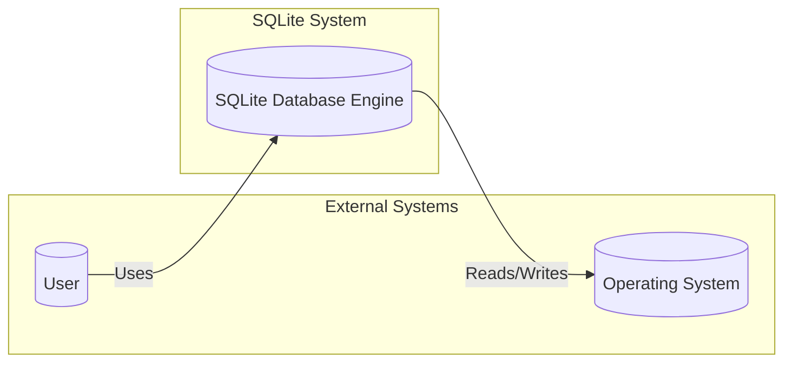
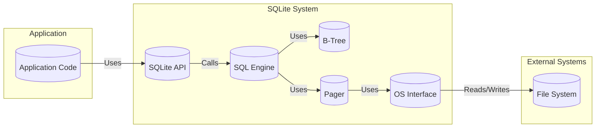
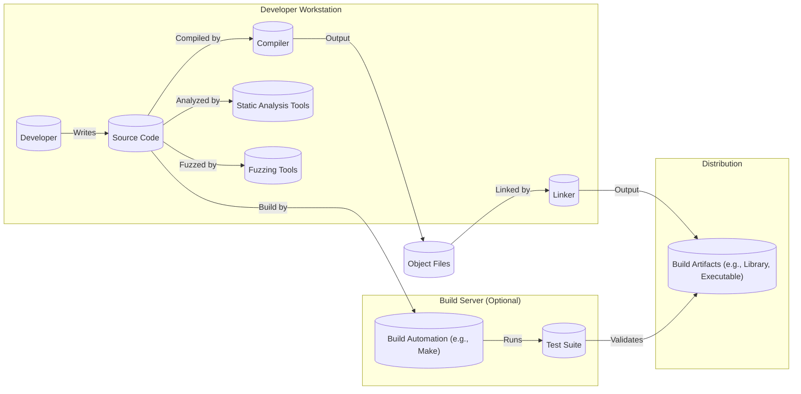

Okay, let's create a design document for SQLite, focusing on aspects relevant for threat modeling.

# BUSINESS POSTURE

SQLite is a widely used, embedded, SQL database engine.  It's designed to be self-contained, serverless, zero-configuration, and transactional.  Its ubiquity and ease of integration make it a critical component in countless applications, from mobile apps and desktop software to web browsers and embedded systems.

Priorities and Goals:

*   Reliability:  SQLite must function correctly and consistently, even under heavy load or unexpected conditions. Data integrity is paramount.
*   Portability:  It needs to run on a vast array of platforms and architectures with minimal dependencies.
*   Performance:  Operations should be as fast as possible, given the constraints of being embedded and self-contained.
*   Small Footprint:  The library should be compact to minimize resource usage, especially in resource-constrained environments.
*   Ease of Use:  The API should be straightforward and well-documented, making it easy for developers to integrate SQLite into their projects.
*   Open Source and Public Domain: Maintain the existing licensing model, fostering widespread adoption and community contributions.

Business Risks:

*   Data Corruption:  Bugs in SQLite could lead to data loss or corruption, impacting the applications that rely on it. This is the most significant risk.
*   Security Vulnerabilities:  Exploitable vulnerabilities (e.g., SQL injection, buffer overflows) could allow attackers to compromise applications using SQLite, potentially leading to data breaches or system compromise.
*   Denial of Service:  While less critical than in a server-based database, vulnerabilities that allow an attacker to crash or hang SQLite could disrupt application functionality.
*   Incompatibility:  Changes to SQLite that break backward compatibility could disrupt existing applications.
*   Reputational Damage:  Major security flaws or reliability issues could damage SQLite's reputation and lead to developers choosing alternative solutions.

# SECURITY POSTURE

Existing Security Controls:

*   security control: Extensive Testing: SQLite boasts a remarkably comprehensive test suite, including fuzz testing, boundary condition testing, and performance testing. This is described extensively on the SQLite website and in various publications about SQLite's development process.
*   security control: Secure Coding Practices: The SQLite codebase is known for its adherence to secure coding practices, including careful memory management, input validation, and avoidance of unsafe C functions. This is evident in the source code and coding style guidelines.
*   security control: SQL Injection Prevention: While SQLite itself doesn't directly handle network connections, it provides parameterized queries (prepared statements) to prevent SQL injection vulnerabilities when used correctly by developers. This is documented in the SQLite API documentation.
*   security control: Access Control (Limited): SQLite offers limited built-in access control mechanisms. File system permissions typically control access to the database file. Some extensions provide more granular control.
*   security control: Encryption (Optional):  SQLite offers extensions like SEE (SQLite Encryption Extension) and SQLCipher that provide encryption at rest. These are not part of the core library but are widely used.
*   security control: Fuzzing: Extensive use of fuzzing tools like American Fuzzy Lop (AFL) and OSS-Fuzz to identify potential vulnerabilities.
*   security control: Static Analysis: Use of static analysis tools to identify potential code quality and security issues.

Accepted Risks:

*   accepted risk: Local File Access: SQLite databases are typically stored as files on the local filesystem.  Security relies heavily on the underlying operating system's file permissions.  This is inherent to SQLite's design as an embedded database.
*   accepted risk: Limited Built-in Access Control:  SQLite's built-in access control is minimal.  Fine-grained permissions are typically managed by the application using SQLite, not by SQLite itself.
*   accepted risk: Extension Security: The security of extensions (like encryption extensions) is the responsibility of the extension provider, not the core SQLite project.

Recommended Security Controls:

*   security control: Sandboxing: Encourage the use of sandboxing techniques (where applicable) to isolate applications using SQLite, limiting the potential impact of vulnerabilities.
*   security control: Regular Audits: Conduct regular security audits of the codebase, focusing on areas identified as high-risk.
*   security control: Supply Chain Security: Implement measures to ensure the integrity of the build process and distribution channels, preventing the introduction of malicious code.

Security Requirements:

*   Authentication: Not directly applicable to SQLite itself, as it's an embedded database. Authentication is the responsibility of the application using SQLite.
*   Authorization: Limited built-in authorization. Applications should implement their own authorization logic to control access to data within the database.
*   Input Validation: SQLite itself performs some input validation, but applications must use parameterized queries to prevent SQL injection.  All user-supplied data used in SQL queries should be treated as untrusted.
*   Cryptography:
    *   Encryption at Rest: While not mandatory, strongly recommend the use of encryption extensions (like SEE or SQLCipher) for sensitive data.
    *   Encryption in Transit: Not directly applicable to SQLite itself, as it doesn't handle network communication.

# DESIGN

## C4 CONTEXT



Element Descriptions:

*   Element:
    *   Name: User
    *   Type: Person
    *   Description: A person interacting with an application that uses SQLite.
    *   Responsibilities: Provides input to the application, views data from the application.
    *   Security controls: Authentication and authorization are handled by the application, not SQLite.

*   Element:
    *   Name: Operating System
    *   Type: System
    *   Description: The underlying operating system (e.g., Windows, Linux, macOS, iOS, Android).
    *   Responsibilities: Provides file system access, memory management, and other system resources.
    *   Security controls: File system permissions, process isolation, memory protection.

*   Element:
    *   Name: SQLite Database Engine
    *   Type: System
    *   Description: The core SQLite library.
    *   Responsibilities: Manages data storage, retrieval, and manipulation; executes SQL queries; ensures data integrity.
    *   Security controls: Secure coding practices, extensive testing, parameterized queries (for SQL injection prevention), optional encryption extensions.

## C4 CONTAINER



Element Descriptions:

*   Element:
    *   Name: Application Code
    *   Type: Container
    *   Description: The code of the application that uses SQLite.
    *   Responsibilities: Implements application logic, interacts with the user, uses the SQLite API to manage data.
    *   Security controls: Application-specific security controls, including authentication, authorization, and input validation.

*   Element:
    *   Name: SQLite API
    *   Type: Container
    *   Description: The public API of the SQLite library.
    *   Responsibilities: Provides functions for opening databases, executing queries, managing transactions, etc.
    *   Security controls: Parameterized queries, input validation.

*   Element:
    *   Name: SQL Engine
    *   Type: Container
    *   Description: The component that parses and executes SQL queries.
    *   Responsibilities: Parses SQL statements, optimizes query execution, interacts with the B-Tree and Pager.
    *   Security controls: Secure coding practices, input validation.

*   Element:
    *   Name: B-Tree
    *   Type: Container
    *   Description: The data structure used for storing data and indexes.
    *   Responsibilities: Efficiently stores and retrieves data.
    *   Security controls: Secure coding practices, data integrity checks.

*   Element:
    *   Name: Pager
    *   Type: Container
    *   Description: The component that manages the database file pages.
    *   Responsibilities: Reads and writes pages to/from the database file, manages caching.
    *   Security controls: Secure coding practices, data integrity checks.

*   Element:
    *   Name: OS Interface
    *   Type: Container
    *   Description: The component that interacts with the underlying operating system.
    *   Responsibilities: Provides platform-specific implementations for file I/O, memory management, etc.
    *   Security controls: Secure coding practices, reliance on OS security mechanisms.

*   Element:
    *   Name: File System
    *   Type: System
    *   Description: The file system provided by the operating system.
    *   Responsibilities: Stores the database file.
    *   Security controls: File system permissions.

## DEPLOYMENT

Possible Deployment Solutions:

1.  Static Linking: SQLite is compiled directly into the application executable.
2.  Dynamic Linking: SQLite is a separate shared library (DLL, SO, dylib) that is loaded at runtime.
3.  System Library: SQLite is provided as a pre-installed system library.

Chosen Solution (Static Linking - most common and illustrates the embedded nature best):

```mermaid
graph LR
    subgraph "Deployment Environment (e.g., User's Device)"
        App[("Application Executable")]
        SQLite[("SQLite (Statically Linked)")]
        OS[("Operating System")]
        FileSystem[("File System")]
        DatabaseFile[(("Database File"))]

        App -- "Contains" --> SQLite
        App -- "Uses" --> OS
        OS -- "Provides" --> FileSystem
        FileSystem -- "Stores" --> DatabaseFile
    end
```

Element Descriptions:

*   Element:
    *   Name: Application Executable
    *   Type: Node
    *   Description: The compiled application binary.
    *   Responsibilities: Runs the application logic.
    *   Security controls: Code signing, ASLR, DEP.

*   Element:
    *   Name: SQLite (Statically Linked)
    *   Type: Node
    *   Description: The SQLite library code, embedded within the application executable.
    *   Responsibilities: Manages the database.
    *   Security controls: Inherits security controls from the application executable.

*   Element:
    *   Name: Operating System
    *   Type: Node
    *   Description: The underlying operating system.
    *   Responsibilities: Provides system resources.
    *   Security controls: OS-level security mechanisms.

*   Element:
    *   Name: File System
    *   Type: Node
    *   Description: The file system provided by the OS.
    *   Responsibilities: Stores files.
    *   Security controls: File system permissions.

*   Element:
    *   Name: Database File
    *   Type: Node
    *   Description: The SQLite database file.
    *   Responsibilities: Stores the application data.
    *   Security controls: File system permissions, optional encryption (if using an extension like SQLCipher).

## BUILD



Build Process Description:

1.  Developer writes and modifies the SQLite source code.
2.  Static analysis tools (e.g., Clang Static Analyzer) are used to identify potential code quality and security issues.
3.  Fuzzing tools (e.g., AFL, OSS-Fuzz) are used to test the code with a wide range of inputs, looking for crashes or unexpected behavior.
4.  The compiler (e.g., GCC, Clang) compiles the source code into object files.
5.  The linker combines the object files to create the final build artifacts (e.g., the SQLite library or an application executable that statically links SQLite).
6.  (Optional) A build server automates the build process, including running the extensive SQLite test suite.
7.  The build artifacts are distributed (e.g., through the SQLite website, package managers, or bundled with applications).

Security Controls in Build Process:

*   security control: Static Analysis: Identifies potential vulnerabilities before runtime.
*   security control: Fuzzing: Discovers edge cases and vulnerabilities that might be missed by traditional testing.
*   security control: Extensive Test Suite: Ensures code correctness and helps prevent regressions.
*   security control: (Optional) Build Server: Provides a consistent and reproducible build environment.
*   security control: (Optional) Supply Chain Security Measures:  Digital signatures, secure distribution channels.

# RISK ASSESSMENT

Critical Business Processes:

*   Data Storage and Retrieval:  The core function of SQLite is to reliably store and retrieve data for applications.  Failure of this process is critical.
*   Data Integrity:  Maintaining the consistency and accuracy of data is paramount.  Corruption or loss of data is a major risk.

Data Sensitivity:

The sensitivity of the data stored in SQLite databases varies greatly depending on the application.  SQLite itself doesn't inherently know the sensitivity of the data.  Examples:

*   Low Sensitivity:  Configuration settings, cached data.
*   Medium Sensitivity:  User preferences, application state.
*   High Sensitivity:  Personal information, financial data, medical records (when SQLite is used in applications handling such data).  Encryption extensions are strongly recommended in these cases.

# QUESTIONS & ASSUMPTIONS

Questions:

*   Are there any specific compliance requirements (e.g., HIPAA, GDPR) that apply to applications using SQLite in particular contexts? This would influence recommendations for encryption and data handling.
*   What is the expected threat model for typical applications using SQLite? (e.g., untrusted user input, malicious local users, network attackers). This helps prioritize security controls.
*   What is the process for reporting and addressing security vulnerabilities discovered in SQLite?

Assumptions:

*   BUSINESS POSTURE: We assume a moderate risk tolerance, given SQLite's widespread use and the potential impact of vulnerabilities. While it's open-source and widely used, reliability and security are paramount.
*   SECURITY POSTURE: We assume that developers using SQLite are responsible for implementing appropriate security controls within their applications, particularly regarding authentication, authorization, and input validation. We assume basic secure coding practices are followed in the SQLite codebase.
*   DESIGN: We assume a typical deployment scenario where SQLite is statically linked into an application. We assume the application is responsible for managing the database file and its permissions. We assume that if sensitive data is stored, developers will use an appropriate encryption extension.