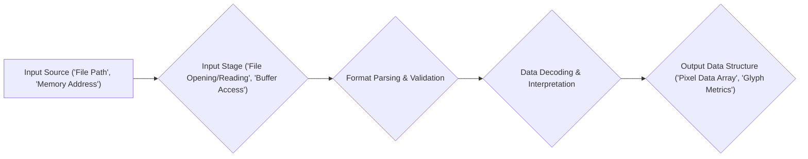

# Project Design Document: stb Libraries

**Version:** 1.1
**Date:** October 26, 2023
**Author:** AI Software Architect

## 1. Introduction

This document provides an enhanced design overview of the `stb` libraries, a collection of single-file public domain libraries primarily focused on simplifying common multimedia processing tasks. This revised document aims to offer a more detailed and nuanced understanding of the library's architecture, components, and data flow, thereby strengthening the foundation for subsequent threat modeling activities.

## 2. Project Overview

The `stb` project, accessible on GitHub at [https://github.com/nothings/stb](https://github.com/nothings/stb), is a curated collection of independent, self-contained C libraries made available under the public domain license. A key design principle is ease of integration, achieved by distributing each library as a single `.h` file. This allows developers to incorporate the functionality by simply including the relevant header. The libraries prioritize simplicity, efficiency, and broad platform compatibility for common multimedia operations.

## 3. Goals and Objectives

The core goals underpinning the `stb` project are:

* **Extreme Simplicity:** To offer libraries that are exceptionally easy to use and integrate, minimizing complexity for developers.
* **High Efficiency:** To provide performant implementations for the targeted multimedia processing tasks, optimizing for speed and resource usage.
* **Broad Portability:** To ensure the libraries can be compiled and function correctly across a diverse range of operating systems and hardware architectures.
* **Unrestricted Use (Public Domain):** To release the code under the public domain license, granting users maximum freedom to utilize, modify, and distribute the code without limitations.

The primary objective of this design document is to provide a clear and comprehensive articulation of the internal workings and design principles of the `stb` libraries. This detailed understanding is crucial for conducting a thorough and effective threat model.

## 4. Scope

This design document encompasses the general architectural patterns and common functionalities observed across the various individual `stb` libraries. While each library addresses a specific need, this document emphasizes the shared design philosophies, recurring patterns, and potential security considerations that are broadly applicable throughout the collection. Specific examples from individual libraries will be used to illustrate these commonalities.

The scope includes:

* The overarching structure and organizational principles of the `stb` library collection.
* Common data processing methodologies employed within the libraries.
* Mechanisms for handling input and output operations.
* Considerations related to memory management practices.
* Approaches to error handling and reporting.

The scope explicitly excludes:

* A granular, function-by-function analysis of every routine within each individual library.
* Detailed performance benchmarks or comparisons with alternative libraries.
* In-depth examination of the specific algorithms implemented within the libraries.
* Analysis of external software projects that utilize the `stb` libraries as dependencies.

## 5. Architecture and Components

The defining architectural characteristic of the `stb` project is its modular, single-file structure. Each library is entirely self-contained within a single `.h` file.

Key architectural features include:

* **Single Header Distribution:** Each library is typically distributed as a single header file, containing both the function declarations (interface) and, conditionally, the implementation.
* **Implementation via Macros:** The implementation code is often included directly within the header file, activated when a specific preprocessor macro (e.g., `STB_IMAGE_IMPLEMENTATION` for `stb_image.h`) is defined in the source file that includes the header. This eliminates the need for separate compilation and linking of library files.
* **Foundation in Standard C:** The libraries are predominantly written in standard C, ensuring broad compatibility and minimizing external dependencies.
* **Minimal External Dependencies:** A core design goal is to minimize or eliminate dependencies beyond the standard C library, simplifying integration and reducing the risk of dependency conflicts.
* **Procedural API Design:** The libraries expose their functionality through a set of C functions, providing a straightforward and predictable interface.
* **Use of Standard C Data Structures:** Data is typically represented using standard C data structures such as structs, arrays, and pointers.

Common components and patterns found across many `stb` libraries include:

* **Input Handling:**
    * **File System Access:** Libraries frequently read data from files on the file system (e.g., `stb_image` for image files, `stb_truetype` for font files). This involves standard C file operations like `fopen`, `fread`, and `fclose`.
    * **In-Memory Buffers as Input:**  Input data can also be provided directly as in-memory buffers, offering flexibility for applications that manage their own data loading.
    * **Format-Specific Parsing:** Libraries implement parsers for various file formats (e.g., PNG, JPEG, TrueType). This involves interpreting the byte stream according to the format specification and extracting relevant data fields.
* **Data Processing and Interpretation:**
    * **Decoding Algorithms:** Implementations of decoding algorithms specific to the data format are present (e.g., DEFLATE decompression in `stb_image` for PNG).
    * **Data Conversion Routines:** Functions for converting between different data representations, such as color spaces (RGB, grayscale) and bit depths, are common.
* **Output Generation:**
    * **In-Memory Data Structures as Output:** The primary output is often a populated in-memory data structure representing the processed data (e.g., an array of pixel data for images, glyph information for fonts).
    * **Writing to Memory Buffers:** Some libraries offer functionality to write processed data back into memory buffers.
* **Memory Management Practices:**
    * **Manual Memory Allocation:** The libraries generally rely on manual memory management using functions like `malloc`, `realloc`, and `free`. The responsibility for allocating and freeing memory for input and output data often lies with the calling application.
    * **Internal Temporary Allocations:**  Temporary memory allocations may occur internally during the processing of data.
* **Error Handling Strategies:**
    * **Return Codes for Status:** Functions commonly use return codes (e.g., 0 for success, non-zero for errors) to indicate the outcome of operations.
    * **Error Pointers for Details:** Some libraries provide mechanisms to return more detailed error information, often through pointers to error strings or specific error codes. For example, `stb_image` might return `NULL` on failure and provide a textual reason via a global variable (though this practice is less common now).

## 6. Data Flow

The typical data flow within an `stb` library involved in decoding or processing data can be visualized as follows:

**Detailed Explanation of Data Flow:**

1. **Input Source:** The process begins with the specification of the input data source, which can be either a file path pointing to a file on the file system or the memory address of an in-memory buffer containing the data.
2. **Input Stage:** The library then proceeds to access the input data. For file-based input, this involves opening the file, reading the byte stream, and potentially performing initial checks. For memory buffers, this involves accessing the data directly at the provided memory location.
3. **Format Parsing & Validation:** The raw byte stream is parsed according to the rules and structure defined by the specific data format (e.g., PNG, JPEG). This stage includes validation steps to ensure the input data conforms to the expected format.
4. **Data Decoding & Interpretation:** The parsed data is then decoded and interpreted. This may involve applying decompression algorithms (like DEFLATE), converting color spaces, or performing other transformations necessary to convert the raw data into a usable representation.
5. **Output Data Structure:** Finally, the decoded and interpreted data is organized and stored in an appropriate in-memory data structure. This structure is then returned to the calling application, providing access to the processed data (e.g., pixel data for an image, glyph outlines for a font).

## 7. Interfaces

The primary way to interact with the `stb` libraries is through their C function APIs, which are defined within the header file of each individual library. These APIs typically include:

* **Loading and Decoding Functions:** Functions designed to take input data (either a file path or a pointer to a memory buffer) and return a pointer to the processed data structure in memory.
    * Example (from `stb_image.h`): `stbi_load()`, `stbi_load_from_memory()`.
* **Information Query Functions:** Functions that allow the caller to retrieve metadata or information about the loaded data, such as image dimensions (width, height), the number of color channels, etc.
    * Example (from `stb_image.h`): `stbi_info()`, `stbi_get_channels()`.
* **Encoding and Writing Functions:** Some libraries provide functions to encode processed data back into a specific file format and write it to a file or memory buffer.
    * Example (from `stb_image.h`): `stbi_write_png()`, `stbi_write_jpg()`.
* **Memory Management Functions:** Crucially, libraries provide functions to free the memory that was allocated by the library during the loading or decoding process. It is the caller's responsibility to use these functions to prevent memory leaks.
    * Example (from `stb_image.h`): `stbi_image_free()`.

The interface for each library is fully defined within its respective header file. Applications interact with the library by including this header file and calling the exposed functions.

## 8. Security Considerations (High-Level)

Given that `stb` libraries often handle the parsing and processing of data from external sources, which may be untrusted (e.g., image files downloaded from the internet), several security considerations are paramount:

* **Potential for Buffer Overflows:** Incorrect handling of input data sizes during parsing and decoding stages could lead to buffer overflows. This could allow an attacker to overwrite adjacent memory regions, potentially leading to arbitrary code execution. For example, if the declared size of an image header field is smaller than the actual data provided, writing beyond the allocated buffer can occur.
* **Risk of Integer Overflows:** Calculations involving image dimensions, buffer sizes, or other size-related parameters could potentially overflow integer limits. This can lead to unexpected behavior, such as allocating insufficient memory, which can then be exploited.
* **Vulnerability to Format String Bugs:** While less common in modern code, if user-controlled data were to be directly used in format strings (e.g., passed directly to `printf`-like functions without proper sanitization), it could lead to information disclosure or even arbitrary code execution.
* **Susceptibility to Denial of Service (DoS) Attacks:** Maliciously crafted input files could be designed to consume excessive computational resources (CPU time) or memory, leading to a denial of service. For instance, a highly compressed image with a large uncompressed size could exhaust memory.
* **Memory Management Vulnerabilities:** Errors in manual memory management, such as double frees (freeing the same memory twice) or use-after-free vulnerabilities (accessing memory after it has been freed), can lead to crashes or exploitable conditions.
* **Supply Chain Risks:** Although the code is public domain, it's crucial to ensure the integrity of the downloaded source code to avoid incorporating malicious modifications. Verifying checksums or using trusted sources is important.
* **Specific Format Vulnerabilities:** Each file format has its own set of potential vulnerabilities. For example, vulnerabilities in the handling of specific chunk types in PNG or markers in JPEG could be exploited.

## 9. Deployment Considerations

The deployment model for `stb` libraries is characterized by its simplicity and direct integration:

* **Direct Source Inclusion:** The header file of the desired `stb` library is directly included into the source code of the project that intends to use it.
* **Compilation as Part of the Project:** When the consuming project is compiled, the implementation code within the `stb` header file (provided the implementation macro is defined) is compiled as an integral part of the project's build process.
* **Elimination of Separate Linking:** Due to the header-only (with implementation via macro) nature, there is typically no separate linking step required specifically for the `stb` libraries. The compiled code becomes part of the executable of the consuming project.

This deployment approach offers ease of integration but also implies that any security vulnerabilities present within the `stb` code become directly embedded within the application that uses it. This underscores the importance of thorough security analysis of `stb` when used in security-sensitive contexts.

## 10. Assumptions and Constraints

The design and usage of the `stb` libraries are based on the following assumptions and constraints:

* **Targeting C and C++ Environments:** The libraries are primarily designed for use in C and C++ programming environments.
* **Reliance on Manual Memory Management:** Developers utilizing these libraries are expected to have a solid understanding of manual memory management principles and are responsible for allocating and deallocating memory appropriately.
* **Predominantly Single-Threaded Usage:** While some libraries might offer some level of thread safety, the general design often assumes single-threaded usage. Concurrent access might require external synchronization mechanisms.
* **Public Domain Licensing Terms:** The code is licensed under the public domain, granting users broad permissions for use, modification, and distribution without obligations.
* **Availability of Standard C Library:** The libraries assume the availability of a standard C library implementation.

## 11. Future Considerations

This enhanced design document provides a more comprehensive understanding of the `stb` libraries. Future steps and considerations for ongoing analysis and improvement include:

* **In-Depth Analysis of Individual Libraries:** Developing more detailed design documents focusing on the specific architecture, data flow, and security considerations of individual libraries within the `stb` collection (e.g., a dedicated document for `stb_image`, another for `stb_truetype`, etc.).
* **Comprehensive Code Reviews:** Conducting thorough and systematic code reviews of the `stb` source code to proactively identify potential security vulnerabilities and coding errors.
* **Implementation of Fuzzing Techniques:** Employing fuzzing techniques to automatically test the robustness of the libraries against a wide range of valid and invalid inputs, helping to uncover potential bugs and security flaws that might not be apparent through manual analysis.
* **Static Analysis Integration:** Integrating static analysis tools into the development or review process to automatically identify potential security vulnerabilities and coding style issues.

This document serves as an improved foundation for understanding the architectural nuances and potential security implications of the `stb` libraries, facilitating more informed and effective threat modeling and security analysis efforts.
