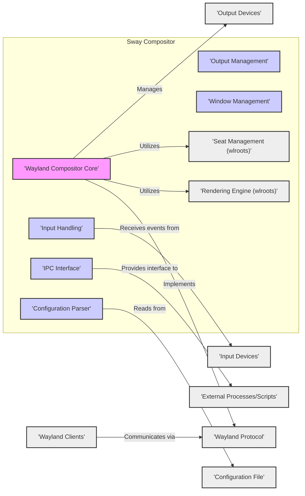

## Project Design Document: Sway Window Manager (Improved)

**1. Introduction**

This document provides an enhanced architectural design of Sway, a tiling Wayland compositor intended as a drop-in replacement for the i3 window manager. This detailed design aims to offer a comprehensive understanding of Sway's internal structure, component interactions, and data flow, specifically tailored to serve as a robust foundation for subsequent threat modeling exercises.

**2. Goals**

The primary goals of this improved design document are to:

*   Present a more detailed and nuanced view of Sway's architecture.
*   Provide granular descriptions of key components, emphasizing their responsibilities and internal mechanisms.
*   Elaborate on the interactions and data flow between components, including specific protocols and data structures.
*   Sharpen the focus on security-relevant aspects of the design, highlighting potential vulnerabilities and attack surfaces.
*   Serve as a precise and informative basis for identifying and analyzing potential threats and vulnerabilities during threat modeling.

**3. Architecture Overview**

Sway's architecture is fundamentally built upon the Wayland protocol and heavily leverages the wlroots library for managing low-level compositor functionalities. It interacts with client applications through the Wayland protocol, manages various input and output devices, and exposes an Inter-Process Communication (IPC) interface for external control and monitoring.

**4. Component Details**

*   **Wayland Compositor Core:**
    *   The central component responsible for the overall lifecycle and operation of the Sway compositor process.
    *   Initializes and manages the Wayland display, including creating the `wl_display` object.
    *   Runs the main event loop, processing events from clients, input devices, and the operating system.
    *   Orchestrates the interactions between other internal components.
    *   Manages global Wayland resources and interfaces.
    *   Security Relevance: A compromise of this core component would likely lead to a complete compromise of the Sway session.

*   **Input Handling:**
    *   Receives raw input events from devices (keyboard, mouse, touchpads, etc.) via the Linux kernel's input subsystem (e.g., evdev).
    *   Utilizes wlroots' input management capabilities to process and interpret these events.
    *   Manages keyboard layouts, keymaps, and input method editors (IMEs).
    *   Dispatches processed input events to the appropriate focused Wayland client through the Wayland protocol.
    *   Handles global keyboard shortcuts and commands defined in the configuration.
    *   Security Relevance: Vulnerabilities here could allow for input injection, denial-of-service by flooding events, or bypassing security restrictions through crafted input sequences.

*   **Output Management:**
    *   Manages connected output devices (monitors, projectors).
    *   Leverages wlroots' output management to handle modesetting (resolution, refresh rate), gamma correction, and output configuration.
    *   Coordinates with the Rendering Engine to present rendered frames on the outputs.
    *   Supports hotplugging of output devices.
    *   Security Relevance: Issues could lead to display manipulation, information disclosure by displaying sensitive content on unintended outputs, or denial-of-service by misconfiguring outputs.

*   **Window Management:**
    *   Implements Sway's core tiling window management logic.
    *   Maintains the state of all managed windows (Wayland surfaces).
    *   Applies user-defined window rules (e.g., floating, tiling, specific workspace).
    *   Manages window focus, stacking order, and workspace organization.
    *   Handles window creation, destruction, and resizing.
    *   Security Relevance: Bugs could lead to clients drawing over each other unexpectedly, bypassing intended isolation, or denial-of-service by creating excessive windows.

*   **IPC Interface:**
    *   Provides a mechanism for external processes and scripts to interact with Sway.
    *   Listens on a Unix domain socket for incoming connections.
    *   Supports a command protocol allowing external entities to query Sway's state (window tree, outputs, etc.) and send commands to manipulate the compositor (e.g., opening applications, changing focus, managing workspaces).
    *   Security Relevance: This interface is a significant attack surface. Lack of proper authentication and authorization could allow unauthorized processes to control the compositor. Command injection vulnerabilities in the parsing of IPC messages are also a risk.

*   **Configuration Parser:**
    *   Responsible for reading and parsing the Sway configuration file (`config`).
    *   Validates the syntax and semantics of the configuration directives.
    *   Applies the configured settings to various Sway components, including keybindings, window rules, output configurations, and theming.
    *   Security Relevance: Vulnerabilities in the parser could allow for arbitrary code execution if a specially crafted malicious configuration file is loaded.

*   **Rendering Engine (wlroots):**
    *   While technically a library, wlroots provides the core rendering capabilities for Sway.
    *   Handles buffer management, damage tracking, and composition of client surfaces.
    *   Utilizes the Direct Rendering Manager (DRM) and Graphics Execution Manager (GEM) for interacting with the graphics hardware.
    *   Security Relevance: Security vulnerabilities within wlroots' rendering pipeline could lead to information disclosure through unintended pixel rendering or denial-of-service by crashing the rendering process.

*   **Seat Management (wlroots):**
    *   wlroots' seat management handles the association of input devices with logical "seats," representing a set of input capabilities.
    *   Manages focus for keyboards and pointers within a seat.
    *   Security Relevance: Issues here could lead to input being directed to the wrong client or unauthorized access to input devices.

*   **Wayland Protocol:**
    *   The fundamental communication protocol between Sway (the Wayland compositor) and Wayland clients.
    *   Defines the messages and interfaces for managing surfaces, input events, output configuration, and other aspects of the graphical environment.
    *   Security Relevance: While the protocol itself is designed with security in mind, vulnerabilities can exist in the implementation of the protocol by either the compositor or the clients.

*   **Wayland Clients:**
    *   Applications that utilize the Wayland protocol to render their user interfaces.
    *   Examples include web browsers, terminal emulators, and other graphical applications.
    *   Security Relevance: Malicious clients could attempt to exploit vulnerabilities in the compositor or other clients. Client isolation is a key security concern.

*   **Input Devices:**
    *   Physical hardware devices such as keyboards, mice, touchpads, and drawing tablets that generate input events.
    *   Security Relevance: Malicious hardware or compromised drivers could inject fabricated input events.

*   **Output Devices:**
    *   Physical display devices such as monitors and projectors where the compositor renders the user interface.
    *   Security Relevance: While less direct, vulnerabilities in display drivers or firmware could potentially be exploited.

*   **Configuration File:**
    *   A plain text file (`config`) where users define Sway's behavior and settings.
    *   Security Relevance: As mentioned, a maliciously crafted configuration file could be used to exploit vulnerabilities in the Configuration Parser.

*   **External Processes/Scripts:**
    *   External applications or scripts that interact with Sway through its IPC interface.
    *   Security Relevance: These processes inherit the security context of the user running them, but vulnerabilities in the IPC interface could allow them to gain elevated privileges or cause harm.

**5. Data Flow**

The following outlines the data flow for critical operations within Sway:

*   **Client Rendering:**
    *   A Wayland client renders its graphical content into a buffer in its own memory space.
    *   The client sends a request to Sway via the Wayland protocol (e.g., `wl_surface.attach`, `wl_surface.commit`) to present this buffer.
    *   Sway's Wayland Compositor Core receives this request.
    *   The Rendering Engine (wlroots) composites the client's surface onto the appropriate output buffer, taking into account window geometry, stacking order, and effects.
    *   The composited frame is then submitted to the graphics hardware via DRM for display on the Output Device.

*   **Input Handling:**
    *   An Input Device generates a raw input event (e.g., key press, mouse movement).
    *   The Linux kernel forwards this event to Sway's Input Handling component.
    *   Input Handling, using wlroots' seat management, determines the focused client (if any).
    *   The processed input event is then serialized and sent to the focused Wayland Client via the Wayland protocol (e.g., `wl_keyboard.key`, `wl_pointer.motion`).
    *   If no client is focused or the event is a global shortcut, Sway's Input Handling component may trigger an internal action (e.g., opening a menu, switching workspaces).

*   **Configuration Loading:**
    *   When Sway starts, the Wayland Compositor Core initiates the loading of the Configuration File.
    *   The Configuration Parser reads the file from the filesystem.
    *   The parser validates the syntax and extracts configuration directives.
    *   These directives are then used to configure various aspects of Sway, such as keybindings in Input Handling, output settings in Output Management, and window rules in Window Management.

*   **IPC Communication:**
    *   An External Process/Script connects to Sway's IPC Unix domain socket.
    *   The external process sends a command or query formatted according to Sway's IPC protocol (typically JSON).
    *   Sway's IPC Interface receives and parses the message.
    *   The request is routed to the appropriate Sway component (e.g., Window Management to move a window, Output Management to change resolution).
    *   The component performs the requested action or retrieves the requested information.
    *   Sway's IPC Interface sends a response (also typically JSON) back to the external process via the IPC socket.

**6. Security Considerations**

This section expands on the security considerations, providing more specific examples:

*   **Wayland Protocol Security:**
    *   **Vulnerability:**  Bugs in the implementation of Wayland protocol handling in Sway could allow malicious clients to crash the compositor or gain unintended access.
    *   **Attack Vector:** A crafted sequence of Wayland messages from a malicious client.
*   **Client Isolation:**
    *   **Vulnerability:**  Despite Wayland's design, compositor vulnerabilities could allow a malicious client to access the buffers or resources of other clients.
    *   **Attack Vector:** Exploiting bugs in Sway's surface management or buffer handling.
*   **Input Handling Security:**
    *   **Vulnerability:**  Bugs in input event processing could allow for input injection, where a malicious client or compromised input device sends fabricated events to control other applications or the compositor.
    *   **Attack Vector:** A malicious client sending forged input events via the Wayland protocol or a compromised keyboard driver.
*   **IPC Interface Security:**
    *   **Vulnerability:** Lack of authentication allows any local process to connect and control Sway. Command injection vulnerabilities in the parsing of IPC commands could lead to arbitrary code execution.
    *   **Attack Vector:** A malicious local process connecting to the IPC socket and sending harmful commands.
*   **Configuration File Security:**
    *   **Vulnerability:**  Bugs in the Configuration Parser could allow for arbitrary code execution if a malicious configuration file is loaded (e.g., through environment variables or user-controlled file paths).
    *   **Attack Vector:** A user being tricked into using a malicious configuration file.
*   **Dependency Security (wlroots):**
    *   **Vulnerability:** Security flaws in wlroots directly impact Sway. This includes vulnerabilities in rendering, input handling, or DRM interaction within wlroots.
    *   **Attack Vector:** Exploiting known vulnerabilities in the version of wlroots used by Sway.
*   **Memory Safety:**
    *   **Vulnerability:** Buffer overflows, use-after-free errors, and other memory safety issues in Sway's C code could be exploited for arbitrary code execution.
    *   **Attack Vector:** Providing carefully crafted input or triggering specific code paths that expose memory safety bugs.
*   **Privilege Separation:**
    *   **Consideration:**  Investigate if Sway employs any privilege separation techniques to limit the impact of vulnerabilities in specific components. For example, are certain operations performed with reduced privileges?
*   **Seat Management Security:**
    *   **Vulnerability:** Issues in seat management could lead to input being incorrectly routed, potentially allowing a malicious client to eavesdrop on or control input intended for another application.
    *   **Attack Vector:** Exploiting bugs in how Sway or wlroots manages input focus and device assignment.

**7. Deployment Considerations**

Sway is typically deployed as the primary graphical environment on Linux systems, replacing traditional X servers. Key deployment aspects include:

*   **Installation:** Requires installation of Sway and its dependencies, including wlroots, Wayland libraries, and potentially graphics drivers.
*   **Configuration:** Users configure Sway through the `config` file located in `~/.config/sway/config`.
*   **Session Management:** Sway is typically launched via a Wayland-compatible display manager (e.g., greetd, ly) or directly from a TTY using `sway`.
*   **Client Compatibility:** Requires applications to be Wayland-native or run under XWayland for compatibility with older X11 applications.

**8. Future Considerations**

Potential future developments that could impact security include:

*   **New Protocol Implementations:** Implementing new Wayland protocols or extensions could introduce new attack surfaces if not implemented securely.
*   **Complex Feature Additions:**  More complex features in window management or input handling could introduce new vulnerabilities.
*   **Refactoring and Code Changes:** While potentially improving security in the long run, refactoring can also introduce new bugs if not done carefully.

This improved design document provides a more detailed and security-focused understanding of the Sway window manager's architecture, serving as a more effective foundation for thorough threat modeling activities.
