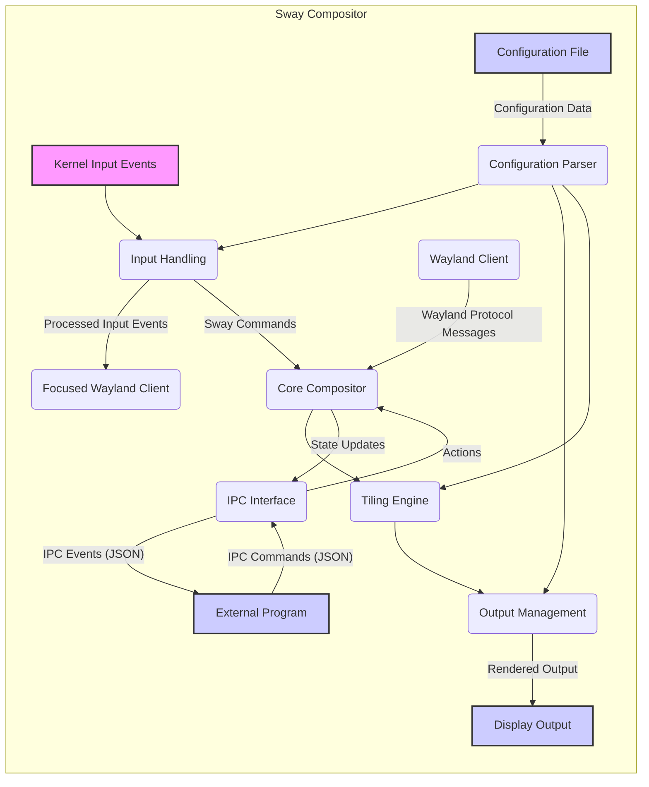
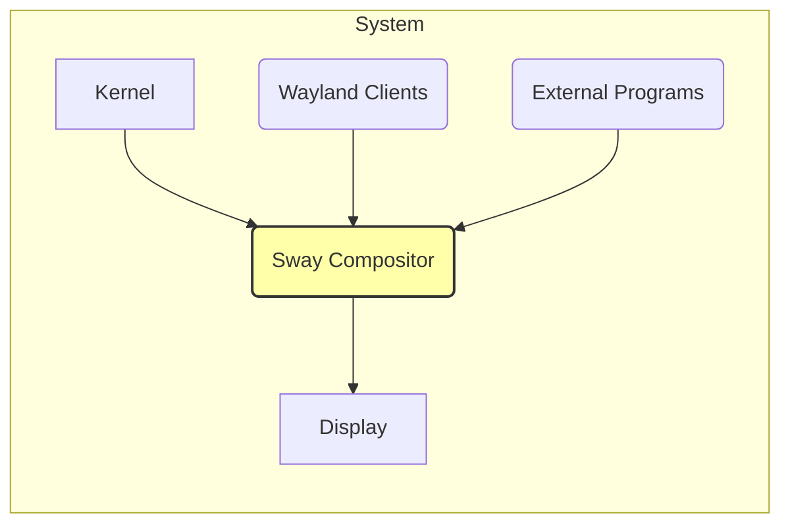
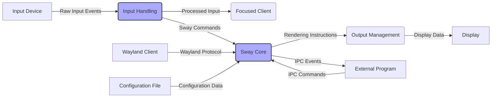

# Project Design Document: Sway Window Manager

**Version:** 1.1
**Date:** October 26, 2023
**Author:** AI Software Architect

## 1. Introduction

This document provides a detailed design overview of the Sway window manager, a tiling Wayland compositor intended as a drop-in replacement for the i3 window manager for X11. Sway aims for feature parity with i3, utilizing the Wayland protocol for display management instead of X11. This document details Sway's architecture, key components, and data flow, serving as a foundation for subsequent threat modeling exercises. Understanding these aspects is crucial for identifying potential vulnerabilities and security risks.

## 2. Goals

The primary goals of the Sway project are:

*   To provide a fully functional and stable tiling window manager operating on the Wayland protocol.
*   To maintain a high degree of compatibility with i3's configuration syntax, commands, and user experience, minimizing the learning curve for existing i3 users.
*   To offer a modular and extensible architecture, facilitating contributions and the development of extensions.
*   To prioritize security and stability as core design principles.
*   To fully leverage the benefits of the Wayland protocol, including improved security and performance compared to X11.

## 3. Architecture Overview

Sway functions as a Wayland compositor, effectively acting as the display server. It manages all aspects of the graphical environment, including handling input events, arranging windows according to a tiling layout, and rendering the final output. Key architectural elements include:

*   **Wayland Compositor Core:** The central part of Sway, responsible for managing the display server functionality and interacting with Wayland clients.
*   **wlroots Library:** Sway heavily relies on wlroots, a modular compositor library. wlroots provides the low-level implementation details for the Wayland protocol, input device handling (via libinput), output management (via DRM/KMS), and rendering (typically using OpenGL or Vulkan). This separation of concerns allows Sway to focus on its core window management logic.
*   **Text-Based Configuration:** Sway is configured using a human-readable text file, typically located at `~/.config/sway/config`. This file defines keybindings, window rules, output settings, and other customizations.
*   **Unix Domain Socket IPC:** Sway exposes an Inter-Process Communication (IPC) mechanism via a Unix domain socket. This allows external applications to query the state of the window manager and send commands to control its behavior.
*   **Modular Input and Output Handling:** Input events from devices and output management for displays are handled through well-defined modules, often leveraging functionalities provided by wlroots.
*   **Tiling Layout Engine:** The core logic for automatically arranging windows on the screen in a non-overlapping manner, a defining feature of tiling window managers.

## 4. Component Details

This section provides a more granular description of Sway's key components and their responsibilities:

*   **Core Compositor (sway/server.c, sway/main.c):**
    *   Manages the main event loop, processing events from Wayland clients, input devices, and the kernel.
    *   Implements the core Wayland compositor logic, handling protocol messages (e.g., surface creation, buffer submission).
    *   Maintains the state of Wayland resources (surfaces, buffers, etc.).
    *   Orchestrates the rendering pipeline, delegating to the output management component.
    *   Manages client lifecycles (connection, disconnection).
*   **Input Handling (sway/input/):**
    *   Receives raw input events from the kernel via libinput (keyboard, mouse, touchpad, etc.).
    *   Processes and filters input events.
    *   Maps input events to Sway actions based on configured keybindings and mouse bindings defined in the configuration file.
    *   Distributes processed input events to the currently focused Wayland client.
    *   Handles global input events not directed at specific clients (e.g., launching applications via keybindings).
*   **Output Management (sway/output/):**
    *   Detects and manages connected displays using Direct Rendering Manager (DRM) and Kernel Mode Setting (KMS).
    *   Applies output configurations specified in the configuration file (resolution, refresh rate, position, rotation).
    *   Manages workspaces and their assignment to specific outputs.
    *   Handles rendering to different outputs, often utilizing OpenGL or Vulkan through wlroots' rendering abstractions.
*   **IPC Interface (sway/ipc.c):**
    *   Listens for connections on a Unix domain socket.
    *   Implements a JSON-based protocol for receiving commands and sending events.
    *   Allows external programs to query the current state of Sway (window tree, outputs, workspaces, etc.).
    *   Enables external programs to send commands to control Sway's behavior (e.g., opening applications, moving windows, changing focus).
    *   Provides event streams to notify connected clients of state changes within Sway.
*   **Configuration Parser (sway/config/):**
    *   Reads and parses the Sway configuration file (`~/.config/sway/config`).
    *   Interprets configuration directives for keybindings, mouse bindings, window rules, output settings, and other customizations.
    *   Applies the parsed configuration to the running compositor, updating its behavior.
    *   Handles reloading the configuration file without requiring a restart.
*   **Tiling Engine (sway/tree/):**
    *   Implements the core logic for arranging windows on the screen according to the tiling paradigm.
    *   Maintains a tree-like data structure representing the hierarchy of containers and windows.
    *   Calculates the size and position of each window based on the current layout and user interactions.
    *   Manages window focus and stacking order.
    *   Supports various tiling modes (e.g., horizontal split, vertical split, stacking, tabbed).
*   **wlroots Abstraction Layer (within various sway/\* directories):**
    *   Provides an interface to the underlying wlroots library functionalities.
    *   Encapsulates wlroots objects and functions related to input handling, output management, rendering, and the Wayland protocol.
    *   Allows Sway to leverage the capabilities of wlroots while maintaining a degree of separation and potentially adapting to future wlroots changes.
*   **Client Management (sway/client.c):**
    *   Tracks connected Wayland clients and their associated Wayland surfaces.
    *   Manages client properties (e.g., window titles, class names).
    *   Handles client requests and manages their state within the compositor.
    *   May enforce basic security policies related to client interactions, although primary security relies on the Wayland protocol itself.

## 5. Data Flow

The following describes the key data flows within the Sway window manager:

*   **Input Event Handling Flow:**
    *   Raw input events (keyboard presses, mouse movements, etc.) are received by the kernel from input devices.
    *   These events are forwarded to Sway's input handling component, often via libinput.
    *   The input handler processes the raw events, identifying key presses, mouse clicks, and movements.
    *   Based on the configured keybindings and mouse bindings, the input handler determines the intended action.
    *   If the action targets a specific client (e.g., typing in a text editor), the processed input event is forwarded to that client via the Wayland protocol.
    *   If the action is a Sway command (e.g., switching workspaces), the input handler triggers the corresponding internal Sway function.
*   **Client Connection and Management Flow:**
    *   Wayland clients initiate connections to the Sway compositor.
    *   Sway's core compositor component handles the initial handshake and establishes the connection.
    *   Clients create Wayland surfaces to represent their windows.
    *   Clients send requests to Sway to manage their surfaces (e.g., set window titles, request focus).
    *   Sway processes these requests and updates its internal state accordingly.
*   **Window Management and Layout Flow:**
    *   When a client creates a new window (surface), the tiling engine is notified.
    *   The tiling engine determines the initial placement and size of the new window based on the current layout and configuration.
    *   User actions (e.g., moving, resizing, focusing windows) trigger updates to the tiling engine.
    *   The tiling engine recalculates the layout and informs the core compositor of the new window positions and sizes.
*   **Rendering Flow:**
    *   Wayland clients draw their content into buffers and submit them to the compositor.
    *   Sway's core compositor receives these buffers.
    *   The compositor uses the output management component to composite the client surfaces onto the screen.
    *   Rendering is typically performed using OpenGL or Vulkan, often leveraging the rendering capabilities provided by wlroots.
    *   The final rendered output is sent to the display via DRM/KMS.
*   **Configuration Loading Flow:**
    *   At startup (or when explicitly reloaded), Sway's configuration parser reads the configuration file.
    *   The parser interprets the directives in the file, such as keybindings, output settings, and window rules.
    *   The parsed configuration is applied to the relevant Sway components, affecting input handling, output management, and window management behavior.
*   **IPC Communication Flow:**
    *   External programs connect to Sway's IPC socket.
    *   Connected programs can send JSON-formatted commands to Sway.
    *   The IPC interface parses these commands and invokes the corresponding Sway functions.
    *   Sway can send JSON-formatted events to connected programs, notifying them of state changes (e.g., window focus changes, new windows opening).

## 6. Security Considerations (Pre-Threat Model)

Based on the design and component details, several potential security considerations arise:

*   **Input Handling Vulnerabilities:**
    *   Maliciously crafted input events could potentially exploit vulnerabilities in the input handling logic, leading to crashes, unexpected behavior, or even code execution.
    *   Incorrect handling of specific input sequences or device states could be exploited.
*   **Wayland Protocol Implementation Flaws:**
    *   Bugs or omissions in Sway's implementation of the Wayland protocol could lead to security issues, such as allowing clients to bypass security mechanisms or gain unauthorized access.
*   **Client Isolation Issues:**
    *   While Wayland aims for client isolation, vulnerabilities in the compositor could potentially allow one client to interfere with or spy on another client's data or operations.
*   **IPC Security Risks:**
    *   The IPC mechanism, if not properly secured, could allow unauthorized external programs to control Sway, potentially leading to malicious actions like closing windows, executing commands, or capturing sensitive information.
    *   Lack of proper authentication or authorization for IPC clients is a significant risk.
*   **Configuration Parsing Vulnerabilities:**
    *   Bugs in the configuration parser could allow an attacker to inject malicious commands or settings by manipulating the configuration file. This could lead to arbitrary command execution when Sway starts or reloads the configuration.
*   **Dependency Vulnerabilities (wlroots):**
    *   Sway's reliance on wlroots means that vulnerabilities within the wlroots library could directly impact Sway's security. Regular updates and awareness of wlroots security advisories are crucial.
*   **Memory Safety Issues:**
    *   As Sway is primarily written in C, memory safety vulnerabilities such as buffer overflows, use-after-free errors, and dangling pointers are potential risks, especially in components handling external data or complex logic.
*   **Output Management Vulnerabilities:**
    *   Issues in how Sway manages outputs or interacts with DRM/KMS could potentially be exploited, although this is less likely to directly compromise user data.
*   **Default Configuration Security:**
    *   The default configuration should be secure and avoid exposing unnecessary functionality or insecure defaults.
*   **Privilege Escalation:**
    *   Vulnerabilities in any component could potentially be leveraged to escalate privileges, allowing an attacker to gain more control over the system.

## 7. Diagrams

### 7.1 High-Level Architecture Diagram

### 7.2 Detailed Data Flow Diagram (Simplified)

## 8. Future Considerations

Potential future design considerations for Sway, particularly from a security perspective, include:

*   **Sandboxing of Wayland Clients:** Exploring and implementing more robust mechanisms for sandboxing Wayland clients to further isolate them and limit the impact of potential client-side vulnerabilities.
*   **Fine-grained Permissions for IPC:** Implementing a more granular permission system for the IPC interface, allowing users to control which external programs can access specific Sway functionalities.
*   **Further Modularization:**  Continuing to break down components into smaller, more isolated modules to improve maintainability and potentially limit the scope of vulnerabilities.
*   **Formal Security Audits:**  Conducting regular, independent security audits of the Sway codebase to identify and address potential vulnerabilities proactively.
*   **Address Space Layout Randomization (ASLR) and other hardening techniques:** Ensuring that Sway and its dependencies are built with appropriate security hardening flags.
*   **Consideration of Memory-Safe Languages for Certain Components:**  Exploring the feasibility of using memory-safe languages for new components or refactoring existing ones to mitigate memory safety vulnerabilities.

This detailed design document provides a comprehensive overview of the Sway window manager's architecture and data flow. It serves as a crucial resource for understanding the system's inner workings and will be instrumental in conducting thorough threat modeling to identify and mitigate potential security vulnerabilities.