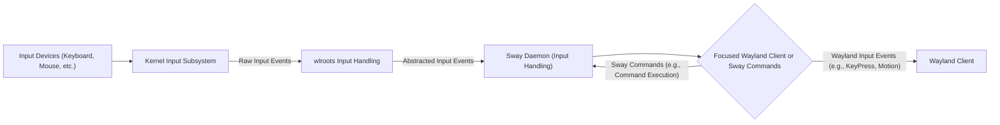
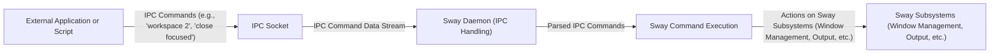
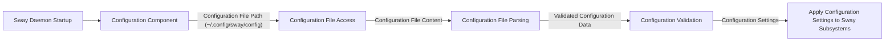

# Project Design Document: Sway Window Manager for Threat Modeling

**Project Name:** Sway Window Manager

**Project Repository:** [https://github.com/swaywm/sway](https://github.com/swaywm/sway)

**Document Version:** 1.1
**Date:** 2023-10-27
**Author:** AI Software Architect

## 1. Introduction

This document provides a detailed design overview of the Sway window manager, a tiling Wayland compositor and a drop-in replacement for the i3 window manager for X11. This document is intended to serve as a foundation for subsequent threat modeling activities. It outlines the system architecture, key components, data flow, and external interfaces of Sway, highlighting areas relevant to security considerations. This document will be used to identify potential threats, vulnerabilities, and attack vectors within the Sway window manager.

## 2. Project Overview

Sway is a compositor for Wayland, designed to be compatible with the i3 window manager configuration and workflow. It aims to be fast, lightweight, and extensible, leveraging the modern Wayland protocol and the wlroots compositor library. Sway provides a tiling window management experience, allowing users to efficiently organize and interact with their applications.  By utilizing Wayland, Sway inherently benefits from Wayland's security-focused architecture compared to the older X11 system.

**Key Features:**

*   **Wayland Compositor:** Built on the Wayland protocol, offering improved security and performance by design compared to X11, including client isolation and reduced attack surface.
*   **Tiling Window Management:** Automatically arranges windows in non-overlapping tiles, maximizing screen space and improving workflow efficiency.
*   **i3 Compatibility:** Uses a similar configuration syntax and command structure to i3, easing transition for existing i3 users and leveraging existing configuration knowledge.
*   **Extensibility:** Supports custom scripts and IPC for advanced configuration, automation, and integration with other system components.
*   **wlroots Based:** Leverages the wlroots library for core compositor functionalities, simplifying development, promoting code reuse, and benefiting from wlroots' ongoing development and security efforts.
*   **Security Focus:** Designed with security in mind, leveraging Wayland's security model and incorporating secure coding practices.

## 3. System Architecture

Sway's architecture is layered, building upon the wlroots library and interacting with the Linux kernel and user space applications. The core components can be broadly categorized as follows:

*   **Kernel:** Provides the underlying operating system functionalities, including input device handling, display management (DRM/KMS), memory management, process management, and system call interface.
*   **wlroots:** A modular Wayland compositor library that handles low-level Wayland protocol implementation, input device management, output management, rendering primitives, and more. Sway relies heavily on wlroots for core compositor functionalities, abstracting away complex low-level details.
*   **Sway Daemon (Core Logic):** The main Sway process responsible for window management logic, input processing and command execution, output configuration and management, IPC handling and command processing, configuration parsing and application, and overall system coordination. It acts as the central orchestrator of the compositor.
*   **Input Handling:** Manages input events from various devices (keyboard, mouse, touchpad, etc.), processing, filtering, and distributing them to relevant clients or acting upon them directly (e.g., executing Sway commands).
*   **Output Management:** Handles display configuration, modesetting, management of multiple monitors, and output related settings like gamma and color profiles.
*   **Window Management:** Implements the tiling window management logic, including window placement algorithms, resizing, focus management, workspace organization, window stacking order, and window decorations.
*   **Inter-Process Communication (IPC):** Provides a robust and extensible mechanism for external applications and scripts to interact with and control Sway, allowing for automation, status monitoring, and integration with other tools.
*   **Configuration:** Parses and applies user configuration files to customize Sway's behavior, including keybindings, layouts, theming, and startup behavior. Configuration is loaded at startup and can be reloaded at runtime.
*   **Rendering:** Utilizes wlroots rendering capabilities, leveraging OpenGL or Vulkan through Mesa, to draw window contents, decorations, and UI elements on the screen. Rendering is crucial for displaying the compositor's visual output.
*   **Wayland Clients:** Applications running under Sway, communicating with the compositor via the secure and well-defined Wayland protocol. Clients are isolated from each other by the Wayland security model.

**Architecture Diagram:**

```mermaid
graph LR
    subgraph "System"
        "Kernel" -- "DRM/KMS, Input Events, Syscalls" --> "wlroots"
        "wlroots" -- "Wayland Protocol, Input Events, Rendering" --> "Sway Daemon"
        "Sway Daemon" --> "Input Handling"
        "Sway Daemon" --> "Output Management"
        "Sway Daemon" --> "Window Management"
        "Sway Daemon" --> "IPC"
        "Sway Daemon" --> "Configuration"
        "Sway Daemon" --> "Rendering"
        "Rendering" --> "wlroots"
        "wlroots" -- "Display Output" --> "Kernel"
        "User" -- "Configuration Files" --> "Configuration"
        "User" -- "IPC Commands" --> "IPC"
        "Wayland Clients" -- "Wayland Protocol" --> "wlroots"
    end
    style "Sway Daemon" fill:#f9f,stroke:#333,stroke-width:2px
```

## 4. Component Breakdown

This section provides a more detailed description of each key component and its functionalities, with a focus on security relevant aspects.

### 4.1. Kernel

*   **Functionality:** The Linux kernel provides the fundamental operating system services. In the context of Sway, it is responsible for:
    *   **Device Drivers:** Managing hardware devices securely and efficiently, including input devices (keyboard, mouse, etc.) and display hardware (graphics cards).
    *   **DRM/KMS (Direct Rendering Manager/Kernel Mode Setting):**  Providing secure and controlled interfaces for managing display outputs and modesetting, ensuring only authorized processes can access display hardware.
    *   **Input Event Handling:**  Receiving input events from devices and securely making them available to user space, with mechanisms to prevent unauthorized input injection.
    *   **System Calls:** Providing a secure and controlled interface for user space programs to request kernel services, with access control and privilege separation.
    *   **Memory Management:** Isolating memory between processes and providing memory protection mechanisms.
    *   **Process Management:** Managing processes and enforcing process isolation and security boundaries.
*   **Security Relevance:** Kernel vulnerabilities are the most critical as they can compromise the entire system. Sway's security posture is fundamentally dependent on the security of the underlying kernel. Regular kernel updates and security patching are essential. Sway relies on the kernel for secure handling of hardware, process isolation, and resource management. Any kernel vulnerability could potentially be exploited to bypass Sway's security measures.

### 4.2. wlroots

*   **Functionality:** wlroots is a modular Wayland compositor library that provides the building blocks for creating Wayland compositors. Sway utilizes wlroots for:
    *   **Wayland Protocol Implementation:** Handling the low-level details of the Wayland protocol securely and efficiently, including socket management, message parsing, and protocol state management, adhering to the Wayland security model.
    *   **Input Device Management:**  Abstracting input devices and providing secure interfaces for handling input events in a compositor-agnostic way, preventing direct hardware access from the compositor and clients.
    *   **Output Management:**  Providing secure interfaces for managing display outputs, modesetting, and output configuration, ensuring only authorized operations on display hardware.
    *   **Rendering Primitives:** Offering basic rendering functionalities securely and efficiently, which Sway can use to draw UI elements and manage window surfaces.
    *   **DRM/KMS Integration:** Interfacing with the kernel's DRM/KMS subsystem securely for display management, leveraging kernel security features.
    *   **Security Updates:** wlroots actively addresses security vulnerabilities and releases updates, which Sway benefits from by staying up-to-date with wlroots releases.
*   **Security Relevance:** As Sway's foundation, vulnerabilities in wlroots directly impact Sway's security. Bugs in Wayland protocol handling, input management, or rendering within wlroots could be exploited to compromise Sway. Regular updates to wlroots are crucial for maintaining Sway's security. Security audits of wlroots code are also important to proactively identify and address potential vulnerabilities.

### 4.3. Sway Daemon (Core Logic)

*   **Functionality:** The central and most privileged component of Sway in user space, responsible for orchestrating all other components and implementing the core window management logic. Key responsibilities include:
    *   **Initialization and Startup:** Securely setting up wlroots, initializing subsystems, parsing configuration files with validation, and establishing secure IPC channels.
    *   **Window Management Logic:** Implementing tiling algorithms, workspace management, window focus, and window stacking securely, preventing unintended interactions between windows and enforcing window isolation.
    *   **Input Event Processing:** Receiving input events from wlroots and dispatching them to the appropriate clients or handling them internally as Sway commands, with input validation and sanitization to prevent injection attacks.
    *   **Output Configuration Management:** Applying output configurations securely based on user settings or dynamic changes, preventing unauthorized or malicious output manipulation.
    *   **IPC Server:**  Managing the IPC socket securely, implementing authentication and authorization mechanisms to control access to Sway's functionalities via IPC, and handling commands securely with input validation.
    *   **Configuration Parsing and Application:** Reading and interpreting the Sway configuration file securely, validating configuration syntax and values to prevent parsing vulnerabilities and ensure configuration integrity, and applying settings securely.
    *   **Rendering Coordination:**  Instructing wlroots to render window surfaces and UI elements based on the current window state and configuration, ensuring rendering operations are performed securely.
    *   **State Management:** Maintaining the compositor's state securely and consistently, preventing race conditions and ensuring data integrity.
*   **Security Relevance:** The Sway daemon is the most privileged component in user space and a primary target for attacks. Vulnerabilities in the daemon could lead to privilege escalation, arbitrary code execution, denial of service, information disclosure, or complete compromise of the user session. Secure coding practices, robust input validation, secure IPC handling, and careful memory management are critical for the Sway daemon. Regular security audits and penetration testing are recommended.

### 4.4. Input Handling

*   **Functionality:** Responsible for processing input events from various devices. This component:
    *   **Receives Input Events:** Gets raw input events from wlroots, which abstracts the underlying input devices, ensuring a consistent and secure input source.
    *   **Event Processing and Dispatch:**  Interprets input events (keyboard presses, mouse movements, etc.) and determines the appropriate action securely. This involves:
        *   Dispatching events to focused Wayland clients via the Wayland protocol, ensuring client isolation and secure event delivery.
        *   Triggering Sway commands securely (e.g., workspace switching, window manipulation), with proper authorization checks.
        *   Handling keyboard shortcuts and keybindings securely, preventing unintended command execution.
    *   **Input Device Configuration:**  Manages configuration related to input devices securely, such as keyboard layouts and mouse acceleration, preventing unauthorized modification of input settings.
    *   **Input Validation and Sanitization:** Validating and sanitizing input events to prevent injection attacks or unexpected behavior.
*   **Security Relevance:** While input handling in a compositor is less directly vulnerable to traditional input injection attacks (which are more relevant to applications), vulnerabilities could arise from:
    *   **Input Event Spoofing (mitigated by Wayland and wlroots, but still a consideration in the context of compromised input devices or kernel vulnerabilities).**
    *   **Denial of Service:**  Processing excessively large or malformed input event streams could potentially lead to resource exhaustion or crashes. Input rate limiting and resource management are important.
    *   **Logic Errors:**  Bugs in input processing logic could lead to unintended command execution or bypass security checks.

### 4.5. Output Management

*   **Functionality:** Manages display outputs and their configurations securely. This component:
    *   **Output Detection and Enumeration:** Detects connected displays and retrieves their capabilities securely, preventing unauthorized access to display information.
    *   **Modesetting and Configuration:**  Applies display configurations securely, including resolution, refresh rate, and positioning of multiple monitors, ensuring only authorized configuration changes are applied.
    *   **Output Hotplugging:** Handles dynamic addition and removal of displays securely, preventing unexpected behavior or security issues during output changes.
    *   **Output Rendering Configuration:**  Configures rendering parameters for each output securely, preventing unauthorized manipulation of rendering settings.
    *   **Access Control:** Enforces access control policies for output management operations, ensuring only authorized users or processes can modify output configurations.
*   **Security Relevance:** Security concerns related to output management are less direct but can include:
    *   **Denial of Service:**  Malicious or buggy output configurations could potentially lead to display corruption, system instability, or denial of service.
    *   **Information Disclosure (less likely in the compositor itself, more relevant if display hardware or drivers are compromised, but compositor should prevent unintended information leakage via display).**
    *   **Unauthorized Output Manipulation:**  Preventing unauthorized modification of output configurations is important for maintaining system integrity and user experience.

### 4.6. Window Management

*   **Functionality:** Implements the core tiling window management logic of Sway securely. This component:
    *   **Window Placement and Tiling:**  Arranges windows according to tiling algorithms securely and efficiently, ensuring proper window isolation and preventing overlaps.
    *   **Workspace Management:**  Provides workspaces (virtual desktops) for organizing windows securely, maintaining workspace isolation and preventing cross-workspace access violations.
    *   **Window Focus Management:**  Determines which window receives keyboard and mouse input securely, ensuring focus is granted to the intended window and preventing focus stealing attacks.
    *   **Window Stacking and Layering:**  Manages the order in which windows are drawn, handling stacking and layering of windows securely, preventing z-order vulnerabilities and ensuring proper window visibility.
    *   **Window Decorations:**  Draws window borders and title bars (if configured) securely, preventing malicious code injection via window decorations.
    *   **Window Isolation:** Enforces window isolation as provided by the Wayland protocol, preventing clients from directly accessing or interfering with each other's windows.
*   **Security Relevance:**  Window management itself is less directly related to security vulnerabilities in the compositor, as Wayland provides strong client isolation. However, logical flaws in window management could potentially lead to unexpected behavior or denial of service.  Ensuring proper window isolation and preventing unintended interactions between windows are crucial.  Bugs in focus management or window stacking could potentially be exploited for UI redressing attacks, although Wayland's design mitigates many of these risks compared to X11.

### 4.7. Inter-Process Communication (IPC)

*   **Functionality:** Provides a secure and robust mechanism for external applications and scripts to communicate with and control Sway. This component:
    *   **IPC Server:**  Listens on a Unix domain socket for incoming IPC connections securely, using appropriate permissions and access control.
    *   **Authentication and Authorization:** Implements authentication mechanisms to verify the identity of IPC clients and authorization policies to control which commands clients are allowed to execute, preventing unauthorized access to Sway's functionalities.
    *   **Command Handling:**  Parses and executes commands received via the IPC socket securely, with robust input validation and sanitization to prevent IPC injection attacks.
    *   **Event Streaming:**  Provides a stream of events via IPC securely, allowing clients to monitor Sway's state and events (e.g., window focus changes, workspace changes) without compromising security or leaking sensitive information.
    *   **Rate Limiting:** Implements rate limiting for IPC requests to prevent denial-of-service attacks via excessive IPC commands.
    *   **Secure Socket Handling:**  Handles IPC sockets securely, preventing unauthorized access or manipulation of the IPC channel.
*   **Security Relevance:** IPC is a critical security component and a major attack surface. Vulnerabilities in IPC handling can have severe consequences:
    *   **Unauthorized Control:**  If IPC is not properly secured, malicious processes could gain complete control over Sway, potentially manipulating windows, executing arbitrary commands, monitoring user activity, or causing denial of service.
    *   **IPC Injection:**  Vulnerabilities in IPC command parsing could allow attackers to inject malicious commands and execute arbitrary code within the Sway daemon's context, leading to privilege escalation or system compromise.
    *   **Privilege Escalation:** If IPC mechanisms are not properly designed, vulnerabilities could potentially be exploited for privilege escalation, allowing unprivileged processes to gain root or Sway daemon privileges.
    *   **Information Disclosure:**  IPC events or command responses might inadvertently leak sensitive information if not carefully designed and sanitized.

### 4.8. Configuration

*   **Functionality:** Parses and applies user configuration files to customize Sway's behavior securely. This component:
    *   **Configuration File Parsing:** Reads and parses the Sway configuration file (typically located at `~/.config/sway/config`) securely, preventing access to unauthorized files.
    *   **Configuration Validation:**  Checks the configuration file for syntax errors and invalid settings robustly, preventing parsing vulnerabilities and ensuring configuration integrity.
    *   **Input Validation and Sanitization:** Validates and sanitizes configuration values to prevent injection attacks or unexpected behavior caused by malicious configuration settings.
    *   **Applying Configuration Settings:**  Applies the configuration settings to various Sway components securely, customizing keybindings, window layouts, output configurations, and other aspects of Sway's behavior without introducing security vulnerabilities.
    *   **Configuration Reloading:**  Allows reloading the configuration file securely without restarting Sway, ensuring configuration changes are applied safely and without disrupting system security.
    *   **Default Configuration:** Provides a secure default configuration to minimize potential security risks out-of-the-box.
*   **Security Relevance:** Configuration parsing is a potential area for vulnerabilities:
    *   **Configuration Parsing Vulnerabilities:**  Bugs in the configuration file parser could be exploited to cause crashes, denial of service, or even arbitrary code execution if the parser is not robust against malformed or malicious configuration files.
    *   **Unintended Configuration Behavior:**  Incorrect or malicious configuration settings could potentially lead to unexpected or undesirable behavior, including security misconfigurations. Input validation and sanitization are crucial to mitigate this.
    *   **Configuration Injection:**  Although less likely in typical configuration files, vulnerabilities could theoretically allow for injection of malicious code via configuration settings if not properly handled.

### 4.9. Rendering

*   **Functionality:**  Handles the actual drawing of window contents, decorations, and UI elements on the screen securely and efficiently. Sway leverages wlroots for rendering functionalities:
    *   **Surface Management:**  Manages Wayland surfaces (regions of memory that clients draw into) securely, ensuring proper surface isolation and preventing unauthorized access.
    *   **Compositing:**  Combines surfaces together to create the final display output securely, preventing compositing vulnerabilities and ensuring visual integrity.
    *   **Rendering Backend:**  Utilizes a rendering backend (typically OpenGL or Vulkan via Mesa) provided by wlroots to perform the actual drawing operations securely and efficiently, relying on the security of the underlying graphics drivers and libraries.
    *   **Damage Tracking and Redrawing:**  Optimizes rendering by only redrawing regions of the screen that have changed, improving performance and potentially reducing attack surface by minimizing rendering operations.
    *   **Resource Limits:** Implements resource limits for rendering operations to prevent resource exhaustion and denial-of-service attacks.
*   **Security Relevance:** Rendering vulnerabilities are less common in the compositor itself, as Sway relies on wlroots and underlying graphics drivers for rendering. However, potential security concerns could arise from:
    *   **Rendering Library Vulnerabilities:**  Vulnerabilities in the underlying rendering libraries (e.g., Mesa, graphics drivers) could potentially be exploited, although these are generally outside of Sway's direct control. Regular updates to graphics drivers and Mesa are important.
    *   **Denial of Service:**  Malicious or buggy rendering operations could potentially lead to resource exhaustion or crashes in the rendering pipeline. Resource management and input validation are important to mitigate this.
    *   **Information Disclosure (less likely in the compositor itself, but rendering bugs could theoretically lead to unintended information leakage via visual output).**

### 4.10. Wayland Clients

*   **Functionality:** Applications running under Sway that communicate with the compositor using the secure Wayland protocol. Wayland's design inherently provides client isolation and security benefits compared to X11.
*   **Security Relevance:** Wayland is designed to improve security compared to X11 by isolating clients from each other and the compositor. Sway's security relies on the Wayland protocol's isolation mechanisms and the security of individual client applications. While Sway provides a secure environment for Wayland clients, vulnerabilities in client applications themselves can still pose security risks. Users should run trusted and updated Wayland clients. Sway's security model prevents a compromised client from directly compromising the compositor or other clients, but clients can still be vulnerable to attacks within their own isolated environment.

## 5. Data Flow

This section describes the flow of data within Sway, highlighting key data paths and potential security considerations for each data flow.

**5.1. Input Event Flow:**



*   **Data Description:** Raw input events from hardware devices are captured by the kernel. wlroots abstracts these raw events into a compositor-friendly format. Sway's input handling processes these events and dispatches them as either Wayland events to clients or internal Sway commands.
*   **Security Considerations:** Ensure input events are handled securely throughout the flow. Kernel input subsystem security is paramount. wlroots and Sway input handling should validate and sanitize input events to prevent injection attacks or denial-of-service.  Access control should be enforced to ensure only authorized processes can receive input events.

**5.2. Wayland Protocol Flow (Client to Compositor):**

```mermaid
graph LR
    A["Wayland Client Application"] -- "Wayland Protocol Messages (e.g., Surface Creation, Buffer Attach)" --> B["Wayland Socket"]
    B -- "Wayland Protocol Data Stream" --> C["wlroots Wayland Protocol Handling"]
    C -- "Parsed Wayland Requests" --> D["Sway Daemon"]
    D -- "Window State Updates, Rendering Instructions" --> E["Window Management, Rendering Coordination"]
    E -- "Rendering Commands" --> F["wlroots Rendering"]
    F -- "DRM/KMS Rendering Operations" --> G["Kernel DRM/KMS"]
    G -- "Display Pixel Data" --> H["Display Output"]
```



*   **Data Description:** Wayland clients send protocol messages to Sway via Unix domain sockets. These messages include requests for surface creation, buffer attachments (window content), input events, and other Wayland protocol operations. wlroots handles the low-level protocol details, and Sway daemon processes the parsed requests to manage window state and rendering.
*   **Security Considerations:** Secure Wayland socket handling is crucial. wlroots and Sway must correctly implement the Wayland protocol and validate all incoming messages to prevent protocol vulnerabilities, buffer overflows, or other attacks. Client isolation is enforced by the Wayland protocol and should be maintained throughout this flow. Rendering operations should be performed securely, preventing rendering vulnerabilities or information leakage.

**5.3. IPC Command Flow:**



*   **Data Description:** External applications send commands to Sway via the IPC socket. These commands are text-based and control various aspects of Sway's behavior. Sway's IPC handling component parses and executes these commands.
*   **Security Considerations:** IPC socket security, authentication, authorization, and robust command parsing are paramount.  Input validation and sanitization of IPC commands are essential to prevent IPC injection attacks. Access control should be enforced to limit which clients can send IPC commands and which commands they are authorized to execute. Rate limiting should be implemented to prevent denial-of-service attacks via IPC.

**5.4. Configuration Loading Flow:**



*   **Data Description:** At startup, the Sway daemon reads the configuration file from a predefined path. The configuration component parses the file, validates the configuration data, and applies the settings to various Sway subsystems.
*   **Security Considerations:** Secure configuration file access is important to prevent unauthorized modification or reading of the configuration. Robust configuration file parsing and validation are crucial to prevent parsing vulnerabilities and ensure configuration integrity. Input validation and sanitization of configuration values are necessary to prevent unintended or malicious configuration settings from causing security issues.

## 6. External Interfaces

Sway interacts with the following external entities, each representing a potential interface for security considerations:

*   **Kernel:** Via system calls (syscall interface), DRM/KMS (display management interface), and input event interfaces (input subsystem interface).  *Security Consideration:* Kernel vulnerabilities, secure syscall handling, secure DRM/KMS and input event processing.
*   **User:** Through configuration files (file system interface) and IPC commands (Unix domain socket interface). *Security Consideration:* Configuration parsing vulnerabilities, IPC security, authentication, authorization, input validation.
*   **Wayland Clients:** Via the Wayland protocol over Unix domain sockets (network socket interface). *Security Consideration:* Wayland protocol vulnerabilities, client isolation, secure socket handling, protocol implementation security.
*   **Other Processes:** Via the IPC mechanism (Unix domain socket interface). *Security Consideration:* IPC security, authentication, authorization, input validation, access control.

## 7. Security Considerations (Detailed)

Based on the architecture, component breakdown, and data flow, detailed security considerations for Sway include:

*   **Vulnerabilities in wlroots:** Sway's security is directly tied to wlroots. *Mitigation:* Regular updates to wlroots, security audits of wlroots code, and monitoring wlroots security advisories.
*   **IPC Security:** The IPC mechanism is a critical attack surface. *Mitigation:* Implement strong authentication and authorization for IPC commands, robust input validation and sanitization of IPC commands, rate limiting for IPC requests, secure IPC socket handling, and regular security audits of IPC implementation.
*   **Configuration Parsing Security:** Robust configuration file parsing is essential. *Mitigation:* Use a secure and well-tested configuration parser, implement thorough input validation and sanitization of configuration values, prevent buffer overflows or other parsing vulnerabilities, and consider using a safer configuration format if necessary.
*   **Memory Safety:** As a C project, memory safety is a general concern. *Mitigation:* Employ secure coding practices to prevent memory corruption vulnerabilities (buffer overflows, use-after-free, etc.), utilize memory safety tools during development (e.g., AddressSanitizer, MemorySanitizer), and conduct regular code reviews focusing on memory safety.
*   **Denial of Service:** Sway should be resilient to denial-of-service attacks. *Mitigation:* Implement resource limits for various subsystems (rendering, IPC, input processing), rate limiting for IPC and input events, robust error handling to prevent crashes, and input validation to prevent malformed input from causing resource exhaustion.
*   **Privilege Escalation:** Prevent unintended privilege escalation within the Sway daemon and its interactions with other components. *Mitigation:* Follow the principle of least privilege, minimize the privileges of the Sway daemon where possible, carefully design IPC mechanisms to prevent privilege escalation via IPC commands, and conduct security audits to identify potential privilege escalation paths.
*   **Dependency Security:** Ensure the security of Sway's dependencies. *Mitigation:* Regularly update dependencies, monitor dependency security advisories, and choose dependencies with a strong security track record.
*   **Wayland Protocol Security:** Rely on and leverage the inherent security features of the Wayland protocol. *Mitigation:* Ensure correct and secure implementation of the Wayland protocol in wlroots and Sway, adhere to Wayland security best practices, and stay updated with Wayland protocol security developments.
*   **Client Isolation:** Maintain and enforce client isolation provided by the Wayland protocol. *Mitigation:* Correctly implement Wayland protocol handling to ensure clients are properly isolated from each other, prevent clients from bypassing Wayland's isolation mechanisms, and regularly test client isolation boundaries.
*   **Resource Management:** Implement resource management and quotas to prevent resource exhaustion by malicious clients or processes. *Mitigation:* Limit resource consumption by clients (e.g., memory, CPU, rendering resources), implement resource quotas and monitoring, and prevent resource exhaustion attacks.
*   **Input Validation and Sanitization:** Implement thorough input validation and sanitization for all external inputs (IPC commands, configuration values, input events). *Mitigation:* Validate all input data against expected formats and ranges, sanitize input data to prevent injection attacks, and use safe input parsing and handling functions.
*   **Secure Defaults:** Provide secure default configurations and settings out-of-the-box. *Mitigation:* Configure Sway with secure defaults, minimize unnecessary features enabled by default, and provide clear documentation on security best practices and configuration options.

## 8. Conclusion

This document provides a detailed design overview of the Sway window manager, focusing on aspects relevant to security and providing a solid foundation for threat modeling. It outlines the system architecture, component functionalities, data flow, and external interfaces, and details initial security considerations. This document will be used as the basis for a comprehensive threat model of Sway, which will identify specific threats, vulnerabilities, and attack vectors in greater detail and propose concrete mitigation strategies to enhance Sway's overall security posture. The next steps involve conducting a structured threat modeling exercise using this design document as input, potentially using methodologies like STRIDE or PASTA, to systematically analyze and address potential security risks in Sway.