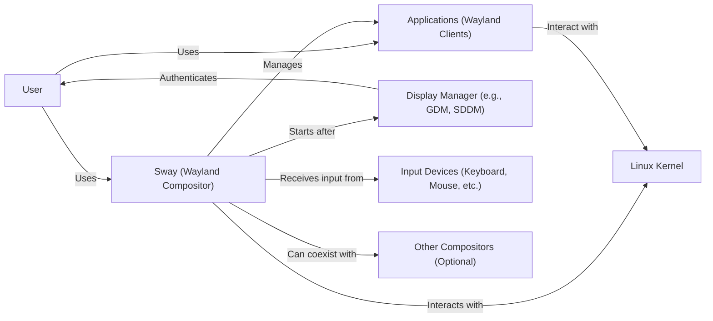
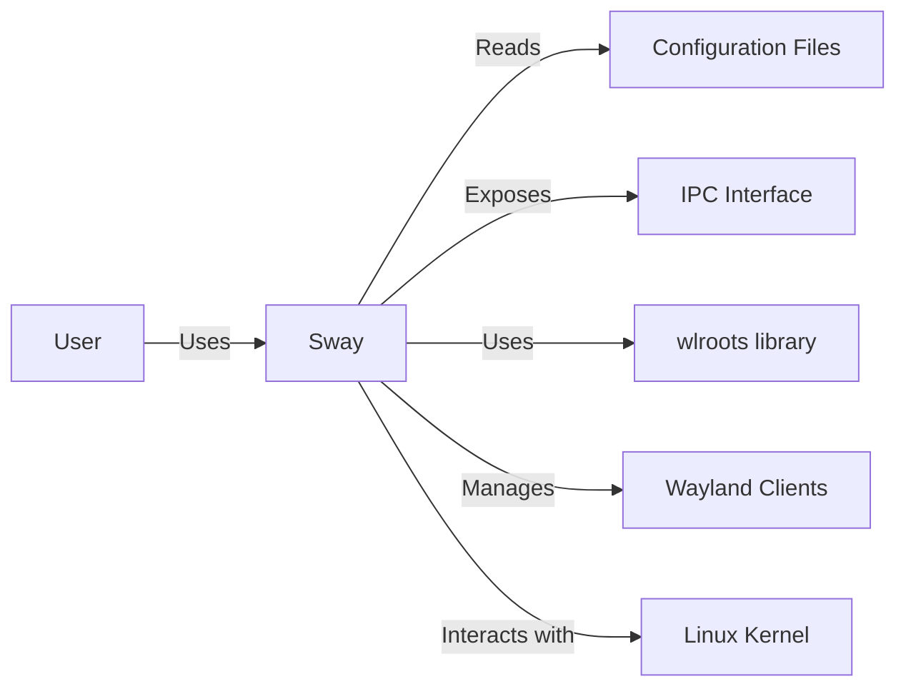
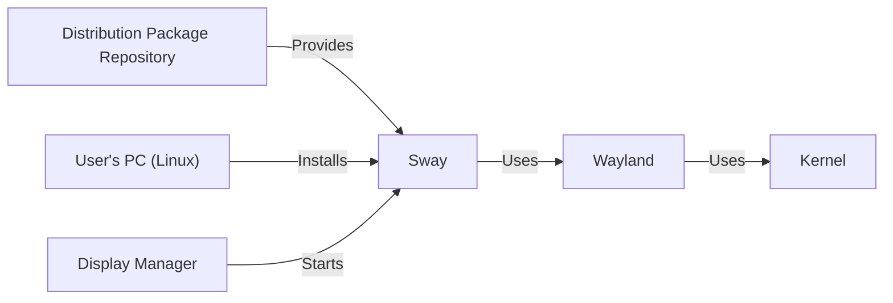
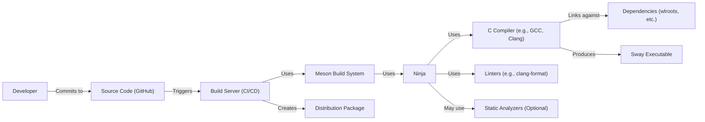

Okay, let's create a design document for the Sway project, focusing on aspects relevant for threat modeling.

# BUSINESS POSTURE

Sway is a tiling Wayland compositor and a drop-in replacement for the i3 window manager for X11.  It's designed to be lightweight, efficient, and highly customizable.  The primary business goals (from the perspective of the project maintainers and contributors, not a commercial entity) are:

*   Provide a stable and performant window management experience on Wayland.
*   Maintain compatibility with i3's configuration and workflow, easing the transition for existing i3 users.
*   Offer a modern, extensible platform for users to customize their desktop environment.
*   Foster a community-driven development model.

Business priorities:

*   User Experience: Providing a smooth, responsive, and customizable user interface is paramount.
*   Compatibility: Maintaining compatibility with i3 is a key differentiator and adoption driver.
*   Stability: Ensuring the compositor is stable and reliable is critical for user trust.
*   Security: As a core component of the user's desktop environment, security is crucial, though it must be balanced with the project's goals of flexibility and performance.
*   Maintainability: The project should be maintainable by a community of developers.

Most important business risks:

*   Instability leading to system crashes or data loss.
*   Security vulnerabilities that could allow attackers to compromise the user's system.
*   Incompatibility with i3 configurations, alienating the existing user base.
*   Lack of community engagement, leading to stagnation of the project.
*   Performance issues that degrade the user experience.

# SECURITY POSTURE

Existing security controls:

*   security control: Code Reviews: All contributions are subject to code review by project maintainers. (Implicit in the GitHub workflow).
*   security control: Community Scrutiny: The open-source nature of the project allows for broad security scrutiny by the community.
*   security control: Use of Memory-Safe Languages: While Sway is written in C, which is not inherently memory-safe, efforts are made to use safe coding practices. (Inferred from project documentation and best practices).
*   security control: Input Sanitization: Sway handles input from various sources (keyboard, mouse, configuration files) and must sanitize this input to prevent vulnerabilities. (Inferred from the nature of the project).
*   security control: Wayland Protocol: By using the Wayland protocol, Sway benefits from its security features, such as client isolation. (Explicit in project description).
*   security control: Limited Scope: Sway focuses on window management and compositing, delegating other tasks (like display server functionality) to other components. This reduces its attack surface.

Accepted risks:

*   accepted risk: Reliance on External Libraries: Sway depends on external libraries (like wlroots) which may have their own vulnerabilities.
*   accepted risk: Complexity of C Codebase: The use of C introduces the inherent risk of memory management errors, despite efforts to mitigate them.
*   accepted risk: User Configuration Errors: Sway's extensive configurability means users can introduce security issues through misconfiguration.
*   accepted risk: Limited Formal Security Audits: Due to resource constraints, formal security audits may be infrequent.

Recommended security controls:

*   Static Analysis: Integrate static analysis tools (e.g., Coverity, clang-tidy) into the build process to identify potential vulnerabilities early.
*   Fuzzing: Implement fuzzing to test Sway's input handling and identify potential crashes or vulnerabilities.
*   Sandboxing: Explore options for sandboxing or isolating certain components of Sway to limit the impact of potential vulnerabilities.
*   Documentation: Improve documentation on secure configuration practices for users.
*   Dependency Management: Establish a clear process for managing dependencies and addressing vulnerabilities in external libraries.

Security Requirements:

*   Authentication: Sway itself does not handle user authentication (this is typically handled by a display manager). However, it should securely interact with authentication mechanisms provided by the system.
*   Authorization: Sway should enforce appropriate access controls based on the Wayland protocol and system configuration. For example, it should prevent unauthorized clients from accessing other clients' surfaces.
*   Input Validation: All input from external sources (configuration files, IPC, user input devices) must be strictly validated to prevent injection attacks or other vulnerabilities.
*   Cryptography: Sway may need to interact with cryptographic APIs (e.g., for secure communication with other components). Any use of cryptography should follow best practices and use well-vetted libraries.
*   Secure Communication: If Sway communicates with other processes or services, it should use secure communication channels (e.g., Unix domain sockets with appropriate permissions).

# DESIGN

## C4 CONTEXT

Element descriptions:

*   Element:
    *   Name: User
    *   Type: Person
    *   Description: A person who interacts with their computer system using Sway.
    *   Responsibilities: Interacts with applications, configures Sway, provides input.
    *   Security controls: N/A (external to the system)

*   Element:
    *   Name: Sway (Wayland Compositor)
    *   Type: Software System
    *   Description: The core of the project, a tiling Wayland compositor.
    *   Responsibilities: Manages windows, handles input, renders output, enforces Wayland protocol.
    *   Security controls: Input sanitization, Wayland protocol enforcement, code reviews, community scrutiny.

*   Element:
    *   Name: Applications (Wayland Clients)
    *   Type: Software System
    *   Description: Applications that run on the Wayland display server.
    *   Responsibilities: Provide user functionality, interact with Sway via the Wayland protocol.
    *   Security controls: Client isolation (provided by Wayland).

*   Element:
    *   Name: Linux Kernel
    *   Type: Software System
    *   Description: The operating system kernel.
    *   Responsibilities: Manages hardware resources, provides system calls.
    *   Security controls: Kernel security features (e.g., ASLR, seccomp).

*   Element:
    *   Name: Display Manager (e.g., GDM, SDDM)
    *   Type: Software System
    *   Description: Handles user login and session management.
    *   Responsibilities: Authenticates users, starts the Wayland compositor.
    *   Security controls: Authentication mechanisms, secure session management.

*   Element:
    *   Name: Input Devices (Keyboard, Mouse, etc.)
    *   Type: Hardware
    *   Description: Devices used to provide input to the system.
    *   Responsibilities: Send input events to the kernel.
    *   Security controls: N/A (hardware level)

*   Element:
    *   Name: Other Compositors (Optional)
    *   Type: Software System
    *   Description: Other Wayland compositors that might be running on the system.
    *   Responsibilities: Same as Sway (in their respective instances).
    *   Security controls: Dependent on the specific compositor.

## C4 CONTAINER

In the case of Sway, the container diagram is very similar to the context diagram, as Sway itself is the primary container.

Element descriptions:

*   Element:
    *   Name: User
    *   Type: Person
    *   Description: A person interacting with Sway.
    *   Responsibilities: Provides input, configures Sway, interacts with applications.
    *   Security controls: N/A

*   Element:
    *   Name: Sway
    *   Type: Container (Application)
    *   Description: The Sway Wayland compositor.
    *   Responsibilities: Window management, input handling, rendering, Wayland protocol implementation.
    *   Security controls: Input sanitization, Wayland protocol enforcement, code reviews, community scrutiny.

*   Element:
    *   Name: Configuration Files
    *   Type: Data Store
    *   Description: Files containing user configuration for Sway.
    *   Responsibilities: Store user preferences for Sway's behavior.
    *   Security controls: File permissions, input validation within Sway.

*   Element:
    *   Name: IPC Interface
    *   Type: API
    *   Description: Inter-Process Communication interface for controlling Sway.
    *   Responsibilities: Allows external tools to interact with and control Sway.
    *   Security controls: Access control (e.g., Unix socket permissions), input validation.

*   Element:
    *   Name: wlroots library
    *   Type: Library
    *   Description: A modular Wayland compositor library.
    *   Responsibilities: Provides building blocks for creating Wayland compositors.
    *   Security controls: Dependent on wlroots's own security posture. Sway relies on wlroots for much of the Wayland protocol handling.

*   Element:
    *   Name: Wayland Clients
    *   Type: Container (Application)
    *   Description: Applications running on the Wayland display server.
    *   Responsibilities: Provide user functionality.
    *   Security controls: Client isolation (provided by Wayland and enforced by Sway).

*   Element:
    *   Name: Linux Kernel
    *   Type: Container (Operating System)
    *   Description: The operating system kernel.
    *   Responsibilities: Manages hardware, provides system calls.
    *   Security controls: Kernel security features.

## DEPLOYMENT

Sway is typically deployed as a package through a distribution's package manager (e.g., apt, pacman).  It can also be built from source.  The deployment environment is a Linux system with Wayland support.

Possible deployment solutions:

1.  Distribution Package: Installed via the system's package manager (e.g., `apt install sway`).
2.  Build from Source: Compiled and installed from the source code.
3.  Containerized Deployment (less common, but possible): Sway could be run within a container (e.g., Docker) for isolation or testing.

Chosen solution (most common): Distribution Package

Element descriptions:

*   Element:
    *   Name: User's PC (Linux)
    *   Type: Infrastructure Node
    *   Description: The user's computer running a Linux distribution.
    *   Responsibilities: Runs the operating system, Sway, and applications.
    *   Security controls: System-level security controls (firewall, user permissions, etc.).

*   Element:
    *   Name: Distribution Package Repository
    *   Type: Infrastructure Node
    *   Description: A repository containing software packages for the Linux distribution.
    *   Responsibilities: Provides a trusted source for software packages.
    *   Security controls: Package signing, repository security measures.

*   Element:
    *   Name: Wayland
    *   Type: Software System
    *   Description: The Wayland display server protocol.
    *   Responsibilities: Provides a communication protocol between Sway and applications.
    *   Security controls: Wayland protocol security features (client isolation).

*   Element:
    *   Name: Sway
    *   Type: Software System
    *   Description: The Sway Wayland compositor.
    *   Responsibilities: Window management, input handling, rendering.
    *   Security controls: Input sanitization, Wayland protocol enforcement.

*   Element:
    *   Name: Display Manager
    *   Type: Software System
    *   Description: Manages user login and session.
    *   Responsibilities: Authenticates users, starts Sway.
    *   Security controls: Authentication mechanisms.

*   Element:
    *   Name: Kernel
    *   Type: Software System
    *   Description: The Linux kernel.
    *   Responsibilities: Manages hardware, provides system calls.
    *   Security controls: Kernel security features.

## BUILD

Sway uses a Meson build system and is typically built using Ninja. The build process involves compiling the C code, linking against required libraries (like wlroots), and generating the final executable.

Security controls in the build process:

*   security control: Code Review: All code changes are reviewed before being merged.
*   security control: Linters: Linters (like clang-format) are used to enforce code style and potentially identify some basic code quality issues.
*   security control: (Recommended) Static Analysis: Static analysis tools can be integrated into the build process to identify potential vulnerabilities.
*   security control: Dependency Management: Dependencies are managed through the build system, and updates should be monitored for security vulnerabilities.
*   security control: (Recommended) Reproducible Builds: Aiming for reproducible builds can help ensure that the build process is deterministic and that the resulting binaries can be verified.

# RISK ASSESSMENT

Critical business processes to protect:

*   User's Desktop Session: Ensuring the stability and security of the user's desktop environment is the primary process to protect.
*   Configuration Management: Protecting the integrity and confidentiality of user configurations.
*   Input Handling: Securely processing input from various sources to prevent vulnerabilities.
*   Inter-Process Communication: Ensuring secure communication between Sway and other processes.

Data to protect and their sensitivity:

*   User Configuration Data: Sensitivity: Medium. Contains user preferences and settings, which could potentially reveal information about the user or their system.
*   Display Output: Sensitivity: High. The contents of the user's screen can contain highly sensitive information.
*   Input Events: Sensitivity: High. Keystrokes and mouse movements can contain sensitive information, including passwords.
*   IPC Communication: Sensitivity: Medium to High. Depending on the content of the communication, it could contain sensitive information or allow for unauthorized control of Sway.

# QUESTIONS & ASSUMPTIONS

Questions:

*   What is the specific threat model or attack surface that is of greatest concern? (e.g., remote attackers, malicious local applications, physical access)
*   Are there any specific compliance requirements or regulations that need to be considered?
*   What is the level of resources available for security testing and auditing?
*   What is the process for handling security vulnerabilities reported by external researchers?
*   Are there plans to integrate any specific security tools or technologies (e.g., SELinux, AppArmor)?

Assumptions:

*   BUSINESS POSTURE: The primary goal is to provide a functional and customizable Wayland compositor, with security being a high priority but balanced with usability and performance.
*   SECURITY POSTURE: The project relies heavily on community contributions and code reviews for security, with limited resources for formal security audits.
*   DESIGN: The design is based on the Wayland protocol and leverages the wlroots library for core functionality. The deployment model is primarily through distribution packages. The build process is automated using Meson and Ninja.