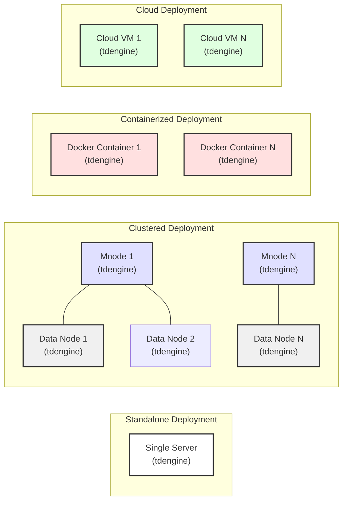

## Project Design Document: TDengine (Improved)

**1. Introduction**

This document provides an enhanced architectural overview of the TDengine project, an open-source, high-performance time-series database (TSDB). This improved version aims to provide even greater clarity and detail, specifically tailored for subsequent threat modeling activities. It offers a comprehensive understanding of the system's components, their interactions, and data flows. The target audience includes security engineers, developers, and architects involved in the security assessment, deployment, and maintenance of TDengine.

**2. Project Overview**

TDengine is engineered for the efficient storage and analysis of time-series data, commonly generated by IoT devices, industrial equipment, and IT infrastructure monitoring systems. Its key features include high compression ratios, rapid query execution, and robust clustering capabilities. A core design principle is the ability to manage data from numerous sensors or data streams within a single, streamlined database instance, simplifying operational management and optimizing query performance.

**3. System Architecture**

The TDengine architecture is composed of several interconnected components working in concert.

*   **tdengine (Server Process):** The central database server process responsible for the majority of TDengine's functionality:
    *   Receiving and processing client requests, including SQL queries and data ingestion commands.
    *   Managing metadata encompassing databases, tables, users, and cluster configurations.
    *   Storing, indexing, and retrieving time-series data from the underlying storage engine.
    *   Executing query plans, optimizing for time-series specific operations.
    *   Enforcing data lifecycle management policies, such as data retention rules.
    *   Orchestrating clustering and data replication activities in distributed deployments.
    *   Handling user authentication and authorization.

*   **Client SDKs (Multi-Language Support):** TDengine offers client-side libraries in various programming languages (e.g., C/C++, Java, Python, Go, Node.js). These SDKs facilitate seamless interaction with the `tdengine` server by:
    *   Managing connection establishment and maintenance.
    *   Providing APIs for executing queries and ingesting data.
    *   Handling data serialization and deserialization.
    *   Abstracting low-level communication details.

*   **taosAdapter (Protocol Translation):** An optional component that acts as a protocol gateway, enabling applications designed for other database systems (notably MySQL) to interact with TDengine. It performs real-time translation of incoming requests into TDengine-compatible operations, facilitating easier migration and integration.

*   **Storage Engine (LSM-Tree Based):** The core of TDengine's data persistence layer, responsible for the physical storage of time-series data on disk. Key characteristics include:
    *   Log-Structured Merge (LSM) tree architecture optimized for write-heavy workloads.
    *   High data compression to minimize storage footprint.
    *   Efficient indexing mechanisms for rapid data retrieval based on timestamps and tags.
    *   Management of data blocks and segments on disk.

*   **MetaDB (Internal Metadata Storage):** A dedicated, embedded database within the `tdengine` process that stores critical metadata:
    *   Definitions of databases, tables (including super tables and sub-tables), and columns.
    *   User accounts, roles, and associated permissions.
    *   Cluster configuration information, including node roles and states.
    *   Internal system configurations and statistics.

*   **Cache Layers:** TDengine employs multiple caching layers to enhance query performance:
    *   **Block Cache:** Caches frequently accessed data blocks from disk in memory.
    *   **Query Cache:** Stores the results of previously executed queries to avoid redundant computations.
    *   **Metadata Cache:** Caches frequently accessed metadata for faster access to table and schema information.

*   **Vnodes (Virtual Nodes - Clustered Mode):** In a clustered deployment, data is horizontally partitioned across multiple virtual nodes. Each `tdengine` server instance manages a subset of these vnodes, responsible for storing and serving data within its assigned partitions.

*   **Mnodes (Management Nodes - Clustered Mode):** In a clustered environment, designated `tdengine` instances operate as management nodes. Their responsibilities include:
    *   Cluster-wide metadata management and synchronization.
    *   Coordination of data replication and distribution across vnodes.
    *   Monitoring the health and status of cluster nodes.
    *   Handling leader election and failover procedures.

**4. Data Flow (Detailed)**

The following diagrams illustrate the detailed data flow within TDengine for both data ingestion and query processing.

*   **Detailed Data Ingestion Flow:**

    ```mermaid
    graph LR
        A["Data Source"] --> B("Client Application");
        B --> C("Client SDK");
        C --> D{"tdengine Server\n(Network Listener)"};
        D --> E{"Authentication\n& Authorization"};
        E -- "Success" --> F{"Data Validation\n& Parsing"};
        F --> G{"Write to WAL\n(Write-Ahead Log)"};
        G --> H{"Memory Table\n(Write Buffer)"};
        H --> I{"Storage Engine\n(Background Flush)"};
        I --> J("Disk Storage");
        E -- "Failure" --> K("Reject Request");
        style A fill:#f9f,stroke:#333,stroke-width:2px
        style J fill:#ccf,stroke:#333,stroke-width:2px
    ```

    *   Data originates from various sources (sensors, applications, etc.).
    *   Client applications utilize the TDengine Client SDK to establish a connection with the `tdengine` server.
    *   The Client SDK transmits data ingestion requests to the `tdengine` server's network listener.
    *   The `tdengine` server performs authentication and authorization checks on the incoming request.
    *   Upon successful authentication, the data is validated and parsed.
    *   The ingested data is first written to the Write-Ahead Log (WAL) for durability.
    *   Subsequently, the data is buffered in an in-memory table (write buffer).
    *   The Storage Engine asynchronously flushes the in-memory data to the persistent disk storage.
    *   If authentication or authorization fails, the request is rejected.

*   **Detailed Query Flow:**

    ```mermaid
    graph LR
        A["Client Application"] --> B("Client SDK");
        B --> C{"tdengine Server\n(Network Listener)"};
        C --> D{"Authentication\n& Authorization"};
        D -- "Success" --> E{"Query Parser\n& Optimizer"};
        E --> F{"Metadata Lookup"};
        F --> G{"Cache Lookup\n(Block, Query)"};
        G -- "Cache Hit" --> H("Return Results");
        G -- "Cache Miss" --> I{"Storage Engine\n(Data Retrieval)"};
        I --> J{"Data Processing\n& Aggregation"};
        J --> H;
        D -- "Failure" --> K("Reject Query");
        H --> B;
        B --> A;
        style A fill:#f9f,stroke:#333,stroke-width:2px
        style I fill:#ccf,stroke:#333,stroke-width:2px
    ```

    *   Client applications use the TDengine Client SDK to send SQL queries to the `tdengine` server.
    *   The `tdengine` server's network listener receives the query.
    *   Authentication and authorization checks are performed.
    *   Upon successful authentication, the Query Parser analyzes and optimizes the query execution plan.
    *   Metadata is consulted to understand the schema and table structures involved.
    *   The cache layers (block cache and query cache) are checked for relevant data or previously computed results.
    *   If a cache hit occurs, results are returned directly.
    *   If a cache miss occurs, the Storage Engine retrieves the necessary data from disk.
    *   Retrieved data undergoes processing and aggregation as specified in the query.
    *   The final results are returned to the client application via the Client SDK.
    *   If authentication or authorization fails, the query is rejected.

**5. Key Interactions and Interfaces (Elaborated)**

*   **Client-Server Communication (TCP with Proprietary Protocol):** Clients interact with the `tdengine` server over TCP/IP. The communication protocol is proprietary but well-defined and documented, often involving binary serialization for efficiency. TLS/SSL encryption can be enabled for secure communication.

*   **Internal Component Communication (APIs and Shared Memory):** Within the `tdengine` process, modules communicate via internal APIs, function calls, and potentially shared memory for performance-critical data exchange.

*   **Storage Engine Interface (Defined API):** The `tdengine` server interacts with the Storage Engine through a well-defined API that abstracts the underlying storage implementation. This API includes functions for writing data blocks, retrieving data based on timestamps and tags, and managing data lifecycle.

*   **Clustering Communication (Gossip Protocol and Dedicated Channels):** In a clustered deployment, `tdengine` instances communicate using a combination of:
    *   **Gossip Protocol:** For cluster membership discovery and health monitoring.
    *   **Dedicated Communication Channels:** For data replication, leader election among Mnodes, and metadata synchronization. This communication typically occurs over TCP/IP and may utilize a binary protocol.

**6. Security Considerations (Detailed for Threat Modeling)**

This section provides a more detailed breakdown of security considerations, crucial for effective threat modeling.

*   **Confidentiality:**
    *   **Network Encryption (TLS/SSL):** TDengine supports TLS/SSL to encrypt communication between clients and the server, and between nodes in a cluster, protecting data in transit. *Threat:* Man-in-the-middle attacks.
    *   **Data Encryption at Rest:** While not explicitly mentioned as a built-in feature in the provided context, the possibility and need for encrypting data at rest on the storage media should be considered. *Threat:* Unauthorized access to data on disk.
    *   **Access Control:** TDengine implements user-based authentication and authorization to control access to databases and tables. *Threat:* Unauthorized data access.

*   **Integrity:**
    *   **Write-Ahead Logging (WAL):** Ensures data durability and consistency by logging all write operations before applying them to the main data store. *Mitigation:* Protect the WAL files.
    *   **Data Validation:** The `tdengine` server validates incoming data to prevent malformed or malicious data from being ingested. *Threat:* Data corruption.
    *   **Data Replication (Clustered Mode):** Replication across multiple nodes provides redundancy and helps ensure data integrity in case of node failures. *Threat:* Data loss due to hardware failure.

*   **Availability:**
    *   **Clustering and High Availability:** Clustered deployments provide redundancy and failover capabilities, ensuring continuous service availability. *Threat:* Service disruption due to single point of failure.
    *   **Resource Management:** Proper resource management (CPU, memory, disk I/O) is crucial to prevent denial-of-service conditions. *Threat:* Resource exhaustion leading to service unavailability.

*   **Authentication and Authorization:**
    *   **User Authentication:** TDengine requires clients to authenticate using usernames and passwords. *Threat:* Brute-force attacks, credential compromise.
    *   **Role-Based Access Control (Potential Future Enhancement):** While the current description mentions user-based access control, future enhancements might include more granular role-based access control.
    *   **Authorization:**  Permissions are granted to users to control access to specific databases and tables. *Threat:* Privilege escalation.

*   **Input Validation:**
    *   **SQL Injection Prevention:** The `tdengine` server must sanitize and validate all incoming SQL queries to prevent SQL injection attacks. *Threat:* Data breaches, unauthorized data manipulation.

*   **Auditing:**
    *   **Logging:** TDengine logs various events, including user logins, query executions, and system errors. *Requirement:* Securely store and monitor these logs. *Threat:* Lack of accountability, difficulty in incident response.

*   **Secure Configuration:**
    *   **Default Credentials:** Ensure default credentials are changed immediately upon deployment. *Threat:* Unauthorized access using default credentials.
    *   **Principle of Least Privilege:** Grant only necessary permissions to users and applications. *Threat:* Excessive privileges leading to potential misuse.

*   **Vulnerability Management:**
    *   **Regular Updates and Patching:** Keeping TDengine up-to-date with the latest security patches is crucial. *Threat:* Exploitation of known vulnerabilities.

**7. Deployment Considerations (Visualized)**

TDengine can be deployed in various configurations, as illustrated below:



*   **Standalone Deployment:** A single `tdengine` instance on one server, suitable for development or small-scale deployments.
*   **Clustered Deployment:** Multiple `tdengine` instances forming a cluster with dedicated Mnodes and data nodes for high availability and scalability.
*   **Containerized Deployment (Docker, Kubernetes):** TDengine deployed within containers for easier management, scaling, and portability.
*   **Cloud Deployments (AWS, Azure, GCP):** TDengine deployed on cloud infrastructure using virtual machines or container services.

**8. Future Considerations and Potential Extensions (Security Focused)**

*   **Enhanced Authentication Mechanisms:** Integration with external authentication providers (e.g., LDAP, Active Directory, OAuth 2.0).
*   **Role-Based Access Control (RBAC):** Implementing a more granular permission system based on roles rather than individual users.
*   **Data Masking and Anonymization:** Features to mask or anonymize sensitive data for compliance and privacy.
*   **Advanced Auditing and Monitoring:** More detailed audit logs and integration with Security Information and Event Management (SIEM) systems for real-time threat detection.
*   **Built-in Data Encryption at Rest:** Native support for encrypting data on disk.
*   **Web Application Firewall (WAF) Integration:** For deployments exposing TDengine through a web interface (if applicable).

**9. Conclusion**

This improved design document provides a more detailed and comprehensive architectural overview of the TDengine project, specifically focusing on aspects relevant to security threat modeling. By elaborating on the components, data flows, interactions, and security considerations, this document serves as a robust foundation for identifying potential vulnerabilities and designing effective security controls. The subsequent threat modeling exercise will leverage this information to systematically assess risks and recommend mitigation strategies to ensure the secure deployment and operation of TDengine.
