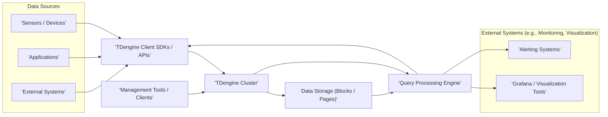
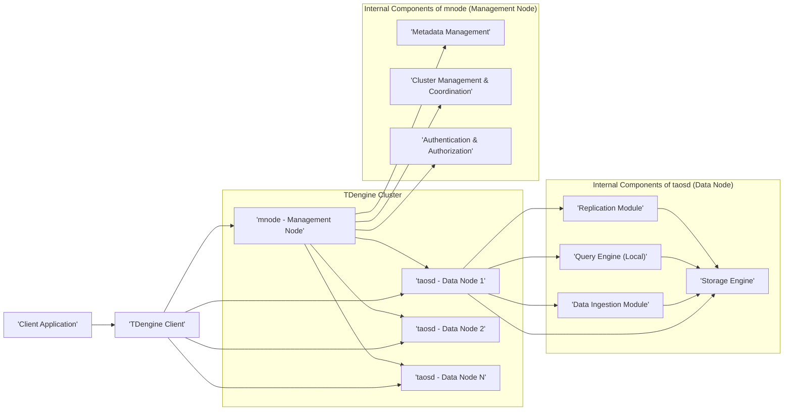
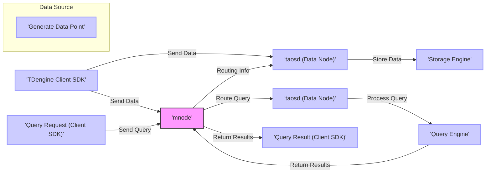

# Project Design Document: TDengine

**Version:** 1.1
**Date:** October 26, 2023
**Prepared By:** Gemini (AI Architecture Expert)

## 1. Project Overview

This document provides a detailed architectural overview of TDengine, an open-source, high-performance time-series database (TSDB) engineered for demanding workloads in the Internet of Things (IoT), Industrial Internet, and connected vehicles domains. The primary purpose of this document is to serve as a foundation for subsequent threat modeling activities.

## 2. Goals

*   Present a clear, concise, and comprehensive architectural description of the TDengine system.
*   Identify and describe the core components of TDengine and their interactions within the system.
*   Illustrate and explain the flow of data through the TDengine architecture.
*   Highlight critical security considerations inherent in the design of TDengine.
*   Act as a foundational document for conducting thorough threat modeling exercises.

## 3. Target Audience

*   Security Engineers responsible for assessing and mitigating security risks.
*   Software Developers involved in building applications that interact with TDengine.
*   System Architects designing and deploying TDengine infrastructure.
*   DevOps Engineers managing and operating TDengine clusters.

## 4. System Architecture

### 4.1. High-Level Architecture

This diagram illustrates the primary actors and components interacting with a TDengine cluster.

### 4.2. Detailed Architecture

This diagram details the internal components of a TDengine cluster, highlighting the roles of data nodes (`taosd`) and the management node (`mnode`).

## 5. Components

*   **`taosd` (Data Node):** The fundamental processing unit within a TDengine cluster, responsible for:
    *   Receiving and efficiently ingesting high-volume time-series data streams.
    *   Storing data in an optimized, columnar format designed for time-series queries.
    *   Processing queries that target data residing on the local node.
    *   Ensuring data durability and availability through replication to other data nodes.
*   **`mnode` (Management Node):** The central coordinating component of the TDengine cluster, responsible for:
    *   Maintaining and managing metadata about databases, tables, users, and cluster topology.
    *   Handling initial client connections, authentication, and authorization checks.
    *   Coordinating data distribution across data nodes and managing replication strategies.
    *   Monitoring the health and operational status of all nodes within the cluster.
*   **TDengine Client SDKs/APIs:**  A set of libraries and interfaces enabling applications to interact with the TDengine cluster programmatically. These SDKs abstract the underlying communication protocols and provide convenient methods for data ingestion and querying. Available for various programming languages including C/C++, Java, Python, and Go.
*   **TDengine Client (CLI):** A command-line interface tool providing administrators and developers with direct access to the TDengine server for executing SQL commands, managing the cluster, and performing administrative tasks.
*   **Data Ingestion Module (within `taosd`):**  The component within a `taosd` process that handles the reception, parsing, and validation of incoming time-series data points from client applications.
*   **Storage Engine (within `taosd`):** The core of the `taosd` process responsible for the physical organization and storage of time-series data on disk. This engine employs techniques like columnar storage and compression to optimize for both storage efficiency and query performance.
*   **Query Engine (Local within `taosd`, Distributed across cluster):**  The component responsible for executing SQL queries. Each `taosd` has a local query engine for processing queries against its local data. The `mnode` coordinates distributed queries that span multiple `taosd` nodes.
*   **Replication Module (within `taosd`):** Ensures data redundancy and fault tolerance by replicating ingested data to other designated `taosd` nodes within the cluster, based on configured replication policies.
*   **Metadata Management (within `mnode`):**  The module within the `mnode` responsible for storing and managing critical information about the structure of databases and tables, user accounts and permissions, and the overall cluster configuration.
*   **Cluster Management & Coordination (within `mnode`):** Handles administrative tasks related to the TDengine cluster, such as adding or removing nodes, managing resource allocation, and ensuring the overall health and stability of the cluster.
*   **Authentication & Authorization (within `mnode`):**  The security component within the `mnode` that verifies the identity of connecting clients and enforces access control policies to ensure that users only access data and perform actions they are authorized for.

## 6. Data Flow

The typical lifecycle of data within TDengine involves the following stages:

1. **Data Ingestion:**
    *   Time-series data is generated by sensors, applications, or other data sources.
    *   This data is transmitted to the TDengine cluster using a TDengine Client SDK or API.
    *   The client initially connects to the `mnode` to establish a session and obtain routing information.
    *   The `mnode`, based on the target database and table, directs the client to the specific `taosd` node responsible for handling that data.
    *   The designated `taosd` node's Data Ingestion Module receives and processes the incoming data.
2. **Data Storage:**
    *   The Data Ingestion Module validates and prepares the received data for storage.
    *   The data is then written to the Storage Engine, which optimizes its layout and applies compression techniques for efficient storage.
    *   Concurrently, the Replication Module within the `taosd` node replicates the ingested data to other `taosd` nodes according to the configured replication factor and strategy.
3. **Query Processing:**
    *   A client application initiates a query against the TDengine database using a Client SDK or API.
    *   The client connects to the `mnode`.
    *   The `mnode` parses the incoming query and identifies the `taosd` nodes that hold the relevant data partitions.
    *   The `mnode` then distributes sub-queries to the appropriate `taosd` nodes.
    *   Each targeted `taosd` node's local Query Engine executes its assigned portion of the query against its local data.
    *   The results from the individual `taosd` nodes are collected and aggregated (if necessary) by the `mnode` before being returned to the client application.
4. **Management Operations:**
    *   Administrators or management tools interact directly with the `mnode` to perform administrative actions.
    *   These actions include creating and managing databases and tables, configuring user accounts and permissions, and monitoring the overall health and performance of the TDengine cluster.

## 7. Security Considerations

This section details security considerations relevant for threat modeling and risk assessment:

*   **Authentication and Authorization:**
    *   **Client Authentication:** TDengine employs username/password-based authentication for clients connecting to the cluster. Consider the strength of password policies and the potential for brute-force attacks.
    *   **API Key Authentication:**  TDengine also supports authentication using API keys. Evaluate the generation, storage, and revocation mechanisms for API keys.
    *   **Role-Based Access Control (RBAC):** TDengine implements RBAC to control access to databases and tables. Analyze the granularity of roles and permissions and the process for assigning roles to users.
    *   **Privilege Levels:**  Different privilege levels exist for users (e.g., administrator, read-only). Assess the potential impact of compromised administrator accounts.
    *   **Credential Storage:** Investigate how user credentials and API keys are stored (e.g., hashed, encrypted) and the security of the storage mechanism.
*   **Network Security:**
    *   **TLS/SSL Encryption:** Communication between clients and the `mnode`, and between nodes within the cluster, can be secured using TLS/SSL encryption. Evaluate the configuration and enforcement of TLS/SSL.
    *   **Firewall Rules:** Proper firewall configuration is crucial to restrict network access to the TDengine cluster. Identify necessary ports and access control lists.
    *   **Network Segmentation:** Consider segmenting the network to isolate the TDengine cluster from other less trusted networks.
    *   **Communication Ports:**  Document the specific network ports used by TDengine components for inter-process and client communication.
*   **Data Encryption:**
    *   **Encryption at Rest:** TDengine offers options for encrypting data at rest on the storage media. Analyze the encryption algorithms used (e.g., AES) and the key management strategy.
    *   **Encryption in Transit:**  (Covered under Network Security with TLS/SSL). Ensure that encryption in transit is consistently enforced.
*   **Input Validation:**
    *   **Data Input Validation:**  Assess the mechanisms in place to validate data inputs to prevent injection attacks or data corruption.
    *   **SQL Injection Prevention:**  Evaluate how TDengine mitigates the risk of SQL injection vulnerabilities in client queries.
*   **Auditing and Logging:**
    *   **Event Logging:** TDengine logs various events, including authentication attempts, data modification operations, and administrative actions. Determine the completeness and relevance of the audit logs.
    *   **Log Storage and Protection:**  Analyze where logs are stored, how access to logs is controlled, and measures to prevent tampering or unauthorized deletion.
    *   **Monitoring and Alerting:**  Evaluate the capabilities for real-time monitoring of security-related events and the mechanisms for generating alerts on suspicious activity.
*   **Vulnerability Management:**
    *   **Patching Process:** Understand the process for identifying, patching, and deploying security updates for TDengine.
    *   **Upgrade Procedures:** Assess the complexity and security considerations involved in upgrading TDengine to newer versions.
*   **Access Control to Configuration Files:**
    *   **Configuration Security:**  Determine how access to TDengine configuration files is controlled and protected to prevent unauthorized modifications.
*   **Replication Security:**
    *   **Data Integrity during Replication:**  Evaluate mechanisms to ensure the integrity of data during the replication process.
    *   **Confidentiality of Replicated Data:** If encryption in transit is not enforced within the cluster, consider the potential exposure of replicated data.
*   **Backup and Recovery:**
    *   **Backup Security:**  Analyze how backups are performed, where they are stored, and the security measures in place to protect backup data.
    *   **Recovery Process:**  Understand the process for restoring data from backups and any associated security considerations.

## 8. Deployment Considerations

*   **On-Premise Deployment:**  Deploying TDengine within an organization's own infrastructure provides greater control over the environment but requires managing the underlying hardware and operating system security.
*   **Cloud Deployment:** Utilizing cloud platforms offers scalability and managed services, but introduces dependencies on the cloud provider's security model and configurations.
*   **Containerization (Docker, Kubernetes):** Containerizing TDengine simplifies deployment and management but requires careful consideration of container image security and orchestration platform security.
*   **Edge Deployment:** Deploying TDengine on edge devices brings data processing closer to the source but introduces challenges related to physical security and remote management.

## 9. Future Considerations

*   Detailed analysis of the security architecture of individual internal modules within `taosd` and `mnode`.
*   Security assessment of specific TDengine Client SDK implementations for potential vulnerabilities.
*   Evaluation of the security implications of integrating TDengine with various third-party systems and applications.
*   Ongoing monitoring of the TDengine project for newly identified vulnerabilities and the implementation of appropriate mitigation strategies.
*   Consideration of incorporating advanced security features such as data masking or redaction in future releases.
