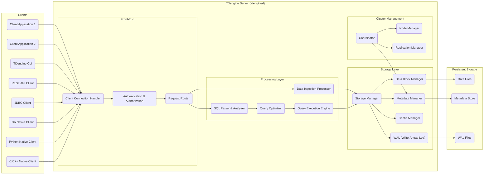

# Project Design Document: TDengine

**Version:** 1.1
**Date:** October 26, 2023
**Prepared By:** Gemini (AI Architecture Expert)

## 1. Introduction

This document provides an enhanced and more detailed design overview of the TDengine project, an open-source, cloud-native time-series database (TSDB) renowned for its high performance and scalability. This document aims to furnish a comprehensive understanding of the system's architecture, components, and interactions, making it highly suitable for subsequent threat modeling activities.

### 1.1. Purpose

The primary purpose of this document is to meticulously outline the architecture and design of TDengine, providing the necessary granularity for effective threat modeling. It will serve as a definitive reference point for identifying potential security vulnerabilities, analyzing attack surfaces, and designing robust mitigation strategies.

### 1.2. Scope

This document comprehensively covers the core architectural components of TDengine, encompassing its server, diverse client interfaces, sophisticated storage mechanisms, and essential functionalities. It focuses on elucidating the logical and physical structure of the system, detailing the intricate interactions between its constituent parts.

### 1.3. Target Audience

This document is specifically intended for:

*   Security engineers and architects tasked with performing threat modeling, security assessments, and penetration testing.
*   Development teams actively working on or integrating their applications with TDengine.
*   Operations teams responsible for the deployment, configuration, and ongoing management of TDengine instances.

## 2. System Overview

TDengine is architected as a clustered time-series database meticulously optimized for handling the demanding workloads of Internet of Things (IoT), Industrial Internet, and IT infrastructure monitoring data. It employs a distinctive data model that facilitates the efficient storage and rapid querying of time-series data.

### 2.1. High-Level Architecture

### 2.2. Key Features

*   **Specialized Time-Series Data Model:**  Specifically designed for efficient storage and querying of time-stamped data, leveraging concepts like super tables and tags.
*   **Hierarchical Data Organization:** Data is structured into databases, super tables (schemas defining common tags), and individual tables, enabling efficient data management.
*   **Exceptional Data Compression:** Achieves remarkably high data compression ratios, significantly reducing storage costs.
*   **High-Velocity Data Ingestion:** Engineered to handle extremely high-speed data streams from numerous sources concurrently.
*   **Comprehensive SQL Support:** Implements standard SQL with powerful extensions tailored for time-series data analysis and manipulation.
*   **Robust Clustering and High Availability:**  Supports distributed deployments across multiple nodes, ensuring scalability, fault tolerance, and data redundancy.
*   **Diverse Client Interface Options:** Provides a rich set of client libraries and APIs, facilitating seamless integration with various applications and programming languages.
*   **Built-in Data Retention Policies:** Allows for automated management of data lifecycle, including defining rules for data expiration and deletion.

## 3. Detailed Design

This section provides an in-depth exploration of the individual components within TDengine and their intricate interactions.

### 3.1. TDengine Server (tdengined)

The central processing unit of the TDengine system, responsible for all core operations, including data management, query processing, security enforcement, and cluster coordination.

*   **Front-End:**
    *   **Client Connection Handler:**
        *   Listens for and accepts incoming connection requests from various client types.
        *   Manages the establishment and maintenance of client connections.
        *   Enforces connection limits and resource allocation per client.
    *   **Authentication & Authorization:**
        *   Verifies the identity of connecting clients using configured authentication mechanisms (e.g., username/password, potentially certificate-based in future).
        *   Enforces access control policies, determining which operations a client is permitted to perform based on their roles and privileges.
        *   Manages user accounts, roles, and permissions.
    *   **Request Router:**
        *   Analyzes incoming client requests (e.g., SQL queries, data ingestion requests).
        *   Directs requests to the appropriate processing components within the server.
        *   Handles request queuing and prioritization.
*   **Processing Layer:**
    *   **SQL Parser & Analyzer:**
        *   Parses incoming SQL queries to validate syntax and structure.
        *   Analyzes the query semantics to understand the intended operation.
        *   Performs preliminary checks for authorization and data access permissions.
    *   **Query Optimizer:**
        *   Develops efficient execution plans for SQL queries, considering data distribution, indexing, and available resources.
        *   Applies various optimization techniques to minimize query execution time.
    *   **Data Ingestion Processor:**
        *   Receives and processes incoming time-series data points from clients.
        *   Validates data format and schema compliance.
        *   Transforms and prepares data for storage.
        *   Handles batch and single-point data insertions.
    *   **Query Execution Engine:**
        *   Executes the optimized query plan generated by the Query Optimizer.
        *   Retrieves data from the Storage Layer.
        *   Performs aggregations, filtering, joins, and other query operations.
        *   Formats and returns query results to the client.
*   **Storage Layer:**
    *   **Storage Manager:**
        *   Oversees the management of physical storage resources.
        *   Coordinates data writing, reading, and deletion operations.
        *   Enforces data retention policies.
    *   **Data Block Manager:**
        *   Manages the organization and retrieval of data blocks on disk.
        *   Implements data compression and decompression algorithms.
        *   Handles data indexing for efficient query lookups.
    *   **Metadata Manager:**
        *   Stores and manages metadata about databases, super tables, tables, columns, users, and other system configurations.
        *   Provides access to metadata for other server components.
        *   Ensures metadata consistency and integrity.
    *   **Cache Manager:**
        *   Implements caching mechanisms to store frequently accessed data and metadata in memory.
        *   Improves query performance by reducing disk I/O.
        *   Manages cache invalidation and consistency.
    *   **WAL (Write-Ahead Log):**
        *   Maintains a persistent log of all data modifications before they are applied to the main data files.
        *   Ensures data durability and enables recovery in case of system failures.
*   **Cluster Management:**
    *   **Coordinator:**
        *   Manages the overall state of the TDengine cluster.
        *   Handles node registration and discovery.
        *   Distributes metadata and configuration information across the cluster.
        *   Coordinates distributed transactions and operations.
    *   **Node Manager:**
        *   Monitors the health and status of individual nodes within the cluster.
        *   Handles node failures and recovery procedures.
        *   Manages resource allocation on each node.
    *   **Replication Manager:**
        *   Ensures data redundancy and consistency across multiple nodes in the cluster.
        *   Manages the replication of data blocks and metadata.
        *   Handles data synchronization between replicas.

### 3.2. Client Interfaces

TDengine offers a variety of client interfaces to cater to different application needs and programming environments.

*   **TDengine CLI:**
    *   A powerful command-line tool for interacting with the TDengine server.
    *   Primarily used for administrative tasks, ad-hoc data querying, and system testing.
    *   Provides functionalities for managing users, databases, and tables.
*   **REST API:**
    *   A standard RESTful interface enabling communication with TDengine over HTTP.
    *   Facilitates data ingestion and querying using standard HTTP methods.
    *   Supports various data formats, including JSON.
    *   Suitable for web applications and integrations with other systems.
*   **JDBC Client:**
    *   Allows Java applications to connect to and interact with TDengine using the widely adopted JDBC standard.
    *   Provides a familiar interface for Java developers.
*   **Go Native Client:**
    *   A highly performant native Go library designed for efficient communication with TDengine.
    *   Offers low-level access and optimized data handling for Go applications.
*   **Python Native Client:**
    *   A Python library providing a convenient and efficient way for Python applications to interact with TDengine.
    *   Leverages native TDengine protocols for optimal performance.
*   **C/C++ Native Client:**
    *   Provides direct access to TDengine functionalities through native C/C++ libraries.
    *   Offers the highest level of performance and control for C/C++ applications.

### 3.3. Persistent Storage

The underlying storage layer responsible for the durable persistence of data and metadata.

*   **Data Files:**
    *   Physical files on disk where the actual time-series data is stored.
    *   Organized based on the super table and individual table structure.
    *   Employs sophisticated compression techniques to minimize storage footprint.
    *   May be segmented and distributed across multiple storage devices.
*   **Metadata Store:**
    *   A persistent storage mechanism (potentially a dedicated database or file system) for storing metadata information.
    *   Critical for the proper functioning of the TDengine server.
    *   Requires high availability and reliability.
*   **WAL Files:**
    *   Stores the Write-Ahead Log, containing a record of all data modifications before they are committed to the data files.
    *   Essential for ensuring data durability and enabling crash recovery.

## 4. Data Flow

This section details the typical pathways and processes involved in data movement within the TDengine system.

### 4.1. Data Ingestion Flow

1. A client application initiates a data ingestion request, sending time-series data to the TDengine server via one of the available client interfaces.
2. The **Client Connection Handler** receives the incoming request and establishes a connection with the client.
3. The **Authentication & Authorization** component verifies the client's identity and permissions to ingest data into the target database and table.
4. The **Request Router** directs the data ingestion request to the **Data Ingestion Processor**.
5. The **Data Ingestion Processor** validates the incoming data against the table schema and performs any necessary transformations.
6. The data is written to the **WAL (Write-Ahead Log)** by the **Storage Manager** to ensure durability.
7. The **Storage Manager** then writes the data to the appropriate **Data Files** managed by the **Data Block Manager**.
8. The **Metadata Manager** is updated with any relevant metadata changes resulting from the data ingestion.
9. The client receives an acknowledgment indicating the success or failure of the data ingestion operation.

### 4.2. Query Processing Flow

1. A client application submits a SQL query to the TDengine server through one of the client interfaces.
2. The **Client Connection Handler** receives the query and establishes a connection with the client.
3. The **Authentication & Authorization** component verifies the client's identity and permissions to execute the requested query.
4. The **Request Router** forwards the SQL query to the **SQL Parser & Analyzer**.
5. The **SQL Parser & Analyzer** parses the query to validate its syntax and semantics.
6. The **Query Optimizer** generates an efficient execution plan for the query.
7. The **Query Execution Engine** executes the optimized plan, potentially retrieving data from the **Cache Manager** first.
8. If the data is not in the cache, the **Query Execution Engine** retrieves the necessary data from the **Data Files** via the **Storage Manager** and **Data Block Manager**.
9. The retrieved data is processed and formatted according to the query requirements.
10. The results are returned to the client through the **Client Connection Handler**.

## 5. Security Considerations (For Threat Modeling)

This section outlines critical security aspects that should be thoroughly considered during threat modeling activities.

*   **Authentication and Authorization:**
    *   **Threats:** Brute-force attacks on authentication credentials, unauthorized access due to weak passwords or compromised accounts, privilege escalation.
    *   **Considerations:** Strength of password policies, multi-factor authentication implementation, secure storage of credentials, principle of least privilege for authorization.
    *   **Specific Areas:** Client connection handling, user management APIs, inter-node authentication in clusters.
*   **Network Security:**
    *   **Threats:** Man-in-the-middle attacks, eavesdropping on network traffic, unauthorized access through open ports.
    *   **Considerations:** Use of TLS/SSL for all client-server and inter-node communication, firewall configurations, network segmentation, intrusion detection/prevention systems.
    *   **Specific Areas:** Client connection endpoints, cluster communication channels.
*   **Data Confidentiality:**
    *   **Threats:** Unauthorized access to sensitive data at rest or in transit, data breaches, exposure of data through insecure APIs.
    *   **Considerations:** Encryption at rest for data files and WAL files, encryption in transit using TLS/SSL, secure key management practices, access control to data files.
    *   **Specific Areas:** Storage layer, data ingestion and query processing pipelines, backup and recovery mechanisms.
*   **Data Integrity:**
    *   **Threats:** Data corruption due to unauthorized modifications, accidental data loss, injection attacks (e.g., SQL injection).
    *   **Considerations:** Input validation and sanitization, use of parameterized queries, checksums or other integrity checks for data blocks, write-ahead logging for durability.
    *   **Specific Areas:** Data ingestion processor, SQL parser, storage manager.
*   **Availability:**
    *   **Threats:** Denial-of-service (DoS) attacks, distributed denial-of-service (DDoS) attacks, infrastructure failures, data loss due to insufficient redundancy.
    *   **Considerations:** Redundant infrastructure components, failover mechanisms, load balancing, rate limiting, robust backup and recovery procedures, disaster recovery planning.
    *   **Specific Areas:** Cluster management components, client connection handler, storage layer.
*   **Input Validation:**
    *   **Threats:** SQL injection attacks, buffer overflows, cross-site scripting (if web interfaces are exposed).
    *   **Considerations:** Strict input validation on all client-provided data, use of parameterized queries, escaping special characters, limiting input sizes.
    *   **Specific Areas:** Client connection handlers, SQL parser, REST API endpoints.
*   **Auditing and Logging:**
    *   **Threats:** Lack of visibility into security events, difficulty in detecting and responding to attacks, inability to perform forensic analysis.
    *   **Considerations:** Comprehensive logging of authentication attempts, authorization decisions, data access, administrative actions, and errors; secure storage and access control for audit logs.
    *   **Specific Areas:** All server components, especially authentication and authorization, and data access layers.
*   **Access Control to Metadata:**
    *   **Threats:** Unauthorized modification or deletion of metadata, leading to data corruption or system instability.
    *   **Considerations:** Strict access control policies for metadata management operations, auditing of metadata changes.
    *   **Specific Areas:** Metadata Manager component, administrative interfaces.
*   **Third-Party Dependencies:**
    *   **Threats:** Vulnerabilities in third-party libraries or components used by TDengine.
    *   **Considerations:** Regular security audits of dependencies, keeping dependencies up-to-date with security patches, using known secure libraries.
    *   **Specific Areas:** All components that rely on external libraries.

## 6. Deployment Considerations

*   **Deployment Environment:** On-premise data centers, public cloud platforms (e.g., AWS, Azure, GCP), hybrid cloud environments.
*   **Operating Systems:** Primarily Linux-based distributions.
*   **Network Topology:**  Requires careful consideration of network segmentation, firewall rules, and routing configurations.
*   **Resource Requirements:**  Scales with CPU, memory, storage capacity, and network bandwidth demands.
*   **Clustering Configuration:**  Number of nodes, replication factor, and data distribution strategy are critical deployment parameters.
*   **Security Hardening:**  Implementation of security best practices for the underlying operating system and infrastructure.

## 7. Future Considerations

*   Enhanced integration with security information and event management (SIEM) systems.
*   Implementation of more granular and attribute-based access control (ABAC) mechanisms.
*   Support for additional authentication protocols and providers.
*   Advanced encryption options, such as column-level encryption.
*   Improved auditing capabilities with more detailed event logging.

This enhanced document provides a more granular and comprehensive design overview of TDengine, offering a solid foundation for conducting thorough and effective threat modeling. By understanding the intricacies of the architecture, components, and data flows, security professionals can proactively identify potential vulnerabilities and implement appropriate security controls.