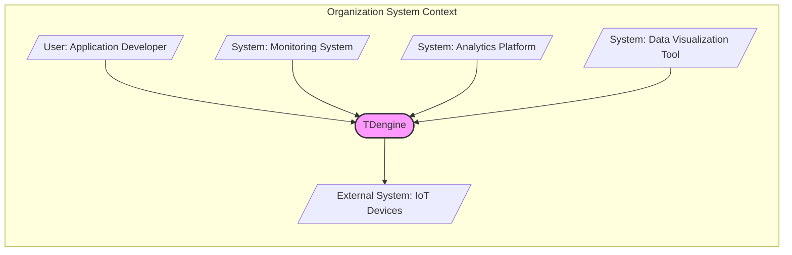
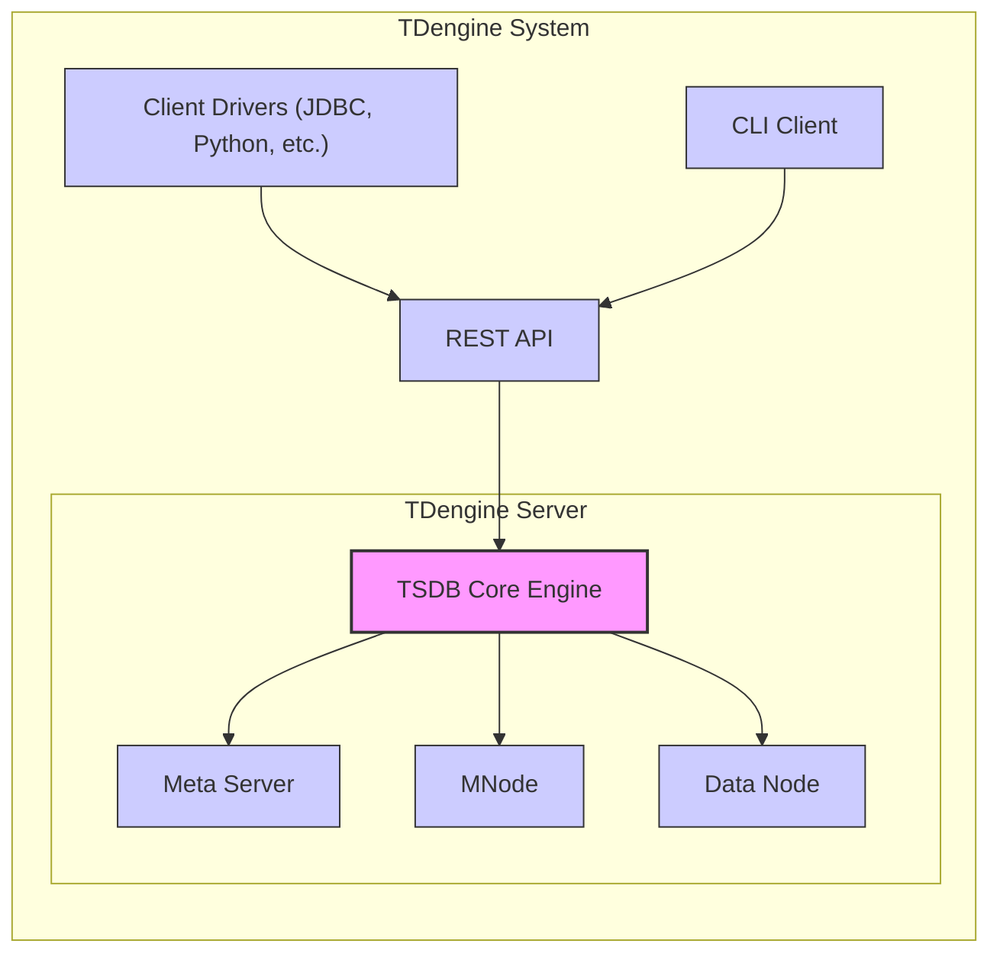
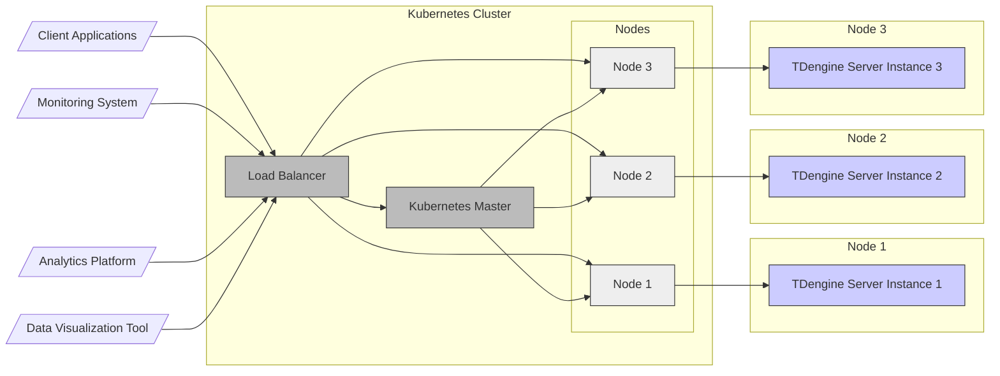

# BUSINESS POSTURE

This project, TDengine, aims to provide a high-performance, scalable, and cost-effective time-series database solution, primarily targeting Internet of Things (IoT), Industrial Internet, and energy sectors. The core business priority is to offer a database system that can efficiently handle massive volumes of time-series data generated by devices and sensors, enabling real-time analytics and insights.

Key business goals include:
- High ingestion and query performance for time-series data.
- Scalability to handle growing data volumes and user concurrency.
- Cost-effectiveness in terms of infrastructure and operational expenses.
- Ease of use and integration with existing systems.
- Reliability and data durability.
- Strong community support and adoption.

Most important business risks that need to be addressed:
- Data loss or corruption due to system failures or security breaches.
- Performance degradation under heavy load or complex queries.
- Security vulnerabilities leading to unauthorized access or data breaches.
- Lack of adoption and market competition from other TSDB solutions.
- Vendor lock-in and dependency on specific infrastructure.
- Compliance with data privacy regulations (e.g., GDPR, CCPA) if handling personal data.

# SECURITY POSTURE

Existing security controls:
- security control: Role-Based Access Control (RBAC) for managing user permissions (described in TDengine documentation).
- security control: Authentication mechanisms for user login (described in TDengine documentation).
- security control: Network encryption using TLS/SSL for communication between client and server (configurable option in TDengine).
- security control: Data encryption at rest (feature availability should be verified in documentation).
- security control: Regular security patching and updates (implied as standard software practice).

Accepted risks:
- accepted risk: Reliance on user configuration for enabling security features like TLS/SSL and data encryption. Misconfiguration can lead to vulnerabilities.
- accepted risk: Potential vulnerabilities in third-party dependencies used by TDengine.
- accepted risk: Risk of insider threats with access to database systems.
- accepted risk: Denial-of-service attacks targeting database availability.

Recommended security controls:
- security control: Implement automated security vulnerability scanning in the software development lifecycle (SAST/DAST).
- security control: Conduct regular penetration testing to identify and address security weaknesses.
- security control: Implement security information and event management (SIEM) for monitoring and alerting on security events.
- security control: Enforce multi-factor authentication (MFA) for administrative access.
- security control: Implement data masking or anonymization techniques for sensitive data in non-production environments.
- security control: Establish incident response plan for security breaches.
- security control: Regularly review and update security configurations and access controls.

Security requirements:

- Authentication:
  - Requirement: Secure authentication mechanism to verify user identity before granting access.
  - Requirement: Support for strong password policies and password rotation.
  - Requirement: Option for integration with external authentication providers (e.g., LDAP, Active Directory, OAuth).

- Authorization:
  - Requirement: Granular role-based access control (RBAC) to manage permissions for different users and roles.
  - Requirement: Principle of least privilege should be enforced, granting users only necessary permissions.
  - Requirement: Audit logging of authorization decisions and access attempts.

- Input Validation:
  - Requirement: Robust input validation on all data inputs to prevent injection attacks (e.g., SQL injection, command injection).
  - Requirement: Input sanitization and encoding to mitigate cross-site scripting (XSS) vulnerabilities if web interfaces are involved.
  - Requirement: Data type validation and range checks to ensure data integrity.

- Cryptography:
  - Requirement: Use strong encryption algorithms and protocols for data in transit (TLS/SSL).
  - Requirement: Option for data encryption at rest to protect data confidentiality.
  - Requirement: Secure key management practices for encryption keys.
  - Requirement: Use of cryptographic hashing for password storage.

# DESIGN

## C4 CONTEXT

Context Diagram Elements:

- Element:
  - Name: TDengine
  - Type: Software System
  - Description: High-performance time-series database management system designed for IoT, Industrial Internet, and energy sectors.
  - Responsibilities: Ingesting, storing, and querying time-series data efficiently and reliably. Managing user access and data security. Providing APIs for data interaction.
  - Security controls: Role-Based Access Control (RBAC), Authentication, TLS/SSL encryption, Data encryption at rest (to be verified), Input validation, Audit logging.

- Element:
  - Name: User: Application Developer
  - Type: Person
  - Description: Developers who build applications that interact with TDengine to store and retrieve time-series data.
  - Responsibilities: Developing applications that utilize TDengine APIs. Managing application-level security and data handling.
  - Security controls: Secure coding practices, Input validation in applications, Proper handling of API keys and credentials.

- Element:
  - Name: System: Monitoring System
  - Type: Software System
  - Description: System that collects and visualizes metrics and logs from TDengine for performance monitoring and troubleshooting.
  - Responsibilities: Monitoring TDengine performance and health. Alerting on anomalies and errors.
  - Security controls: Secure API access to TDengine metrics, Access control to monitoring dashboards, Secure storage of monitoring data.

- Element:
  - Name: System: Analytics Platform
  - Type: Software System
  - Description: Platform used to perform advanced analytics and machine learning on time-series data stored in TDengine.
  - Responsibilities: Querying and processing time-series data from TDengine for analytical purposes.
  - Security controls: Secure API access to TDengine data, Authorization to access specific datasets, Secure processing and storage of analytical results.

- Element:
  - Name: System: Data Visualization Tool
  - Type: Software System
  - Description: Tools used to visualize time-series data from TDengine for dashboards and reports.
  - Responsibilities: Visualizing time-series data in a user-friendly manner.
  - Security controls: Secure API access to TDengine data, Access control to dashboards and visualizations.

- Element:
  - Name: External System: IoT Devices
  - Type: External System
  - Description: IoT devices and sensors that generate time-series data ingested into TDengine.
  - Responsibilities: Generating and transmitting time-series data. Device authentication and authorization (device level security).
  - Security controls: Device authentication, Secure communication protocols (e.g., MQTT over TLS), Device management and patching.

## C4 CONTAINER

Container Diagram Elements:

- Element:
  - Name: TDengine Server
  - Type: Container
  - Description: The core server component of TDengine, responsible for managing and processing time-series data. It includes multiple sub-components.
  - Responsibilities: Data ingestion, storage, query processing, data replication, cluster management, user authentication and authorization.
  - Security controls: Role-Based Access Control (RBAC), Authentication, TLS/SSL encryption for internal communication, Data encryption at rest (to be verified), Input validation, Audit logging.

- Element:
  - Name: TSDB Core Engine
  - Type: Container
  - Description: The central engine within the TDengine Server that handles the core time-series database functionalities.
  - Responsibilities: Optimized storage and retrieval of time-series data, query execution, data indexing, data compression.
  - Security controls: Input validation, Secure query processing, Memory management to prevent buffer overflows.

- Element:
  - Name: Meta Server
  - Type: Container
  - Description: Manages metadata for the TDengine cluster, including schema information, user accounts, and cluster configuration.
  - Responsibilities: Metadata management, user and permission management, cluster configuration management.
  - Security controls: Access control to metadata, Secure storage of metadata, Audit logging of metadata changes.

- Element:
  - Name: MNode (Management Node)
  - Type: Container
  - Description: Responsible for cluster management and coordination, including node discovery, health monitoring, and task scheduling.
  - Responsibilities: Cluster management, node monitoring, task scheduling, failover management.
  - Security controls: Secure inter-node communication, Access control to management interfaces.

- Element:
  - Name: Data Node
  - Type: Container
  - Description: Stores actual time-series data partitions. Multiple Data Nodes can be deployed for scalability and redundancy.
  - Responsibilities: Data storage, data replication, data retrieval for queries.
  - Security controls: Data encryption at rest (to be verified), Access control to data files, Data integrity checks.

- Element:
  - Name: REST API
  - Type: Container
  - Description: Provides a RESTful API for client applications to interact with TDengine.
  - Responsibilities: Exposing TDengine functionalities through REST endpoints, handling client requests, authentication and authorization for API access.
  - Security controls: API authentication (e.g., API keys, JWT), Input validation on API requests, Rate limiting to prevent denial-of-service, Output encoding to prevent injection attacks.

- Element:
  - Name: CLI Client
  - Type: Container
  - Description: Command-line interface for users to interact with TDengine for administration and data querying.
  - Responsibilities: Providing a command-line interface for database administration and data interaction.
  - Security controls: Authentication for CLI access, Secure handling of user credentials, Command history management.

- Element:
  - Name: Client Drivers (JDBC, Python, etc.)
  - Type: Container
  - Description: Libraries and drivers for various programming languages to connect to TDengine.
  - Responsibilities: Providing programmatic access to TDengine from different applications.
  - Security controls: Secure connection establishment (TLS/SSL), Secure handling of database credentials in applications, Input validation in client applications.

## DEPLOYMENT

Deployment Solution: Cloud-based Deployment on Kubernetes

TDengine can be deployed on Kubernetes for scalability, high availability, and ease of management in cloud environments.

Deployment Diagram Elements:

- Element:
  - Name: Kubernetes Cluster
  - Type: Infrastructure
  - Description: Kubernetes cluster providing container orchestration and management.
  - Responsibilities: Container orchestration, resource management, service discovery, scaling, high availability.
  - Security controls: Kubernetes RBAC, Network policies, Pod security policies/Pod Security Admission, Secrets management, Security updates for Kubernetes components.

- Element:
  - Name: Kubernetes Master
  - Type: Infrastructure Component
  - Description: Control plane of the Kubernetes cluster, managing the cluster state and orchestrating workloads.
  - Responsibilities: Cluster management, API server, scheduler, controller manager, etcd (key-value store).
  - Security controls: Access control to Kubernetes API server, Secure etcd storage, Audit logging of API server requests.

- Element:
  - Name: Nodes (Node 1, Node 2, Node 3)
  - Type: Infrastructure Component
  - Description: Worker nodes in the Kubernetes cluster where TDengine Server instances are deployed.
  - Responsibilities: Running containerized applications (TDengine Server instances), providing compute and storage resources.
  - Security controls: Operating system security hardening, Container runtime security, Node security updates, Network segmentation.

- Element:
  - Name: Load Balancer
  - Type: Infrastructure Component
  - Description: Distributes incoming traffic across TDengine Server instances for load balancing and high availability.
  - Responsibilities: Load balancing, traffic routing, health checks.
  - Security controls: DDoS protection, TLS/SSL termination, Access control to load balancer configuration.

- Element:
  - Name: TDengine Server Instance 1, 2, 3
  - Type: Software Instance
  - Description: Instances of TDengine Server running as containers within the Kubernetes cluster.
  - Responsibilities: Running TDengine Server application, handling data ingestion and queries.
  - Security controls: Security controls of TDengine Server container image, Resource limits and quotas in Kubernetes, Network policies to restrict container network access.

- Element:
  - Name: Client Applications, Monitoring System, Analytics Platform, Data Visualization Tool
  - Type: External System
  - Description: External systems and applications accessing TDengine deployed in Kubernetes.
  - Responsibilities: Interacting with TDengine through Load Balancer.
  - Security controls: Client-side security controls, Secure communication channels (TLS/SSL) to Load Balancer, Authentication and authorization when accessing TDengine.

## BUILD

Build Process using GitHub Actions

```mermaid
flowchart LR
    Developer[/"Developer"/] --> CodeCommit[/"Code Commit to GitHub"/];
    CodeCommit --> GitHubActions[/"GitHub Actions CI/CD"/];
    subgraph "GitHub Actions CI/CD"
    SourceCodeCheckout["Source Code Checkout"];
    BuildStep["Build & Compile"];
    UnitTest["Unit Tests"];
    SAST["SAST Scanning"];
    DependencyCheck["Dependency Scanning"];
    ContainerBuild["Container Image Build"];
    ImagePush[/"Image Push to Container Registry"/];
    end
    GitHubActions --> SourceCodeCheckout;
    SourceCodeCheckout --> BuildStep;
    BuildStep --> UnitTest;
    UnitTest --> SAST;
    SAST --> DependencyCheck;
    DependencyCheck --> ContainerBuild;
    ContainerBuild --> ImagePush;
    ImagePush --> ContainerRegistry[/"Container Registry (e.g., Docker Hub, GHCR)"/];
    ContainerRegistry --> Deployment[/"Deployment to Kubernetes"/];

    style GitHubActions fill:#eee,stroke:#333,stroke-width:1px
    style SourceCodeCheckout fill:#ccf,stroke:#333,stroke-width:1px
    style BuildStep fill:#ccf,stroke:#333,stroke-width:1px
    style UnitTest fill:#ccf,stroke:#333,stroke-width:1px
    style SAST fill:#ccf,stroke:#333,stroke-width:1px
    style DependencyCheck fill:#ccf,stroke:#333,stroke-width:1px
    style ContainerBuild fill:#ccf,stroke:#333,stroke-width:1px
    style ImagePush fill:#ccf,stroke:#333,stroke-width:1px
```

Build Process Elements:

- Element:
  - Name: Developer
  - Type: Person
  - Description: Software developers contributing code to the TDengine project.
  - Responsibilities: Writing code, committing code changes, performing local testing.
  - Security controls: Secure development environment, Code review practices, Secure coding training.

- Element:
  - Name: Code Commit to GitHub
  - Type: Process
  - Description: Developers commit code changes to the GitHub repository.
  - Responsibilities: Version control, code change tracking.
  - Security controls: Branch protection rules, Access control to GitHub repository, Commit signing.

- Element:
  - Name: GitHub Actions CI/CD
  - Type: System
  - Description: Automated CI/CD pipeline using GitHub Actions to build, test, and publish TDengine.
  - Responsibilities: Automated build process, testing, security scanning, container image creation, publishing artifacts.
  - Security controls: Secure GitHub Actions workflows, Secrets management in GitHub Actions, Access control to GitHub Actions workflows, Audit logging of CI/CD activities.

- Element:
  - Name: Source Code Checkout
  - Type: Build Step
  - Description: Checks out the latest source code from the GitHub repository.
  - Responsibilities: Retrieving source code for build process.
  - Security controls: Access control to GitHub repository, Secure communication with GitHub.

- Element:
  - Name: Build & Compile
  - Type: Build Step
  - Description: Compiles the source code to create executable binaries.
  - Responsibilities: Code compilation, artifact generation.
  - Security controls: Secure build environment, Dependency management, Build process hardening.

- Element:
  - Name: Unit Tests
  - Type: Build Step
  - Description: Executes automated unit tests to verify code functionality.
  - Responsibilities: Code quality assurance, bug detection.
  - Security controls: Secure test environment, Test case coverage for security aspects.

- Element:
  - Name: SAST Scanning (Static Application Security Testing)
  - Type: Build Step
  - Description: Performs static code analysis to identify potential security vulnerabilities in the source code.
  - Responsibilities: Early vulnerability detection, code security analysis.
  - Security controls: SAST tool configuration, Vulnerability reporting and remediation process.

- Element:
  - Name: Dependency Scanning
  - Type: Build Step
  - Description: Scans project dependencies for known vulnerabilities.
  - Responsibilities: Supply chain security, vulnerability management of dependencies.
  - Security controls: Dependency scanning tool configuration, Vulnerability database updates, Remediation process for vulnerable dependencies.

- Element:
  - Name: Container Image Build
  - Type: Build Step
  - Description: Builds container images for TDengine components.
  - Responsibilities: Containerization, image creation.
  - Security controls: Base image security, Minimal image creation, Vulnerability scanning of container image, Image signing.

- Element:
  - Name: Image Push to Container Registry
  - Type: Build Step
  - Description: Pushes built container images to a container registry.
  - Responsibilities: Image distribution, artifact publishing.
  - Security controls: Secure communication with container registry, Access control to container registry, Image signing and verification.

- Element:
  - Name: Container Registry (e.g., Docker Hub, GHCR)
  - Type: System
  - Description: Stores and manages container images.
  - Responsibilities: Container image storage, image distribution, version control.
  - Security controls: Access control to container registry, Vulnerability scanning of stored images, Image signing and verification, Audit logging of registry access.

- Element:
  - Name: Deployment to Kubernetes
  - Type: Process
  - Description: Deploys container images from the container registry to the Kubernetes cluster.
  - Responsibilities: Application deployment, infrastructure provisioning.
  - Security controls: Secure deployment pipelines, Infrastructure-as-Code security, Kubernetes security configurations.

# RISK ASSESSMENT

Critical business processes we are trying to protect:
- Time-series data ingestion and storage: Ensuring continuous and reliable data collection from IoT devices and other sources.
- Query processing and data retrieval: Providing timely and accurate access to time-series data for monitoring, analytics, and visualization.
- System availability and reliability: Maintaining continuous operation of the TDengine database to support critical business applications.
- Data integrity and consistency: Ensuring data accuracy and preventing data corruption or loss.

Data we are trying to protect and their sensitivity:
- Time-series data: Sensitivity depends on the application domain. In IoT and industrial contexts, this data can include:
    - Sensor readings (temperature, pressure, humidity, etc.): Generally low to medium sensitivity, but aggregated data can reveal business insights.
    - Machine telemetry data (performance metrics, error logs): Medium sensitivity, can impact operational efficiency and security if compromised.
    - Energy consumption data: Medium sensitivity, can impact cost management and resource optimization.
    - Industrial control system data: High sensitivity, potential safety and operational risks if compromised.
    - Personal data (in some IoT applications): High sensitivity, subject to data privacy regulations (GDPR, CCPA).
- Metadata: Medium sensitivity, includes database schema, user accounts, and configuration. Compromise can lead to unauthorized access and data manipulation.
- Audit logs: Medium sensitivity, crucial for security monitoring and incident investigation.

# QUESTIONS & ASSUMPTIONS

Questions:
- What are the specific data sensitivity levels for the intended use cases of TDengine?
- Are there any specific compliance requirements (e.g., GDPR, HIPAA, PCI DSS) that TDengine needs to adhere to?
- What are the performance and scalability requirements for the project?
- What are the specific deployment environments being considered (cloud, on-premises, hybrid)?
- Is data encryption at rest currently implemented in TDengine? If so, what are the details of the implementation?
- What are the existing security testing practices for TDengine (penetration testing, vulnerability scanning)?
- What is the incident response plan for security breaches?

Assumptions:
- BUSINESS POSTURE: The primary business goal is to provide a high-performance and scalable time-series database for IoT and industrial applications. Security is a critical concern but balanced with performance and usability.
- SECURITY POSTURE: TDengine includes basic security features like RBAC and authentication. Further security controls are recommended to enhance the security posture. Secure software development lifecycle and secure deployment practices are important.
- DESIGN: TDengine follows a distributed architecture with core engine, meta server, management nodes, and data nodes. REST API and client drivers are used for external access. Cloud-based deployment on Kubernetes is a relevant deployment scenario. GitHub Actions is used for CI/CD and build automation.