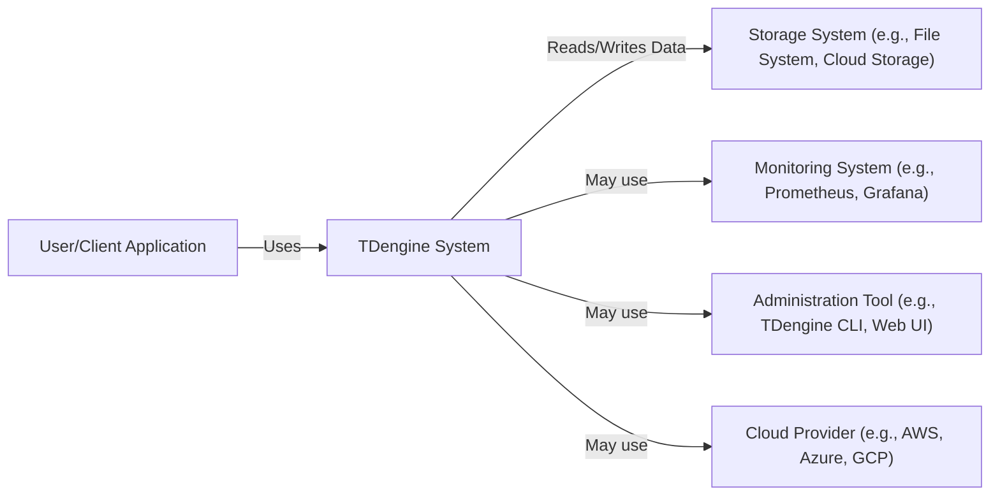
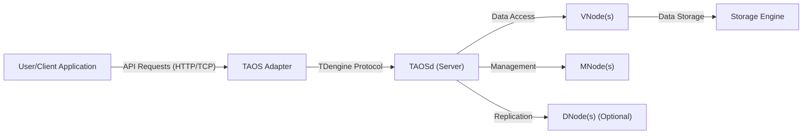
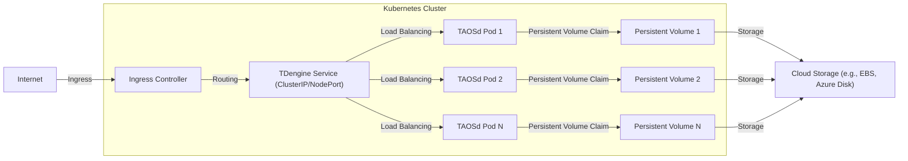
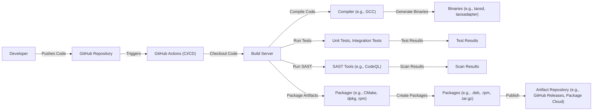

Okay, let's create a design document for the TDengine project based on the provided GitHub repository.

# BUSINESS POSTURE

TDengine is an open-source, cloud-native time-series database optimized for IoT, Industrial IoT, and IT infrastructure monitoring data.  The business priorities appear to be:

*   Provide a high-performance, scalable, and reliable time-series database.
*   Offer a solution that is easy to deploy, manage, and use.
*   Reduce the total cost of ownership (TCO) for time-series data management compared to other solutions.
*   Build a strong community and ecosystem around the open-source project.
*   Offer commercial support and enterprise features.
*   Support various deployment models, including on-premise, cloud, and hybrid.

Business Goals:

*   Become a leading time-series database solution in the market.
*   Attract a large number of users and contributors to the open-source project.
*   Generate revenue through commercial offerings and support services.
*   Establish partnerships with other technology providers and system integrators.

Most Important Business Risks:

*   Data Loss/Corruption:  Given that TDengine is a database, data loss or corruption due to software bugs, hardware failures, or operational errors is a critical risk.
*   Performance Degradation/Outages:  As a time-series database, performance and availability are paramount.  Slow queries or system outages can severely impact users relying on real-time data.
*   Security Breaches:  Unauthorized access to the database could lead to data breaches, data manipulation, or denial-of-service attacks.  This is particularly important for sensitive IoT and industrial data.
*   Competition: The time-series database market is competitive.  Failure to innovate or keep up with competitors could lead to loss of market share.
*   Community Adoption:  The success of the open-source project depends on community adoption and contributions.  Lack of community engagement could hinder development and support.
*   Supply Chain Vulnerabilities: Reliance on third-party libraries and components introduces the risk of supply chain attacks.

# SECURITY POSTURE

Existing Security Controls:

*   security control: Authentication: TDengine supports user authentication with username and password. (Described in documentation and source code).
*   security control: Authorization: TDengine provides role-based access control (RBAC) to manage user permissions. (Described in documentation and source code).
*   security control: Encryption in transit: TDengine supports TLS/SSL encryption for client-server communication. (Described in documentation and source code).
*   security control: Data at Rest Encryption: TDengine Enterprise Edition supports data at rest encryption. (Described in documentation).
*   security control: Auditing: TDengine provides audit logging to track user activities and database operations. (Described in documentation and source code).
*   security control: Input Validation: The system performs input validation to prevent SQL injection and other code injection vulnerabilities. (Observed in source code).
*   security control: Regular Security Updates: The project releases regular updates, including security patches. (Observed in release history).
*   security control: Secure Configuration Defaults: TDengine is designed with secure configuration defaults. (Observed in documentation and configuration files).

Accepted Risks:

*   accepted risk: Limited built-in protection against DDoS attacks in the open-source edition. Mitigation relies on external infrastructure (e.g., firewalls, load balancers).
*   accepted risk: Community edition may have a slower response time to security vulnerabilities compared to the enterprise edition.

Recommended Security Controls:

*   Implement a comprehensive vulnerability management program, including regular penetration testing and static/dynamic code analysis.
*   Enhance DDoS protection mechanisms, potentially through integration with cloud-native DDoS mitigation services.
*   Consider implementing a Web Application Firewall (WAF) to protect against web-based attacks if HTTP/REST interfaces are exposed.
*   Provide detailed security hardening guides for different deployment scenarios.
*   Offer security training and awareness programs for users and administrators.

Security Requirements:

*   Authentication:
    *   Support strong password policies.
    *   Consider multi-factor authentication (MFA) for enhanced security.
    *   Integrate with existing identity providers (e.g., LDAP, Active Directory).
*   Authorization:
    *   Implement fine-grained access control at the database, table, and even column level.
    *   Provide a clear and easy-to-use interface for managing user roles and permissions.
*   Input Validation:
    *   Ensure all user inputs are validated and sanitized to prevent injection attacks.
    *   Use parameterized queries or prepared statements to prevent SQL injection.
*   Cryptography:
    *   Use strong, industry-standard cryptographic algorithms for encryption in transit and at rest.
    *   Implement secure key management practices.
    *   Regularly review and update cryptographic configurations to address emerging threats.

# DESIGN

## C4 CONTEXT

Element Descriptions:

*   Element:
    *   Name: User/Client Application
    *   Type: External Entity (Person or System)
    *   Description: Applications or users that interact with TDengine to store and retrieve time-series data.
    *   Responsibilities: Sending data to TDengine, querying data from TDengine, managing data within TDengine.
    *   Security controls: Authentication, authorization (handled by TDengine).

*   Element:
    *   Name: TDengine System
    *   Type: Software System
    *   Description: The core TDengine database system, including all its components.
    *   Responsibilities: Storing, processing, and retrieving time-series data, managing users and permissions, providing an interface for data access and management.
    *   Security controls: Authentication, authorization, encryption in transit, data at rest encryption (Enterprise Edition), auditing, input validation.

*   Element:
    *   Name: Storage System
    *   Type: External System
    *   Description: The underlying storage system used by TDengine to persist data. This could be a local file system, a network-attached storage (NAS), or cloud-based storage.
    *   Responsibilities: Providing persistent storage for TDengine data.
    *   Security controls: Data at rest encryption (if supported by the storage system), access controls (managed by the storage system).

*   Element:
    *   Name: Monitoring System
    *   Type: External System
    *   Description: Systems used to monitor the performance and health of TDengine, such as Prometheus and Grafana.
    *   Responsibilities: Collecting and visualizing metrics from TDengine.
    *   Security controls: Authentication, authorization (handled by the monitoring system).

*   Element:
    *   Name: Administration Tool
    *   Type: External System
    *   Description: Tools used to administer and manage TDengine, such as the TDengine CLI or a web-based UI.
    *   Responsibilities: Managing users, databases, and other TDengine resources.
    *   Security controls: Authentication, authorization (handled by TDengine).

*   Element:
    *   Name: Cloud Provider
    *   Type: External System
    *   Description: Cloud platforms where TDengine might be deployed, such as AWS, Azure, or GCP.
    *   Responsibilities: Providing infrastructure and services for running TDengine.
    *   Security controls: Cloud provider's security controls (e.g., IAM, VPCs, security groups).

## C4 CONTAINER

Element Descriptions:

*   Element:
    *   Name: User/Client Application
    *   Type: External Entity
    *   Description: Applications or users that interact with TDengine.
    *   Responsibilities: Sending data, querying data.
    *   Security controls: Authentication, authorization (handled by TDengine).

*   Element:
    *   Name: TAOS Adapter
    *   Type: Container (Library/Process)
    *   Description: Client-side library that provides an interface for applications to interact with TDengine.  Handles protocol translation and connection management.
    *   Responsibilities: Establishing connections to TAOSd, serializing/deserializing data, handling API requests.
    *   Security controls: TLS/SSL encryption for communication with TAOSd.

*   Element:
    *   Name: TAOSd (Server)
    *   Type: Container (Process)
    *   Description: The main TDengine server process.  Handles client connections, query processing, and data management.
    *   Responsibilities: Managing client connections, processing queries, coordinating data storage and retrieval, enforcing security policies.
    *   Security controls: Authentication, authorization, encryption in transit, auditing.

*   Element:
    *   Name: VNode(s)
    *   Type: Container (Process/Logical Component)
    *   Description: Virtual Nodes.  Logical units of data storage and processing within TDengine.  Each VNode manages a subset of the data.
    *   Responsibilities: Storing and retrieving data, executing queries on their data subset.
    *   Security controls: Data at rest encryption (Enterprise Edition).

*   Element:
    *   Name: Storage Engine
    *   Type: Container (Library/Component)
    *   Description: The component responsible for interacting with the underlying storage system.
    *   Responsibilities: Reading and writing data to the storage system.
    *   Security controls: Data at rest encryption (Enterprise Edition).

*   Element:
    *   Name: MNode(s)
    *   Type: Container (Process/Logical Component)
    *   Description: Management Nodes.  Responsible for metadata management and cluster coordination.
    *   Responsibilities: Maintaining cluster metadata, coordinating data distribution and replication.
    *   Security controls: Internal communication security.

*   Element:
    *   Name: DNode(s) (Optional)
    *   Type: Container (Process/Logical Component)
    *   Description: Data Nodes. Used for data replication and high availability in a distributed setup.
    *   Responsibilities: Replicating data from other DNodes.
    *   Security controls: Internal communication security, data at rest encryption (Enterprise Edition).

## DEPLOYMENT

TDengine supports multiple deployment models:

1.  Single-Node Deployment: All components (TAOSd, VNodes, MNode) run on a single machine. Suitable for development, testing, and small-scale deployments.
2.  Cluster Deployment (On-Premise): TAOSd, VNodes, and MNodes are distributed across multiple physical or virtual machines. Provides high availability and scalability.
3.  Cloud Deployment (e.g., AWS, Azure, GCP): TDengine can be deployed on cloud VMs, using cloud-native storage services (e.g., S3, Azure Blob Storage).
4.  Kubernetes Deployment: TDengine can be deployed on a Kubernetes cluster using Helm charts or operators.

Chosen Deployment Model: Kubernetes Deployment

Element Descriptions:

*   Element:
    *   Name: Internet
    *   Type: External Entity
    *   Description: The public internet.
    *   Responsibilities: Source of external traffic.
    *   Security controls: Firewall, DDoS protection (typically provided by the cloud provider or a CDN).

*   Element:
    *   Name: Ingress Controller
    *   Type: Kubernetes Component
    *   Description: Manages external access to services within the Kubernetes cluster.
    *   Responsibilities: Routing incoming traffic to the appropriate services based on rules.
    *   Security controls: TLS termination, potentially WAF integration.

*   Element:
    *   Name: TDengine Service
    *   Type: Kubernetes Service
    *   Description: A Kubernetes Service that exposes the TDengine pods. Can be a ClusterIP (internal) or NodePort/LoadBalancer (external).
    *   Responsibilities: Providing a stable endpoint for accessing TDengine.
    *   Security controls: Network policies (restricting access to the service).

*   Element:
    *   Name: TAOSd Pod 1, TAOSd Pod 2, TAOSd Pod N
    *   Type: Kubernetes Pod
    *   Description: Pods running the TAOSd container. Multiple pods provide high availability and scalability.
    *   Responsibilities: Running the TDengine server process.
    *   Security controls: Kubernetes security context (e.g., running as a non-root user), resource limits.

*   Element:
    *   Name: Persistent Volume 1, Persistent Volume 2, Persistent Volume N
    *   Type: Kubernetes Persistent Volume
    *   Description: Persistent storage volumes used by the TDengine pods.
    *   Responsibilities: Providing persistent storage for TDengine data.
    *   Security controls: Encryption at rest (if supported by the underlying storage).

*   Element:
    *   Name: Cloud Storage
    *   Type: External System
    *   Description: Cloud-based storage used by the Persistent Volumes (e.g., AWS EBS, Azure Disk).
    *   Responsibilities: Providing durable storage.
    *   Security controls: Cloud provider's storage security features (e.g., encryption, access controls).

*   Element:
      * Name: Kubernetes Cluster
      * Type: Deployment Environment
      * Description: Set of nodes orchestrated by Kubernetes.
      * Responsibilities: Provide compute, network and storage resources for containers.
      * Security controls: RBAC, network policies, pod security policies, secrets management.

## BUILD

TDengine's build process involves several steps, from source code to deployable artifacts. The process leverages GitHub Actions for CI/CD.

Security Controls in Build Process:

*   Source Code Management: GitHub provides access control and version history.
*   CI/CD: GitHub Actions automates the build and testing process, ensuring consistency and repeatability.
*   Static Application Security Testing (SAST): CodeQL is integrated into the GitHub Actions workflow to scan for vulnerabilities in the source code.
*   Unit and Integration Tests: Automated tests are run as part of the build process to verify code correctness and prevent regressions.
*   Dependency Management: The project uses CMake for dependency management. Dependencies should be regularly reviewed and updated to address security vulnerabilities.
*   Artifact Signing: Release artifacts (packages) should be digitally signed to ensure their integrity and authenticity. (Not explicitly mentioned, but a recommended practice).
*   Secure Build Environment: The GitHub Actions runners should be configured securely, with minimal privileges and access to sensitive resources.

# RISK ASSESSMENT

Critical Business Processes:

*   Data Ingestion: The ability to continuously and reliably ingest time-series data from various sources.
*   Data Querying: The ability to efficiently query and retrieve time-series data for analysis and visualization.
*   Data Storage: The ability to securely and reliably store large volumes of time-series data.
*   System Availability: Ensuring the database is available and responsive to user requests.

Data Sensitivity:

*   Raw Sensor Data: Sensitivity depends on the specific application.  IoT data from industrial sensors could contain sensitive information about production processes, equipment performance, or environmental conditions.  IT infrastructure monitoring data could reveal information about system configurations, resource utilization, and potential vulnerabilities.
*   Aggregated Data: Aggregated data may be less sensitive than raw data, but could still reveal trends and patterns that could be valuable to competitors or attackers.
*   Metadata: Database metadata (e.g., table schemas, user information) is sensitive and should be protected from unauthorized access.
*   Configuration Data: Configuration files may contain sensitive information such as passwords, API keys, and connection strings.

# QUESTIONS & ASSUMPTIONS

Questions:

*   What are the specific compliance requirements (e.g., GDPR, HIPAA, PCI DSS) that TDengine needs to adhere to?
*   What are the expected data retention policies?
*   What are the specific performance requirements (e.g., queries per second, data ingestion rate)?
*   Are there any specific threat actors or attack scenarios that are of particular concern?
*   What level of support is provided for different versions of TDengine (e.g., community vs. enterprise)?
*   What is the process for reporting and handling security vulnerabilities?
*   What are plans for HSM or other secure key storage integration?

Assumptions:

*   BUSINESS POSTURE: The primary users of TDengine are technical users (e.g., developers, DevOps engineers, data scientists) who have a good understanding of database concepts and security best practices.
*   SECURITY POSTURE: The default security settings of TDengine are reasonably secure, but users are responsible for configuring and hardening the system according to their specific needs.
*   DESIGN: The underlying storage system (e.g., file system, cloud storage) is properly secured and managed. The network infrastructure is secure, with appropriate firewalls and intrusion detection/prevention systems in place.