# Project Design Document: TimescaleDB

**Version:** 1.1
**Date:** October 26, 2023
**Author:** AI Software Architect

## 1. Introduction

This document provides a detailed design overview of TimescaleDB, an open-source time-series database implemented as a PostgreSQL extension. This document serves as a blueprint for understanding the system's architecture, core components, and data flow, specifically intended to facilitate subsequent threat modeling exercises. It outlines the key elements of TimescaleDB to enable a comprehensive security analysis.

## 2. Goals and Objectives

The fundamental goals of TimescaleDB are to:

*   Enable efficient and scalable storage and retrieval of large volumes of time-series data.
*   Maintain full SQL compatibility by operating as a seamless extension to PostgreSQL.
*   Simplify the management and querying of time-series data through abstractions like hypertables and continuous aggregates.
*   Preserve the reliability, robustness, and transactional integrity offered by the underlying PostgreSQL database.

This design document aims to:

*   Clearly delineate the core architectural components that constitute TimescaleDB.
*   Visually represent and describe the typical data flow patterns within the system.
*   Identify the primary interfaces through which the system interacts with external entities and internal components.
*   Highlight significant security considerations inherent in the architecture, providing a foundation for threat identification and mitigation strategies.

## 3. High-Level Architecture

```mermaid
graph LR
    subgraph "Client Application"
        A["Client Application"]
    end
    subgraph "TimescaleDB Extension"
        B["SQL Parser & Router"]
        C["Query Planner Augmentation"]
        D["Access Management ('Hypertables', 'Chunks')"]
        E["Continuous Aggregates Manager"]
        F["Data Compression Coordinator"]
        G["Data Retention Policy Engine"]
        H["Background Worker Integration"]
    end
    subgraph "PostgreSQL Database"
        I["PostgreSQL Core Engine"]
        J["Storage Layer"]
        K["Transaction Management"]
        L["Write-Ahead Log ('WAL') System"]
        M["Extension API"]
    end

    A -- "SQL Queries" --> B
    B -- "TimescaleDB Directives" --> C
    B -- "Standard SQL" --> I
    C --> D
    D --> J
    B -- "Continuous Aggregate Queries" --> E
    E --> D
    B -- "Compression Operations" --> F
    F --> D
    B -- "Retention Policy Management" --> G
    G --> H
    H --> I
    TimescaleDB Extension -- "Utilizes" --> M
    I --> J
    I --> K
    K --> L
```

The architecture of TimescaleDB is centered around extending the capabilities of PostgreSQL. Client applications interact with the database using standard SQL. The TimescaleDB extension intercepts and intelligently routes queries, optimizing those involving time-series data stored in its managed structures while leveraging PostgreSQL's core functionalities for general database operations, storage, and transaction integrity.

## 4. Component Details

This section provides a more detailed breakdown of the key components within the TimescaleDB system:

*   **Client Application:**
    *   Represents any external application, service, or tool that needs to interact with and retrieve data from TimescaleDB.
    *   Communicates with the database server using standard PostgreSQL connection protocols and SQL.
    *   Examples include monitoring dashboards, IoT data ingestion pipelines, analytical platforms, and custom applications.

*   **TimescaleDB Extension:**
    *   **SQL Parser & Router:**  Receives SQL queries, determines if they involve TimescaleDB specific features (like hypertables), and routes them to the appropriate internal components for processing. Standard SQL queries are passed directly to the PostgreSQL core.
    *   **Query Planner Augmentation:** Extends the PostgreSQL query planner with specialized logic to optimize queries targeting hypertables and other TimescaleDB constructs. This involves strategies for efficient chunk selection and data access.
    *   **Access Management ('Hypertables', 'Chunks'):**  Manages the abstraction of hypertables, which are virtual tables automatically partitioned into physical chunks based on time or other criteria. This component is responsible for mapping queries to the relevant chunks.
    *   **Continuous Aggregates Manager:**  Handles the creation, refreshing, and querying of continuous aggregates. This involves scheduling background processes to pre-compute aggregations of time-series data, significantly improving query performance for common analytical tasks.
    *   **Data Compression Coordinator:**  Orchestrates the compression and decompression of data chunks based on defined policies. This component interacts with the underlying storage layer to manage compressed data efficiently.
    *   **Data Retention Policy Engine:**  Implements policies for automatically removing old data based on time or other criteria. This typically involves background processes that identify and drop outdated chunks.
    *   **Background Worker Integration:** Leverages PostgreSQL's background worker framework to perform asynchronous tasks such as continuous aggregate refreshes, compression, and data retention enforcement.

*   **PostgreSQL Database:**
    *   **PostgreSQL Core Engine:** Provides the foundational database functionalities, including SQL parsing, query execution (for standard SQL), user management, security features (authentication, authorization), and concurrency control.
    *   **Storage Layer:**  Manages the physical storage of data on disk. TimescaleDB utilizes PostgreSQL's storage mechanisms to store both metadata about hypertables and the actual time-series data within chunks.
    *   **Transaction Management:** Ensures the ACID properties (Atomicity, Consistency, Isolation, Durability) for all database operations, including those involving TimescaleDB extensions.
    *   **Write-Ahead Log ('WAL') System:**  A critical component for ensuring data durability and recoverability. All changes are written to the WAL before being applied to the data files.
    *   **Extension API:** The interface provided by PostgreSQL that allows extensions like TimescaleDB to hook into and extend its core functionalities, including query planning, data access methods, and background processes.

## 5. Data Flow

The typical flow of data within TimescaleDB can be broken down into several key operations:

```mermaid
graph LR
    subgraph "Data Ingestion"
        A["Client Application"] -- "INSERT Statement" --> B{"SQL Parser & Router"}
        B -- "Hypertable Target" --> C{"TimescaleDB Planner"}
        C --> D{"Chunk Router"}
        D --> E{"PostgreSQL Storage"}
        E --> F["Disk Storage"]
        E --> G{"WAL"}
    end
    subgraph "Data Retrieval"
        H["Client Application"] -- "SELECT Statement" --> I{"SQL Parser & Router"}
        I -- "Hypertable Query" --> J{"TimescaleDB Planner"}
        J --> K{"Chunk Selector"}
        K --> L{"PostgreSQL Storage"}
        L --> H
    end
    subgraph "Continuous Aggregate Refresh"
        M{"Continuous Aggregates Manager"} -- "Scheduled Query" --> N{"TimescaleDB Planner"}
        N --> O{"Chunk Selector"}
        O --> P{"PostgreSQL Storage"}
        P --> Q["Materialized View Storage"]
    end
    subgraph "Data Compression"
        R{"Data Compression Coordinator"} -- "Policy Check" --> S{"Chunk Metadata"}
        S --> T{"PostgreSQL Storage (Compressed)"}
    end
    subgraph "Data Retention"
        U{"Data Retention Policy Engine"} -- "Policy Check" --> V{"Chunk Metadata"}
        V -- "Drop Command" --> W{"PostgreSQL Storage"}
    end
```



*   **Data Ingestion:**
    *   A client application sends an `INSERT` statement containing time-series data.
    *   The SQL Parser & Router identifies the target hypertable and routes the query to the TimescaleDB Planner.
    *   The TimescaleDB Planner and Chunk Router determine the appropriate chunk(s) based on the timestamp of the data.
    *   The data is written to the corresponding chunk within the PostgreSQL Storage layer.
    *   Changes are logged in the Write-Ahead Log (WAL) for durability.

*   **Data Retrieval:**
    *   A client application sends a `SELECT` query.
    *   The SQL Parser & Router identifies if the query involves hypertables.
    *   The TimescaleDB Planner optimizes the query and the Chunk Selector identifies the relevant chunks.
    *   Data is retrieved from the appropriate chunks via the PostgreSQL Storage layer and returned to the client. Continuous aggregates may be accessed for pre-computed results.

*   **Continuous Aggregate Refresh:**
    *   The Continuous Aggregates Manager schedules and executes queries against the underlying hypertables.
    *   The TimescaleDB Planner and Chunk Selector identify the necessary data.
    *   Aggregated results are computed and stored in materialized views within the PostgreSQL Storage layer.

*   **Data Compression:**
    *   The Data Compression Coordinator periodically checks defined compression policies.
    *   Eligible chunks are compressed, and the compressed data is stored within the PostgreSQL Storage layer, potentially using different storage formats. Metadata about the compression is also maintained.

*   **Data Retention:**
    *   The Data Retention Policy Engine periodically evaluates retention policies.
    *   Outdated chunks are identified, and commands are issued to the PostgreSQL Storage layer to drop these chunks, reclaiming storage space.

## 6. Security Considerations

From an architectural perspective, several security aspects are crucial for TimescaleDB:

*   **Authentication and Authorization (PostgreSQL):** TimescaleDB relies entirely on PostgreSQL's robust mechanisms for user authentication (e.g., password-based, certificate-based) and authorization (roles, privileges). Secure configuration of these mechanisms is paramount.
*   **Data Encryption (At Rest and In Transit):** PostgreSQL's features for encrypting data files on disk and using TLS/SSL for secure client connections are applicable to TimescaleDB. Ensuring these are properly configured protects sensitive data.
*   **SQL Injection Prevention:** As with any database system, protecting against SQL injection attacks requires careful input validation and sanitization in client applications. TimescaleDB itself does not introduce new vulnerabilities in this area but relies on secure SQL practices.
*   **Access Control to Extension Functionality:**  PostgreSQL's privilege system controls who can create, modify, and drop TimescaleDB specific objects like hypertables and continuous aggregates. Restricting these privileges to authorized users is essential.
*   **Security of Background Processes:** The background workers used for continuous aggregates, compression, and retention run with database privileges. Securing the execution environment and ensuring the integrity of these processes is important.
*   **Dependency Security:** The security of the underlying PostgreSQL installation, operating system, and any other dependencies directly impacts TimescaleDB's security. Regular patching and security updates are critical.
*   **Replication Security (If Configured):** When using PostgreSQL replication for high availability or disaster recovery, the replication channel must be secured to prevent unauthorized access or data breaches.
*   **Extension Security:**  As a PostgreSQL extension, the security of the TimescaleDB extension code itself is important. Regular security audits and adherence to secure coding practices are necessary.
*   **Resource Limits and Denial of Service:**  Properly configuring resource limits within PostgreSQL can help mitigate potential denial-of-service attacks targeting TimescaleDB.

## 7. Deployment Considerations

The chosen deployment model significantly impacts security responsibilities and considerations:

*   **Self-Managed Deployments:**  Organizations are fully responsible for all aspects of security, including server hardening, network security, database configuration, patching, and access control. This requires significant expertise and ongoing effort.
*   **Cloud-Managed Services (e.g., Timescale Cloud):** The cloud provider assumes responsibility for the underlying infrastructure security, operating system patching, and potentially some aspects of database security. However, users are still responsible for configuring access controls, managing user credentials, and ensuring secure application development practices. Understanding the shared responsibility model is crucial.
*   **Containerized Deployments (e.g., Docker, Kubernetes):** Security considerations include securing the container images, the container runtime environment, and the orchestration platform. Proper configuration of network policies and access controls within the container environment is essential.

## 8. Technology Stack

*   **Core Database:** PostgreSQL
*   **Extension Language:** Primarily C for performance-critical components and core extension logic.
*   **SQL:** Standard SQL with extensions and functions specific to TimescaleDB for managing time-series data.

## 9. Assumptions and Constraints

*   This document assumes a foundational understanding of relational database concepts and SQL.
*   The focus is on the core architectural design of TimescaleDB. Specific implementation details and optimizations may vary across different versions.
*   Security considerations are presented at a high level and will be further elaborated upon during dedicated threat modeling sessions.

## 10. Future Considerations

*   **Enhanced Security Features:** Exploring potential future enhancements such as more granular access control within TimescaleDB specific features, or integration with external security information and event management (SIEM) systems.
*   **Distributed TimescaleDB Architecture:**  Further detailing the architecture and security implications of distributed TimescaleDB deployments for increased scalability and resilience.
*   **Advanced Data Compression and Encryption Techniques:** Investigating and potentially integrating newer compression algorithms and encryption methods to further optimize storage and security.
*   **Improved Observability and Auditing:**  Developing more comprehensive tools and features for monitoring system health, performance, and security-related events within TimescaleDB.