# Project Design Document: TimescaleDB for Threat Modeling

**Version:** 1.1
**Date:** October 26, 2023
**Author:** AI Software Architect

## 1. Introduction

This document provides an enhanced architectural overview of TimescaleDB, an open-source time-series database built as an extension on PostgreSQL. This revised document is specifically tailored to facilitate comprehensive threat modeling activities by offering a more granular view of the system's components, data flows, and interactions, with a stronger emphasis on security considerations. It aims to provide a robust foundation for identifying potential vulnerabilities and attack vectors.

## 2. Goals and Objectives

*   Provide a clear, detailed, and security-focused architectural description of TimescaleDB.
*   Identify key components and their interactions within the system, highlighting security-relevant aspects.
*   Illustrate data flow paths for various operations, explicitly showing security checkpoints.
*   Elaborate on potential security concerns and their context within the architecture.
*   Serve as a refined and more detailed foundation for subsequent threat modeling exercises.

## 3. System Overview

TimescaleDB's architecture is built upon the solid foundation of PostgreSQL, extending its capabilities for efficient time-series data management. This extension introduces specialized storage mechanisms (hypertables), optimized query planning, and management tools. The design prioritizes scalability and performance for time-series workloads while maintaining full SQL compatibility and the inherent reliability features of PostgreSQL. Understanding this layered approach is crucial for identifying potential security boundaries and interaction points.

## 4. High-Level Architecture

```mermaid
graph LR
    subgraph "External Entities"
        A["Monitoring Application"]
        B["IoT Device"]
        C["Analytical Tool"]
    end
    D["Network"]
    subgraph "TimescaleDB Instance"
        E["PostgreSQL Process Manager"]
        F["Connection Listener"]
        G["Authentication Handler"]
        H["Authorization Manager"]
        I["SQL Parser"]
        J["TimescaleDB Extension Logic"]
        K["Hypertable Management"]
        L["Chunk Management"]
        M["Access Methods (e.g., B-Tree, BRIN)"]
        N["Query Planner & Optimizer"]
        O["Query Executor"]
        P["WAL (Write-Ahead Log) Writer"]
        Q["Background Worker Processes"]
        R["pg_stat_statements Collector"]
        S["pg_locks Manager"]
        T["Memory Management"]
    end
    U["Data Storage (Disk)"]

    A -- "SQL Queries" --> D
    B -- "Data Streams" --> D
    C -- "Analytical Queries" --> D
    D -- "TCP/IP" --> F
    F --> E
    E --> G
    G -- "Authentication Success" --> H
    H -- "Authorization Granted" --> I
    I --> J
    J --> K
    K --> L
    L --> M
    J --> N
    N --> O
    O --> L
    O --> T
    O --> U
    E --> P
    E --> Q
    E --> R
    E --> S
    style A fill:#ccf,stroke:#333,stroke-width:2px
    style B fill:#ccf,stroke:#333,stroke-width:2px
    style C fill:#ccf,stroke:#333,stroke-width:2px
    style D fill:#eee,stroke:#333,stroke-width:2px
    style E fill:#ccf,stroke:#333,stroke-width:2px
    style F fill:#ccf,stroke:#333,stroke-width:2px
    style G fill:#ccf,stroke:#333,stroke-width:2px
    style H fill:#ccf,stroke:#333,stroke-width:2px
    style I fill:#ccf,stroke:#333,stroke-width:2px
    style J fill:#ccf,stroke:#333,stroke-width:2px
    style K fill:#ccf,stroke:#333,stroke-width:2px
    style L fill:#ccf,stroke:#333,stroke-width:2px
    style M fill:#ccf,stroke:#333,stroke-width:2px
    style N fill:#ccf,stroke:#333,stroke-width:2px
    style O fill:#ccf,stroke:#333,stroke-width:2px
    style P fill:#ccf,stroke:#333,stroke-width:2px
    style Q fill:#ccf,stroke:#333,stroke-width:2px
    style R fill:#ccf,stroke:#333,stroke-width:2px
    style S fill:#ccf,stroke:#333,stroke-width:2px
    style T fill:#ccf,stroke:#333,stroke-width:2px
    style U fill:#eee,stroke:#333,stroke-width:2px
```

## 5. Detailed Component Description

*   **External Entities:** Systems interacting with TimescaleDB.
    *   List item: **Monitoring Application:** Reads time-series data for visualization and alerting. Potential attack surface if compromised credentials are used.
    *   List item: **IoT Device:** Sends time-series data for storage. Vulnerable devices could be exploited to inject malicious data.
    *   List item: **Analytical Tool:** Executes complex queries for data analysis. Potential for resource exhaustion if queries are poorly formed or malicious.
*   **Network:** The communication pathway.
    *   List item: **Network (D):**  Susceptible to eavesdropping and man-in-the-middle attacks if not properly secured (e.g., lacking TLS).
*   **TimescaleDB Instance:** The core database system.
    *   List item: **PostgreSQL Process Manager (E):** Manages all PostgreSQL processes. A vulnerability here could compromise the entire instance.
    *   List item: **Connection Listener (F):** Accepts incoming connections. DoS attacks targeting this component could prevent legitimate access.
    *   List item: **Authentication Handler (G):** Verifies user credentials. Weak authentication mechanisms or brute-force attacks are potential threats.
    *   List item: **Authorization Manager (H):** Enforces access control policies. Misconfigurations can lead to unauthorized data access or modification.
    *   List item: **SQL Parser (I):**  Parses incoming SQL queries. Vulnerable to SQL injection attacks if not handled carefully.
    *   List item: **TimescaleDB Extension Logic (J):** Implements the core time-series functionality. Bugs or vulnerabilities in this extension could be exploited.
    *   List item: **Hypertable Management (K):** Manages the virtual hypertables. Potential for metadata manipulation attacks.
    *   List item: **Chunk Management (L):** Handles the physical storage of data in chunks. Access control issues at the chunk level could lead to data breaches.
    *   List item: **Access Methods (M):** Indexing mechanisms. While generally not a direct security vulnerability, inefficient indexing can contribute to DoS.
    *   List item: **Query Planner & Optimizer (N):** Determines the execution plan. Maliciously crafted queries could exploit planner inefficiencies.
    *   List item: **Query Executor (O):** Executes the query plan. Vulnerabilities here could lead to data leaks or corruption.
    *   List item: **WAL (Write-Ahead Log) Writer (P):** Ensures data durability. Compromise of the WAL could lead to data loss or inconsistency.
    *   List item: **Background Worker Processes (Q):** Perform maintenance tasks. Exploiting these processes could lead to system instability or data manipulation.
    *   List item: **`pg_stat_statements` Collector (R):** Collects query statistics. Sensitive information might be exposed if access is not restricted.
    *   List item: **`pg_locks` Manager (S):** Manages database locks. Abuse of locking mechanisms could lead to DoS.
    *   List item: **Memory Management (T):**  Manages memory allocation. Memory exhaustion attacks are a potential threat.
*   **Data Storage (Disk):** The physical storage layer.
    *   List item: **Data Storage (U):** Requires appropriate access controls and encryption to protect data at rest.

## 6. Data Flow Diagrams

### 6.1. Secure Data Ingestion

```mermaid
graph LR
    A["Data Source (e.g., IoT Device)"] --> B["Network"]
    B -- "Encrypted Connection (TLS)" --> C["TimescaleDB Listener"]
    C --> D["Authentication"]
    D -- "Success" --> E["Authorization"]
    E -- "Granted" --> F["Data Validation"]
    F -- "Valid Data" --> G["SQL Parser"]
    G --> H["Query Planner"]
    H --> I["Executor"]
    I -- "Write to Chunk" --> J["Chunk Storage"]
    I -- "Write to WAL" --> K["WAL"]
    style A fill:#ccf,stroke:#333,stroke-width:2px
    style B fill:#eee,stroke:#333,stroke-width:2px
    style C fill:#ccf,stroke:#333,stroke-width:2px
    style D fill:#ccf,stroke:#333,stroke-width:2px
    style E fill:#ccf,stroke:#333,stroke-width:2px
    style F fill:#ccf,stroke:#333,stroke-width:2px
    style G fill:#ccf,stroke:#333,stroke-width:2px
    style H fill:#ccf,stroke:#333,stroke-width:2px
    style I fill:#ccf,stroke:#333,stroke-width:2px
    style J fill:#ccf,stroke:#333,stroke-width:2px
    style K fill:#ccf,stroke:#333,stroke-width:2px
```

**Description:**

*   Data originates from a source (e.g., an IoT device).
*   Data is transmitted over the network using an encrypted connection (TLS) to protect confidentiality and integrity.
*   The TimescaleDB listener receives the connection.
*   Authentication verifies the identity of the data source.
*   Authorization ensures the data source has the necessary permissions to write data.
*   Data validation checks the incoming data for correctness and prevents injection of malicious payloads.
*   The SQL parser processes the validated data.
*   The query planner optimizes the insertion.
*   The executor writes the data to the appropriate chunk and the WAL for durability.

### 6.2. Secure Data Query

```mermaid
graph LR
    A["Client Application"] --> B["Network"]
    B -- "Authenticated & Encrypted Connection" --> C["TimescaleDB Listener"]
    C --> D["Authentication"]
    D -- "Success" --> E["Authorization"]
    E -- "Granted" --> F["SQL Parser"]
    F --> G["Query Planner (TimescaleDB Aware)"]
    G --> H["Access Control Check"]
    H -- "Access Allowed" --> I["Executor"]
    I -- "Read from Chunks" --> J["Chunk Storage"]
    I --> K["Result Processing"]
    K --> B
    style A fill:#ccf,stroke:#333,stroke-width:2px
    style B fill:#eee,stroke:#333,stroke-width:2px
    style C fill:#ccf,stroke:#333,stroke-width:2px
    style D fill:#ccf,stroke:#333,stroke-width:2px
    style E fill:#ccf,stroke:#333,stroke-width:2px
    style F fill:#ccf,stroke:#333,stroke-width:2px
    style G fill:#ccf,stroke:#333,stroke-width:2px
    style H fill:#ccf,stroke:#333,stroke-width:2px
    style I fill:#ccf,stroke:#333,stroke-width:2px
    style J fill:#ccf,stroke:#333,stroke-width:2px
    style K fill:#ccf,stroke:#333,stroke-width:2px
```

**Description:**

*   A client application initiates a data query.
*   Communication occurs over an authenticated and encrypted connection.
*   The TimescaleDB listener accepts the connection.
*   Authentication verifies the client's identity.
*   Authorization confirms the client has permission to execute the query.
*   The SQL parser processes the query.
*   The TimescaleDB-aware query planner optimizes the query.
*   An access control check verifies that the client has the rights to access the specific data being requested.
*   The executor retrieves data from the relevant chunks.
*   Results are processed and returned to the client application.

## 7. Enhanced Security Considerations

This section expands on potential security concerns, providing more context and specific examples.

*   **Authentication and Authorization:** Critical entry points for securing the database.
    *   List item: **Brute-force attacks:**  Implement account lockout policies and strong password requirements.
    *   List item: **Credential stuffing:** Encourage multi-factor authentication (MFA).
    *   List item: **Privilege escalation:** Adhere to the principle of least privilege, regularly review and audit user and role permissions.
    *   List item: **Connection security:** Enforce SSL/TLS for all client connections to prevent eavesdropping and tampering.
*   **Network Security:** Protecting data in transit and controlling access.
    *   List item: **Man-in-the-middle attacks:**  Strong TLS configuration with certificate validation is essential.
    *   List item: **Unauthorized access:** Implement network segmentation and firewall rules to restrict access to the database server.
    *   List item: **Port scanning:**  Minimize open ports and use intrusion detection/prevention systems (IDS/IPS).
*   **Data at Rest Encryption:** Protecting sensitive data when stored.
    *   List item: **Unauthorized physical access:** Implement physical security measures for the server infrastructure.
    *   List item: **Compromised storage media:** Use transparent data encryption (TDE) to protect data even if storage devices are compromised. Implement robust key management practices.
*   **SQL Injection:** A common web application vulnerability that can impact databases.
    *   List item: **Lack of input validation:**  Sanitize and validate all user inputs before incorporating them into SQL queries.
    *   List item: **Dynamic SQL construction:**  Avoid constructing SQL queries dynamically using string concatenation. Use parameterized queries or prepared statements.
*   **Denial of Service (DoS):** Preventing legitimate users from accessing the database.
    *   List item: **Connection flooding:** Implement connection limits and rate limiting.
    *   List item: **Resource exhaustion:**  Monitor resource usage and implement query timeouts. Properly configure background worker processes to prevent resource starvation.
*   **Extension Security:** Ensuring the TimescaleDB extension itself is secure.
    *   List item: **Vulnerabilities in extension code:** Keep the TimescaleDB extension updated to the latest version with security patches. Follow secure coding practices during development.
    *   List item: **Supply chain attacks:**  Verify the integrity of the extension package.
*   **Backup and Recovery:** Protecting against data loss and ensuring business continuity.
    *   List item: **Unauthorized access to backups:** Encrypt backups and store them in a secure location with restricted access.
    *   List item: **Backup corruption:** Implement integrity checks for backups.
*   **Monitoring and Auditing:** Detecting and responding to security incidents.
    *   List item: **Lack of visibility:** Configure comprehensive audit logging to track database activity, including login attempts, query execution, and data modifications.
    *   List item: **Delayed incident response:** Implement real-time monitoring and alerting for suspicious activity.
*   **Privilege Escalation:** Unauthorized gaining of higher access levels.
    *   List item: **Overly permissive roles:**  Grant only the necessary privileges to users and roles. Regularly review and audit permissions.
    *   List item: **Vulnerabilities in stored procedures or functions:** Securely develop and review any custom database code.

## 8. Deployment Considerations

The deployment environment significantly impacts the security responsibilities and potential threats.

*   **Self-Managed:** Requires the user to manage all aspects of security, including infrastructure, network, operating system, and database security. This offers greater control but also greater responsibility.
*   **Cloud-Managed Services:** The cloud provider handles certain security aspects (e.g., physical security, infrastructure security), but the user remains responsible for configuring access controls, securing data, and managing application-level security. Understand the shared responsibility model.

## 9. Future Considerations

*   Detailed diagrams illustrating the internal workings of specific security features within TimescaleDB and PostgreSQL (e.g., row-level security).
*   Analysis of the security implications of TimescaleDB clustering and replication features.
*   Integration with external security tools and services (e.g., security information and event management (SIEM) systems).

This enhanced document provides a more detailed and security-focused architectural overview of TimescaleDB, better equipping security teams for comprehensive threat modeling and the development of robust security strategies.