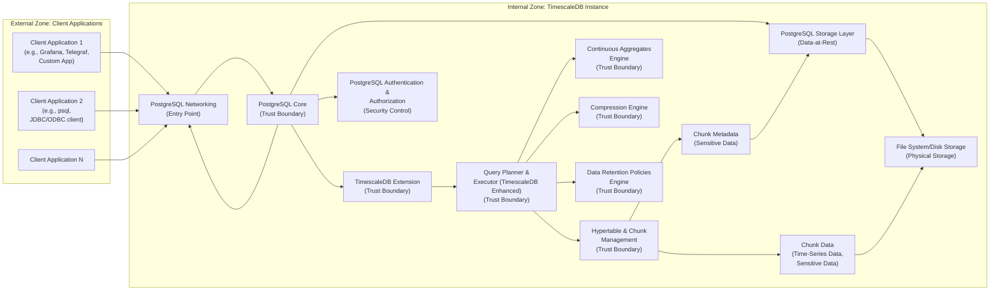

# Project Design Document: TimescaleDB for Threat Modeling (Improved)

**Project Name:** TimescaleDB

**Project Repository:** [https://github.com/timescale/timescaledb](https://github.com/timescale/timescaledb)

**Document Version:** 1.1

**Date:** October 26, 2023

**Author:** Gemini (AI Expert in Software, Cloud, and Cybersecurity Architecture)

## 1. Project Overview

TimescaleDB is an open-source time-series database, implemented as a PostgreSQL extension. It is specifically designed to efficiently manage and query time-series data, addressing challenges like high-volume data ingestion, complex temporal queries, and data lifecycle management. By extending PostgreSQL, TimescaleDB inherits PostgreSQL's robustness, SQL compatibility, and extensive ecosystem while adding time-series optimizations.

**Key Features Relevant to Architecture and Security:**

*   **Hypertable & Chunking:**  Abstracts time-series data into hypertables, automatically partitioned into chunks based on time. This improves query performance and manageability but introduces a layer of abstraction for data access.
*   **Native SQL Interface:**  Full SQL compatibility ensures ease of use and integration with existing tools and applications, leveraging PostgreSQL's security model.
*   **Scalability & High Availability:**  Supports scaling both vertically and horizontally, including distributed deployments for high availability and increased capacity.
*   **Data Compression:**  Columnar compression within chunks reduces storage footprint and improves query I/O, impacting performance and potentially security if compression algorithms have vulnerabilities.
*   **Continuous Aggregates:**  Materialized views that automatically refresh, providing pre-computed aggregations for faster analytics, but require careful management of refresh processes and access control.
*   **Data Retention Policies (Data Lifecycle Management):** Automated policies for data retention and deletion, crucial for compliance and storage optimization, but require secure and reliable deletion mechanisms.
*   **PostgreSQL Security Inheritance:**  Inherits and relies on PostgreSQL's mature security features, including authentication, authorization, and encryption.

**Purpose of this Document:**

This document provides an enhanced architectural blueprint of TimescaleDB, specifically tailored for threat modeling exercises. It details the system's components, data flow, technology stack, and deployment models, emphasizing security-relevant aspects. This document aims to be a comprehensive resource for identifying potential threats, vulnerabilities, and attack vectors within a TimescaleDB deployment. It will serve as the foundation for structured threat modeling activities, such as STRIDE or PASTA.

## 2. System Architecture Diagram

**Diagram Notes:**

*   **Zones:** The diagram explicitly separates "External Zone" (untrusted clients) and "Internal Zone" (TimescaleDB instance).
*   **Trust Boundaries:**  Key components within the "Internal Zone" are marked as "Trust Boundary" to highlight areas where security controls are critical. Crossing these boundaries requires careful consideration of security implications.
*   **Sensitive Data:** Components handling "Chunk Metadata" and "Chunk Data" are marked as potentially containing "Sensitive Data," emphasizing the need for data protection measures.
*   **Security Controls & Entry Points:** "PostgreSQL Authentication & Authorization" is marked as a "Security Control," and "PostgreSQL Networking" as an "Entry Point," highlighting their roles in security.

## 3. Component Description (Enhanced for Threat Modeling)

This section provides detailed descriptions of each component, focusing on security implications and relevance to threat modeling.

**3.1. Client Applications (External Zone):**

*   **Description:** Applications external to the TimescaleDB instance that interact with it. These represent the primary attack surface from an external perspective.
*   **Examples:** (Same as before, but emphasizing security context)
    *   **Grafana (Dashboarding):** Potential for information disclosure if dashboards are not properly secured or if Grafana itself is compromised.
    *   **Telegraf (Data Collection Agent):** If compromised, could be used to inject malicious data or exfiltrate data.
    *   **psql (Admin Interface):** Powerful tool; unauthorized access can lead to complete database compromise.
    *   **JDBC/ODBC Clients (Programmatic Access):** Vulnerable to application-level vulnerabilities like SQL injection if not properly implemented.
    *   **Custom Applications (Various Purposes):** Security posture depends heavily on the application's development practices.
*   **Trust Level:** Untrusted. Client applications are considered outside the security perimeter of the TimescaleDB instance itself.
*   **Assets Handled:** User credentials, query requests, potentially sensitive data in transit.
*   **Potential Threats:**
    *   **Compromised Client Application:** Malware, vulnerabilities in client software.
    *   **Credential Theft:** Phishing, keylogging, insecure storage of credentials.
    *   **Man-in-the-Middle (MITM) Attacks:** Interception of communication if not encrypted.
    *   **SQL Injection:** If applications construct SQL queries dynamically without proper sanitization.

**3.2. TimescaleDB Instance (Internal Zone - Trust Boundaries):**

This zone represents the core TimescaleDB server and is considered a trusted zone relative to external clients, but contains internal trust boundaries between components.

**3.2.1. PostgreSQL Core (Trust Boundary):**

*   **Description:** The foundational PostgreSQL database system. It's a major trust boundary as all requests must pass through it.
*   **Functionality Relevant to Security:**
    *   **Authentication & Authorization (M):** Enforces access control based on roles and permissions.
    *   **Networking (N):** Handles network connections and is the entry point for all client requests.
    *   **Storage Layer (O):** Manages data-at-rest and durability.
*   **Trust Level:** Trusted component, but itself contains internal security mechanisms that must be correctly configured and maintained.
*   **Assets Handled:** User credentials, SQL queries, all data flowing into and out of the database, configuration data.
*   **Potential Threats:**
    *   **Authentication Bypass:** Vulnerabilities in authentication mechanisms.
    *   **Authorization Bypass:** Privilege escalation, flaws in permission checks.
    *   **Denial of Service (DoS):** Resource exhaustion attacks targeting network or processing capabilities.
    *   **Exploitation of PostgreSQL Vulnerabilities:** Known and unknown vulnerabilities in the PostgreSQL codebase.

**3.2.2. TimescaleDB Extension (Trust Boundary):**

*   **Description:** The TimescaleDB extension code loaded into PostgreSQL. It operates within the PostgreSQL process and inherits its privileges. Represents a critical trust boundary as it extends core database functionality.
*   **Functionality Relevant to Security:**
    *   **Query Planner & Executor (TimescaleDB Enhanced) (F):** Modifies query execution, potentially introducing vulnerabilities if not implemented securely.
    *   **Hypertable & Chunk Management (G):** Manages data partitioning, impacting data access paths and potentially introducing logical vulnerabilities.
    *   **Continuous Aggregates Engine (H):** Handles materialized views, requiring secure refresh mechanisms and access control.
    *   **Compression Engine (I):** Implements compression algorithms, potential for vulnerabilities in compression/decompression logic.
    *   **Data Retention Policies Engine (J):** Manages data deletion, critical for secure data disposal.
*   **Trust Level:** Trusted extension code, but vulnerabilities within the extension can directly compromise the PostgreSQL instance.
*   **Assets Handled:** SQL queries, chunk metadata, chunk data, configuration related to time-series features.
*   **Potential Threats:**
    *   **Vulnerabilities in Extension Code:** Buffer overflows, logic errors, injection vulnerabilities within the C or SQL code of the extension.
    *   **Bypass of Security Checks:** Flaws in the extension that could bypass PostgreSQL's built-in security mechanisms.
    *   **Data Corruption:** Bugs in the extension leading to data corruption or loss.
    *   **Resource Exhaustion:** Inefficient extension code causing performance degradation or DoS.

**3.2.3. Hypertable & Chunk Management (G - Trust Boundary):**

*   **Description:** Manages the abstraction of hypertables and the underlying chunking mechanism. Critical for data organization and query routing.
*   **Functionality Relevant to Security:**
    *   **Chunk Metadata (K):** Stores metadata about chunks, access to this metadata is crucial for data access control and integrity.
    *   **Chunk Data (L):**  Actual time-series data stored in chunks. Security of chunks is paramount.
*   **Trust Level:** Trusted component responsible for data partitioning and access.
*   **Assets Handled:** Chunk metadata (table names, time ranges, locations), chunk data (time-series data itself).
*   **Potential Threats:**
    *   **Metadata Manipulation:** Unauthorized modification of chunk metadata leading to data access bypass or data corruption.
    *   **Chunk Access Control Bypass:** Flaws in chunk routing or access control allowing unauthorized access to chunks.
    *   **Data Leakage through Chunking:**  Improper chunk isolation potentially leading to data leakage between tenants in multi-tenant scenarios (if applicable).

**3.2.4. Continuous Aggregates Engine (H - Trust Boundary):**

*   **Description:** Manages continuous aggregates (materialized views) for efficient querying of aggregated data.
*   **Functionality Relevant to Security:**
    *   **Aggregate Data Integrity:** Ensuring the accuracy and integrity of aggregated data.
    *   **Access Control to Aggregates:**  Controlling who can access and query aggregated views.
*   **Trust Level:** Trusted component responsible for generating and maintaining aggregated views.
*   **Assets Handled:** Aggregated data, refresh schedules, definitions of continuous aggregates.
*   **Potential Threats:**
    *   **Data Integrity Issues in Aggregates:** Bugs in the aggregation logic leading to incorrect or manipulated aggregated data.
    *   **Unauthorized Access to Aggregated Data:**  Lack of proper access control to continuous aggregates, potentially exposing sensitive aggregated information.
    *   **Resource Exhaustion during Refresh:**  Resource-intensive refresh processes causing DoS.

**3.2.5. Compression Engine (I - Trust Boundary):**

*   **Description:** Implements data compression algorithms to reduce storage and improve query performance.
*   **Functionality Relevant to Security:**
    *   **Data Integrity after Compression/Decompression:** Ensuring data is not corrupted during compression or decompression.
    *   **Potential Vulnerabilities in Compression Algorithms:**  Although less common, vulnerabilities in compression algorithms could exist.
*   **Trust Level:** Trusted component responsible for data compression.
*   **Assets Handled:** Compressed data, compression algorithms.
*   **Potential Threats:**
    *   **Data Corruption due to Compression Bugs:**  Bugs in compression/decompression logic leading to data corruption.
    *   **Exploitation of Compression Algorithm Vulnerabilities:**  If vulnerabilities exist in the chosen compression algorithms.
    *   **Performance Degradation due to Compression Overhead:**  Excessive compression overhead leading to performance DoS.

**3.2.6. Data Retention Policies Engine (J - Trust Boundary):**

*   **Description:** Automates data retention and deletion based on defined policies.
*   **Functionality Relevant to Security:**
    *   **Secure Data Deletion:** Ensuring data is securely and permanently deleted when retention policies are enforced, especially for sensitive data.
    *   **Prevention of Accidental Data Deletion:**  Configuration errors or bugs leading to unintended data loss.
*   **Trust Level:** Trusted component responsible for data lifecycle management.
*   **Assets Handled:** Data retention policies, data marked for deletion.
*   **Potential Threats:**
    *   **Insecure Data Deletion:** Data not being securely erased, potentially recoverable after deletion.
    *   **Accidental Data Loss:**  Misconfigured retention policies or bugs leading to unintended deletion of important data.
    *   **Denial of Service through Data Deletion:**  Resource-intensive deletion processes impacting performance.

**3.2.7. PostgreSQL Storage Layer (O - Data-at-Rest):**

*   **Description:** PostgreSQL's core storage management, handling data persistence and retrieval from disk.
*   **Functionality Relevant to Security:**
    *   **Data-at-Rest Encryption:**  Provides mechanisms for encrypting data on disk.
    *   **File System Access Control:** Relies on OS-level file system permissions for access control to data files.
*   **Trust Level:** Trusted component for data persistence.
*   **Assets Handled:** Data files, WAL logs, configuration files stored on disk.
*   **Potential Threats:**
    *   **Unauthorized Access to Data Files:**  Bypassing database access controls by directly accessing data files on disk.
    *   **Data Theft from Storage Media:** Physical theft of storage media containing unencrypted data.
    *   **Data Corruption due to Storage Issues:**  Disk failures or file system corruption leading to data loss or integrity issues.

**3.2.8. File System/Disk Storage (P - Physical Storage):**

*   **Description:** The physical storage layer where PostgreSQL data is stored.
*   **Functionality Relevant to Security:**
    *   **Physical Security:** Physical access control to storage media.
    *   **Storage Media Encryption:**  Full disk encryption at the storage level.
*   **Trust Level:** Underlying infrastructure, security depends on physical security and storage configuration.
*   **Assets Handled:** Physical storage media containing all database data.
*   **Potential Threats:**
    *   **Physical Theft of Storage Media:**  Theft of hard drives or storage devices leading to data breach.
    *   **Unauthorized Physical Access:**  Unauthorized access to data centers or server rooms.
    *   **Data Remanence after Disposal:**  Improper disposal of storage media potentially leaving data recoverable.

## 4. Data Flow (Enhanced Security Perspective)

The data flow descriptions are enhanced to explicitly mention security checks and potential vulnerabilities at each stage.

**4.1. Data Ingestion (Write Path - Security Focus):**

1.  **Client Application sends write request:** (Unencrypted communication is a vulnerability here).
2.  **PostgreSQL Networking receives request:** (Firewall rules should control access at this point).
3.  **PostgreSQL Authentication & Authorization:** (Crucial security check - weak credentials or authorization bypass are threats).
4.  **PostgreSQL SQL Engine parses and plans query:** (SQL injection vulnerabilities can occur if input is not sanitized before this stage).
5.  **TimescaleDB Extension intercepts and optimizes:** (Extension vulnerabilities could be exploited here).
6.  **Chunk Management routes data to appropriate chunk:** (Chunk routing logic vulnerabilities could lead to data misplacement or access bypass).
7.  **PostgreSQL Storage Layer writes data to disk:** (Data-at-rest encryption should be in place at this stage).
8.  **Confirmation to Client:** (Response should not leak sensitive information).

**4.2. Data Retrieval (Read Path - Security Focus):**

1.  **Client Application sends read request:** (Unencrypted communication is a vulnerability).
2.  **PostgreSQL Networking receives request:** (Firewall rules should control access).
3.  **PostgreSQL Authentication & Authorization:** (Crucial security check - authorization should be enforced for data access).
4.  **PostgreSQL SQL Engine parses and plans query:** (SQL injection still a concern if queries are dynamically constructed).
5.  **TimescaleDB Extension intercepts and optimizes:** (Extension vulnerabilities could be exploited).
6.  **Query Planner & Executor (TimescaleDB Enhanced) executes query across relevant chunks:** (Chunk access control should be enforced during query execution).
7.  **PostgreSQL Storage Layer retrieves data from disk:** (Data is decrypted if data-at-rest encryption is enabled).
8.  **PostgreSQL Networking sends data to Client:** (Data in transit should be encrypted, response should not leak excessive information).

## 5. Security Considerations (Detailed and Categorized)

This section provides a more detailed and categorized breakdown of security considerations, aligned with common security principles.

**5.1. Confidentiality:** Protecting sensitive data from unauthorized access and disclosure.

*   **Data-at-Rest Encryption:** Implement PostgreSQL's data-at-rest encryption to protect data stored on disk (Chunk Data, Chunk Metadata, WAL logs).
*   **Data-in-Transit Encryption:** Enforce TLS/SSL for all client-server communication to encrypt data transmitted over the network.
*   **Access Control (RBAC):** Utilize PostgreSQL's role-based access control to restrict access to data based on user roles and permissions. Apply granular permissions to tables, views, and functions.
*   **Masking/Redaction of Sensitive Data:** Consider techniques for masking or redacting sensitive data in query results or logs if necessary.
*   **Secure Logging Practices:** Avoid logging sensitive data in application logs or database logs.

**5.2. Integrity:** Maintaining the accuracy and completeness of data.

*   **Input Validation:** Implement robust input validation in client applications to prevent injection attacks and ensure data conforms to expected formats.
*   **SQL Injection Prevention:** Use parameterized queries or prepared statements to prevent SQL injection vulnerabilities.
*   **Data Validation on Write:** Implement database constraints and triggers to validate data integrity during write operations.
*   **Regular Data Integrity Checks:** Periodically perform data integrity checks to detect and correct any data corruption.
*   **Secure Compression:** Ensure the compression algorithms used are secure and do not introduce data corruption risks.

**5.3. Availability:** Ensuring authorized users have reliable and timely access to data and resources.

*   **High Availability (HA) Configuration:** Implement TimescaleDB in a high-availability configuration (e.g., replication, clustering) to minimize downtime.
*   **Disaster Recovery (DR) Plan:** Develop and test a disaster recovery plan to ensure business continuity in case of major outages.
*   **Resource Monitoring and Capacity Planning:** Monitor system resources (CPU, memory, disk I/O) and perform capacity planning to prevent performance bottlenecks and DoS.
*   **DoS Protection:** Implement measures to protect against Denial of Service attacks at the network and application levels (e.g., rate limiting, firewalls).
*   **Robust Backup and Recovery:** Implement regular, automated backups and test the recovery process to ensure data can be restored in case of failures.

**5.4. Authentication and Authorization:** Verifying user identity and controlling access to resources.

*   **Strong Authentication Mechanisms:** Enforce strong password policies, consider multi-factor authentication (MFA), and support secure authentication methods (Kerberos, LDAP, certificate-based).
*   **Principle of Least Privilege:** Grant users only the minimum necessary privileges required to perform their tasks.
*   **Regular Access Reviews:** Periodically review user roles and permissions to ensure they are still appropriate and remove unnecessary access.
*   **Audit Logging of Authentication and Authorization Events:** Enable audit logging to track authentication attempts, authorization failures, and privilege changes.

**5.5. Auditing and Logging:** Recording security-relevant events for monitoring, incident response, and compliance.

*   **Comprehensive Audit Logging:** Enable PostgreSQL's audit logging to capture security-relevant events, including authentication, authorization, data access, and schema changes.
*   **Centralized Logging:** Centralize logs from TimescaleDB instances and client applications for easier monitoring and analysis.
*   **Log Monitoring and Alerting:** Implement log monitoring and alerting to detect suspicious activities and security incidents in a timely manner.
*   **Secure Log Storage and Retention:** Securely store logs and retain them for an appropriate period for auditing and compliance purposes.

**5.6. Vulnerability Management:** Identifying, assessing, and mitigating security vulnerabilities.

*   **Regular Security Scanning:** Perform regular vulnerability scans of TimescaleDB instances and underlying infrastructure.
*   **Patch Management:** Implement a robust patch management process to promptly apply security patches for PostgreSQL, TimescaleDB extension, and operating systems.
*   **Security Audits and Penetration Testing:** Conduct periodic security audits and penetration testing to identify and address security weaknesses.
*   **Stay Informed about Security Advisories:** Subscribe to security advisories from PostgreSQL and TimescaleDB communities to stay informed about known vulnerabilities.

## 6. Technology Stack (No Change)

*(Same as Version 1.0)*

## 7. Deployment Model (Security Implications Added)

This section expands on deployment models, highlighting security considerations specific to each model.

*   **Self-Managed On-Premise:**
    *   **Security Responsibility:** Organization has full responsibility for all aspects of security, including physical security, infrastructure security, database security, and application security.
    *   **Security Advantages:** Potentially greater control over security configurations and physical access.
    *   **Security Challenges:** Requires significant in-house security expertise and resources.

*   **Self-Managed in the Cloud (IaaS):**
    *   **Security Responsibility:** Shared responsibility model. Cloud provider manages physical infrastructure security, organization manages OS, database, and application security.
    *   **Security Advantages:** Leverage cloud provider's infrastructure security, potentially easier to implement some security controls (e.g., network segmentation).
    *   **Security Challenges:** Requires understanding of cloud security best practices, managing cloud configurations securely, and ensuring proper integration with cloud security services.

*   **Managed Cloud Services (PaaS):**
    *   **Timescale Cloud / Cloud Provider Managed PostgreSQL with TimescaleDB:**
        *   **Security Responsibility:** Primarily managed by the cloud provider or Timescale Cloud. Provider handles infrastructure, OS, database security. Organization responsible for application security and access control within the managed service.
        *   **Security Advantages:** Reduced operational burden for database security, leverage provider's security expertise and certifications.
        *   **Security Challenges:** Less direct control over some security configurations, reliance on provider's security posture, potential vendor lock-in.  Need to carefully review provider's security practices and compliance certifications.

*   **Containerized Deployments (Docker, Kubernetes):**
    *   **Security Responsibility:** Shared responsibility. Container image security, container runtime security, orchestration platform security, and application security are all relevant.
    *   **Security Advantages:**  Isolation through containers, potentially easier to automate security deployments and updates.
    *   **Security Challenges:** Container security complexities, securing the container orchestration platform (Kubernetes), managing secrets in containers, ensuring image security.

**Deployment Environment Security Considerations:**

*   **Development Environment:** Security often relaxed for development speed, but should still follow basic security hygiene (strong passwords, network isolation).
*   **Staging Environment:** Should closely mirror production security configurations to identify security issues before production deployment.
*   **Production Environment:** Requires the most stringent security measures, including all applicable security controls outlined in Section 5, hardened configurations, and continuous security monitoring.

This improved document provides a more comprehensive and security-focused architectural overview of TimescaleDB, better suited for threat modeling activities. It emphasizes trust boundaries, potential threats, and detailed security considerations across various aspects of the system. Further threat modeling exercises can now leverage this document to systematically identify and mitigate potential security risks.