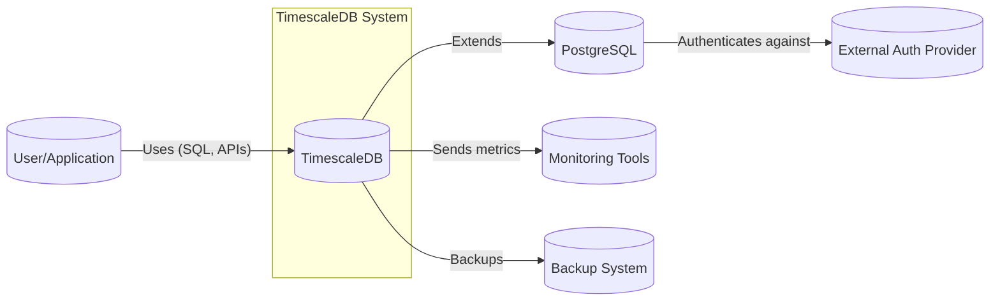
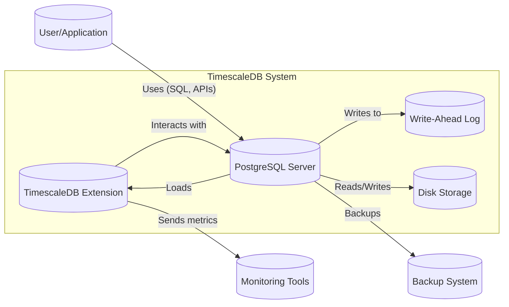
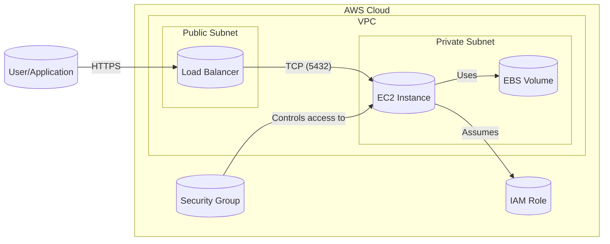
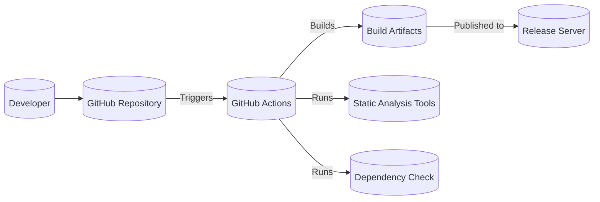

Okay, let's create a design document for TimescaleDB, focusing on aspects relevant for threat modeling.

# BUSINESS POSTURE

TimescaleDB is an open-source time-series database optimized for fast ingest and complex queries. It's built on PostgreSQL and offered as a PostgreSQL extension.  The business priorities and goals revolve around:

*   Providing a scalable and performant time-series database solution.
*   Maintaining compatibility with the PostgreSQL ecosystem (tools, drivers, etc.).
*   Offering a seamless user experience for developers familiar with PostgreSQL.
*   Enabling efficient storage and retrieval of time-series data for various use cases (IoT, monitoring, analytics, etc.).
*   Building a strong community and ecosystem around the product.
*   Offering managed cloud services (Timescale Cloud) for ease of deployment and management.

Based on these, the most important business risks are:

*   Data loss or corruption:  Loss of time-series data can have significant consequences for users relying on TimescaleDB for critical monitoring or analytics.
*   Performance degradation:  Slow query performance or ingest bottlenecks can render the database unusable for its intended purpose.
*   Security breaches:  Unauthorized access to or modification of data can lead to data breaches, compliance violations, and reputational damage.
*   Incompatibility issues:  Breaking changes or incompatibilities with PostgreSQL can disrupt existing user workflows and hinder adoption.
*   Lack of scalability:  Inability to handle increasing data volumes or user load can limit growth and adoption.
*   Operational complexity: Difficulty in deploying, managing, or troubleshooting TimescaleDB can lead to user frustration and churn.

# SECURITY POSTURE

TimescaleDB leverages PostgreSQL's security features and adds its own enhancements. Here's a breakdown:

*   security control: Authentication: Inherits PostgreSQL's authentication mechanisms, including password-based authentication (SCRAM-SHA-256, MD5), certificate-based authentication, GSSAPI, SSPI, and PAM. Described in PostgreSQL documentation.
*   security control: Authorization: Uses PostgreSQL's role-based access control (RBAC) system with GRANT/REVOKE privileges on databases, schemas, tables, and functions. Described in PostgreSQL documentation.
*   security control: Data Encryption: Supports PostgreSQL's Transparent Data Encryption (TDE) for data at rest when configured on the underlying PostgreSQL instance. Also supports SSL/TLS encryption for data in transit. Described in PostgreSQL and TimescaleDB documentation.
*   security control: Auditing: Leverages PostgreSQL's auditing capabilities (e.g., pgaudit extension) to track database activity. Described in PostgreSQL documentation.
*   security control: Row-Level Security (RLS): Inherits PostgreSQL's RLS capabilities to enforce fine-grained access control at the row level. Described in PostgreSQL documentation.
*   security control: Network Security: Relies on network configuration and firewalls (typically managed at the infrastructure level) to restrict access to the database port (default 5432). Described in deployment environment documentation (e.g., AWS, Azure, GCP).
*   security control: Regular Security Updates: TimescaleDB releases regular updates, including security patches, to address vulnerabilities. Described in TimescaleDB release notes and security advisories.
*   security control: Secure Development Practices: Timescale follows secure coding practices, including code reviews, static analysis, and vulnerability scanning. Described in internal development documentation.
*   accepted risk: Limited built-in input validation specific to TimescaleDB features: TimescaleDB relies primarily on PostgreSQL's input validation. While PostgreSQL handles general SQL injection, TimescaleDB-specific functions might have undiscovered vulnerabilities.
*   accepted risk: Complexity of configuration: Securely configuring PostgreSQL and TimescaleDB requires expertise. Misconfigurations can lead to vulnerabilities.
*   accepted risk: Dependency on PostgreSQL security: TimescaleDB's security is inherently tied to the security of the underlying PostgreSQL instance. Vulnerabilities in PostgreSQL directly impact TimescaleDB.
*   accepted risk: Supply chain risks: Although TimescaleDB itself might be secure, dependencies (libraries, build tools) could introduce vulnerabilities.

Recommended Security Controls (High Priority):

*   Implement more robust input validation specifically for TimescaleDB's custom functions and APIs.
*   Provide a security hardening guide tailored to TimescaleDB, covering recommended configurations and best practices.
*   Conduct regular penetration testing and security audits focused on TimescaleDB-specific features.
*   Implement a Software Bill of Materials (SBOM) to track and manage dependencies, mitigating supply chain risks.

Security Requirements:

*   Authentication:
    *   Support strong password policies.
    *   Enforce multi-factor authentication (MFA) where possible (leveraging PostgreSQL extensions or external tools).
    *   Integrate with existing identity providers (e.g., LDAP, Active Directory) if required.
*   Authorization:
    *   Implement granular permissions based on the principle of least privilege.
    *   Regularly review and audit user permissions.
    *   Utilize Row-Level Security (RLS) to enforce data access restrictions based on user attributes or roles.
*   Input Validation:
    *   Validate all user inputs to prevent SQL injection and other injection attacks.
    *   Sanitize data before using it in queries or system commands.
    *   Implement specific validation checks for TimescaleDB functions and APIs.
*   Cryptography:
    *   Use strong encryption algorithms (e.g., AES-256) for data at rest and in transit.
    *   Securely manage encryption keys.
    *   Regularly review and update cryptographic protocols and libraries.
    *   Ensure proper certificate management for TLS connections.

# DESIGN

## C4 CONTEXT

Element Descriptions:

*   1.  Name: User/Application
    *   Type: User
    *   Description: Represents a user or application interacting with TimescaleDB.
    *   Responsibilities: Sending queries, inserting data, managing the database.
    *   Security controls: Authentication, authorization, input validation (at the application level).

*   2.  Name: TimescaleDB
    *   Type: System
    *   Description: The TimescaleDB time-series database extension.
    *   Responsibilities: Providing time-series specific functionality, managing data storage and retrieval.
    *   Security controls: Inherits PostgreSQL security controls, plus any TimescaleDB-specific enhancements.

*   3.  Name: PostgreSQL
    *   Type: System
    *   Description: The underlying PostgreSQL database system.
    *   Responsibilities: Handling core database operations, managing data storage, enforcing security policies.
    *   Security controls: Authentication, authorization, data encryption, auditing, RLS.

*   4.  Name: Monitoring Tools
    *   Type: System
    *   Description: External tools used to monitor TimescaleDB performance and health.
    *   Responsibilities: Collecting metrics, generating alerts.
    *   Security controls: Secure communication channels (e.g., TLS), authentication.

*   5.  Name: Backup System
    *   Type: System
    *   Description: System used for backing up TimescaleDB data.
    *   Responsibilities: Creating and storing backups, restoring data in case of failure.
    *   Security controls: Data encryption, access controls, secure storage.

*   6.  Name: External Auth Provider
    *   Type: System
    *   Description: External system for user authentication (e.g., LDAP, Active Directory).
    *   Responsibilities: Authenticating users, providing user information.
    *   Security controls: Secure communication, strong authentication protocols.

## C4 CONTAINER

Since TimescaleDB is a PostgreSQL extension, the container diagram is essentially an extension of the context diagram.

Element Descriptions:

*   1.  Name: User/Application
    *   Type: User
    *   Description: Represents a user or application interacting with TimescaleDB.
    *   Responsibilities: Sending queries, inserting data, managing the database.
    *   Security controls: Authentication, authorization, input validation (at the application level).

*   2.  Name: TimescaleDB Extension
    *   Type: Container
    *   Description: The TimescaleDB extension code loaded into PostgreSQL.
    *   Responsibilities: Providing time-series specific functions, managing hypertables and chunks.
    *   Security controls: Inherits PostgreSQL security controls, input validation for custom functions.

*   3.  Name: PostgreSQL Server
    *   Type: Container
    *   Description: The core PostgreSQL server process.
    *   Responsibilities: Handling connections, processing queries, managing data storage.
    *   Security controls: Authentication, authorization, data encryption, auditing, RLS.

*   4.  Name: Write-Ahead Log (WAL)
    *   Type: Container
    *   Description: PostgreSQL's WAL for ensuring data durability.
    *   Responsibilities: Recording all database changes before they are written to disk.
    *   Security controls: Access controls (managed by PostgreSQL).

*   5.  Name: Disk Storage
    *   Type: Container
    *   Description: The physical storage where data is stored.
    *   Responsibilities: Storing data persistently.
    *   Security controls: Data encryption at rest (if enabled), access controls (managed by the operating system and PostgreSQL).

*   6.  Name: Monitoring Tools
    *   Type: System
    *   Description: External tools used to monitor TimescaleDB performance and health.
    *   Responsibilities: Collecting metrics, generating alerts.
    *   Security controls: Secure communication channels (e.g., TLS), authentication.

*   7.  Name: Backup System
    *   Type: System
    *   Description: System used for backing up TimescaleDB data.
    *   Responsibilities: Creating and storing backups, restoring data in case of failure.
    *   Security controls: Data encryption, access controls, secure storage.

## DEPLOYMENT

TimescaleDB can be deployed in various ways:

1.  Self-hosted:  Installed directly on a user's own infrastructure (physical servers, VMs).
2.  Cloud (Self-Managed):  Installed on cloud VMs (e.g., AWS EC2, Azure VMs, GCP Compute Engine).
3.  Timescale Cloud:  Fully managed service provided by Timescale.
4.  Cloud (Marketplace):  Pre-configured images available on cloud marketplaces (e.g., AWS Marketplace).

We'll describe the Cloud (Self-Managed) deployment on AWS EC2 as an example:

Element Descriptions:

*   1.  Name: User/Application
    *   Type: User
    *   Description: Represents a user or application connecting to TimescaleDB.
    *   Responsibilities: Sending queries, inserting data.
    *   Security controls: Authentication, authorization (at the application and database level).

*   2.  Name: Load Balancer
    *   Type: Node
    *   Description: AWS Application Load Balancer (ALB) or Network Load Balancer (NLB).
    *   Responsibilities: Distributing traffic across multiple EC2 instances (if used for high availability).
    *   Security controls: SSL/TLS termination, access controls (security groups).

*   3.  Name: EC2 Instance
    *   Type: Node
    *   Description: An AWS EC2 instance running PostgreSQL and TimescaleDB.
    *   Responsibilities: Hosting the database server.
    *   Security controls: Security groups, IAM roles, SSH key-based access, OS-level security hardening.

*   4.  Name: EBS Volume
    *   Type: Node
    *   Description: An AWS Elastic Block Storage (EBS) volume used for data storage.
    *   Responsibilities: Providing persistent storage for the database.
    *   Security controls: Encryption at rest (using AWS KMS), snapshots.

*   5.  Name: Security Group
    *   Type: Node
    *   Description: An AWS security group acting as a virtual firewall.
    *   Responsibilities: Controlling inbound and outbound traffic to the EC2 instance.
    *   Security controls: Restricting access to specific ports (e.g., 5432) and IP addresses.

*   6.  Name: IAM Role
    *   Type: Node
    *   Description: An AWS IAM role assigned to the EC2 instance.
    *   Responsibilities: Providing permissions for the EC2 instance to access other AWS services (e.g., S3 for backups).
    *   Security controls: Least privilege principle, managed policies.

*   7.  Name: VPC
    *   Type: Node
    *   Description: Virtual Private Cloud.
    *   Responsibilities: Provides logically isolated section of the AWS Cloud.
    *   Security controls: Network access control lists.

*   8.  Name: Public Subnet
    *   Type: Node
    *   Description: Subnet with the route to internet.
    *   Responsibilities: Provides access to internet.
    *   Security controls: Network access control lists.

*   9.  Name: Private Subnet
    *   Type: Node
    *   Description: Subnet without the route to internet.
    *   Responsibilities: Provides isolation for resources.
    *   Security controls: Network access control lists.

## BUILD

TimescaleDB's build process involves multiple steps, from source code to packaged releases.  Here's a simplified overview, focusing on security aspects:

Build Process Description:

1.  Developers commit code to the TimescaleDB GitHub repository.
2.  GitHub Actions (CI/CD) is triggered by commits or pull requests.
3.  The build process includes:
    *   Compiling the code (C, SQL).
    *   Running unit tests and integration tests.
    *   security control: Performing static analysis (e.g., using linters, code analyzers) to identify potential vulnerabilities.
    *   security control: Checking dependencies for known vulnerabilities (e.g., using tools like Dependabot).
    *   Packaging the code into various formats (e.g., DEB, RPM, tarballs).
4.  Build artifacts are created and stored.
5.  security control: Artifacts are signed to ensure authenticity and integrity.
6.  security control: Artifacts are published to a release server (e.g., GitHub Releases, package repositories).

Security Controls in the Build Process:

*   security control: Code Reviews: All code changes undergo peer review before being merged.
*   security control: Static Analysis: Automated tools scan the code for potential security issues.
*   security control: Dependency Management: Tools track and manage dependencies, identifying and mitigating known vulnerabilities.
*   security control: Build Automation: GitHub Actions ensures a consistent and reproducible build process.
*   security control: Artifact Signing: Digital signatures verify the authenticity and integrity of released packages.
*   security control: Limited Access: Access to build systems and release servers is restricted to authorized personnel.

# RISK ASSESSMENT

*   Critical Business Processes:
    *   Data Ingestion: Ensuring continuous and reliable ingestion of time-series data.
    *   Data Querying: Providing fast and efficient access to data for analysis and reporting.
    *   Data Storage: Maintaining data integrity and availability.
    *   Database Administration: Managing the database, including backups, security, and performance tuning.

*   Data Sensitivity:
    *   The sensitivity of data stored in TimescaleDB depends on the specific use case. It can range from low (e.g., public sensor data) to high (e.g., financial transactions, personal health information).
    *   Common data types include:
        *   Timestamps: Representing points in time.
        *   Metrics: Numerical values associated with timestamps (e.g., temperature, CPU usage, stock prices).
        *   Tags/Labels: Metadata associated with metrics (e.g., device ID, location, customer ID).
        *   Configuration Data: Information about the database schema, users, and permissions.

# QUESTIONS & ASSUMPTIONS

*   Questions:
    *   What specific compliance requirements (e.g., GDPR, HIPAA, PCI DSS) apply to users of TimescaleDB? This will influence the necessary security controls.
    *   What are the expected data volumes and query loads? This will impact scalability and performance considerations.
    *   What are the specific threat models considered by TimescaleDB developers? This will help understand the rationale behind existing security measures.
    *   Are there any plans to implement more advanced security features, such as dynamic data masking or data loss prevention (DLP)?
    *   What is the process for handling security vulnerabilities reported by external researchers?
    *   What level of support is provided for different deployment models (self-hosted, cloud, managed service)?
    *   How is continuous security testing integrated into the development lifecycle?

*   Assumptions:
    *   Users are responsible for securing their own infrastructure and applications connecting to TimescaleDB.
    *   Users will follow best practices for database security, such as using strong passwords and configuring firewalls.
    *   TimescaleDB's reliance on PostgreSQL's security features means that PostgreSQL is properly configured and secured.
    *   The build process is secure and protected from unauthorized access.
    *   Regular security updates are applied promptly.
    *   Users are aware of the shared responsibility model for security, especially in cloud deployments.
    *   TimescaleDB's documentation provides sufficient guidance for secure configuration and usage.