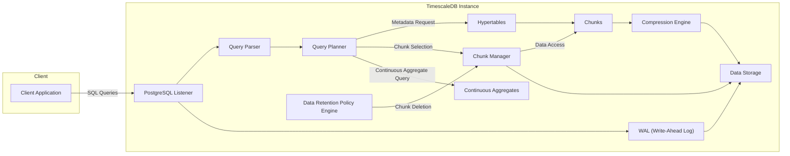

## Project Design Document: TimescaleDB

**1. Introduction**

This document provides a detailed architectural design of TimescaleDB, an open-source time-series database built as an extension on PostgreSQL. This document will serve as the foundation for subsequent threat modeling activities.

**2. Project Overview**

TimescaleDB enhances PostgreSQL with features specifically designed for time-series data, including:

*   Automatic partitioning across time and space (chunks).
*   Optimized query engine for time-series workloads.
*   Data retention policies.
*   Continuous aggregates for pre-computation of common queries.
*   Compression for reducing storage costs.

The core goal of TimescaleDB is to provide the scalability and performance of specialized time-series databases while retaining the reliability and features of a relational database.

**3. System Architecture**

TimescaleDB operates as a PostgreSQL extension, tightly integrated with its core functionalities. The key architectural components are:

*   **PostgreSQL Core:** The underlying relational database system providing core functionalities like transaction management, concurrency control, and data storage.
*   **Hypertables:**  Logical tables that abstract away the underlying chunking mechanism. Users interact with hypertables as if they were regular tables.
*   **Chunks:** Physical storage units that partition the data of a hypertable based on time and potentially other dimensions.
*   **Chunk Management:**  The component responsible for creating, managing, and querying data within chunks.
*   **Query Planner Modifications:**  Enhancements to the PostgreSQL query planner to optimize queries against hypertables and chunks.
*   **Access Methods:**  Specialized indexing and access methods optimized for time-series data.
*   **Continuous Aggregates:** Materialized views that automatically refresh as new data arrives, enabling efficient querying of aggregated time-series data.
*   **Data Retention Policies (Data Lifecycle Management):**  Automated mechanisms for dropping old data based on defined policies.
*   **Compression:**  Algorithms to compress data within chunks, reducing storage footprint.

**4. Component Details**

*   **PostgreSQL Core:**
    *   Provides the foundation for data storage, retrieval, and transaction management.
    *   Manages user authentication and authorization.
    *   Handles network communication with clients.
    *   Responsible for write-ahead logging (WAL) for durability.
    *   Supports standard SQL.
*   **Hypertables:**
    *   Represent the user-facing abstraction for time-series data.
    *   Define the schema for the time-series data.
    *   Queries against hypertables are automatically routed to the relevant chunks.
*   **Chunks:**
    *   Store the actual time-series data.
    *   Partitioned based on time intervals and potentially other dimensions.
    *   Can be stored on different tablespaces.
    *   Compression is applied at the chunk level.
*   **Chunk Management:**
    *   Determines how data is partitioned into chunks.
    *   Manages the creation and deletion of chunks.
    *   Optimizes query execution by targeting relevant chunks.
*   **Query Planner Modifications:**
    *   Extends the PostgreSQL query planner to understand hypertable structures.
    *   Optimizes query execution plans for time-series queries, leveraging chunking.
    *   Can push down certain operations to the chunk level.
*   **Access Methods:**
    *   Includes specialized indexes like BRIN (Block Range Index) optimized for time-ordered data.
    *   Allows for efficient retrieval of data within specific time ranges.
*   **Continuous Aggregates:**
    *   Materialized views that automatically update as new data is ingested.
    *   Store pre-computed aggregations, improving query performance for common analytical queries.
    *   Based on standard PostgreSQL materialized views with added refresh policies.
*   **Data Retention Policies (Data Lifecycle Management):**
    *   Allows users to define policies for automatically dropping old data.
    *   Operates at the chunk level, dropping entire chunks based on time.
    *   Helps manage storage costs and compliance requirements.
*   **Compression:**
    *   Employs compression algorithms (e.g., LZ4, Zstandard) to reduce storage space.
    *   Compression is applied at the chunk level.
    *   Data is decompressed on-the-fly during query execution.

**5. Data Flow Diagram**

**6. Deployment Options**

TimescaleDB can be deployed in various configurations:

*   **Single Instance:** A single PostgreSQL instance with the TimescaleDB extension installed. Suitable for development and small-scale deployments.
*   **High Availability (HA):**  Utilizing PostgreSQL's built-in replication features (e.g., streaming replication) for redundancy and failover.
    *   Includes a primary instance and one or more standby instances.
    *   Requires a mechanism for failover (e.g., Patroni, Stolon).
*   **Distributed TimescaleDB (Multi-Node):**  A more advanced setup for massive scalability, involving multiple TimescaleDB instances working together.
    *   Requires careful configuration and management of data distribution.
    *   Involves concepts like access nodes and data nodes.
*   **Cloud Deployments:**  Deploying TimescaleDB on cloud platforms like AWS, Azure, or GCP, leveraging their managed database services or deploying on virtual machines.
    *   Often involves using managed PostgreSQL services with the TimescaleDB extension.
    *   Can leverage cloud-specific features for scalability and availability.

**7. Security Considerations**

*   **Authentication and Authorization:**
    *   Relies on PostgreSQL's authentication mechanisms (e.g., password-based, certificate-based).
    *   Role-based access control (RBAC) is managed through PostgreSQL roles and permissions.
    *   Connection security via SSL/TLS encryption.
*   **Data Encryption:**
    *   Supports PostgreSQL's encryption at rest capabilities for encrypting data files on disk.
    *   Encryption in transit is handled by SSL/TLS.
*   **Network Security:**
    *   Firewall rules to restrict access to the PostgreSQL port (default 5432).
    *   Consider using a virtual private cloud (VPC) for isolating the database instance.
*   **Data Access Control:**
    *   Granting specific privileges on hypertables and chunks to different users or roles.
    *   Row-level security (RLS) can be used to control access to specific rows within hypertables.
*   **Auditing:**
    *   Leveraging PostgreSQL's audit logging capabilities to track database activity.
*   **Backup and Recovery:**
    *   Regular backups of the PostgreSQL database, including TimescaleDB metadata and data.
    *   Point-in-time recovery (PITR) capabilities.
*   **Vulnerability Management:**
    *   Staying up-to-date with PostgreSQL and TimescaleDB security patches.
    *   Regularly scanning for vulnerabilities.
*   **Secrets Management:**
    *   Securely managing database credentials and other sensitive information.

**8. Technology Stack**

*   **Programming Language:** Primarily C (for PostgreSQL core and TimescaleDB extension).
*   **Database:** PostgreSQL.
*   **Operating Systems:** Linux (primary), macOS, Windows (limited support).
*   **Client Libraries:** Standard PostgreSQL client libraries (e.g., libpq, JDBC, Python's psycopg2).

**9. Future Considerations**

*   Further enhancements to the query planner for more complex time-series queries.
*   Improved compression algorithms and techniques.
*   More sophisticated data retention policies.
*   Deeper integration with other data processing and analytics tools.

This document provides a comprehensive overview of the TimescaleDB architecture, laying the groundwork for a thorough threat modeling exercise. The detailed component descriptions and data flow diagram will be crucial in identifying potential vulnerabilities and attack vectors.
