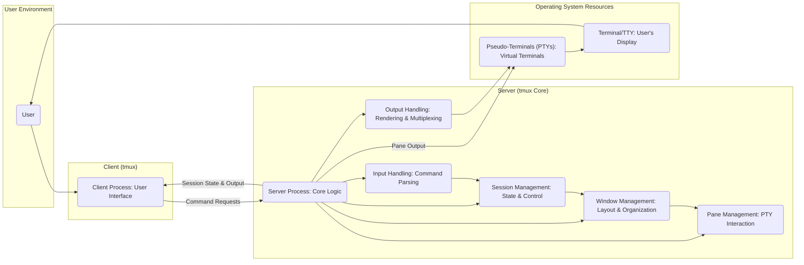

# Project Design Document: tmux

**Version:** 1.1
**Date:** October 26, 2023
**Prepared By:** Gemini (AI Language Model)

## 1. Introduction

This document provides a detailed architectural design of the `tmux` project, a terminal multiplexer. This design will serve as the foundation for subsequent threat modeling activities. It outlines the key components, their interactions, and the data flow within the `tmux` system, with a focus on aspects relevant to security analysis.

## 2. Goals

*   Provide a clear and comprehensive overview of the `tmux` architecture.
*   Identify the major components and their specific responsibilities.
*   Describe the interactions and the nature of data flow between components.
*   Establish a solid foundation for threat modeling and security analysis, highlighting potential attack surfaces.
*   Document key assumptions and constraints relevant to security.

## 3. High-Level Architecture

The `tmux` architecture operates on a client-server model. A single server process manages multiple sessions, each containing windows and panes. Clients connect to this server to interact with these sessions by sending commands and receiving output.

## 4. Detailed Component Descriptions

*   **User:** The individual interacting with the `tmux` system through a terminal, providing input and viewing output.

*   **Client Process (`tmux`):**
    *   The user-facing interface for interacting with the `tmux` server.
    *   Responsibilities include:
        *   Receiving and interpreting user input (keystrokes, mouse events).
        *   Parsing user commands according to `tmux` syntax.
        *   Establishing and maintaining a connection to the `tmux` server (typically via a Unix domain socket).
        *   Serializing command requests for transmission to the server.
        *   Receiving serialized output from the server.
        *   Rendering the received output onto the user's terminal.
        *   Managing the local terminal settings and state.

*   **Server Process (`tmux`):**
    *   The central component responsible for managing all `tmux` sessions, windows, and panes.
    *   Responsibilities include:
        *   Listening for and accepting connections from client processes.
        *   Deserializing command requests received from clients.
        *   Authenticating and authorizing client requests (implicitly based on Unix permissions of the socket).
        *   Maintaining the state of all sessions, windows, and panes in memory.
        *   Managing the lifecycle of pseudo-terminals (PTYs) associated with each pane.
        *   Orchestrating input and output flow between clients and PTYs.
        *   Enforcing access control policies (limited, primarily based on user ownership).

*   **Session Management:**
    *   A logical module within the server responsible for:
        *   Creating, destroying, and listing active sessions.
        *   Tracking the association between clients and sessions.
        *   Managing session-specific settings and environment variables.

*   **Window Management:**
    *   A logical module within the server responsible for:
        *   Creating, destroying, and manipulating windows within a session.
        *   Managing the layout of panes within a window (e.g., tiling, zooming).
        *   Tracking the active window within a session.

*   **Pane Management:**
    *   A logical module within the server responsible for:
        *   Creating, destroying, and resizing panes within a window.
        *   Allocating and managing the pseudo-terminal (PTY) associated with each pane.
        *   Relaying input from the client to the appropriate PTY.
        *   Receiving output from the PTY and forwarding it to connected clients.

*   **Input Handling:**
    *   A module within the server responsible for:
        *   Receiving serialized command requests from client processes.
        *   Deserializing and parsing these commands.
        *   Validating the syntax and semantics of the commands.
        *   Dispatching commands to the appropriate management modules (session, window, pane).

*   **Output Handling:**
    *   A module within the server responsible for:
        *   Receiving output data from the pseudo-terminals (PTYs) associated with panes.
        *   Formatting and potentially modifying the output (e.g., applying escape sequences).
        *   Multiplexing the output from multiple panes for delivery to connected clients.
        *   Serializing the output for transmission back to the client processes.

*   **Terminal/TTY:**
    *   The user's terminal emulator or physical terminal device where the `tmux` client renders the output. This is the ultimate destination for the displayed content.

*   **Pseudo-Terminals (PTYs):**
    *   Kernel-level virtual terminal devices that provide an interface for programs running within `tmux` panes to interact with the terminal environment as if they were directly connected to a physical terminal. The server interacts with these PTYs on behalf of the client.

## 5. Data Flow

The primary data flows within the `tmux` system are:

*   **User Input to Server:**
    *   User interacts with the terminal, generating input events (keystrokes, mouse clicks).
    *   The `tmux` client process captures these events.
    *   The client parses the input and constructs command requests.
    *   These command requests are serialized and sent to the `tmux` server process via a Unix domain socket.

*   **Server Processing and State Updates:**
    *   The server receives the serialized command request.
    *   The input handling module deserializes and parses the command.
    *   The server validates the command and performs the requested action, potentially updating the internal state of sessions, windows, and panes.

*   **Pane Input/Output:**
    *   When a command requires interaction with a process running in a pane:
        *   The server forwards relevant input from the client to the PTY associated with that pane.
        *   The process running in the pane generates output.
        *   This output is captured by the PTY.
        *   The server reads the output from the PTY.

*   **Server Output to Client:**
    *   The output handling module gathers output from the PTYs.
    *   It formats and multiplexes the output, potentially adding control sequences for rendering.
    *   The output is serialized and sent back to the connected `tmux` client process.

*   **Client Rendering:**
    *   The client process receives the serialized output from the server.
    *   The client deserializes the output and interprets any control sequences.
    *   The client updates the terminal display to reflect the received output.

## 6. Key Interactions

*   **User-Client Interaction:** The user interacts directly with the `tmux` client application running in their terminal.

*   **Client-Server Communication:** Clients communicate with the server using a custom protocol over a Unix domain socket. This involves sending command requests and receiving output streams. The security of this communication relies on the file system permissions of the socket.

*   **Server-PTY Interaction:** The server interacts with pseudo-terminals on behalf of the processes running within panes. This interaction is crucial for providing the terminal multiplexing functionality. Vulnerabilities in PTY handling could be exploited.

*   **Inter-Module Communication (Server):** The different management modules within the server (session, window, pane, input, output) interact with each other in memory to manage the `tmux` environment's state and behavior.

## 7. Security Considerations

This section outlines potential security considerations based on the architecture described above.

*   **Unix Domain Socket Security:**
    *   **Threat:** Unauthorized clients could potentially connect to the server's Unix domain socket if permissions are misconfigured, potentially allowing them to send malicious commands or eavesdrop on communication.
    *   **Mitigation:** Proper configuration of file system permissions on the socket file is crucial.

*   **Server Process Privileges:**
    *   **Threat:** If the server process has vulnerabilities, an attacker could potentially exploit them to gain the privileges of the user running the server.
    *   **Mitigation:** Regular security audits and adherence to secure coding practices are necessary.

*   **Input Handling Vulnerabilities:**
    *   **Threat:** Improper parsing or validation of user commands received from clients could lead to command injection vulnerabilities, allowing attackers to execute arbitrary commands on the server.
    *   **Mitigation:** Implement robust input validation and sanitization techniques.

*   **PTY Security:**
    *   **Threat:** Vulnerabilities in the operating system's PTY implementation could be exploited through `tmux`. For example, issues with escape sequence handling or buffer overflows in the PTY driver.
    *   **Mitigation:** Rely on the security of the underlying operating system's PTY implementation. Stay updated with OS security patches.

*   **Client-Side Vulnerabilities:**
    *   **Threat:** Although less critical than server-side issues, vulnerabilities in the client could potentially be exploited if a malicious server were to send crafted output.
    *   **Mitigation:** Implement secure coding practices in the client, especially in output rendering.

*   **Session Management Security:**
    *   **Threat:**  Although `tmux` primarily operates within a single user's context, vulnerabilities in session management could theoretically lead to unauthorized access or manipulation of other users' `tmux` sessions if shared resources or misconfigurations exist.
    *   **Mitigation:** Ensure proper isolation of session data and processes.

*   **Escape Sequence Handling:**
    *   **Threat:** Improper handling of terminal escape sequences (used for formatting and control) could lead to vulnerabilities like terminal injection, allowing an attacker to manipulate the user's terminal.
    *   **Mitigation:** Implement careful parsing and sanitization of escape sequences.

## 8. Assumptions and Constraints

*   **Operating System:** `tmux` is assumed to be running on a Unix-like operating system providing standard POSIX features, including pseudo-terminals and Unix domain sockets.
*   **Communication Protocol:** The primary communication mechanism between client and server is assumed to be a reliable, ordered byte stream over a Unix domain socket.
*   **User Context:** The server process runs within the security context of the user who initiated it. Access control is primarily based on the file system permissions of the Unix domain socket.
*   **No Built-in Encryption:** The base `tmux` implementation does not provide built-in encryption for client-server communication. Secure communication relies on the security of the local system and the Unix domain socket.

## 9. Future Considerations

*   **Exploring alternative, potentially more secure, inter-process communication mechanisms.**
*   **Investigating options for adding end-to-end encryption for client-server communication, especially in scenarios where the socket file permissions might be insufficient.**
*   **Implementing more fine-grained access control mechanisms within the server.**
*   **Further hardening of input handling to prevent command injection and other related vulnerabilities.**
*   **Continuous monitoring for and patching of vulnerabilities in the underlying operating system's PTY implementation.**

This improved design document provides a more detailed and security-focused overview of the `tmux` architecture, making it a more effective foundation for subsequent threat modeling activities.