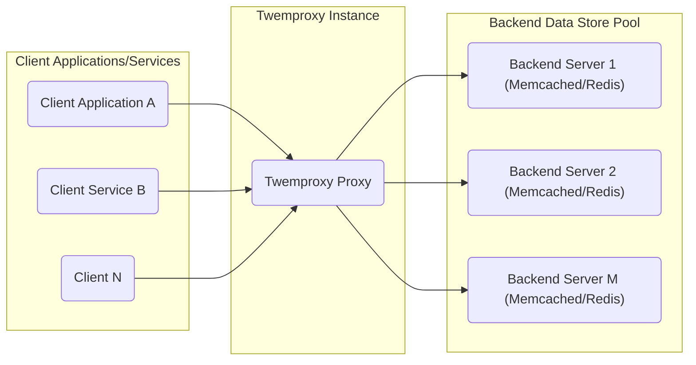
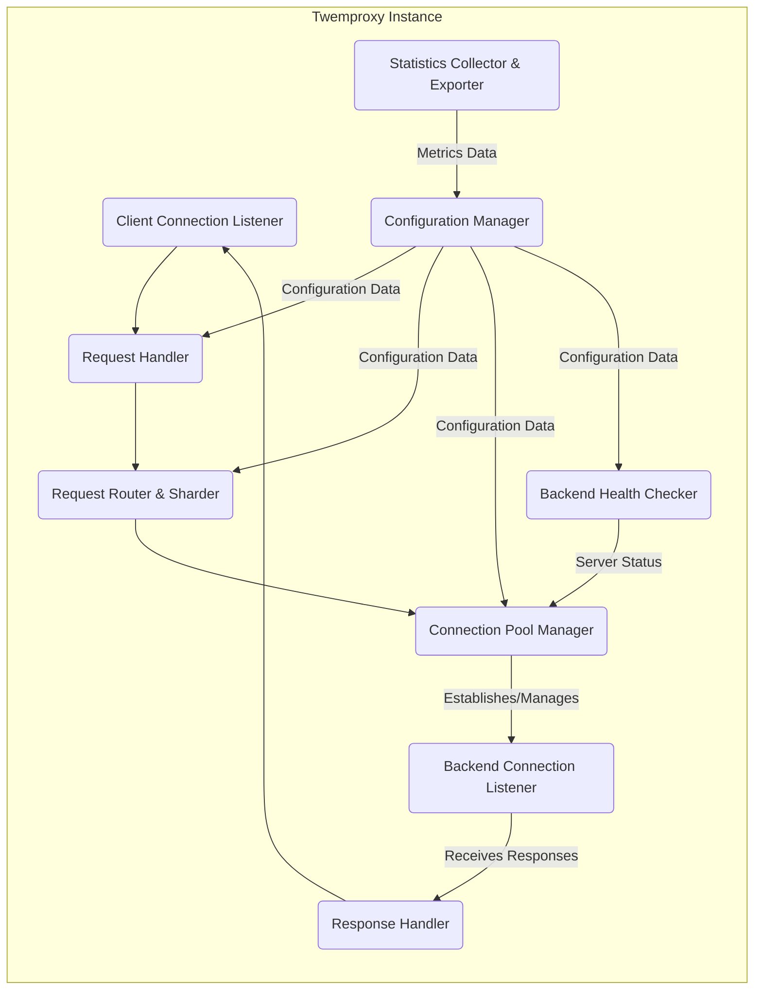

# Project Design Document: Twemproxy (Nutcracker)

**Version:** 1.1
**Date:** October 26, 2023
**Author:** AI Software Architect

## 1. Introduction

This document provides an enhanced and detailed architectural design of Twemproxy (also known as Nutcracker), a high-performance, lightweight proxy for memcached and redis protocols. The primary purpose of this document is to offer a clear and comprehensive understanding of the system's internal components, data flow mechanisms, and inter-component interactions. This detailed design will serve as a robust foundation for subsequent threat modeling exercises, enabling a thorough analysis of potential security vulnerabilities.

## 2. Goals and Objectives

The core design goals and objectives of Twemproxy are:

*   **Efficient Connection Pooling:** To minimize the performance overhead associated with establishing new connections to backend servers by maintaining and reusing a pool of persistent connections. This reduces latency and improves overall throughput.
*   **Intelligent Request Routing and Sharding:** To distribute incoming client requests across a cluster of backend servers based on configurable and efficient hashing algorithms. This enables horizontal scaling and improved performance.
*   **Robust Failover and High Availability:** To provide mechanisms for automatically detecting and handling backend server failures, ensuring continuous service availability and minimizing disruption to clients.
*   **Comprehensive Monitoring and Statistics:** To offer detailed insights into the proxy's operational performance, including request rates, latency, and the health status of individual backend servers. This facilitates performance tuning and proactive issue identification.
*   **Lightweight Protocol Handling:** To efficiently process and forward requests and responses adhering to the specific protocols of Memcached and Redis, minimizing processing overhead.

## 3. System Architecture

### 3.1. High-Level Architecture

*   **Client Applications/Services:**  These represent the various applications or services that require access to data stored in the backend Memcached or Redis servers. They initiate requests to Twemproxy.
*   **Twemproxy Instance:** This is the central proxy process, responsible for managing client connections, routing requests to the appropriate backend servers, and handling responses.
*   **Backend Data Store Pool:** This represents the collection of actual Memcached or Redis server instances that hold the persistent data. Twemproxy distributes client requests across this pool.

### 3.2. Detailed Architecture

A more granular view of the Twemproxy instance reveals the following key internal components and their interactions:

*   **Client Connection Listener (CLI):**  Responsible for passively listening on a designated network port for incoming TCP connection requests from client applications. Upon receiving a request, it establishes a new connection.
*   **Backend Connection Listener (BCLI):**  Manages the pool of persistent TCP connections to the backend Memcached or Redis servers. It handles connection establishment, maintenance, and tear-down.
*   **Request Handler (REQH):**  Receives incoming requests from connected clients, parses the request according to the Memcached or Redis protocol, and extracts relevant information such as keys and commands.
*   **Response Handler (RESPH):**  Receives responses from the backend servers, parses them according to the Memcached or Redis protocol, and forwards the responses back to the originating client.
*   **Request Router & Sharder (ROUTER):**  Determines the specific backend server or servers to which a client request should be directed. This decision is based on the configured sharding strategy (e.g., consistent hashing) and the keys present in the request.
*   **Connection Pool Manager (POOLM):**  Maintains and manages the pool of persistent connections to the backend servers. It handles connection creation, retrieval, reuse, and closure, optimizing connection management.
*   **Configuration Manager (CONFIG):**  Loads, parses, and manages the Twemproxy configuration, typically from a file. This includes details about backend servers, ports, sharding algorithms, and other operational parameters.
*   **Statistics Collector & Exporter (STATS):**  Gathers and aggregates runtime statistics about Twemproxy's performance and the health of the backend servers. It typically exposes these metrics through an interface (e.g., a stats port) for monitoring systems.
*   **Backend Health Checker (HEALTH):**  Periodically probes the backend servers to assess their health and availability. This component updates the Connection Pool Manager with the status of each backend server, enabling intelligent failover.

## 4. Component Details

### 4.1. Client Connection Listener

*   **Functionality:**  Actively listens for and accepts incoming TCP connections from client applications on a pre-configured port.
*   **Responsibilities:**
    *   Binds to the specified IP address and port.
    *   Accepts new client connections.
    *   Creates new socket descriptors for each accepted connection.
    *   Hands off the new socket descriptor to the Request Handler for further processing.
*   **Configuration:**  Configurable listening IP address and port number.

### 4.2. Backend Connection Listener

*   **Functionality:**  Manages and maintains a pool of persistent TCP connections to the configured backend Memcached or Redis servers.
*   **Responsibilities:**
    *   Establishes new connections to backend servers as needed, based on configuration and demand.
    *   Reuses existing idle connections from the pool to serve new requests.
    *   Handles connection failures and attempts to re-establish connections.
    *   Closes connections that are no longer needed or have become unhealthy.
*   **Configuration:**  List of backend server addresses and ports, maximum number of connections per backend server.

### 4.3. Request Handler

*   **Functionality:**  Processes incoming requests received from client connections.
*   **Responsibilities:**
    *   Reads data from the client socket.
    *   Parses the incoming data according to the Memcached or Redis protocol specification.
    *   Identifies the command and extracts relevant parameters, including keys.
    *   Prepares the request for routing.
*   **Protocol Support:**  Specifically designed to handle the command formats and semantics of both Memcached and Redis protocols.

### 4.4. Response Handler

*   **Functionality:**  Processes responses received from the backend servers.
*   **Responsibilities:**
    *   Reads response data from the backend server socket.
    *   Parses the response according to the Memcached or Redis protocol.
    *   Matches the response to the originating client request.
    *   Forwards the parsed response back to the appropriate client connection.

### 4.5. Request Router & Sharder

*   **Functionality:**  Determines the target backend server(s) for each incoming client request.
*   **Responsibilities:**
    *   Implements the configured distribution (sharding) algorithm (e.g., consistent hashing, modulo hashing).
    *   Maps the key(s) from the client request to a specific backend server or a set of servers.
    *   Handles requests involving multiple keys, potentially routing them to different backend servers.
*   **Configuration:**  Selection of the hashing algorithm, definition of the server pool topology.

### 4.6. Connection Pool Manager

*   **Functionality:**  Manages the lifecycle of connections to the backend servers.
*   **Responsibilities:**
    *   Creates new connections to backend servers when the pool is depleted or as needed.
    *   Tracks the state (idle, in-use, unhealthy) of each connection in the pool.
    *   Provides connections to the Request Router for forwarding requests.
    *   Reclaims and closes connections that are no longer needed or have become faulty.
    *   Integrates with the Health Checker to avoid using unhealthy backend servers.
*   **Configuration:**  Maximum and minimum pool sizes, connection timeout settings.

### 4.7. Configuration Manager

*   **Functionality:**  Loads, parses, and provides access to the Twemproxy configuration.
*   **Responsibilities:**
    *   Reads the configuration file (typically in YAML or JSON format).
    *   Parses the configuration data and validates its structure.
    *   Makes the configuration parameters available to other Twemproxy components.
    *   May support dynamic reconfiguration in some implementations.
*   **Configuration Data:**  Details of server pools, lists of backend servers with their addresses and ports, hashing algorithms, timeout values, and other operational settings.

### 4.8. Statistics Collector & Exporter

*   **Functionality:**  Gathers, aggregates, and exposes runtime performance metrics.
*   **Responsibilities:**
    *   Collects statistics on request rates, response times, connection counts, and backend server health.
    *   Aggregates these metrics over time.
    *   Provides an interface (e.g., a dedicated stats port or API endpoint) for external monitoring systems to access these metrics.
*   **Exposed Metrics:**  Number of client connections, number of backend connections, request throughput, latency, error rates, backend server status.

### 4.9. Backend Health Checker

*   **Functionality:**  Monitors the health and availability of the backend Memcached or Redis servers.
*   **Responsibilities:**
    *   Periodically sends health check probes (e.g., ping commands) to the backend servers.
    *   Analyzes the responses from the health checks to determine the server's status.
    *   Updates the Connection Pool Manager with the health status of each backend server.
    *   May implement different health check strategies based on configuration.
*   **Configuration:**  Health check interval, timeout for health checks, criteria for determining server health.

## 5. Data Flow

The typical sequence of events for a client request processed by Twemproxy is as follows:

1. **Client Initiates Request:** A client application sends a request to Twemproxy on its designated listening port.
2. **Connection Established:** The Client Connection Listener accepts the incoming connection request.
3. **Request Reception:** The Request Handler receives the data representing the client's request.
4. **Request Parsing:** The Request Handler parses the request according to the Memcached or Redis protocol.
5. **Routing Decision:** The Request Router & Sharder analyzes the request (specifically the key(s)) and uses the configured sharding algorithm to determine the target backend server(s).
6. **Connection Retrieval:** The Connection Pool Manager provides an available and healthy connection to the selected backend server. If no suitable connection exists, a new one might be established.
7. **Request Forwarding:** The Request Handler forwards the client's request to the chosen backend server through the established connection.
8. **Response Reception:** The Backend Connection Listener receives the response from the backend server.
9. **Response Parsing:** The Response Handler parses the response received from the backend.
10. **Response Forwarding:** The Response Handler forwards the parsed response back to the original client application.

## 6. Security Considerations (For Threat Modeling)

The following areas represent potential security concerns that should be thoroughly investigated during threat modeling:

*   **Configuration File Security:**
    *   **Threat:** Unauthorized access or modification of the configuration file could lead to compromised backend server credentials, altered routing rules, or denial of service.
    *   **Considerations:**  File system permissions, encryption of sensitive data within the configuration.
*   **Input Validation Vulnerabilities:**
    *   **Threat:** Maliciously crafted client requests could exploit vulnerabilities in the Request Handler's parsing logic, leading to buffer overflows, command injection, or other attacks.
    *   **Considerations:**  Robust input validation and sanitization of client requests.
*   **Backend Authentication and Authorization:**
    *   **Threat:** If Twemproxy needs to authenticate to backend servers, insecure storage or handling of these credentials could lead to unauthorized access to the data store.
    *   **Considerations:** Secure credential management, use of authentication protocols.
*   **Denial of Service (DoS) Attacks:**
    *   **Threat:** An attacker could overwhelm Twemproxy with a large volume of requests, exhausting resources and preventing legitimate clients from accessing the backend servers.
    *   **Considerations:**  Rate limiting, connection limits, resource management.
*   **Information Disclosure:**
    *   **Threat:** Error messages or exposed statistics could inadvertently reveal sensitive information about the backend infrastructure or data.
    *   **Considerations:**  Careful handling of error conditions, secure configuration of statistics endpoints.
*   **Man-in-the-Middle (MitM) Attacks:**
    *   **Threat:** If communication between clients and Twemproxy, or between Twemproxy and backend servers, is not encrypted, attackers could intercept and potentially modify data in transit.
    *   **Considerations:**  Implementation of TLS/SSL for both client-proxy and proxy-backend communication.
*   **Access Control to Twemproxy:**
    *   **Threat:**  Lack of access control could allow unauthorized clients to connect to Twemproxy and potentially access or manipulate data.
    *   **Considerations:**  Firewall rules, network segmentation, potential client authentication mechanisms.
*   **Logging and Auditing Deficiencies:**
    *   **Threat:** Insufficient logging of security-relevant events could hinder incident detection and response.
    *   **Considerations:**  Comprehensive logging of connection attempts, authentication failures, and other critical events.
*   **Buffer Overflow Vulnerabilities:**
    *   **Threat:**  Bugs in the request or response handling logic could lead to buffer overflows, potentially allowing attackers to execute arbitrary code.
    *   **Considerations:**  Secure coding practices, thorough testing and code reviews.

## 7. Deployment Considerations

*   **Standalone Process:** Twemproxy is typically deployed as a standalone process on a dedicated server or within a containerized environment.
*   **High Availability:** For production environments, multiple Twemproxy instances are often deployed behind a load balancer to ensure high availability and fault tolerance.
*   **Configuration Management:**  Centralized configuration management tools are essential for managing the configuration of multiple Twemproxy instances and their associated backend server pools.
*   **Monitoring and Alerting:**  Integration with monitoring systems is crucial for tracking Twemproxy's performance, resource utilization, and the health of backend servers. Alerting mechanisms should be in place to notify administrators of potential issues.
*   **Network Topology:**  Careful consideration of network topology is important to minimize latency between clients, Twemproxy, and backend servers.
*   **Resource Allocation:**  Appropriate allocation of CPU, memory, and network resources is necessary to ensure optimal performance of Twemproxy.

## 8. Future Considerations

*   **Support for Additional Backend Protocols:** Expanding support to other NoSQL databases or caching systems.
*   **Enhanced Monitoring and Management Interface:** Developing a more comprehensive and user-friendly interface for monitoring and managing Twemproxy instances.
*   **Built-in TLS Support:**  Implementing native TLS support for securing communication with clients and backend servers, rather than relying on external solutions.
*   **Dynamic Reconfiguration:**  Enabling the ability to modify the Twemproxy configuration without requiring a restart, minimizing service disruption.
*   **Advanced Load Balancing Strategies:**  Exploring and implementing more sophisticated load balancing algorithms beyond basic consistent hashing.
*   **Integration with Service Discovery Mechanisms:**  Integrating with service discovery tools to automatically detect and adapt to changes in the backend server pool.

This enhanced design document provides a more in-depth understanding of Twemproxy's architecture, offering a solid foundation for conducting thorough threat modeling activities. The detailed descriptions of components, data flow, and security considerations will be instrumental in identifying potential vulnerabilities and designing effective security mitigations.
