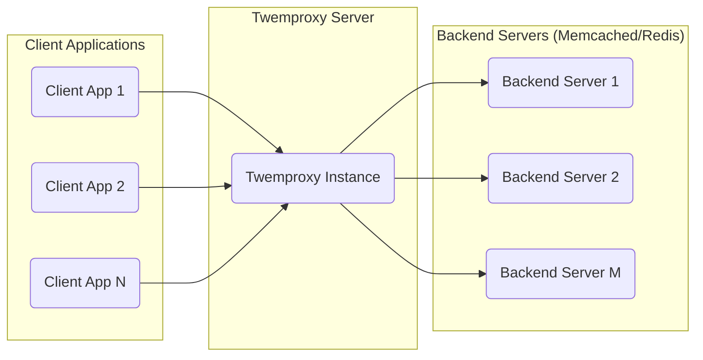
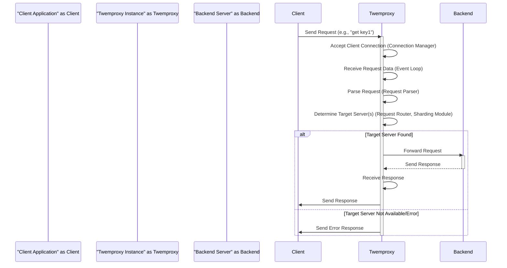

# Project Design Document: Twemproxy (Nutcracker)

**Version:** 1.1
**Date:** October 26, 2023
**Author:** Gemini (AI Architecture Expert)

## 1. Introduction

This document provides a detailed design overview of Twemproxy (also known as Nutcracker), a lightweight, high-performance proxy for memcached and Redis. Its primary function is to reduce direct connections to backend cache servers, improving performance and scalability. This document is intended to serve as a basis for subsequent threat modeling activities.

## 2. Goals and Objectives

Twemproxy aims to achieve the following objectives:

*   **Connection Pooling and Multiplexing:** Minimize the overhead of establishing and maintaining connections to backend servers by reusing connections.
*   **Scalability:** Enable horizontal scaling of caching infrastructure by distributing requests across multiple backend servers.
*   **High Availability:** Enhance resilience by routing requests away from failed backend servers.
*   **Simplified Client Interaction:** Provide a single point of contact for clients, abstracting away the complexity of managing multiple backend servers.
*   **Efficient Resource Utilization:** Optimize resource usage on both client and backend servers.
*   **Support for Multiple Sharding Strategies:** Offer flexibility in distributing data across backend servers based on different algorithms.

## 3. System Architecture

Twemproxy acts as an intermediary layer between client applications and backend caching servers (memcached or Redis). It receives client requests, determines the appropriate backend server based on its configuration and sharding strategy, and forwards the request.

### 3.1. High-Level Architecture

### 3.2. Detailed Component Architecture

Internally, Twemproxy comprises several interacting components:

*   **Event Loop (Core):**  The central processing unit of Twemproxy. It uses non-blocking I/O (e.g., `epoll`, `kqueue`) to efficiently handle multiple concurrent client and server connections. It monitors file descriptors for read/write events.
*   **Connection Manager:** Responsible for managing the lifecycle of both client and backend server connections. This includes accepting new client connections, establishing connections to backend servers, and handling connection closures (graceful and abrupt). It maintains pools of persistent connections to backend servers.
*   **Request Parser:**  Analyzes incoming client requests according to the memcached or Redis protocol. It extracts the command, keys, and values from the raw network data. This component is crucial for understanding the client's intent.
*   **Request Router:**  Determines the target backend server(s) for a given request based on the configured server pools and the selected sharding algorithm. This involves hashing the key and mapping it to a specific server or set of servers.
*   **Sharding Module:** Implements various sharding strategies, such as:
    *   **Modulo Hashing:** Distributes keys based on the modulo of the hash of the key.
    *   **Consistent Hashing (with Ketama):** Provides a more even distribution and minimizes key movements when servers are added or removed.
    *   **Pre-distribution:** Allows for manual assignment of key ranges to specific servers.
*   **Server Pool Manager:** Maintains the configuration and status of backend server pools. This includes information about server addresses, ports, weights (for weighted distribution), and health status (up or down).
*   **Response Aggregator:** For operations that might involve multiple backend servers (though less common in basic memcached/Redis usage through Twemproxy), this component would gather responses from different servers before sending a consolidated response back to the client.
*   **Configuration Loader:** Reads and parses the Twemproxy configuration file (typically YAML), which defines server pools, sharding parameters, listening addresses, and other settings.
*   **Statistics Collector:** Gathers runtime statistics such as connection counts, request rates, error rates, and latency. These statistics can be exposed for monitoring purposes.
*   **Logger:** Records events, errors, and potentially access logs for debugging, auditing, and monitoring.

### 3.3. Key Data Structures

Twemproxy utilizes several important data structures:

*   **`client_connections`:** A list or map holding information about active client connections, including socket details, associated request/response queues, and connection state.
*   **`server_connections`:** A pool of persistent connections to backend servers, managed per server pool. This helps reduce connection establishment overhead. Each entry contains socket details, server address, and connection status.
*   **`request_queue` (per client connection):** A buffer to hold incoming client requests that are waiting to be processed and forwarded to backend servers. This helps handle situations where the backend is temporarily overloaded.
*   **`response_queue` (per client connection):** A buffer to hold responses received from backend servers before they are sent back to the corresponding client.
*   **`server_pool`:** A data structure representing a group of backend servers. It contains a list of server configurations, the selected sharding algorithm, and potentially health check information.
*   **`key_map` (implicit):**  While not a directly visible data structure, the sharding logic effectively creates a mapping between keys and the assigned backend servers. The structure of this mapping depends on the chosen sharding algorithm.

## 4. Data Flow

A typical client request flows through Twemproxy as follows:

**Detailed Steps:**

1. **Client Request:** The client application sends a request (e.g., a `get` or `set` command) to Twemproxy's listening address and port.
2. **Connection Acceptance:** Twemproxy's Event Loop detects the incoming connection, and the Connection Manager establishes a new client connection.
3. **Request Reception:** The Event Loop reads the data from the client connection.
4. **Request Parsing:** The Request Parser analyzes the incoming data according to the memcached or Redis protocol to understand the requested operation and the associated key(s).
5. **Target Server Determination:** The Request Router, using the configured Sharding Module and the request key, determines the appropriate backend server (or servers) to handle the request.
6. **Request Forwarding:** Twemproxy retrieves a connection to the target backend server from its connection pool (or establishes a new connection if necessary) and forwards the client's request.
7. **Backend Processing:** The backend server processes the request and generates a response.
8. **Response Reception:** Twemproxy receives the response from the backend server.
9. **Response Forwarding:** Twemproxy forwards the response back to the originating client application.
10. **Error Handling:** If an error occurs during any of these steps (e.g., backend server unavailable, network issues), Twemproxy handles the error and may return an appropriate error response to the client.

## 5. Deployment Considerations

*   **Operating System:** Twemproxy is typically deployed on Linux or other Unix-like operating systems due to its reliance on `epoll` or `kqueue`.
*   **Configuration Management:**  Configuration is primarily done through a YAML file. Secure storage and management of this configuration are important.
*   **High Availability Deployment:** Multiple Twemproxy instances can be deployed behind a load balancer to provide redundancy and handle increased traffic.
*   **Containerization:** Twemproxy can be easily containerized using Docker, facilitating deployment and scaling in container orchestration platforms like Kubernetes.
*   **Resource Allocation:**  Properly sizing the Twemproxy instance (CPU, memory, network bandwidth) is crucial based on the expected traffic volume and the number of backend servers.
*   **Monitoring and Logging Infrastructure:** Integration with monitoring systems (e.g., Prometheus, Grafana) and logging platforms (e.g., Elasticsearch, Fluentd, Kibana - EFK stack) is essential for operational visibility and troubleshooting.
*   **Network Topology:** The network connectivity between clients, Twemproxy, and backend servers needs to be considered for latency and security.

## 6. Security Considerations

This section outlines security considerations relevant for threat modeling:

*   **Lack of Built-in Authentication/Authorization:** Twemproxy does not inherently authenticate or authorize client connections. Security relies on the backend servers and network-level controls. This makes it vulnerable if deployed in untrusted environments without additional security measures.
    *   **Threat:** Unauthorized access to backend data if Twemproxy is exposed without proper network segmentation or authentication at the backend layer.
*   **Unencrypted Communication:** Twemproxy does not natively support encryption (e.g., TLS/SSL) for communication with clients or backend servers. This leaves data in transit vulnerable to eavesdropping and manipulation (Man-in-the-Middle attacks).
    *   **Threat:** Sensitive data being intercepted during transmission.
*   **Input Validation Vulnerabilities:** While Twemproxy parses requests, vulnerabilities in its parsing logic could be exploited to cause unexpected behavior or even crashes.
    *   **Threat:** Maliciously crafted requests leading to denial of service or potentially remote code execution (if severe parsing flaws exist).
*   **Denial of Service (DoS) Attacks:** Twemproxy is susceptible to various DoS attacks:
    *   **Connection Exhaustion:** Attackers can flood Twemproxy with connection requests, exhausting its resources and preventing legitimate clients from connecting.
    *   **Request Flooding:** Sending a large volume of valid or invalid requests can overwhelm Twemproxy and the backend servers.
    *   **Resource Consumption:** Attacks exploiting inefficiencies in request processing could lead to excessive CPU or memory usage.
*   **Configuration Security:**  A misconfigured Twemproxy instance can introduce vulnerabilities.
    *   **Threat:** Exposing management interfaces, using weak sharding configurations leading to data leakage, or allowing access from untrusted networks.
*   **Dependency Vulnerabilities:** Twemproxy relies on underlying libraries. Vulnerabilities in these dependencies could be exploited.
    *   **Threat:** Exploiting known vulnerabilities in libraries for malicious purposes. Regular updates and security audits are necessary.
*   **Insufficient Logging and Monitoring:** Lack of comprehensive logging makes it difficult to detect and respond to security incidents.
    *   **Threat:** Delayed detection of attacks and difficulty in forensic analysis.
*   **Backend Server Security Dependence:** Twemproxy's security is heavily reliant on the security of the backend memcached or Redis servers. Vulnerabilities in the backend can be exploited through Twemproxy.
    *   **Threat:** If backend servers are compromised, the attacker can potentially access or manipulate all data.
*   **Access Control to Twemproxy Server:**  Unrestricted access to the Twemproxy server itself can allow attackers to modify configurations or disrupt the service.
    *   **Threat:** Unauthorized changes to configuration leading to service disruption or security breaches.

## 7. Future Enhancements (Beyond Current Scope)

*   **Native TLS/SSL Support:** Implementing built-in support for encrypted communication.
*   **Advanced Monitoring Metrics:** Providing more detailed and granular performance metrics.
*   **Dynamic Reconfiguration:**  Allowing configuration updates without requiring a restart.
*   **Support for Additional Protocols:** Expanding support to other caching or NoSQL protocols.
*   **Built-in Authentication/Authorization Mechanisms:** Adding options for securing client connections directly at the Twemproxy level.

## 8. Conclusion

This document provides a detailed design overview of Twemproxy, outlining its architecture, components, data flow, deployment considerations, and crucial security aspects. This information serves as a foundational understanding for conducting thorough threat modeling to identify potential vulnerabilities and implement appropriate security measures. The lack of inherent authentication and encryption highlights key areas of focus for securing deployments of Twemproxy.